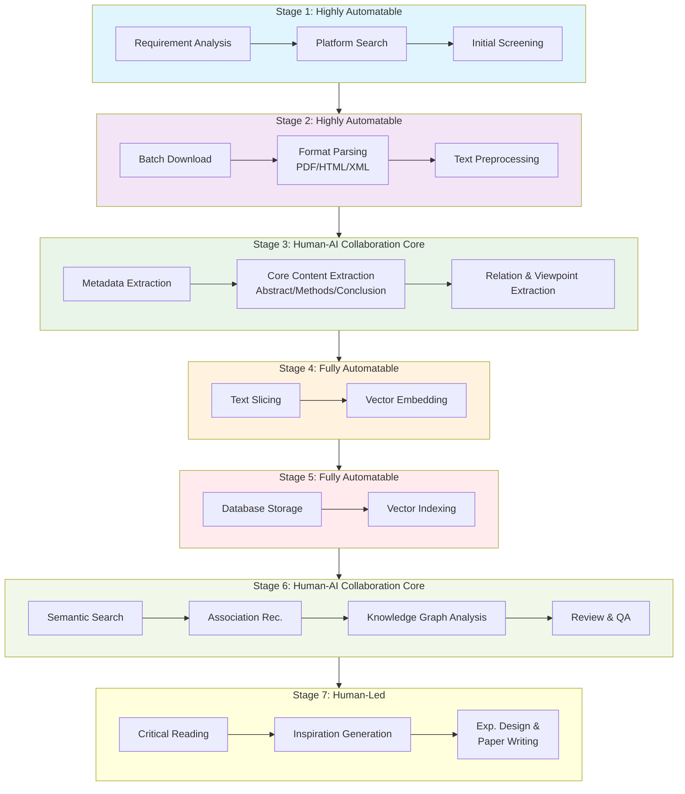
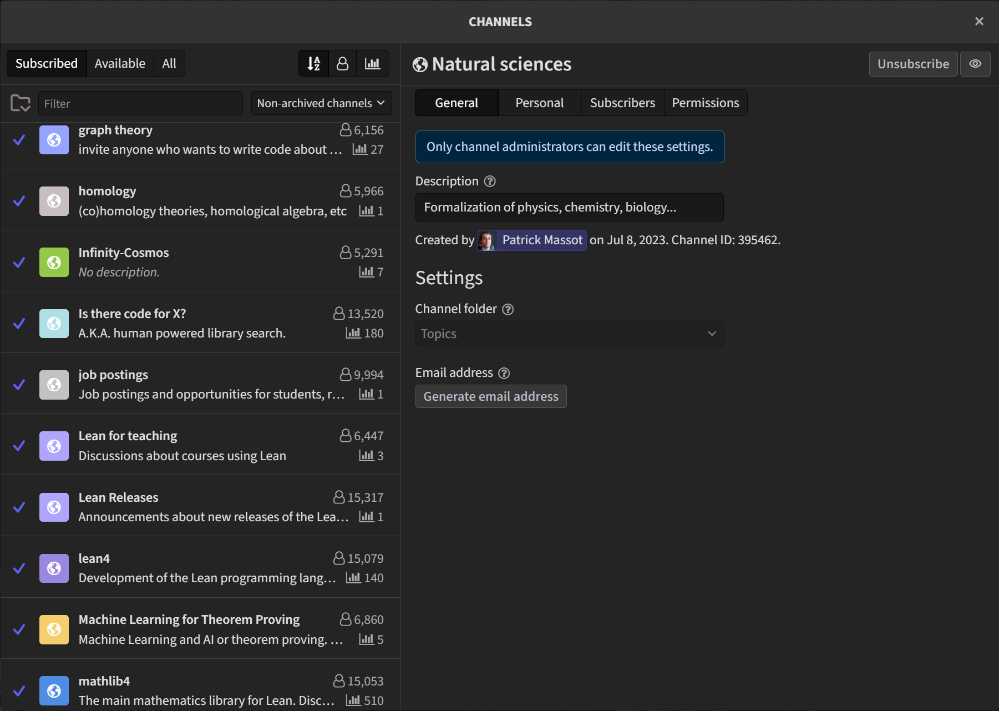

## 🏗️ Architecture Vision

The project is designed around a 7-stage workflow:

### Stage Analysis & Design Philosophy

The overall workflow is designed centered on `human-machine collaboration`, integrating manual operations with intelligent processing of AI models to achieve efficient and accurate literature processing.

Core Principle: Deterministic tasks are accomplished through coding implementation combined with human judgment and decision-making, while indeterministic tasks are undertaken by intelligent Agents.

At each stage, AI models can be incorporated to enhance operational efficiency and intelligence. Such functional modules are uniformly defined as AI Plugins (marked with 🌟 throughout the documentation). Users may selectively integrate these AI Plugins according to personalized requirements to extend and empower the capabilities of each workflow stage.

⚠️ Note: This repository only provides the design specifications and integration schemes for AI Plugins. The selection of specific AI models, prompt engineering, and result post-processing shall be independently customized by users based on their own research demands.

---

#### 📝 中文设计说明（脚注）
> **阶段分析与设计理念**
> 本工作流以**人机协同**为核心设计思想，将人工操作与 AI 模型智能处理深度融合，实现高效、精准的文献处理流程。
>
> **核心原则**：确定性任务通过代码化实现并结合人工判断与决策完成；非确定性任务由智能代理执行。
>
> 各流程阶段均可嵌入 AI 模型以提升执行效率与智能化水平，此类功能模块统一定义为 **🌟AI 插件**。用户可根据个性化需求选择性集成，实现各工作流阶段的能力扩展与增强。
>
> ⚠️ **说明**：本仓库仅提供 AI 插件的设计规范与集成方案，具体模型选型、提示词工程与结果后处理需用户根据自身研究需求独立定制。

--- 

#### Stage 1: Retrieval & Collection
The starting point of the entire workflow.
- **Manual Process**: Manually entering Queries on platforms like PubMed, BioRxiv, arXiv or Google Scholar, browsing results, and saving literature results locally.
- **Automation Entry Points**:
    - **Intelligent Retrieval Agent**: Scripts using APIs or crawlers to perform periodic automated searches based on preset keywords, journal lists, or scholar tracking.
    - **Initial Screening Algorithms**: Rule-based filtering (e.g., title terms, impact factor, date range) to sort and filter results.
- **🌟AI Plugin**
    - **Intelligent Query Refinement (Query builder skill)**: Utilizing LLMs to refine user queries based on the context of the literature, improving search accuracy. Design an interactive topic and query builder. After users input a general research theme, the AI assists in refining and expanding the theme through multi-round brainstorming iterations, clarifying users’ real research demands and academic orientation. It then generates multiple combinations of retrieval keywords and continuously optimizes these combinations based on user feedback to achieve comprehensive coverage of relevant literature. The module retains the traceability of research theme reasoning, as well as the diversity and relevance of the final keyword sets.
    - **Reference inspiration**: Some brainstorm skills, like [Superpowers brainstorm](https://github.com/obra/superpowers)/[iorlas-brainstorm](https://github.com/iorlas/brainstorm),  they can be referenced and scenario-adapted for optimization in literature retrieval workflows.

---
> 📝 中文脚注
>
> **阶段1：检索与收集**
> 
> **人工流程**：在 PubMed、BioRxiv、arXiv 等学术平台手动输入检索关键词，逐条浏览检索结果并完成文献留存。
>
> **自动化切入点**：
> - **智能检索代理**：依托官方 API 或合规爬虫能力，依据预设关键词库、目标期刊列表、重点学者追踪规则，实现周期性自动化文献检索。
> - **初筛算法**：基于标题专业术语、期刊影响因子、发表时间范围等约束条件，对检索文献进行规则化初步过滤与筛选。
>
> 🌟 **AI 插件能力说明**
> 
> > **研究主题/检索词构建模块**：提供交互式主题与检索词构建能力。用户输入粗略研究方向后，AI 通过多轮头脑风暴迭代细化拓展研究主题，精准挖掘真实文献调研需求与科研切入点；自动生成多组适配检索关键词，并根据用户反馈持续迭代优化，最大化覆盖领域相关文献。完整保留研究主题推演全过程可追溯性，同时保证输出关键词组合的多样性与学术相关性。
> 
> > 模块设计可参考开源社区多个学术文献brainstorm skill，并结合学术文献检索场景做定制化适配与优化。
---

#### Stage 2: Processing & Parsing
Convert raw literature files into machine-processable plain text and metadata, which are organized into Markdown or JSON format for subsequent AI downstream processing.

In general, metadata is acquired via APIs or web crawlers, while full-text content is obtained manually from PDF files and then parsed through a unified parser.
- **Automation Entry Points**:
    - **Unified PDF Parser**: Adopt mainstream tools (e.g., pdfplumber, opendataloader-pdf, MinerU, PaddleOCR) to accurately extract text, figures and tables from PDFs, and standardize outputs into Markdown or JSON.
    - **Metadata Enhancement**: Automatically retrieve and supplement complete bibliographic metadata (title, authors, DOI, keywords, etc.) through APIs or crawlers with unified formatting.
- **🌟AI Plugin**
    - **PDF Parsing Module**: Design an intelligent PDF parser capable of automatically recognizing and extracting text, figures, tables, and other elements from PDFs, and converting them into standardized Markdown or JSON format. Reference tools like [MinerU](https://github.com/opendatalab/MinerU). We deploy and adapt its core capabilities to implement the customized PDF parsing module for our workflow.
    - **Reference Inspiration**: Some PDF parsing skills, like [MinerU-Skill](https://github.com/Nebutra/MinerU-Skill), they can be referenced and scenario-adapted for optimization in literature processing workflows.

---
> 📝 中文脚注
> 
> **阶段2：处理与解析**
> 
> 将原始文献文件转换为可被程序识别处理的纯文本与元数据，并规整为 Markdown / JSON 结构化格式，适配后续 AI 模型处理流程。
> 
> 整体分工：元数据通过开放 API 或合规爬虫自动获取；全文内容由人工收集 PDF 后，经由统一解析器完成结构化解析。
>
> **自动化切入点**
> - **统一解析器**：基于 pdfplumber、opendataloader-pdf、MinerU、PaddleOCR 等工具，高精度提取 PDF 内文本、图表与表格，统一导出为 Markdown 或 JSON 格式。
> - **元数据增强**：通过 API 与爬虫自动抓取、补全文献标题、作者、DOI、关键词等完整元数据，并完成格式标准化对齐。
>
> 🌟 **AI 插件能力说明**
> 
> >**PDF 解析模块**：智能识别 PDF 中的文本、图表、表格等版式元素，完成结构化抽取并输出标准 Markdown / JSON, 由于解析出来的pdf文件提取不友好, 需要进一步进行语义优化解析、边界处理，并支持自定义解析规则与格式。可以纯正则边界解析，也可以借助大模型、skill进行语义优化解析。
---

#### Stage 3: Core Information Structured Extraction
The critical leap from "Text" to "Information".
- **Automation Entry Points** (Human-AI Collaboration Core):
    - **Structured Information Extraction**: Deploy large language models (LLMs) to simulate domain‑expert thinking, extracting literature content into predefined structured schemas, including problem statements, core methodologies, key experimental data, and research conclusions.
    - **Relation & Viewpoint Extraction**: Detect citation sentiment and intent (support / refute / neutral), and distill condensed core arguments from academic narratives.
    - **Ontology Construction**: Build domain‑specific ontologies based on professional terminologies, to support downstream knowledge representation, semantic linking and logical reasoning (🌟)
    - **Formalized Proof**: For methodological or theoretical papers, formalize core arguments into rigorous logical expressions, and verify internal logical consistency via automated theorem‑proving tools such as the `Lean Prover`. Reference community: [Lean Zulip Forum](https://leanprover.zulipchat.com/#channels/395462/Natural.20sciences/general)

        Additional resources and discussions on ontology engineering and formalized proof can be accessed from the Lean Zulip Forum.

- 🌟 **AI Plugin**
    - Information Extraction & Ontology Construction Skill: Design a dedicated skill module that extracts structured information from parsed literature texts following predefined schemas, and automatically constructs domain ontologies from professional terminologies.
    - Reference inspiration: [OpenIE](https://github.com/knowitall/openie). But actually, we only need to implement one simple literature-reading skill at this stage, focusing on basic structured information (e.g., research questions, core methods, key experimental data, research conclusions). Advanced capabilities such as relation extraction and ontology construction will be iteratively upgraded later. For example, [ai4s-paper reading skill](https://github.com/MaybeBio/ai4s-paper)

> 📝 中文脚注
>
> **阶段3：核心信息结构化提取**
>
> 实现从原始“文本”到可复用“结构化信息”的关键跃迁，完成文献内容的语义提纯与知识固化。
>
> **自动化切入点（人机协同核心）**
> - **结构化信息抽取**：以大语言模型（LLM）模拟领域专家视角，按照预设固定范式抽取文献核心要素，包含研究问题陈述、核心方法、关键实验数据、研究结论等。
> - **关系与观点提取**：识别文献引用的情感与立场（支持/反驳/中立），从长篇论述中凝练精简的核心论点。
> - **构建本体论**：依托领域专属专业术语搭建本体知识体系，用于后续知识表示、语义关联与逻辑推理，为深度知识挖掘提供底层框架。
> - **形式化证明**：针对方法论类、理论性论文，将核心论证逻辑转化为严谨的形式化逻辑表达式，借助 Lean Prover 等自动定理证明工具校验论证内部一致性；可参考 Lean Zulip 论坛获取本体构建与形式化证明的社区资源与前沿讨论。
>
> 🌟 **AI 插件能力说明**
> 
> > **信息抽取与本体构建 Skill**：定制开发专属智能能力模块，可依据预设 Schema 从解析后的文献文本中精准抽取结构化信息，并基于领域术语自动生成、迭代本体论，适配科研知识图谱构建与逻辑推理需求。可参考开放信息抽取框架 OpenIE 的设计范式优化模块语义解析能力。但实际上，我们在这个阶段只需要实现一个简单的文献阅读技能，重点关注基础的结构化信息（例如研究问题、核心方法、关键实验数据、研究结论等）。诸如关系抽取和本体构建等高级功能将会在后续迭代中逐步升级完善。比如说[ai4s-paper阅读skill](https://github.com/MaybeBio/ai4s-paper)

#### Stage 4: Deep Encoding & Vectorization
Establishing mathematical representations for information.
- **Automation Entry Points**:
    - **Text Embedding**: Using Transformer models to generate high-dimensional vectors (Embeddings) for literature.
    - **Vector Storage**: Storing vectors in specialized databases (e.g., ChromaDB, Pinecone) to enable semantic retrieval.
  
⚠️ Note: Due to current development efforts and practical business needs, we will significantly simplify the construction of the literature knowledge corpus, and **Stages 4 and 5 will not be deeply developed temporarily**.

> 📝 中文脚注
>
> #### 阶段4：深度编码与向量化
> 为抽取后的结构化信息建立可计算的数学表征，目的是为了能够在后续的语义检索与相似度匹配中，实现更准确、更高效的检索结果（就像代码相似性搜索一样，实现相似语句、段落、观点级别的检索）。
> - **自动化切入点**：
>     - **文本嵌入**：基于Transformer模型，为文献内容生成高维语义向量（Embedding）。
>     - **向量存储**：将生成的语义向量存入向量数据库（如ChromaDB、Pinecone），实现高效语义检索与相似度匹配。
>
> 注：受当前开发精力与实际业务需求约束，将大幅简化文献知识语料库构建工作，**阶段4、阶段5暂不进行深度开发**。

#### Stage 5: Dynamic Knowledge Base Storage & Indexing
The "memory module" of the system.
- **Automation Entry Points**:
    - **Multi‑modal Database**: Integrate relational databases (for structured information storage) and vector databases (for embedding storage).
    - **Automated Indexing & Association**: Automatically discover potential connections between literatures via co‑citation analysis and methodological similarity calculation, constructing initial edges of the knowledge graph.
  
⚠️ Note: Due to current development efforts and practical business needs, we will significantly simplify the construction of the literature knowledge corpus, and **Stages 4 and 5 will not be deeply developed temporarily**.

> 📝 中文脚注
>
> #### 阶段5：动态知识库存储与索引
> 系统的核心“记忆体”模块，实现文献知识的持久化与关联化存储。
> - **自动化切入点**：
>     - **多模态数据库**：融合关系型数据库（用于结构化信息存储）与向量数据库（用于语义向量存储），实现分层存储。
>     - **自动化索引与关联**：通过共引分析、方法相似度计算，自动挖掘文献间潜在关联关系，构建知识图谱的初始边结构。
>
> 注：受当前开发精力与实际业务需求约束，将大幅简化文献知识语料库构建工作，**阶段4、阶段5暂不进行深度开发**。

#### Stage 6: Intelligent Interaction & Knowledge Discovery
Proactive academic exploration powered by the knowledge base.
- **Automation Entry Points** (Human‑AI Collaboration Core):
    - **Semantic Search Engine**: Enable query‑driven retrieval that understands question semantics and returns relevant literature excerpts.
    - **Relevance Recommendation & Visualization**: Recommend related literatures based on content similarity and visualize the academic landscape.
    - **Intelligent Q&A & Review Generation**: Generate structured academic reviews based on all literature data in the knowledge base.
    - **Formalized Proof & Idea Generation**: Perform logical reasoning over the knowledge graph to identify potential research gaps or contradictions and inspire novel research directions. In particular, tools like the Lean Prover can automatically verify the logical consistency of arguments. It alerts researchers to contradictions or unproven assumptions for further investigation, thus facilitating new research opportunities (🌟).
    - **⚠️Simplified Integrated Knowledge Base Workflow**: `Given that Stage 4 and Stage 5 will not be deeply developed temporarily, we integrate Stages 4, 5 and 6 into a unified pipeline. Currently we build a basic literature corpus: convert all topic‑related papers into Markdown format, then standardize semantic parsing into fixed sections using LLMs or regular‑expression boundary detection. Our literature knowledge base is essentially a lightweight full‑text repository clustered by paper sections. We design dedicated high‑efficiency modules for corpus interaction: batch‑extract abstracts for induction, batch‑extract introductions for background writing, batch‑extract discussion and conclusion sections for literature investigation and innovation identification, etc.`
  

> 📝 中文脚注
>
> #### 阶段6：智能交互与知识发现
> 依托已构建的知识库实现主动式学术知识探索。
> - **自动化切入点（人机协同核心）**：
>     - **语义搜索引擎**：实现语义级“以问代搜”，精准理解用户问题意图并返回匹配的文献段落。
>     - **关联推荐与可视化**：基于内容相似度实现文献智能推荐，对学术研究版图进行可视化呈现。
>     - **智能问答与综述生成**：基于知识库内全部文献，自动生成结构化学术综述。
>     - **形式化证明 & 研究思路碰撞**：在知识图谱上开展逻辑推理，挖掘潜在研究空白、学术矛盾点，启发创新研究方向。尤其可借助 Lean Prover 等工具自动校验论点逻辑一致性，对矛盾点或未验证假设进行预警提示，引导研究者深度挖掘，催生全新研究方向（🌟）。
>     - **⚠️简化版知识库集成工作流**：鉴于阶段4、阶段5暂不进行深度开发，我们将阶段4、阶段5与阶段6整合为统一流程。目前我们构建了一个基础的文献语料库：将所有与主题相关的论文转换为 Markdown 格式，然后通过 LLM 或正则表达式边界检测等方式，将语义解析标准化为固定的几个语段章节。我们的文献知识库本质上是一个以论文章节为聚类单位的轻量级全文库。我们设计了专门的高效模块进行语料库交互：批量抽取摘要进行归纳总结，批量抽取引言部分用于背景写作，批量抽取讨论和结论部分用于文献调查与创新点识别等等。有了语料库之后，深入的交互方式和智能分析我们全交给SOTA的文本理解和逻辑推理能力的LLM来实现就好，毕竟我们不需要在这个阶段构建一个完备的知识图谱系统，而是更关注于通过智能交互来提升文献处理效率和创新发现能力。

⚠️ 暂时将阶段4、5、6合并实现。

#### Stage 7: Final Output & Internalization
Human-led, with AI as an augmentation tool.
- **Automation Entry Points**:
    - **Assisted Writing & Citation**: Real-time recommendation of relevant citations and formatting during writing.
    - **Viewpoint Collision & Inspiration**: Presenting methodological conflicts or cross-domain associations to stimulate critical thinking.
    - **Advanced Corpus Query**: Support targeted section‑level retrieval from the full‑text literature corpus built in Stage 6, enabling quick access to abstracts, introductions, discussions and conclusions for paper writing, literature review and innovation mining. With the literature corpus in place, we can fully leverage the SOTA LLMs' capabilities in text understanding and logical reasoning to implement deep interaction and intelligent analysis.

- 🌟 **AI Plugin**
    - **Intelligent Q&A & Assited Writing**: Enable intelligent interaction with the user, including question‑answering, citation recommendation, and paper writing. All we need is a SOTA text processing LLM model.

> 📝 中文脚注
>
> #### 阶段七：最终产出与内化
> 以研究者为主导，AI 作为效率增强工具，完成知识落地与成果输出。
> - **自动化切入点**：
>     - **辅助写作与引用**：在论文撰写过程中，实时推荐相关参考文献并自动规范引用格式。
>     - **观点碰撞与灵感生成**：梳理不同研究间的方法论冲突，提供跨领域关联启发，激发批判性思考与创新思路。
>     - **语料库高级查询**：支持对阶段6构建的全文本文献语料库进行**章节级定向检索**，可快速调取摘要、引言、讨论、结论等内容，服务论文写作、文献调研与创新点挖掘。有了语料库之后，深入的交互方式和智能分析我们全交给SOTA的文本理解和逻辑推理能力的LLM来实现就好。
>
> 🌟 **AI 插件能力说明**
>
>   - **智能问答与辅助写作**：写作全流程辅助，只要我们的参考文献语料库都是真实的，那么本质上一切的写作后期问题都可以通过LLM来解决，包括但不限于各种复杂的Prompt工程，比如说Skill、Plugin的二次开发调用等。

