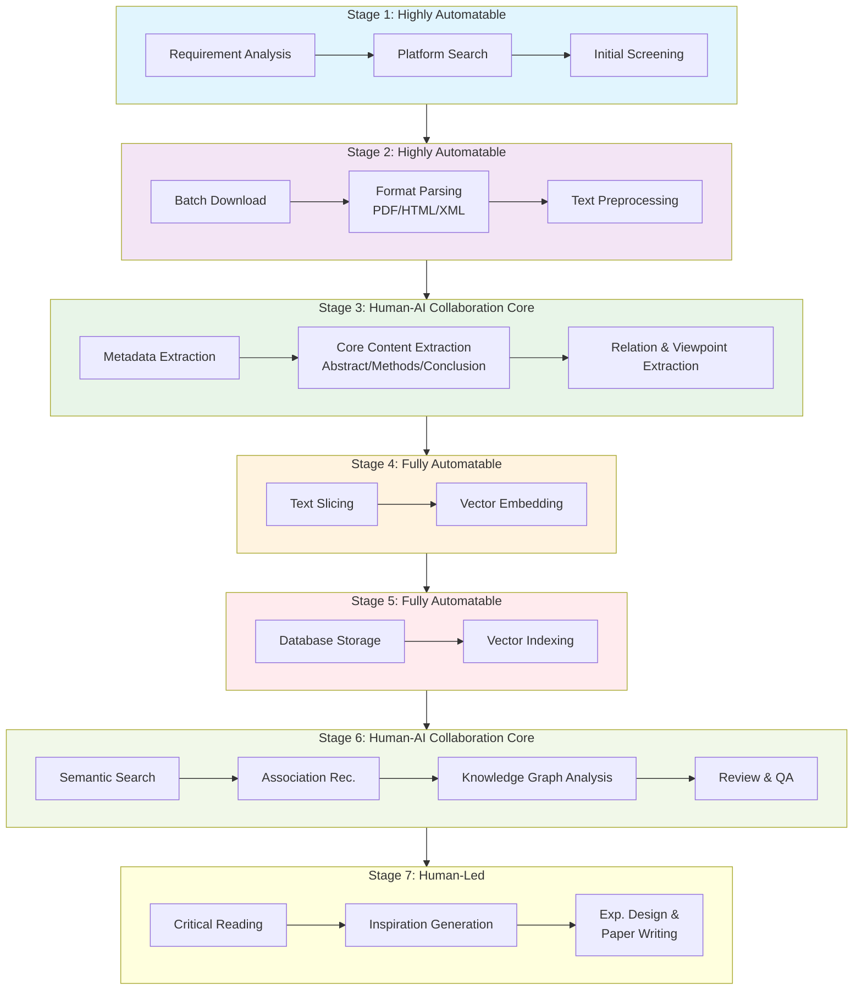
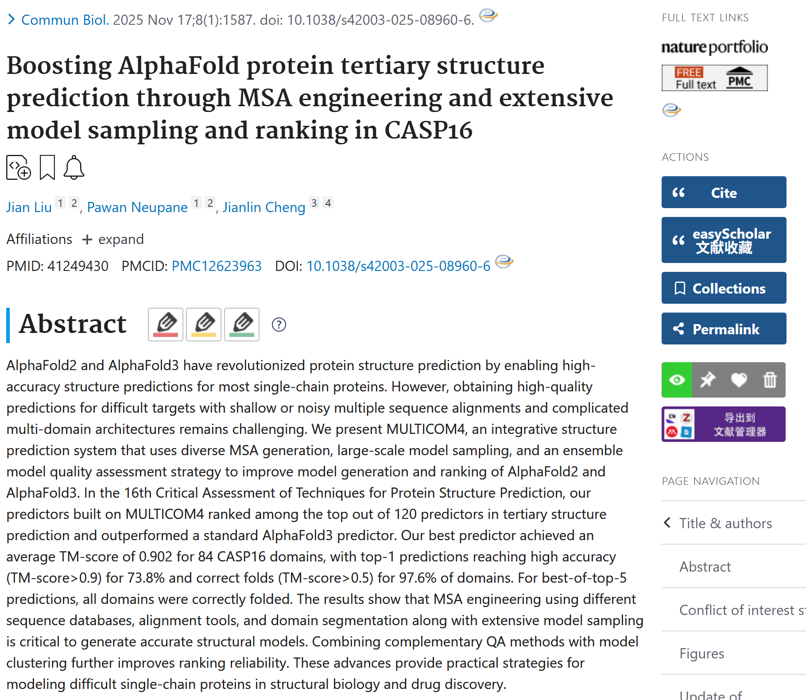

# pyPaperFlow - An Automatic Paper Reading Platform

[English Version](README.md) | [Chinese Version 中文版本](README_zh.md)

An automated platform designed to streamline the process of scientific literature reading. From retrieval and collection to structured extraction and intelligent analysis, this tool aims to assist researchers in managing and digesting large volumes of papers efficiently.


## 🚀 Features

- **Automated Retrieval**: Search and fetch paper metadata from PubMed/Medline.
- **Full-Text Access**: Automatically download open-access full text (XML/Text) from PMC.
- **Structured Storage**:
  - **Metadata**: Stored as detailed JSON files.
  - **Lookup Table**: A CSV-based hash table for fast indexing and management.
- **Tagging System**: Manually or programmatically tag papers to create feature vectors (e.g., `relevant=1`, `reviewed=0`).
- **CLI Tool**: A user-friendly command-line interface (`pyPaperFlow`) for all operations.

## 🏗️ Architecture Vision

The project is designed around a 7-stage workflow:



### Stage Analysis & Design Philosophy

#### Stage 1: Retrieval & Collection
The starting point of the entire workflow.
- **Manual Process**: Manually entering keywords on platforms like PubMed or Google Scholar, browsing results, and saving them.
- **Automation Entry Points**:
    - **Intelligent Retrieval Agent**: Scripts using APIs or crawlers to perform periodic automated searches based on preset keywords, journal lists, or scholar tracking.
    - **Initial Screening Algorithms**: Rule-based filtering (e.g., title terms, impact factor, date range) to sort and filter results.

#### Stage 2: Processing & Parsing
Converting raw files into computer-processable plain text and metadata.
- **Automation Entry Points**:
    - **Unified Parser**: Using tools (e.g., pdfplumber, GROBID) to extract text and charts from PDFs with high precision.
    - **Metadata Enhancement**: Automatically completing full bibliographic metadata (Title, Author, DOI, etc.) and ensuring format uniformity.

#### Stage 3: Core Information Structured Extraction
The critical leap from "Text" to "Information".
- **Automation Entry Points** (Human-AI Collaboration Core):
    - **Structured Information Extraction**: Using LLMs to act as domain experts, extracting information into fixed schemas (e.g., Problem Statement, Core Methods, Key Data, Conclusions).
    - **Relation & Viewpoint Extraction**: Identifying citation intent (support/refute) and distilling core arguments.

#### Stage 4: Deep Encoding & Vectorization
Establishing mathematical representations for information.
- **Automation Entry Points**:
    - **Text Embedding**: Using Transformer models to generate high-dimensional vectors (Embeddings) for literature.
    - **Vector Storage**: Storing vectors in specialized databases (e.g., ChromaDB, Pinecone) to enable semantic retrieval.

#### Stage 5: Dynamic Knowledge Base Storage & Indexing
The "Memory" of the system.
- **Automation Entry Points**:
    - **Multi-modal Database**: A dual-storage system combining relational databases (for structured info) and vector databases (for embeddings).
    - **Automated Indexing & Association**: Automatically establishing potential links between papers (co-citation analysis, method similarity) to build the initial edges of a knowledge graph.

#### Stage 6: Intelligent Interaction & Knowledge Discovery
Active exploration using the built knowledge base.
- **Automation Entry Points** (Human-AI Collaboration Core):
    - **Semantic Search Engine**: "Ask instead of Search" - understanding query semantics to return relevant passages.
    - **Association Recommendation & Visualization**: Recommending papers based on content similarity and visualizing the academic landscape.
    - **Intelligent QA & Review Generation**: Generating structured mini-reviews based on all literature in the database.

#### Stage 7: Final Output & Internalization
Human-led, with AI as an augmentation tool.
- **Automation Entry Points**:
    - **Assisted Writing & Citation**: Real-time recommendation of relevant citations and formatting during writing.
    - **Viewpoint Collision & Inspiration**: Presenting methodological conflicts or cross-domain associations to stimulate critical thinking.

*Currently, Stages 1, 2, and parts of 4/5 (Lite version via Tagging) are implemented.*

## 📦 Installation

```bash
git clone https://github.com/MaybeBio/pyPaperFlow.git
cd pyPaperFlow
pip install -e .
```

## 🛠️ Usage

The platform provides a CLI tool named `paperflow`.

### 1. Search PubMed
Search for papers and get a list of PMIDs.

```bash
paperflow search "COVID-19 vaccine" --retmax 5
```

### 2. Fetch Papers
Fetch metadata for papers and save them to your local storage.

**By Query:**
```bash
paperflow fetch --query "COVID-19 vaccine" --batch-size 10
```

**By PMID List:**
Create a file `pmids.txt` with one PMID per line, then run:
```bash
paperflow fetch --file pmids.txt
```

### 3. Download Full Text
Download PMC full text for fetched papers (if available).

```bash
paperflow download-fulltext --pmid 34320283
```

### 4. Manage Tags (Feature Vectors)
Organize your papers by assigning tags. This creates a feature vector for each paper in the lookup table.

```bash
# Mark a paper as relevant
paperflow tag 34320283 relevant 1

# Mark a paper as read
paperflow tag 34320283 read 1
```

### 5. Query & Retrieve
Find papers based on your tags or retrieve full details.

**Query by Tags:**
```bash
# Find all relevant papers
paperflow query --tag relevant=1
```

**Get Paper Details:**
```bash
paperflow get 34320283
```

## 📂 Data Structure

The platform uses a "Lite" storage approach:

-   **`paper_data/paper_lookup.csv`**: A lookup table acting as a local database.
    -   Rows: PMIDs.
    -   Columns: `json_path`, and dynamic tags (e.g., `relevant`, `topic_A`).
-   **`paper_data/papers/{pmid}.json`**: Detailed metadata and content for each paper.

We will store all datas in structures like:

output dir/year/pmid/your files


## 📝 Notes on Medline Format

The fetcher parses Medline format to extract rich metadata including:
-   **PMID**: PubMed ID
-   **DP**: Date of Publication
-   **TI**: Title
-   **AB**: Abstract
-   **FAU/AU**: Authors
-   **AD**: Affiliations
-   **PT**: Publication Type (e.g., Journal Article, Review)

## 🔗 References & Inspiration

-   [PubMed Research Extractor](https://github.com/Proveer/pubmed-research-extractor)
-   [BioLitMiner](https://github.com/akshayoo/BioLitMiner)


## Test Cases

### 🧬 Case 1: Get PMIDs from Query

run the command:
```bash
paperflow search "alphafold3 AND conformation AND ensemble" --email YOUR_EMAIL --api-key YOUR_NCBI_API_KEY -o ./test
```
the log shows:
```bash
✅ NCBI API Key set successfully. Rate limit increased to 10 req/s.
Now searching PubMed with query [alphafold3 AND conformation AND ensemble] at [2026-01-13 09:25:09] ...
found 16 related articles about [alphafold3 AND conformation AND ensemble] at [2026-01-13 09:25:10] ...
Retrieving 16 PMIDs from history server at [2026-01-13 09:25:10] ...
Fetching PMIDs 1 to 16 at [2026-01-13 09:25:10] ...
  -> Retrieved 16 PMIDs in this batch.
Total PMIDs retrieved: 16 out of 16 at [2026-01-13 09:25:12] ...
Found 16 PMIDs.
['41502950', '41478913', '41432299', '41249430', '41147497', '41047853', '41014267', '40950168', '40938899', '40714407', '40549150', '40490178', '39574676', '39186607', '38996889', '38995731']
PMIDs saved to ./test/searched_pmids.txt.
```
As you can see, we will print the PMIDs list for you and save it in a text file which can be used further.


### 🧬 Case 2: Fetch Metadata for pubmed papers from query or PMIDs list

If you do not have detailed PMID list and want to fetch meta information from query, run the command:
```bash
paperflow fetch -q "alphafold3 AND conformation AND ensemble" --email YOUR_EMAIL --api-key YOUR_NCBI_API_KEY -o ./test/alphafold3_ensemble
```

the log shows:
```bash
 NCBI API Key set successfully. Rate limit increased to 10 req/s.
Fetching papers for query: alphafold3 AND conformation AND ensemble
Now searching PubMed with query [alphafold3 AND conformation AND ensemble] at [2026-01-13 09:14:38] ...
found 16 related articles about [alphafold3 AND conformation AND ensemble] at [2026-01-13 09:14:39] ...
Fetching articles 1 to 16 at [2026-01-13 09:14:39] ...
  -> Retrieved 16 Medline records and 16 Xml articles. Please check whether they equal and the efetch number here with esearch count.
Error in batch Elink acheck for 16 PMIDs (Attempt 1/5): [IncompleteRead(167 bytes read)]. Retrying in 1s...
Error in batch Elink acheck for 16 PMIDs (Attempt 2/5): [IncompleteRead(167 bytes read)]. Retrying in 1s...
Error in batch Elink acheck for 16 PMIDs (Attempt 3/5): [IncompleteRead(167 bytes read)]. Retrying in 1s...
Error in batch Elink acheck for 16 PMIDs (Attempt 4/5): [IncompleteRead(167 bytes read)]. Retrying in 1s...
    [Warning] Batch Elink acheck failed for 16 PMIDs after 5 attempts at [2026-01-13 09:16:06] ...  Skipping discovery step (using default links). Error: IncompleteRead(167 bytes read)
  -> Deep mining 5 types of internal connections for 16 PMIDs at [2026-01-13 09:16:06] ...
     Fetching pubmed_pmc from pmc for 16 PMIDs at [2026-01-13 09:16:06] ...
     Fetching pubmed_pubmed from pubmed for 16 PMIDs at [2026-01-13 09:16:10] ...
     Fetching pubmed_pubmed_citedin from pubmed for 16 PMIDs at [2026-01-13 09:16:14] ...
     Fetching pubmed_pubmed_reviews from pubmed for 16 PMIDs at [2026-01-13 09:16:18] ...
     Fetching pubmed_pubmed_refs from pubmed for 16 PMIDs at [2026-01-13 09:16:24] ...
  -> Fetching external LinkOuts (Datasets, Full Text, etc.) for 16 PMIDs at [2026-01-13 09:16:27] ...
  -> Saved 41502950 to ./test/alphafold3_ensemble/2026/41502950/41502950.json
  -> Saved 41478913 to ./test/alphafold3_ensemble/2026/41478913/41478913.json
  -> Saved 41432299 to ./test/alphafold3_ensemble/2026/41432299/41432299.json
  -> Saved 41249430 to ./test/alphafold3_ensemble/2025/41249430/41249430.json
  -> Saved 41147497 to ./test/alphafold3_ensemble/2026/41147497/41147497.json
  -> Saved 41047853 to ./test/alphafold3_ensemble/2026/41047853/41047853.json
  -> Saved 41014267 to ./test/alphafold3_ensemble/2026/41014267/41014267.json
  -> Saved 40950168 to ./test/alphafold3_ensemble/2025/40950168/40950168.json
  -> Saved 40938899 to ./test/alphafold3_ensemble/2025/40938899/40938899.json
  -> Saved 40714407 to ./test/alphafold3_ensemble/2025/40714407/40714407.json
  -> Saved 40549150 to ./test/alphafold3_ensemble/2025/40549150/40549150.json
  -> Saved 40490178 to ./test/alphafold3_ensemble/2025/40490178/40490178.json
  -> Saved 39574676 to ./test/alphafold3_ensemble/2024/39574676/39574676.json
  -> Saved 39186607 to ./test/alphafold3_ensemble/2024/39186607/39186607.json
  -> Saved 38996889 to ./test/alphafold3_ensemble/2024/38996889/38996889.json
  -> Saved 38995731 to ./test/alphafold3_ensemble/2024/38995731/38995731.json
```

you can check the result here: [alphafold3_ensemble](./test/alphafold3_ensemble/)

Otherwise, if you have detailed PMID list,
run the command below:
```bash
paperflow fetch -f ./test/searched_pmids.txt  --email YOUR_EMAIL --api-key YOUR_NCBI_API_KEY -o ./test/alphafold3_ensemble_try2
```

the log shows the same way:

```bash
✅ NCBI API Key set successfully. Rate limit increased to 10 req/s.
Fetching 16 papers from file /data2/pyPaperFlow/test/searched_pmids.txt.
Total PMIDs to fetch: 16 at [2026-01-13 09:27:13] ...
Fetching articles 1 to 16 (PMID: ['41502950', '41478913', '41432299', '41249430', '41147497', '41047853', '41014267', '40950168', '40938899', '40714407', '40549150', '40490178', '39574676', '39186607', '38996889', '38995731']) at [2026-01-13 09:27:13] ...
  -> Retrieved 16 Medline records and 16 Xml articles. Please check whether they equal and whether they match the number of this batch.
Error in batch Elink acheck for 16 PMIDs (Attempt 1/5): [IncompleteRead(167 bytes read)]. Retrying in 1s...
Error in batch Elink acheck for 16 PMIDs (Attempt 2/5): [IncompleteRead(167 bytes read)]. Retrying in 1s...
Error in batch Elink acheck for 16 PMIDs (Attempt 3/5): [IncompleteRead(167 bytes read)]. Retrying in 1s...
Error in batch Elink acheck for 16 PMIDs (Attempt 4/5): [IncompleteRead(167 bytes read)]. Retrying in 1s...
    [Warning] Batch Elink acheck failed for 16 PMIDs after 5 attempts at [2026-01-13 09:28:40] ...  Skipping discovery step (using default links). Error: IncompleteRead(167 bytes read)
  -> Deep mining 5 types of internal connections for 16 PMIDs at [2026-01-13 09:28:40] ...
     Fetching pubmed_pubmed from pubmed for 16 PMIDs at [2026-01-13 09:28:40] ...
     Fetching pubmed_pmc from pmc for 16 PMIDs at [2026-01-13 09:28:44] ...
     Fetching pubmed_pubmed_citedin from pubmed for 16 PMIDs at [2026-01-13 09:28:51] ...
     Fetching pubmed_pubmed_refs from pubmed for 16 PMIDs at [2026-01-13 09:29:01] ...
     Fetching pubmed_pubmed_reviews from pubmed for 16 PMIDs at [2026-01-13 09:29:08] ...
  -> Fetching external LinkOuts (Datasets, Full Text, etc.) for 16 PMIDs at [2026-01-13 09:29:13] ...
  -> Saved 41502950 to ./test/alphafold3_ensemble_try2/2026/41502950/41502950.json
  -> Saved 41478913 to ./test/alphafold3_ensemble_try2/2026/41478913/41478913.json
  -> Saved 41432299 to ./test/alphafold3_ensemble_try2/2026/41432299/41432299.json
  -> Saved 41249430 to ./test/alphafold3_ensemble_try2/2025/41249430/41249430.json
  -> Saved 41147497 to ./test/alphafold3_ensemble_try2/2026/41147497/41147497.json
  -> Saved 41047853 to ./test/alphafold3_ensemble_try2/2026/41047853/41047853.json
  -> Saved 41014267 to ./test/alphafold3_ensemble_try2/2026/41014267/41014267.json
  -> Saved 40950168 to ./test/alphafold3_ensemble_try2/2025/40950168/40950168.json
  -> Saved 40938899 to ./test/alphafold3_ensemble_try2/2025/40938899/40938899.json
  -> Saved 40714407 to ./test/alphafold3_ensemble_try2/2025/40714407/40714407.json
  -> Saved 40549150 to ./test/alphafold3_ensemble_try2/2025/40549150/40549150.json
  -> Saved 40490178 to ./test/alphafold3_ensemble_try2/2025/40490178/40490178.json
  -> Saved 39574676 to ./test/alphafold3_ensemble_try2/2024/39574676/39574676.json
  -> Saved 39186607 to ./test/alphafold3_ensemble_try2/2024/39186607/39186607.json
  -> Saved 38996889 to ./test/alphafold3_ensemble_try2/2024/38996889/38996889.json
  -> Saved 38995731 to ./test/alphafold3_ensemble_try2/2024/38995731/38995731.json
```

We store the meta data of the paper in a json file.
 
One example [PMID 41249430](./test/alphafold3_ensemble/2025/41249430/41249430.json) listed as below:





### 🧬 Case 3: Fetch full text data for pubmed papers from PMIDs list

If you just want to fetch full text from pmids, you can just run 
```bash
# we choose pmid 39570595 here as an example
paperflow download-fulltext  -p 39570595  --email YOUR_EMAIL --api-key YOUR_NCBI_API_KEY -o ./test/full_text
```

the log shows
```bash
✅ NCBI API Key set successfully. Rate limit increased to 10 req/s.
Downloading full texts for 1 PMIDs from file provided PMIDs.
Fetching full text for 1 Pubmed articles at [2026-01-14 19:08:37] ...
 -> Converting Pubmed articles 1 to 1 (PMID : ['39570595']) to PMC IDs at [2026-01-14 19:08:37] ...
  -> Mapped 1 out of 1 PMIDs to valid PMC IDs. Downloading full text XML for these PMC IDs at [2026-01-14 19:08:39] ...
  -> Saved XML to ./test/full_text/2024/39570595/39570595.xml
  -> Saved parsed JSON to ./test/full_text/2024/39570595/39570595_parsed.json
  -> Saved parsed text to ./test/full_text/2024/39570595/39570595_parsed.md
```

As you can see, for full-text data, we handle it differently from metadata—while metadata is simply stored in a JSON file, full-text data is output into three files with distinct formats, each serving a specific purpose:
* **{PMID}.xml**: Stores the raw XML content retrieved directly from the response, preserving the original data structure.
* **{PMID_parsed}.json**: Contains detailed, structured full-text content. This format allows for direct extraction of specific sections (e.g., introduction, results, discussion), making it ideal for quick exploration or targeted analysis of particular parts of the text.
* **{PMID_parsed}.md**: Saves the full text of the paper in Markdown format. Its clean, human-readable structure makes it well-suited for high-throughput summarization tasks using LLMs/AI tools (such as ChatGPT or other preferred models).


or you can batch download what you want 
```bash
# we use searched_pmids.txt generated by Case1
paperflow download-fulltext  -f ./test/searched_pmids.txt  --email YOUR_EMAIL --api-key YOUR_NCBI_API_KEY -o ./test/alphafold_ensemble_try3_full_text
```

the log shows 
```bash
✅ NCBI API Key set successfully. Rate limit increased to 10 req/s.
Downloading full texts for 16 PMIDs from file /data2/pyPaperFlow/test/searched_pmids.txt.
Fetching full text for 16 Pubmed articles at [2026-01-14 19:41:58] ...
 -> Converting Pubmed articles 1 to 16 (PMID : ['41502950', '41478913', '41432299', '41249430', '41147497', '41047853', '41014267', '40950168', '40938899', '40714407', '40549150', '40490178', '39574676', '39186607', '38996889', '38995731']) to PMC IDs at [2026-01-14 19:41:58] ...
  -> Mapped 8 out of 16 PMIDs to valid PMC IDs. Downloading full text XML for these PMC IDs at [2026-01-14 19:42:14] ...
  -> Saved XML to ./test/alphafold_ensemble_try3_full_text/2024/38995731/38995731.xml
  -> Saved parsed JSON to ./test/alphafold_ensemble_try3_full_text/2024/38995731/38995731_parsed.json
  -> Saved parsed text to ./test/alphafold_ensemble_try3_full_text/2024/38995731/38995731_parsed.md
  -> Saved XML to ./test/alphafold_ensemble_try3_full_text/2024/39574676/39574676.xml
  -> Saved parsed JSON to ./test/alphafold_ensemble_try3_full_text/2024/39574676/39574676_parsed.json
  -> Saved parsed text to ./test/alphafold_ensemble_try3_full_text/2024/39574676/39574676_parsed.md
  -> Saved XML to ./test/alphafold_ensemble_try3_full_text/2025/40950168/40950168.xml
  -> Saved parsed JSON to ./test/alphafold_ensemble_try3_full_text/2025/40950168/40950168_parsed.json
  -> Saved parsed text to ./test/alphafold_ensemble_try3_full_text/2025/40950168/40950168_parsed.md
  -> Saved XML to ./test/alphafold_ensemble_try3_full_text/2025/41249430/41249430.xml
  -> Saved parsed JSON to ./test/alphafold_ensemble_try3_full_text/2025/41249430/41249430_parsed.json
  -> Saved parsed text to ./test/alphafold_ensemble_try3_full_text/2025/41249430/41249430_parsed.md
  -> Saved XML to ./test/alphafold_ensemble_try3_full_text/2025/40549150/40549150.xml
  -> Saved parsed JSON to ./test/alphafold_ensemble_try3_full_text/2025/40549150/40549150_parsed.json
  -> Saved parsed text to ./test/alphafold_ensemble_try3_full_text/2025/40549150/40549150_parsed.md
  -> Saved XML to ./test/alphafold_ensemble_try3_full_text/2025/41432299/41432299.xml
  -> Saved parsed JSON to ./test/alphafold_ensemble_try3_full_text/2025/41432299/41432299_parsed.json
  -> Saved parsed text to ./test/alphafold_ensemble_try3_full_text/2025/41432299/41432299_parsed.md
  -> Saved XML to ./test/alphafold_ensemble_try3_full_text/2025/40938899/40938899.xml
  -> Saved parsed JSON to ./test/alphafold_ensemble_try3_full_text/2025/40938899/40938899_parsed.json
  -> Saved parsed text to ./test/alphafold_ensemble_try3_full_text/2025/40938899/40938899_parsed.md
  -> Saved XML to ./test/alphafold_ensemble_try3_full_text/2026/41502950/41502950.xml
  -> Saved parsed JSON to ./test/alphafold_ensemble_try3_full_text/2026/41502950/41502950_parsed.json
  -> Saved parsed text to ./test/alphafold_ensemble_try3_full_text/2026/41502950/41502950_parsed.md
```
as you can see, not all pmids have a validated pmc id, you can try other tools for free full text extraction


### 🧬 Case 4: Fetch full paper data (including metadata and full text data) for pubmed papers from PMIDs list

Now if you want to get everything of papers you want, not just metadata or full text but BOTH!

You can simply run 
```bash
# from query 
paperflow fetch-full --query "IDR AND interaction AND deep learning" --email YOUR_EMAIL --api-key YOUR_NCBI_API_KEY -o ./test/full_paper_test

# from PMID list

```
the log shows 
```
✅ NCBI API Key set successfully. Rate limit increased to 10 req/s.
=== Step 1: Fetching Metadata ===
Now searching PubMed with query [IDR AND interaction AND deep learning] at [2026-01-14 21:50:51] ...
found 5 related articles about [IDR AND interaction AND deep learning] at [2026-01-14 21:50:52] ...
Fetching articles 1 to 5 at [2026-01-14 21:50:52] ...
  -> Retrieved 5 Medline records and 5 Xml articles. Please check whether they equal and the efetch number here with esearch count.
Error in batch Elink acheck for 5 PMIDs (Attempt 1/3): [IncompleteRead(167 bytes read)]. Retrying in 1s...
Error in batch Elink acheck for 5 PMIDs (Attempt 2/3): [IncompleteRead(167 bytes read)]. Retrying in 1s...
    [Warning] Batch Elink acheck failed for 5 PMIDs after 3 attempts at [2026-01-14 21:51:45] ...  Skipping discovery step (using default links). Error: IncompleteRead(167 bytes read)
  -> Deep mining 5 types of internal connections for 5 PMIDs at [2026-01-14 21:51:45] ...
     Fetching pubmed_pmc from pmc for 5 PMIDs at [2026-01-14 21:51:45] ...
     Fetching pubmed_pubmed_citedin from pubmed for 5 PMIDs at [2026-01-14 21:52:00] ...
     Fetching pubmed_pubmed_reviews from pubmed for 5 PMIDs at [2026-01-14 21:52:05] ...
     Fetching pubmed_pubmed from pubmed for 5 PMIDs at [2026-01-14 21:52:09] ...
     Fetching pubmed_pubmed_refs from pubmed for 5 PMIDs at [2026-01-14 21:52:15] ...
  -> Fetching external LinkOuts (Datasets, Full Text, etc.) for 5 PMIDs at [2026-01-14 21:52:19] ...
  -> Saved 41378882 metadata to ./test/full_paper_test/2025/41378882/41378882.json
  -> Saved 40286477 metadata to ./test/full_paper_test/2025/40286477/40286477.json
  -> Saved 39763873 metadata to ./test/full_paper_test/2025/39763873/39763873.json
  -> Saved 38701796 metadata to ./test/full_paper_test/2024/38701796/38701796.json
  -> Saved 36851914 metadata to ./test/full_paper_test/2023/36851914/36851914.json

=== Step 2: Fetching Full Text ===
Fetching full text for 5 Pubmed articles at [2026-01-14 21:52:21] ...
 -> Converting Pubmed articles 1 to 5 (PMID : ['41378882', '40286477', '39763873', '38701796', '36851914']) to PMC IDs at [2026-01-14 21:52:21] ...
  -> Mapped 3 out of 5 PMIDs to valid PMC IDs. Downloading full text XML for these PMC IDs at [2026-01-14 21:52:25] ...
  -> Saved XML to ./test/full_paper_test/2025/39763873/39763873.xml
  -> Saved parsed JSON to ./test/full_paper_test/2025/39763873/39763873_parsed.json
  -> Saved parsed text to ./test/full_paper_test/2025/39763873/39763873_parsed.md
  -> Saved XML to ./test/full_paper_test/2023/36851914/36851914.xml
  -> Saved parsed JSON to ./test/full_paper_test/2023/36851914/36851914_parsed.json
  -> Saved parsed text to ./test/full_paper_test/2023/36851914/36851914_parsed.md
  -> Saved XML to ./test/full_paper_test/2025/41378882/41378882.xml
  -> Saved parsed JSON to ./test/full_paper_test/2025/41378882/41378882_parsed.json
  -> Saved parsed text to ./test/full_paper_test/2025/41378882/41378882_parsed.md

=== Step 3: Processing and Saving Metadata ===
  -> Extracted 2 URLs from full text for PMID 41378882
  -> Saved 41378882 metadata to ./test/full_paper_test/2025/41378882/41378882.json
  -> Saved 40286477 metadata to ./test/full_paper_test/2025/40286477/40286477.json
  -> Extracted 2 URLs from full text for PMID 39763873
  -> Saved 39763873 metadata to ./test/full_paper_test/2025/39763873/39763873.json
  -> Saved 38701796 metadata to ./test/full_paper_test/2024/38701796/38701796.json
  -> Extracted 29 URLs from full text for PMID 36851914
  -> Saved 36851914 metadata to ./test/full_paper_test/2023/36851914/36851914.json

```

# 要注意full text中获取的全文链接，可能是末尾多了一些其他的数字, 到时候访问链接的时候可以逐个末尾去除再试试

parse soup to json可以再优化一下, 目的是为了构建所需要的工具

## 📝 TODOs 

因为要做的内容比较多，这里还是按照总流程设计来，也就是按照我们原本的设计步骤来，针对每一步骤有什么需要实现的

<details>
<summary><b>Stage 1: 检索与收集</b></summary>

> - [ ] 目前文献数据库仅仅只覆盖了pubmed, 对于其他预印本平台的文献数据库并不支持, 但是一个人写解析太麻烦了, 看到有一个非常棒的仓库, 可以借助其对于除了pubmed之外其他数据解析的部分，可以整个库都import进来, 作为整个依赖的一部分,就是可以完全独立, ——》声明是外部依赖库[paperscraper](https://github.com/jannisborn/paperscraper)

</details>


## 📝 Storage Design
我们可以将每一个函数的功能以及文件夹都自由设计，然后在输出的时候再统一整理


目前有两种存储策略，1种是一个paper作为1个文件夹，然后这个文件夹里面存放这篇文献的metadata、full text等；
另外一种按照层级分类，就是meta、full text等作为一个文件夹，然后这个文件夹下面每一个文献pmid放一个文件夹，或者是直接放文件


⚠️ 暂时采用第一种

随着数据量的增长和数据类型的丰富（元数据、全文、向量、图谱关系等），一个扁平的文件夹结构（所有 JSON 堆在一起）很快就会变得不可维护。

推荐的数据仓库层级设计
我建议采用 "分层 + 分桶 (Sharding)" 的混合结构。

1. 顶层设计：data_repository/
这是你的数据仓库根目录，建议作为一个独立的 Git 仓库或单独挂载的存储卷。

```bash
data_repository/
├── metadata/               # 核心元数据 (JSON)
│   ├── 00/                 # 分桶目录 (基于 PMID 后两位)
│   │   ├── 34320200.json
│   │   └── ...
│   └── ...
├── fulltext/               # 全文数据
│   ├── pmc_xml/            # 原始 XML
│   └── parsed_text/        # 解析后的纯文本
├── vectors/                # 向量数据 (如果不用向量数据库)
│   └── embeddings.npy
├── indices/                # 索引与查找表
│   ├── paper_lookup.csv    # 核心查找表
│   └── tag_index.json      # 标签倒排索引
└── logs/                   # 运行日志
```


2. 关键决策点：一个 PMID 一个文件夹 vs 分类存放？
方案 A：以 PMID 为核心的文件夹

```bash
papers/
  └── 34320283/
      ├── metadata.json
      ├── fulltext.txt
      └── fulltext.xml

```
优点：物理上聚合，删除某篇论文时非常方便（直接删文件夹）。
缺点：文件系统压力大（inode 消耗是 3 倍），且当你只想“遍历所有元数据”时，需要递归进入每个文件夹，IO 效率极低。


方案 B：按数据类型分类存放（推荐方案）
```bash
metadata/
  └── 34320283.json
fulltext/
  └── 34320283.txt

```

优点：
批量处理极快：如果要训练 NLP 模型，只读 fulltext/ 目录即可；如果要构建图谱，只读 metadata/ 即可。
结构清晰：不同类型的数据生命周期不同（元数据可能常更新，全文可能下载一次就不动了）。


1. 解决“文件太多”的问题：分桶 (Sharding)
当文献数量超过 10 万篇时，单目录下文件过多会导致 ls 卡死，文件系统性能下降。
解决方案：使用 PMID 的最后两位作为子目录。

PMID: 34320283 -> 存放在 .../83/34320283.json
这样有 100 个子目录（00-99），每个目录下文件数量减少 100 倍，轻松支持千万级文献。


我们原始的分析如下规划:


 All structure should be Raw Data -> Fetcher -> Paper Object -> JSON/Database -> AI Analyzer


现在要做的:
1，先把我的工具中能够做的做好:
就是目前我的工具: stage1能够做的模块做好

！还得实现，给pmid，返回全文文本数据


2, tag就是对于每一篇文献的一个list
对于每一篇文献的tags, 可以show/list，可以add，也可以remove

3, 一些需求可以参考：https://github.com/andybrandt/mcp-simple-pubmed
一些解决方法


4, 如何使用AI介入：
https://github.com/arokem/pubmed-gpt?tab=readme-ov-file
如何做成一个利用简单API的工具


5, 整体文档注释风格可以参考：
https://github.com/iCodator/scientific_research_tool


6, 整体参考借助llm可以做到的数据库层面：
https://github.com/BridgesLab/ResearchAssistant
肯定得借助zotero


构建自然query:
https://github.com/iCodator/scientific_research_tool


应该是每篇文献pmid，对应存储1个tag的string list，我们可以先show一下，再添加一下;
然后再储存对应的位置