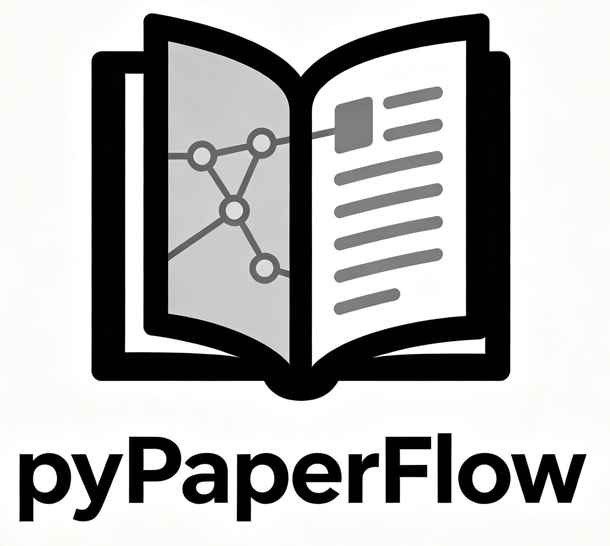
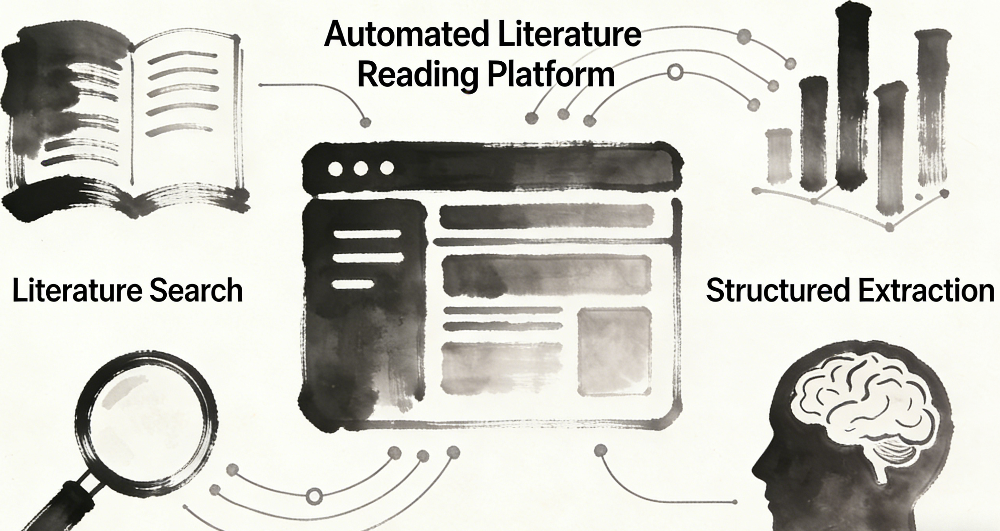
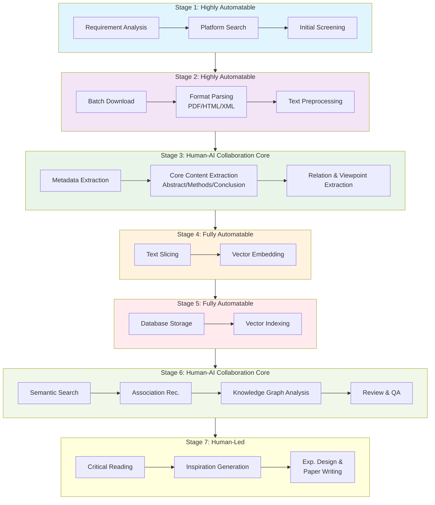
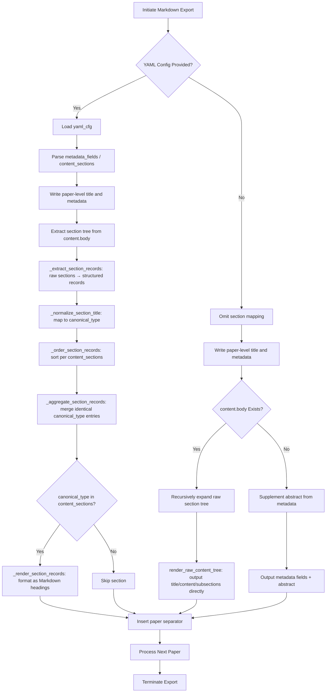

<div align="center">

# pyPaperFlow



<p><strong>An automated literature processing platform for scientific researchers.</strong></p>

<p>Batch retrieve, fetch, parse, and structure papers from PubMed, arXiv, bioRxiv, ChemRxiv, and DOI-based sources.</p>

<p>From paper retrieval to knowledge internalization, automate the heavy lifting and keep the judgment human.</p>



[](https://www.gnu.org/licenses/gpl-3.0) 
[](http://makeapullrequest.com)
[](docs/Design.md)
[](#features)
[](https://pypi.org/project/pyPaperFlow/)
[](https://pypi.org/project/pyPaperFlow/)
[](https://pepy.tech/project/pyPaperFlow)
[](https://maybebio.github.io/pyPaperFlow/)

<p>
  Document here 👉
  <a href="README.md">English</a> |
  <a href="README_zh.md">中文</a> 
</p>

<p>
  <a href="./docs/Design.md">Design</a> |
  <a href="./docs/Cases.md">Cases</a>
</p>


</div>

> **If this project helps you, please consider giving it a Star ⭐. Thank you!** 

---

## Index

- [pyPaperFlow](#pypaperflow)
  - [Index](#index)
  - [📖 Overview](#-overview)
  - [🚀 Features](#-features)
  - [🏗️ Architecture Vision](#️-architecture-vision)
  - [📦 Installation](#-installation)
  - [🛠️ Usage](#-usage)
      - [Module overview](#module-overview)
      - [1. Research Start Point](#1-research-start-point)
      - [2. Search Papers (and Fetch Metadata)](#2-search-papers-and-fetch-metadata)
      - [3. Fetch Papers (and Download Full Text)](#3-fetch-papers-and-download-full-text)
      - [4. Literature content extraction and structured processing](#4-literature-content-extraction-and-structured-processing)
      - [5. Processing for other literature](#5-processing-for-other-literature-databases)
      - [6. Critical reading and knowledge graph analysis downstream : end-use](#6-critical-reading-and-knowledge-graph-analysis-downstream-enduse)
  - [🔍 Test cases](#-test-cases)
  - [📌 Future maintenance & Todo list](#-future-maintenance--todo-list)


---

## 📖 Overview 

An `automated literature processing platform` for scientific researchers. This tool focuses on `information extraction and knowledge discovery` stages, enabling researchers to efficiently complete the entire workflow from literature retrieval to knowledge internalization through a `7-stage automated process`.

**Core Objectives**

- **Rapid Domain Entry**: Batch retrieve and access all available literature in a specific field
- **Batch Knowledge Extraction**: Utilize AI long-text processing capabilities to extract structured knowledge from massive amounts of text
- **Research Trend Tracking**: Quickly grasp the latest research methods, conclusions, and core papers in a field

**Positioning**

This tool is designed to `complement rather than replace` reference management software like Zotero. We focus on the two key steps of "Information Extraction" and "Knowledge Discovery" to build a `structured knowledge base` for you, laying the foundation for `subsequent semantic search, content analysis, and review generation`.


## 🚀 Features

- **Automated Retrieval from Multiple Sources**: Automatically search and retrieve paper metadata and full-text records from `PubMed/Medline, arXiv, medRxiv, chemRxiv and bioRxiv`. The repository focuses primarily on biomedical research and computational interdisciplinary fields (`Biomedicine + Computational Biology`).
- **Full-Text Access**: Enable automatic downloading of open-access full texts in XML/Text format from `PMC`. For preprints and other publications without accessible PMC full texts, alternative acquisition modules are integrated to fetch `original PDFs`, with `Sci-Hub` set as the fallback provider.
- **Structured Storage**:
  - **Metadata**: Preserved in well-structured detailed JSON files.
  - **Full Text**: Stored in multiple formats including parsed JSON and Markdown for versatile downstream usage — JSON for programmatic data analysis, and Markdown optimized for LLM comprehension and processing.
  - **Standardized Structured Parsing**：All literatures are parsed and organized into `standardized JSON schemas`. The schema strictly classifies content into metadata fields (title, year, authors) and canonical academic sections (abstract, introduction, results, discussion, methods, conclusion, supplementary, availability, funding, acknowledgements, author contributions, references, other). `Custom section parsing is fully supported, allowing users to apply self-defined JSON schemas for semantic parsing of literature with special formatting structures`. Dedicated modules are provided to extract designated sections from bulk topic-related papers and `assemble them into source-verified Markdown literature corpora`, facilitating subsequent literature investigation and systematic review writing.
- **LLM & Agent Empowerment**: Integrate LLM skills and intelligent Agent capabilities to streamline the entire workflow of literature investigation and in-depth reading.
- **CLI Tool**: Provide a user-friendly command-line interface `paperflow` that supports all core operations out of the box.

## 🏗️ Architecture Vision

You can check the [Design.md](docs/Design.md) for more details about our Design Philosophy.

The project is designed around a 7-stage workflow:


```mermaid
flowchart TD
    A[Retrieval &<br>Collection] --> B[Processing &<br>Parsing]
    B --> C[Structured<br>Extraction]
    C --> D[Deep Encoding &<br>Vectorization]
    D --> E[Dynamic Knowledge<br>Base Storage]
    E --> F[Intelligent Interaction &<br>Discovery]
    F --> G[Final Output &<br>Internalization]

    style A fill:#e1f5fe
    style B fill:#f3e5f5
    style C fill:#e8f5e8
    style D fill:#fff3e0
    style E fill:#ffebee
    style F fill:#f1f8e9
    
    subgraph A [Stage 1: Highly Automatable]
        direction LR
        A1[Requirement Analysis] --> A2[Platform Search]
        A2 --> A3[Initial Screening]
    end

    subgraph B [Stage 2: Highly Automatable]
        direction LR
        B1[Batch Download] --> B2[Format Parsing<br>PDF/HTML/XML]
        B2 --> B3[Text Preprocessing]
    end

    subgraph C [Stage 3: Human-AI Collaboration Core]
        direction LR
        C1[Metadata Extraction] --> C2[Core Content Extraction<br>Abstract/Methods/Conclusion]
        C2 --> C3[Relation & Viewpoint Extraction]
    end

    subgraph D [Stage 4: Fully Automatable]
        direction LR
        D1[Text Slicing] --> D2[Vector Embedding]
    end

    subgraph E [Stage 5: Fully Automatable]
        direction LR
        E1[Database Storage] --> E2[Vector Indexing]
    end

    subgraph F [Stage 6: Human-AI Collaboration Core]
        direction LR
        F1[Semantic Search] --> F2[Association Rec.] --> F3[Knowledge Graph Analysis] --> F4[Review & QA]
    end

    subgraph G [Stage 7: Human-Led]
        direction LR
        G1[Critical Reading] --> G2[Inspiration Generation] --> G3[Exp. Design &<br>Paper Writing]
    end
```

## 📦 Installation

> ⚠️ For typical usage, you only need to install our tool, seen below:

```bash
# 1. install our tool
## ✏️1️⃣ option1: Install via pip (Recommended)
pip install pyPaperFlow

## ✏️2️⃣ option2: Install from source
git clone https://github.com/MaybeBio/pyPaperFlow.git
cd pyPaperFlow
pip install -e .
```

> Some optional dependencies, if you do not need to use the corresponding functional modules, you can ignore the installation. seen below:

```bash
# 2. install MinerU
# follow the official installation guide: https://github.com/opendatalab/MinerU
# verify installation: mineru --help
pip install --upgrade pip -i https://mirrors.aliyun.com/pypi/simple
pip install uv -i https://mirrors.aliyun.com/pypi/simple
uv pip install -U "mineru[all]" -i https://mirrors.aliyun.com/pypi/simple 

--------------------------------------------------------

# 3. install AI backend
pip install openai anthropic

--------------------------------------------------------

# 4. install paperscraper backend
# follow the official installation guide: https://github.com/jannisborn/paperscraper
pip install paperscraper
```


## 🛠️ Usage 

> 📌 **Tip**: If you want to get started directly, please refer to the usage examples in [Cases.md](./docs/Cases.md). The content below is theoretical process analysis and can be skipped.

We designed pyPaperFlow as a versatile academic research tool built strictly around the `real‑world workflow of researchers conducting literature investigation, paper reading, literature comprehension and analysis, and corpus utilization`.

Therefore, please follow our step‑by‑step operations, which mirror your full literature research process. Through this hands‑on experience, you will fully grasp the design philosophy and usage of this tool.

The platform provides a CLI tool named `paperflow`.


### Module Overview

Current available modules include (`will be continuously updated`):

```python 
❯ paperflow --help
                                                                                                                                              
 Usage: paperflow [OPTIONS] COMMAND [ARGS]...                                                                                                 
                                                                                                                                              
 pyPaperFlow CLI                                                                                                                              
                                                                                                                                              
╭─ Options ──────────────────────────────────────────────────────────────────────────────────────────────────────────────────────────────────╮
│ --install-completion          Install completion for the current shell.                                                                    │
│ --show-completion             Show completion for the current shell, to copy it or customize the installation.                             │
│ --help                        Show this message and exit.                                                                                  │
╰────────────────────────────────────────────────────────────────────────────────────────────────────────────────────────────────────────────╯
╭─ Commands ─────────────────────────────────────────────────────────────────────────────────────────────────────────────────────────────────╮
│ pubmed-search      Search PubMed using Your customized query and return PMIDs.                                                             │
│ pubmed-meta        Fetch paper metadata from PubMed using Your customized query, pmid list file and save to storage.                       │
│ pubmed-content     Download full text (PMC) for given PMIDs if the paper has a PMC ID.                                                     │
│ pubmed-all         Fetch BOTH metadata and full text (if available) for papers.                                                            │
│                    Also extracts URLs from full text and updates metadata links.                                                           │
│ pubmed-merge-json  Create a merged JSON (or JSONL) file from PubMed paper directories.                                                     │
│ pubmed-export-md   Export a single Markdown view from a merged JSON file using optional YAML config.                                       │
│ arxiv-search       Search arXiv and write matching IDs to a text file.                                                                     │
│ arxiv-fetch        Fetch arXiv metadata and attempt to download PDFs.                                                                      │
│ biorxiv-search     Search bioRxiv and write matching IDs to a text file.                                                                   │
│ biorxiv-fetch      Fetch bioRxiv metadata and attempt to download PDFs.                                                                    │
│ medrxiv-search     Search medRxiv and write matching IDs to a text file.                                                                   │
│ medrxiv-fetch      Fetch medRxiv metadata and attempt to download PDFs.                                                                    │
│ chemrxiv-search    Search ChemRxiv and write matching IDs to a text file.                                                                  │
│ chemrxiv-fetch     Fetch ChemRxiv metadata and attempt to download PDFs.                                                                   │
│ paper-fetch        Fetch PDFs by DOI — passes through to the paper-fetch engine.                                                           │
│ pdf-parse          Parse a PDF file using MinerU engine, and clean up the output directory.                                                │
│ mineru-parse       Parse mineru output content_list_v2.json into canonical sectioned JSON.                                                 │
│ mineru-export-md   Export structured mineru JSON to a clean Markdown file for LLM processing.                                              │
│ github-export      Export GitHub links from merged PubMed JSON, validate accessibility,                                                    │
│                    and aggregate `ghresearcher parse <owner/repo> --view` outputs into one markdown.                                       │
╰────────────────────────────────────────────────────────────────────────────────────────────────────────────────────────────────────────────╯

```

Classify these modules according to the workflow stages:
```python
PubMed Modules:
- pubmed-search # search papers and return PMIDs
- pubmed-meta # fetch paper metadata from PubMed
- pubmed-content # download full text (PMC) for given PMIDs if the paper has a PMC ID
- pubmed-all # fetch BOTH metadata and full text (if available) for papers
- pubmed-merge-json # Batch merge a collection of PubMed papers of the same topic 
- pubmed-export-md # export PubMed paper collections as Markdown files, supporting batch export of specific sections (🌟 e.g., batch export of introductions as your research background)

arXiv Modules:
- arxiv-search # search arXiv and return matching IDs
- arxiv-fetch # fetch arXiv metadata and attempt to download PDFs

bioRxiv Modules:
- biorxiv-search # search bioRxiv and return matching IDs
- biorxiv-fetch # fetch bioRxiv metadata and attempt to download PDFs

medRxiv Modules:
- medrxiv-search # search medRxiv and return matching IDs
- medrxiv-fetch # fetch medRxiv metadata and attempt to download PDFs

ChemRxiv Modules:
- chemrxiv-search # search ChemRxiv and return matching IDs
- chemrxiv-fetch # fetch ChemRxiv metadata and attempt to download PDFs

Third-party Modules:
- paper-fetch # fetch PDFs by DOI
- pdf-parse # parse PDF files into JSON, Markdown format using the MinerU engine
- mineru-parse # Based on your custom section configuration, re-parse the MinerU output file into a structured JSON format clustered by standard literature sections
- mineru-export-md # Based on your custom section configuration, export the structured mineru JSON to a clean Markdown file for LLM processing (🌟 e.g., batch export of introductions as your research background)
- github-export # export GitHub links from merged PubMed JSON, validate accessibility, and aggregate `ghresearcher parse <owner/repo> --view` outputs into one markdown
```

> ⚠️ `Other preprint platforms modules are under development, please stay tuned!`

### 1. Research Start Point

The primary step in conducting a literature review is the collection and organization of literature information. When existing knowledge reserves are insufficient, academic materials need to be integrated to systematically grasp the domestic and international research status in relevant fields.

First, the intended research topic must be defined. At the initial stage of research, you may only have scattered preliminary ideas, fragmented literatures, rough investigation drafts, or even no prior materials at all—merely several core keywords.

In this phase, the research direction and scope shall be preliminarily defined based on all available information. Only broad research boundaries need to be determined here; there is no need to precisely finalize the ultimate research objective in the first iteration.

Accordingly, priori or posteriori brainstorming is required. This tool features dedicated built‑in functional modules to help you organize existing ideas and information, and refine them into well‑defined research directions and scopes.


```bash
Inputs:
- Research Direction: The intended research topic or problem domain
- Existing Information: Related literatures, investigation drafts, keywords and other prior materials you have obtained, with attachments supported

Outputs:
- Research Scope: An explicit definition covering core topics and boundary constraints. More intuitively, it can be regarded as preliminary research questions or the overall research orientation, uniformly defined as the Starting Point of Research in this document.
- Output is mainly presented as a keyword list guiding subsequent literature retrieval or standardized research question statements. Constraints can be supplemented through multiple iterations according to research requirements.
```

> Core Note: `The Starting Point of Research is not finalized once and for all. It can be continuously updated and refined through multiple iterations with newly acquired information and research progress.`

You may leverage state‑of‑the‑art large language models, combined with all materials and information at hand, to repeatedly verify and refine the Starting Point of Research until it is sufficiently clear and specific, or meets the criteria to proceed to the next step of literature retrieval.

> 🌟 Here we provide a few brainstorming skills for literature review: [Skills List](./docs/Skills.md)

### 2. Search Papers (and Fetch Metadata)

Once the starting point of research is finalized (or any intermediate brainstorming stage requiring supplementary literature review), you may proceed with paper retrieval.

This tool does not generate search queries for you. Instead, we highly recommend crafting grammatically standardized and high‑relevance queries prior to using our search module.

Our literature database primarily covers biomedical research and computational interdisciplinary fields, with core data sources as follows:

- PubMed/Medline
- arXiv
- bioRxiv，medRxiv，chemRxiv

> **⚠️ — Preprint search = Crossref relevance search + local boolean re-check (not a full-corpus pull, and not each server's official API).** Each request asks Crossref to search ONLY that platform's prefix (`filter=prefix:10.64898 / 10.26434,type:posted-content`) — platform scoping happens server-side, not by post-filtering a global result set. bioRxiv and medRxiv share the openRxiv prefix `10.64898`, so those two are then told apart locally by DOI-accession digit count (6 = bioRxiv, 8 = medRxiv).
>
> How the relevance step behaves: `query.bibliographic` is a fuzzy, OR-like ranking (a two-term query returns more than either single term — e.g. chemRxiv "base editing" ≈ the union of "base" and "editing"), i.e. a **superset** of the strict matches. The fetcher cursor-paginates the whole result set (not a capped top-N), then keeps only records in which **every** query term is actually present in the metadata (local boolean AND over title/abstract/…). Because strict matches ⊆ relevance superset, ranking never drops a metadata-level exact match — it only changes the order.
>
> **Limitations of the relevance search:**
>
> ① **Deposit lag** — a preprint posted minutes ago may not be indexed in Crossref yet.
>
> ② **Metadata-only matching** — Crossref scores deposited metadata (title/abstract/…), so query terms that appear only in the paper body are invisible to it. Only the bioRxiv/medRxiv Europe PMC leg indexes full text; **ChemRxiv has no full-text leg at all**, so body-only-term misses are expected there.
>
> ③ **Version duplication** — every revision is its own DOI work, so `.../v1` and `.../v2` both match a search and may need manual dedup.
>
> **Difference vs. exhaustive full-corpus enumeration:** a relevance search is a heuristic over the deposited metadata. The "no-omission-by-construction" alternative is to list the *whole* platform corpus (`filter=prefix…` with no `query`, cursor-paging every record — ≈ 55k ChemRxiv / 436k openRxiv) and run the boolean AND locally, with no relevance engine in the loop; recall is then exactly "all records whose metadata fully matches the query" (a `--start/--end-date` window shrinks the pull). The cost is downloading the full corpus per search, and it still inherits the source-level boundaries above (deposit lag, metadata-only, version duplication). This tool's `search()` path is relevance-based today; the exhaustive mode is not currently exposed as a flag.

We recommend that you proactively learn and master the search syntax of these databases, as our built‑in search module functions similarly to the search bar on official web portals.

For instance, here is a typical complex query example tailored for PubMed:

```python
"""
(
  "Intrinsically Disordered Proteins"[Mesh] OR
  "Intrinsically Disordered Protein"[Title/Abstract] OR
  "Intrinsically Disordered Proteins"[Title/Abstract] OR
  "Intrinsically Disordered Region"[Title/Abstract] OR 
  "Intrinsically Disordered Regions"[Title/Abstract] OR 
  "Natively Unfolded Protein"[Title/Abstract] OR
  "Natively Unfolded Proteins"[Title/Abstract] OR
  "Unstructured Protein"[Title/Abstract] OR
  "Unstructured Proteins"[Title/Abstract] OR
  "IDR"[Title/Abstract] OR 
  "IDP"[Title/Abstract]
)
AND 
(
  "Protein Interaction Maps"[Mesh] OR
  "Protein Interaction Maps"[Title/Abstract] OR
  "Protein Interaction Networks"[Title/Abstract] OR
  "Protein-Protein Interaction Map"[Title/Abstract] OR
  "Protein-Protein Interaction Network"[Title/Abstract] OR

  "Protein Interaction Mapping"[Mesh] OR
  "Protein Interaction Mapping"[Title/Abstract] OR
  "Binding Sites"[Title/Abstract] OR
  "Protein Binding"[Title/Abstract] OR
  "Protein Interaction Domains and Motifs"[Title/Abstract] OR
  "Protein Interaction Maps"[Title/Abstract] OR   

  "Protein Interaction Domains and Motifs"[Mesh] OR
  
  "Protein Interaction"[Title/Abstract] OR
  "Protein-Protein Interaction"[Title/Abstract] OR
  "PPI"[Title/Abstract] OR
  "Interaction"[Title/Abstract] OR
  "Binding"[Title/Abstract] OR
  "Interface"[Title/Abstract] OR
  "Complex"[Title/Abstract]
) 
AND 
(
  "Artificial Intelligence"[Mesh] OR
  "Deep Learning"[Mesh] OR
  "Machine Learning"[Mesh] OR
  "Neural Networks, Computer"[Mesh] OR
  "Artificial Intelligence"[Title/Abstract] OR
  "Deep Learning"[Title/Abstract] OR
  "Machine Learning"[Title/Abstract] OR
  "Neural Network"[Title/Abstract] 
)
AND (
  "2023/01/01"[Date - Publication] : "2026/12/31"[Date - Publication]
)
"""
```

Once you finish constructing your search query, you can start searching for papers. We will use the PubMed-related API as an example.

```python
❯ paperflow pubmed-search --help
                                                                                                                              
 Usage: paperflow pubmed-search [OPTIONS] QUERY                                                                               
                                                                                                                              
 Search PubMed using Your customized query and return PMIDs.                                                                  
                                                                                                                              
                                                                                                                              
 Notes:                                                                                                                       
 - 1, This command only searches and returns PMIDs, it does not fetch paper metadata.                                         
 - 2, This command will print the found PMIDs and also save them to 'pubmed_searched_ids.txt' in the specified output         
 directory.                                                                                                                   
 If --output-dir is not specified, it will default to the storage directory.                                                  
 - 3, Note that storage_dir is used to initialize the fetcher for consistency, while output_dir is where the PMIDs are saved. 
 They are different parameters!                                                                                               
                                                                                                                              
                                                                                                                              
 Example usage:                                                                                                               
 - 1. Search for papers related to "machine learning" and return up to 500 PMIDs/per batch:                                   
 paperflow pubmed-search "machine learning" --retmax 500 --output-dir ./MyPapers --email "YOUR_EMAIL@example.com" --api-key   
 "YOUR_NCBI_API_KEY"                                                                                                          
                                                                                                                              
╭─ Arguments ────────────────────────────────────────────────────────────────────────────────────────────────────────────────╮
│ *    query      TEXT  PubMed search query. [required]                                                                      │
╰────────────────────────────────────────────────────────────────────────────────────────────────────────────────────────────╯
╭─ Options ──────────────────────────────────────────────────────────────────────────────────────────────────────────────────╮
│    --retmax       -n      INTEGER  Max number of PMIDs to return every batch, must less than 10000. [default: 500]         │
│ *  --email                TEXT     Entrez Email. [required]                                                                │
│    --api-key              TEXT     NCBI API Key (recommended).                                                             │
│    --storage-dir  -s      TEXT     Directory in Repository-level to store paper data for Initialization.                   │
│                                    [default: ./Papers]                                                                     │
│    --output-dir   -o      TEXT     Directory in result-level to store output IDs.                                          │
│    --max-retries          INTEGER  Maximum number of retries for Entrez API calls. [default: 3]                            │
│    --help                          Show this message and exit.                                                             │
╰────────────────────────────────────────────────────────────────────────────────────────────────────────────────────────────╯
```

At this stage, we recommend retrieving paper metadata (primarily abstracts) via literature search.

Literature collection is an iterative process. You can often identify target papers using only abstracts, then proceed to download the required papers in the next step. In some cases, you may still need to download all retrieved papers.

It is important to emphasize that you can re-enter the brainstorming phase at any stage. The output of each phase can serve as the input for subsequent literature research. Based on the output of this phase, you can conduct further brainstorming to refine your research starting point and define your research questions more precisely.


```python
❯ paperflow pubmed-meta --help
                                                                                                                                                             
 Usage: paperflow pubmed-meta [OPTIONS]                                                                                                                      
                                                                                                                                                             
 Fetch paper metadata from PubMed using Your customized query, pmid list file and save to storage.                                                           
                                                                                                                                                             
                                                                                                                                                             
 Notes:                                                                                                                                                      
 - 1, You must provide one of --query, or --file to specify which papers to fetch. Note that they are mutually exclusive.                                    
 - 2, -f can be used to fetch one or more PMIDs listed in a text file (one PMID per line).                                                                   
                                                                                                                                                             
                                                                                                                                                             
 Example usage:                                                                                                                                              
 - 1. Fetch papers for a query and save to storage:                                                                                                          
   paperflow pubmed-fetch --query "machine learning" --output-dir ./MyPapers --email "YOUR_EMAIL@example.com" --api-key "YOUR_NCBI_API_KEY"                  
 - 2. Fetch papers from a list of PMIDs in a file:                                                                                                           
   paperflow pubmed-fetch --file ./pmid_list.txt --output-dir ./MyPapers --email "YOUR_EMAIL@example.com" --api-key "YOUR_NCBI_API_KEY"                      
                                                                                                                                                             
╭─ Options ─────────────────────────────────────────────────────────────────────────────────────────────────────────────────────────────────────────────────╮
│    --query        -q      TEXT     PubMed search query.                                                                                                   │
│    --file         -f      TEXT     Text file containing PMIDs (one per line), -q and -f are mutually exclusive.                                           │
│    --batch-size   -b      INTEGER  Batch size for fetching. [default: 50]                                                                                 │
│ *  --email                TEXT     Entrez Email. [required]                                                                                               │
│    --api-key              TEXT     NCBI API Key (recommended).                                                                                            │
│    --storage-dir  -s      TEXT     Directory in Repository-level to store paper data for Initialization. [default: ./Papers]                              │
│    --max-retries          INTEGER  Maximum number of retries for Entrez API calls. [default: 3]                                                           │
│    --output-dir   -o      TEXT     Directory in result-level to store output papers, default is current directory. If not specified, will be set to root  │
│                                    directory of the repository-level which is storage_dir. 🌟 We will create a '/pubmed' subfolder under the output       │
│                                    directory to save all pubmed related data                                                                              │
│                                    [default: .]                                                                                                           │
│    --help                          Show this message and exit.                                                                                            │
╰───────────────────────────────────────────────────────────────────────────────────────────────────────────────────────────────────────────────────────────╯
```


### 3. Fetch Papers (and Download Full Text)

Once you have confirmed your target papers, or, worse case, the metadata obtained during the search phase is insufficient for further evaluation and you need to download all full‑text papers, you may start downloading the papers.

Take PubMed as an example: for PubMed papers, we prioritize downloading full texts from PMC if available. If no PMC full text exists, we only retrieve PubMed metadata (mainly abstracts) and basic paper information.

Additionally, we provide a dedicated PDF‑crawling module as a fallback strategy for paper acquisition. Manual retrieval of PDF files is only recommended when all aforementioned methods fail to obtain PubMed paper data.

Output files from the PubMed database are available in two formats: JSON and Markdown. JSON is recommended for subsequent analysis, while Markdown serves as input data for Large Language Models (LLMs). Our tool generates both file formats for your selection simultaneously.


```python
❯ paperflow pubmed-content --help
                                                                                                                                                                  
 Usage: paperflow pubmed-content [OPTIONS]                                                                                                                        
                                                                                                                                                                  
 Download full text (PMC) for given PMIDs if the paper has a PMC ID.                                                                                              
                                                                                                                                                                  
                                                                                                                                                                  
 Notes:                                                                                                                                                           
 - 1, This currently only supports PMC full text fetching if the paper has a PMC ID.                                                                              
                                                                                                                                                                  
                                                                                                                                                                  
                                                                                                                                                                  
 Example usage:                                                                                                                                                   
 - 1. Download full text for PMIDs listed in a file:                                                                                                              
   paperflow download-fulltext --file ./pmid_list.txt --email "YOUR_EMAIL@example" --api-key "YOUR_NCBI_API_KEY" --output-dir ./MyPapers                          
                                                                                                                                                                  
                                                                                                                                                                  
╭─ Options ──────────────────────────────────────────────────────────────────────────────────────────────────────────────────────────────────────────────────────╮
│    --file         -f      TEXT     File containing PMIDs (one per line).                                                                                       │
│ *  --email                TEXT     Entrez Email. [required]                                                                                                    │
│    --api-key              TEXT     NCBI API Key (recommended).                                                                                                 │
│    --storage-dir  -s      TEXT     Directory in Repository-level to store paper data for Initialization. [default: ./Papers]                                   │
│    --max-retries          INTEGER  Maximum number of retries for Entrez API calls. [default: 3]                                                                │
│    --output-dir   -o      TEXT     Directory in result-level to store output full texts, default is current directory. If not specified, will be set to root   │
│                                    directory of the repository-level which is storage_dir. 🌟 We will create a '/pubmed' subfolder under the output directory  │
│                                    to save all pubmed related data                                                                                             │
│                                    [default: .]                                                                                                                │
│    --pmid         -p      TEXT     Single PMID to download full text for, can be repeated.                                                                     │
│    --help                          Show this message and exit.                                                                                                 │
╰────────────────────────────────────────────────────────────────────────────────────────────────────────────────────────────────────────────────────────────────╯

```

Alternatively, you may perform metadata retrieval and content fetching in two separate steps; we recommend handling them separately.

```python
❯ paperflow pubmed-all --help
                                                                                                                                                                  
 Usage: paperflow pubmed-all [OPTIONS]                                                                                                                            
                                                                                                                                                                  
 Fetch BOTH metadata and full text (if available) for papers. Also extracts URLs from full text and updates metadata links.                                       
                                                                                                                                                                  
                                                                                                                                                                  
 Example usage:                                                                                                                                                   
 - 1. Fetch full papers for a query:                                                                                                                              
   paperflow pubmed-all --query "machine learning" --output-dir ./MyPapers --email "YOUR_EMAIL"                                                                   
                                                                                                                                                                  
╭─ Options ──────────────────────────────────────────────────────────────────────────────────────────────────────────────────────────────────────────────────────╮
│    --query        -q      TEXT     PubMed search query.                                                                                                        │
│    --file         -f      TEXT     Text file containing PMIDs (one per line), -q and -f are mutually exclusive.                                                │
│    --pmid         -p      TEXT     Single PMID to download full text for, can be repeated.                                                                     │
│    --batch-size   -b      INTEGER  Batch size for fetching. [default: 50]                                                                                      │
│    --max-retries          INTEGER  Maximum number of retries for Entrez API calls. [default: 3]                                                                │
│ *  --email                TEXT     Entrez Email. [required]                                                                                                    │
│    --api-key              TEXT     NCBI API Key (recommended).                                                                                                 │
│    --storage-dir  -s      TEXT     Directory in Repository-level to store paper data for Initialization. [default: ./Papers]                                   │
│    --output-dir   -o      TEXT     Directory in result-level to store output papers. If not specified, defaults to storage-dir.                                │
│    --help                          Show this message and exit.                                                                                                 │
╰────────────────────────────────────────────────────────────────────────────────────────────────────────────────────────────────────────────────────────────────╯
``` 

For PubMed papers without PMC full texts, or papers from other databases where only the DOI is available (the pubmed‑meta module guarantees DOI acquisition), you may directly download full texts by DOI (if open‑access versions exist).

```python 
❯ paperflow paper-fetch --help
usage: paper-fetch [-h] [--title TITLE] [--batch FILE] [--out DIR] [--dry-run] [--format {json,text}] [--pretty] [--stream] [--overwrite]
                   [--idempotency-key KEY] [--timeout SECONDS] [--version]
                   [doi]

Fetch legal open-access PDFs by DOI via Unpaywall, Semantic Scholar, arXiv, PMC, and bioRxiv/medRxiv.

positional arguments:
  doi                   DOI to fetch (e.g. 10.1038/s41586-020-2649-2). Use '-' to read from stdin.

options:
  -h, --help            show this help message and exit
  --title TITLE         paper title; resolved to a DOI via Crossref before download. Mutually exclusive with positional DOI / --batch.
  --batch FILE          file with one DOI per line for bulk download. Use '-' to read from stdin.
  --out DIR             output directory (default: pdfs)
  --dry-run             resolve sources without downloading; preview the PDF URL and filename
  --format {json,text}  output format. json for agents, text for humans. Default: json when stdout is not a TTY, text otherwise.
  --pretty              pretty-print JSON output (2-space indent)
  --stream              emit one NDJSON result per line on stdout as each DOI resolves (batch mode)
  --overwrite           re-download even if the destination file already exists
  --idempotency-key KEY
                        safe-retry key; re-running with the same key replays the original envelope from <out>/.paper-fetch-idem/
  --timeout SECONDS     HTTP timeout in seconds per request (default: 30)
  --version             show program's version number and exit

exit codes:
  0  all DOIs resolved successfully
  1  unresolved (some DOIs had no OA copy; no transport failure)
  3  validation error (bad arguments)
  4  transport error (network / download / IO failure; retryable class)

subcommands:
  schema                 print the machine-readable CLI schema and exit (no network)

stdin:
  paper-fetch -          read a single DOI from stdin
  paper-fetch --batch -  read DOIs line-by-line from stdin

output:
  stdout emits one JSON object per invocation (NDJSON with --stream).
  stderr emits NDJSON progress events when --format json, prose when --format text.
  stdout format auto-detects TTY: json when piped/captured, text in a terminal.

examples:
  paper-fetch 10.1038/s41586-020-2649-2
  paper-fetch 10.1038/s41586-020-2649-2 --dry-run
  paper-fetch --batch dois.txt --out ./papers --format text
  echo 10.1038/s41586-020-2649-2 | paper-fetch --batch -
  paper-fetch schema

```


We acknowledge the work of [paper-fetch](https://github.com/Agents365-ai/paper-fetch)！We have modified, refactored, and encapsulated one of its core scripts for tailored integration into our pipeline.

> 🔙 Rollback boundary for the paper-fetch module: commit `bc8394c` (`update paper-fetch module according to upstream repo`) contains the **original upstream script**. Commit `89eda06bac1f853254b04aee9e8916109c7771a1` is the first local **modification** to it. To restore the original module, use `89eda06` as the boundary — e.g. `git show 89eda06^:src/pyPaperFlow/integrations/pdf_fetch.py` (identical to `bc8394c`).

The workflow of our paper acquisition module is outlined below:

```bash
┌─────────────────────────────────────────┐
│  Input: DOI / Paper Title / Batch File   │
└─────────────────────────────────────────┘
                   ↓
┌─────────────────────────────────────────┐
│  Title‑based Resolution? → Crossref → Semantic Scholar
│  (Resolves to DOI with confidence score) │
└─────────────────────────────────────────┘
                   ↓
┌─────────────────────────────────────────┐
│  1. Unpaywall (requires UNPAYWALL_EMAIL) │
│     → Fastest open‑access (OA) links with metadata
└─────────────────────────────────────────┘
           Failure / Skip ↓
┌─────────────────────────────────────────┐
│  2. Semantic Scholar                    │
│     → PDF URLs + external identifiers (arXiv / PMCID)
└─────────────────────────────────────────┘
           Failure ↓
┌─────────────────────────────────────────┐
│  3. arXiv (via S2 externalIds.ArXiv)     │
│  4. Europe PMC → PMC (via PMCID)         │
│     No PMCID: DOI→PMCID recovery         │
│     (Europe PMC hasPDF=Y / OpenAIRE)     │
│  5. bioRxiv / medRxiv (DOI prefix: 10.1101/)
└─────────────────────────────────────────┘
           Total Failure ↓
┌─────────────────────────────────────────┐
│  6. Publisher Direct Links (Institutional Mode Only)
│     Nature / Science / Elsevier / Springer, etc.
│     Requires institutional IP / subscription / EZproxy authorization
└─────────────────────────────────────────┘
           Persistent Failure ↓
┌─────────────────────────────────────────┐
│  7. CORE Repository Aggregator (optional, requires CORE_API_KEY)
│     → core.ac.uk aggregates OA full-text downloadUrl
└─────────────────────────────────────────┘
           Persistent Failure ↓
┌─────────────────────────────────────────┐
│  8. Sci‑Hub Mirror Fallback (enabled by default, configurable)
│     → 1 request‑per‑second rate‑limiting to prevent CAPTCHA triggers
│     → Automatic discovery of active new mirrors
└─────────────────────────────────────────┘

```

```bash
Resolution Priority Sequence

Unpaywall: The optimal open‑access source covering the broadest range of publishers with the highest hit rate.
Semantic Scholar: Retrieves OA PDF links and cross‑platform external identifiers.
arXiv: Activated when an arXiv identifier is available for the target paper.
PubMed Central (PMC) OA Subset: Activated when a PMCID is associated with the paper; when no PMCID is known, a DOI→PMCID recovery is attempted first (Europe PMC search hasPDF=Y / OpenAIRE originalId).
bioRxiv / medRxiv: Triggered for preprints with the DOI prefix 10.1101/.
Publisher Direct Links: Enabled only under institutional mode (PAPER_FETCH_INSTITUTIONAL=1), authorized via the caller’s institutional subscription IP, cookies, or EZproxy access.
CORE Repository Aggregator: Optional, requires CORE_API_KEY; aggregates full texts from many repositories, attempted only when all other OA sources miss (free tier ~5 req/10s).
Sci‑Hub Mirror Fallback: Enabled by default as the final retrieval backup.
Mirrors are attempted in the order specified by the environment variable PAPER_FETCH_SCIHUB_MIRRORS (default list: sci‑hub.ru, sci‑hub.st, sci‑hub.su, sci‑hub.box, sci‑hub.red, sci‑hub.al, sci‑hub.mk, sci‑hub.ee).
If all predefined mirrors fail, the module fetches the latest live mirror list from https://www.sci‑hub.pub/ and retries.
Set PAPER_FETCH_NO_SCIHUB=1 to disable Sci‑Hub retrieval.
If all sources fail, metadata is returned with a recommendation for interlibrary loan (ILL) acquisition.

```

> ⚠️ Prior to using the paper‑fetch module, configure your Unpaywall contact email via environment variable:

```bash
export UNPAYWALL_EMAIL=you@example.com
```


**Cloudflare-blocked PDFs (optional)**

Some publishers (e.g. `science.org`) sit behind Cloudflare and return `403`/`429` or a "Just a moment…" JS challenge page instead of the PDF. Set `PAPER_FETCH_CLOAK=1` to retry those URLs through [CloakBrowser](https://github.com/CloakHQ/CloakBrowser) (a stealth Chromium that can pass the challenge). This fallback lives at the download layer (covers all sources), fails silently when CloakBrowser is unavailable, is operator-controlled (agents cannot enable it), and re-validates returned bytes through the same `%PDF` + 50 MB checks. Successful cloak downloads carry `via:"cloak"`.

Setup — install once, then treat `PAPER_FETCH_CLOAK` as an always-on safety net:

```bash
# One-time install: put cloakbrowser into the same Python that runs paperflow
# (auto-detected), or into a separate venv and point CLOAKBROWSER_PYTHON at it.
pip install cloakbrowser

# Recommended: keep as a safety net (fires ONLY when a download is blocked;
# normal OA downloads are unaffected).
export PAPER_FETCH_CLOAK=1

# Cleaner per-command alternative, when you only occasionally hit a blocked URL:
PAPER_FETCH_CLOAK=1 paperflow paper-fetch 10.1126/sciadv.aee6105 --out ./pdfs

# ⚠️ PAPER_FETCH_CLOAK_HEADED=1 is NOT a default. Set it only for strong
# challenges (e.g. science.org) AND only on a machine with a display:
# export PAPER_FETCH_CLOAK_HEADED=1
```

> **Practical notes (from testing)**
> - Cloak is **not** a paywall bypass. It only fires when an *OA* download is Cloudflare-blocked; a paywalled paper (no OA copy, e.g. `10.1016/j.cels.2025.101486`) never reaches the download layer, so Cloak is never invoked.
> - `science.org` is a "strong" challenge that **headless cannot pass** (it stalls on "Just a moment…") — it requires `PAPER_FETCH_CLOAK_HEADED=1` on a real display (a desktop, or a headless server wrapped with `xvfb-run`).
> - Cloak only has a URL to retry when a source returned a direct `url_for_pdf`. Papers whose only OA copy is in PMC (Unpaywall reports a landing page with no `url_for_pdf`) are **not** attempted by the stock script.
> - Keeping `PAPER_FETCH_CLOAK=1` always on has no effect on normal downloads, but once `cloakbrowser` is installed, each blocked URL adds a ~30–90 s browser attempt before falling through; use the inline form if you'd rather not wait.
> - Sci-Hub discovery contacts `www.sci-hub.pub` — on networks where that DNS is blocked you'll see `scihub_discover_failed`, which removes the last fallback. For genuinely unavailable papers, use institutional mode (`PAPER_FETCH_INSTITUTIONAL=1`) or download via a browser / interlibrary loan.


**Institutional access (optional)**

Some paywalled papers are exactly what your institution's subscription covers — a generic OA source just can't see them. Set `PAPER_FETCH_INSTITUTIONAL=1` to enable the publisher-direct-link source (step 6 of the chain): the script builds a direct PDF URL for the DOI's publisher and downloads it.

```bash
export PAPER_FETCH_INSTITUTIONAL=1   # only effective while on the institutional network
```

> **Key requirement (verified by testing):** authorization comes from the *caller's network*, not the script. Publisher-direct downloads succeed only when the machine runs **on-campus or on the institutional VPN** — the publisher recognizes your institution's IP range (or cookies / EZproxy). From an off-network IP (a datacenter or home machine) the URL is still built correctly but the publisher answers `HTTP 403 Forbidden`, and the run ends with `download_network_error` (retryable) instead of `not_found` — that error-type change is how you can tell institutional mode actually fired.
> - The result envelope's `auth_mode` field reports `"institutional"` (vs `"public"`).
> - Direct-link templates are matched by DOI prefix; Elsevier (`10.1016/`) needs an extra PII lookup via Crossref and `sciencedirect.com/.../pdfft` — verified working. Supported publishers: Nature, Science, Wiley, Springer, ACS, PNAS, NEJM, SAGE, Taylor & Francis, Elsevier, MDPI.
> - Auto rate-limits to **1 req/s** to respect publisher ToS (protects your institution's IP from throttling).
> - In public mode, when a paper looks paywalled the error payload sets `suggest_institutional: true` and hints to set this variable and re-run from on-campus / VPN.


**CORE repository-aggregator fallback (optional)**

When a paper misses across all OA sources (Unpaywall / Semantic Scholar / arXiv / PMC / bioRxiv) but an institutional or subject repository may still hold a copy, set `CORE_API_KEY` to enable the [CORE](https://core.ac.uk) (core.ac.uk) aggregator fallback. CORE aggregates full-text metadata from thousands of OA repositories and journals worldwide; its v3 search API queries by DOI and the `downloadUrl` field of a matching record is the directly downloadable OA full-text link (paywalled records leave this field empty and are skipped automatically).

```bash
export CORE_API_KEY=your_core_api_key   # free signup: https://core.ac.uk/services/api
```

> **Principle & notes**
> - CORE is a *repository aggregator*, not a single publisher: it pools full texts from institutional and subject repositories, covering repository copies that other sources miss.
> - This source fires **only** when all earlier OA sources (Unpaywall / Semantic Scholar / arXiv / PMC / bioRxiv) have missed — it never interferes with the normal OA download path, so keeping it on is harmless.
> - Requires a free API key (Bearer auth); the source is silently skipped when `CORE_API_KEY` is unset.
> - The free tier rate-limits to roughly **5 requests / 10 seconds** and returns `403` when exceeded — imperceptible for single papers, and batch fetching is serialized/throttled.
> - Returned links pass the same `%PDF` magic-byte + 50 MB checks; successful hits carry `source:"core"`.
> - Only records with a non-empty `downloadUrl` are used, naturally filtering out paywalled entries with no OA copy.


**Recommended setup (best practice)**

For a mixed workload — OA papers, Cloudflare-gated OA papers, and the occasional paywalled paper your institution subscribes to — keep three things on:

```bash
export UNPAYWALL_EMAIL=you@example.com   # fastest / broadest OA source
export PAPER_FETCH_CLOAK=1               # safety net for Cloudflare-gated OA PDFs (harmless otherwise)
# Run the line below only while on campus / the institutional VPN:
export PAPER_FETCH_INSTITUTIONAL=1       # publisher-direct links for paywalled papers
```

Decision logic for a single paper:

- **OA paper** → Unpaywall / Semantic Scholar / arXiv / PMC handle it; `PAPER_FETCH_CLOAK` only adds a retry when the download is Cloudflare-blocked.
- **Cloudflare-blocked OA** (e.g. `science.org`) → Cloak retries it (headless may stall; use `PAPER_FETCH_CLOAK_HEADED=1` on a machine with a display).
- **Paywalled paper** (e.g. `10.1016/j.cels.2025.101486`) → only the institutional chain can fetch it, and only from on-campus / VPN: Unpaywall → Semantic Scholar → publisher-direct (Elsevier via PII lookup → `sciencedirect.com/.../pdfft`) → Sci-Hub fallback. From an off-network IP the publisher answers `403` and no automated path remains — use your library portal / EZproxy or interlibrary loan.


**Notes & Environment Variables**

All settings are read from environment variables when the process starts — there is no config file. Every var above can be combined freely.

| Env var | Effect | Default | When to set |
| --- | --- | --- | --- |
| `UNPAYWALL_EMAIL` | Contact email for the Unpaywall API (sent in the User-Agent); without it the Unpaywall source is skipped. | empty | Recommended — Unpaywall is the fastest / broadest source |
| `CORE_API_KEY` | API key for the CORE (core.ac.uk) aggregator; without it the `core` repository source is skipped. | empty | When you need coverage for institutional / subject repository OA copies |
| `PAPER_FETCH_NO_SCIHUB` | Set to `1` to disable the Sci-Hub mirror fallback. | Sci-Hub ON | If your institution / compliance forbids Sci-Hub |
| `PAPER_FETCH_SCIHUB_MIRRORS` | Comma-separated mirror list, tried in priority order (hostnames only). | built-in default list | When the default mirrors stop working |
| `PAPER_FETCH_INSTITUTIONAL` | Set to `1` to enable publisher direct links (authorized by your institutional IP / cookies / EZproxy). Auto rate-limits to 1 req/s to respect publisher ToS. | off | If you have an institutional subscription |
| `PAPER_FETCH_CLOAK` | Set to `1` to retry Cloudflare-blocked PDFs through CloakBrowser. | off | For publishers behind Cloudflare (e.g. `science.org`) |
| `CLOAKBROWSER_PYTHON` | Python interpreter that can `import cloakbrowser`. | auto-detected | Only if not auto-detected |
| `PAPER_FETCH_CLOAK_HEADED` | Set to `1` for a headed browser (needs a display). | headless | For strong challenges that fail headless (e.g. `science.org`) |

> ⚠️ **Boolean flags are presence-based, not value-based.** The code checks `os.environ.get(...)`, so *any* non-empty value enables the feature. Setting `PAPER_FETCH_CLOAK=0` or `=false` still **enables** Cloak; setting `PAPER_FETCH_NO_SCIHUB=0` still **disables** Sci-Hub. To turn a feature off, `unset` the variable — never write `=0`/`=false`.

**Usage notes**

- The output directory flag is `--out` — there is **no `-o` short option** (the `paperflow paper-fetch` passthrough does not rewrite args).
- One DOI as a positional arg; `-` reads a single DOI from stdin; `--batch FILE` (or `--batch -`) reads DOIs line-by-line.
- Files already downloaded are skipped by default; pass `--overwrite` to force a re-download.
- stdout carries the machine-readable JSON envelope, stderr carries progress; `--format json|text` plus TTY auto-detection control the shape. Exit codes: `0` all resolved, `1` some unresolved, `3` bad arguments, `4` transport error (retryable).
- `paperflow paper-fetch schema` prints the machine-readable CLI schema (no network).
- `--idempotency-key KEY` replays the original result envelope on retry, with no network I/O.

**Known limitations**

- Some publisher redirects land on HTML pages instead of PDFs — the `%PDF` magic-byte check rejects them.
- No browser automation by default (no CAPTCHA solving) — only the optional `PAPER_FETCH_CLOAK` CloakBrowser fallback.
- SSRF protection rejects private IPs, non-`http(s)` schemes, non-80/443 ports, and cloud metadata hosts.
- Each PDF is capped at 50 MB.

Unlike PMC parsing, non‑PubMed papers can only be obtained as PDF files via the paper‑fetch module.

We recommend standardizing all paper information into Markdown or JSON formats.

Given subsequent requirements for paragraph segmentation and information extraction, JSON is the most suitable intermediate format for programmatic processing.

We provide a pdf‑parser module that parses input PDFs into preliminary Markdown and JSON files using MinerU.

Refer to official documentation for details. Since typical users lack sufficient GPU resources for acceleration, we use the basic parsing mode by default (pipeline backend).


```python
❯ paperflow pdf-parse --help
                                                                                                                                   
 Usage: paperflow pdf-parse [OPTIONS]                                                                                              
                                                                                                                                   
 Parse a PDF file using MinerU engine, and clean up the output directory.                                                          
                                                                                                                                   
                                                                                                                                   
 Notes:                                                                                                                            
 - 1, MinerU generates a subfolder /auto under --output with .md, .json, .pdf, and images/.  Use --clear to strip anything         
 unnecessary,                                                                                                                      
 note that we only use .md files and _content_list_v2.json/_content_list.json files for further processing like structuring.       
 - 2, ⚠️  Remember to switch to domestic mirror source when you can not access huggingface.                                        
                                                                                                                                   
                                                                                                                                   
 Example usage:                                                                                                                    
   paperflow pdf-parse -i paper.pdf -o ./output                                                                                    
                                                                                                                                   
╭─ Options ───────────────────────────────────────────────────────────────────────────────────────────────────────────────────────╮
│ *  --input   -i      TEXT  Input PDF file path. [required]                                                                      │
│ *  --output  -o      TEXT  Output directory for parsed output. [required]                                                       │
│    --clear                 After conversion, keep only the .md files and necessary .json                                        │
│                            files(_content_list_v2.json/_content_list.json).                                                     │
│    --help                  Show this message and exit.                                                                          │
╰─────────────────────────────────────────────────────────────────────────────────────────────────────────────────────────────────╯


```


> 🌟 Regarding the PDF paper retrieval module, we also provide a suite of reference scripts, which can be integrated into existing skills or implemented independently:  [Paper pdf fetch](./docs/Skills.md)


### 4. Literature Content Extraction and Structured Processing

In the preceding stage, we acquired metadata and textual content of academic papers:
- For PubMed papers: Metadata is retrieved, and full‑text content is downloaded from the PubMed Central (PMC) database (when available), then parsed into Markdown and JSON formats.
- For non‑PubMed papers: PDF files are obtained via Digital Object Identifiers (DOIs) and parsed using the MinerU parsing engine, with outputs standardised to Markdown and JSON formats.

The generated Markdown files from both sources serve as viable full‑text alternatives for direct literature reading, yet they are not amenable to chapter‑level extraction and standardised processing.

By contrast, JSON files retain raw parsed outputs with intricate structures, containing comprehensive textual content and positional metadata, but lack standardisation for direct downstream utilisation.

This stage processes raw JSON files by parsing and classifying textual segments to produce standardised, chapter‑organised JSON outputs.

Specifically, content is extracted and partitioned into canonical academic sections as listed below (with minor configurable variations in section delineation):

```bash
metadata(title,year,authors)
abstract
introduction
results
discussion
methods
conclusion
supplementary
availability
funding
acknowledgements
author contributions
references
other

```

Our objective is to fundamentally segment papers into fixed canonical sections aligned with the internal structural conventions of individual publications and the core downstream analytical demands of researchers. Teleologically, this standardised partitioning enables scholars to review and utilise literature knowledge within a consistent cognitive framework.

For PubMed papers, textual data is sourced from the PMC database; accordingly, our parsing workflow commences with JSON outputs generated from PMC parsing responses.

To preserve complete data provenance (not all PubMed papers have PMC full‑text access), we implement two modular components for structured extraction and representation of PubMed literature.

First, metadata and textual content (where PMC full‑text exists) are merged to generate a single JSON file encapsulating complete paper information:

```python
❯ paperflow pubmed-merge-json --help
                                                                                                                    
 Usage: paperflow pubmed-merge-json [OPTIONS]                                                                       
                                                                                                                    
 Create a merged JSON (or JSONL) file from PubMed paper directories.                                                
                                                                                                                    
 This produces a canonical merged JSON representation per paper and is                                              
 intended as the first stage in a two-stage pipeline (merge-json -> export-md).                                     
                                                                                                                    
                                                                                                                    
 Example usage:                                                                                                     
 - 1. Merge JSON files for all papers in a directory:                                                               
   paperflow pubmed-merge-json --input ./MyPapers --output ./MyPapers                                               
 - 2. Merge JSON files for PMIDs listed in a file:                                                                  
   paperflow pubmed-merge-json --input ./MyPapers --output ./MyPapers --pmid-file ./pmid_list.txt --jsonl           
 --stats-path ./MyPapers/stats                                                                                      
                                                                                                                    
╭─ Options ────────────────────────────────────────────────────────────────────────────────────────────────────────╮
│ *  --input       -i      TEXT  Directory containing paper data                                                   │
│                                ({INPUT_PAPER_DIR_HERE}/pubmed/year/pmid/structure).                              │
│                                [required]                                                                        │
│ *  --output      -o      TEXT  Output directory or file path. If a directory or path without extension is given, │
│                                the merged file is auto-named as                                                  │
│                                <input-directory-base-name>_<datetime>.json/.jsonl.                               │
│                                [required]                                                                        │
│    --pmid-file   -p      TEXT  File containing PMIDs to merge (one per line).                                    │
│    --jsonl                     Write output as JSONL, one JSON per line.                                         │
│    --stats-path  -s      TEXT  Optional path to save merge statistics file, defaults to current directory.       │
│                                [default: .]                                                                      │
│    --help                      Show this message and exit.                                                       │
╰──────────────────────────────────────────────────────────────────────────────────────────────────────────────────╯
```

Designed primarily for batch‑processing workflows to enable bulk content extraction from standardised section schemas, this module also supports single‑paper processing via file‑level specification.

By default, independent merging is executed for all PubMed papers within the input directory, and JSON files corresponding to specified PMID inventories are further aggregated into a single consolidated JSON file. This workflow is particularly suited for compiling papers on a unified research topic to construct preliminary literature knowledge bases.

This aggregated JSON file serves as the input for subsequent structured classification and extraction:

```python
❯ paperflow pubmed-export-md --help
                                                                                                 
 Usage: paperflow pubmed-export-md [OPTIONS]                                                     
                                                                                                 
 Export a single Markdown view from a merged JSON file using optional YAML config.               
                                                                                                 
                                                                                                 
 Notes:                                                                                          
 - 1, The input merged JSON/JSONL should be produced by the pubmed-merge-json command, which     
 creates a canonical representation of paper metadata and content.                               
 - 2, The optional YAML config can specify which metadata fields and content sections to include 
 in the Markdown output. If not provided, it defaults to including basic metadata and the FULL   
 content.                                                                                        
                                                                                                 
                                                                                                 
 Example usage:                                                                                  
 - 1. Export Markdown for all papers in a merged JSON:                                           
 paperflow pubmed-export-md --input ./MyPapers/merged.jsonl --output ./MyPapers/exported.md      
 --config ./config.yaml                                                                          
 - 2. Export Markdown for PMIDs listed in a file:                                                
 paperflow pubmed-export-md --input ./MyPapers/merged.jsonl --output ./MyPapers/exported.md      
 --config ./config.yaml --pmid-file ./pmid_list.txt                                              
                                                                                                 
╭─ Options ─────────────────────────────────────────────────────────────────────────────────────╮
│ *  --input      -i      TEXT  Path to merged JSON or JSONL produced by pubmed-merge-json.     │
│                               [required]                                                      │
│ *  --output     -o      TEXT  Output Markdown file path. [required]                           │
│    --config     -c      TEXT  YAML config file specifying metadata_fields and                 │
│                               content_sections. If not provided, defaults to basic metadata   │
│                               and FULL content.                                               │
│    --pmid-file  -p      TEXT  Optional PMID file to filter exported papers.                   │
│    --help                     Show this message and exit.                                     │
╰───────────────────────────────────────────────────────────────────────────────────────────────╯

```

Metadata key‑value pairs for each paper follow a fixed schema:

```bash
content
    abstract  # abstract text, 🌟 important
    keywords  # keywords, 🌟 important
    mesh_terms  # mesh terms, 🌟 important
    pub_types # article or review, can be used for filtering, 🌟 important
contributors
    medline # contributors parsed from medline format, MIXED PERSONS PER DICT, LESS DETAILED
        affiliations # affiliations of contributors
        auids # ORCID 
        full_names # full names of contributors
        short_names # short names of contributors, 🌟 important for citation
    xml  # contributors parsed from xml format, ONE PERSON PER DICT, MORE DETAILED
        affiliations # same as above
        full_name
        identifiers
        short_name
identity
    doi # DOI of the paper, 🌟 important, can be used for DOI-based fetching module
    pmid # PubMed ID, 🌟 important
    title # title of the paper, 🌟 important
links
    cites # cite this paper, 🌟 important
    entrez # other entrez links
    external # other external database links, ONE LINK PER DICT, MORE DETAILED (⚠️ there may be Full text source)
        attribute
        category
        linkname
        provider
        url # URL of the external database link, 🌟 important
    pmc # PMC ID used to download full text, 🌟 important
    refs # (pmid) cited by this paper, 🌟 important
    review # (pmid) All review articles highly relevant to the theme of this paper , 🌟 important
    similar # (pmid) topic-similar papers, 🌟 important
    text_mined # links mined from PMC full text(if available), 🌟 important (there may be github links or other sources)
metadata
    entrez_date # date when the paper was added to PubMed
    fetched_at # date when the paper was fetched by our tool
source
    journal_abbrev # abbreviation abbreviation of the journal
    journal_title # full name of the journal
    pub_date # publication date
    pub_types # publication types, similar to pub_types in content above 
    pub_year # publication year, 🌟 important for citation
```

Semantic segmentation and classification are applied exclusively to textual content.

Within the batch‑export module `pubmed-export-md`, the `-c` parameter accepts a YAML configuration file for section extraction [pubmed export yaml](./config/pubmed_export_config.yaml), enabling bulk extraction of designated sections—for instance, batch retrieval of introduction sections for background research.

> ⚠️ Keys within this YAML file are fixed; users may only comment out specific keys to extract targeted sections, or retain default settings to export all sections.

```yaml
metadata_fields:
  - identity.title
  - identity.pmid
  - identity.doi
  - content.keywords
  - content.mesh_terms
  - content.pub_types
  - content.abstract # abstract in metadata first, fall back in content sections(deprecated)
  - contributors.medline
  - contributors.xml
  - links.cites
  - links.entrez
  - links.external
  - links.pmc
  - links.refs
  - links.review
  - links.similar
  - links.text_mined
  - metadata.entrez_date
  - metadata.fetched_at
  - source.journal_abbrev
  - source.journal_title
  - source.pub_date
  - source.pub_types
  - source.pub_year

content_sections:
  - abstract
  - introduction
  - methods
  - results
  - discussion
  - conclusion
  - supplementary
  - availability
  - funding
  - acknowledgements
  - author_contributions

```

The core parsing logic is illustrated below:


```mermaid
flowchart TD
    A[Initiate Markdown Export] --> B{YAML Config Provided?}

    B -- Yes --> C[Load yaml_cfg]
    C --> D[Parse metadata_fields / content_sections]
    D --> E[Write paper‑level title and metadata]
    E --> F[Extract section tree from content.body]
    F --> G[_extract_section_records: raw sections → structured records]
    G --> H[_normalize_section_title: map to canonical_type]
    H --> I[_order_section_records: sort per content_sections]
    I --> J[_aggregate_section_records: merge identical canonical_type entries]
    J --> K{canonical_type in content_sections?}
    K -- No --> L[Skip section]
    K -- Yes --> M[_render_section_records: format as Markdown headings]
    M --> N[Insert paper separator]
    L --> N

    B -- No --> O[Omit section mapping]
    O --> P[Write paper‑level title and metadata]
    P --> Q{content.body Exists?}
    Q -- Yes --> R[Recursively expand raw section tree]
    R --> S[render_raw_content_tree: output title/content/subsections directly]
    Q -- No --> T[Supplement abstract from metadata]
    T --> U[Output metadata fields + abstract]
    S --> N
    U --> N

    N --> V[Process Next Paper]
    V --> W[Terminate Export]
```

The above workflow describes structured extraction for PubMed papers. For non‑PubMed publications, parsing commences with preliminary JSON outputs（`content_list_v2.json`）generated by the MinerU parsing engine.

The `content_list_v2.json` file generated by processing PDFs with MinerU organizes data on a page-by-page basis: an outer array represents all pages, and each element is a list of rendered blocks for that page. These blocks include diverse types such as paper titles, paragraphs, interline equations, images/charts, tables, page headers, footers, and footnotes, which are mixed together and cannot be directly used for downstream semantic analysis or LLM input.

Our goal is to convert this raw JSON into a unified, structured JSON organized by standard sections in the literature domain.

Input JSON structure:
```json
[
  [                        // page 0
    {"type": "title",      "content": {"title_content": [...], "level": 1}},
    {"type": "paragraph",  "content": {"paragraph_content": [...]}},
    {"type": "title",      "content": {"title_content": [...], "level": 2}},
    {"type": "paragraph",  "content": {"paragraph_content": [...]}},
    {"type": "page_header", ...},     // noise
    {"type": "page_footnote", ...},   // noise
    ...
  ],
  [                        // page 1
    ...
  ]
]
```

Common block types (categorized by content values):

| Type | Is Main Content | Text Extraction Path |
|------|-----------------|---------------------|
| `title` | Yes (Section Anchor) | `content.title_content[*].content` + `level` (1 = Paper Title, 2 = Primary Section) |
| `paragraph` | Yes (Main Text) | `content.paragraph_content[*].content`, supports `equation_inline` sub-items |
| `equation_interline` | Yes (Interline Equation) | `content.math_content` (LaTeX) |
| `table` | Partial | `content.html` (HTML Table) + `content.table_caption` |
| `image` / `chart` | No (Caption Preserved) | `content.image_caption[*].content` / `content.chart_caption` |
| `page_header` / `page_footer` / `page_footnote` | **Noise (Discarded)** | Used for metadata scanning (year/DOI/journal name) |

Our parsing pipeline is as follows:

```
                   content_list_v2.json
                           │
  ───────────────── Step 1: Flattening ─────────────────
                           │
              _flatten() — Remove noise blocks
             (page_header/footer/footnote)
              Preserve title / paragraph / table, etc.
                           │
  ────────────── Step 2: Metadata Extraction ────────────────
                           │
              ┌─ title    ← First level=1 title block
              ├─ authors  ← First short line after title (contains commas, <400 characters)
              ├─ year     ← Extract "2025" from page_footer
              ├─ doi      ← Match "10.1002/..." from page_footnote
              └─ journal  ← Select all-uppercase short name from page_header
                           │
  ────────────── Step 3: Abstract Extraction ──────────────────
                           │
             _extract_abstract()
             Skip author lines → Collect all paragraphs before the first section
                           │
  ─────────┐ Step 4: Section Segmentation ─────────────────────
           │
           │  Split paragraphs by title blocks:
           │    level=1 → Skip (Paper Title)
           │    level=2 → New Primary Section
           │    level>=3 or numbered "2.1." → Subsection, grouped under parent section
           │
  ─────────┤ Step 5: Title Normalization ─────────────────────
           │
           │  normalize_section_title()
           │    Remove numeric prefixes "2.2. IDPFold..." → "IDPFold..."
           │    Match CANONICAL_TYPES table → "results"
           │
  ─────────┤ Step 6: Section Aggregation ───────────────────────
           │
           │  _aggregate_sections()
           │    Merge content with the same canonical_type
           │    Preserve subsections list
           │
  ─────────┘ Step 7: Table Extraction ─────────────────────
                           │
             _extract_tables()
             Collect html + caption of all table blocks
                           │
                           ▼
                   Structured Output JSON
```


This JSON schema is more complex and less straightforward to parse than PMC‑derived JSON files.

Analogous to the PubMed processing pipeline, two sequential modules are deployed for structured extraction of non‑PubMed JSON outputs.

The combination `mineru‑parse + mineru‑export‑md` serves as an enhanced counterpart to `pubmed‑merge‑json + pubmed‑export‑md`.

```python
❯ paperflow mineru-parse --help
                                                                                                                      
 Usage: paperflow mineru-parse [OPTIONS]                                                                              
                                                                                                                       
 Parse mineru output content_list_v2.json into canonical sectioned JSON.                                              
                                                                                                                      
 Extracts metadata (title, authors, year, DOI, journal),                                                              
 and sections normalised to canonical types (abstract, introduction, results,                                         
 discussion, methods, etc.). Tables are preserved as HTML.                                                            
                                                                                                                       
                                                                                                                      
 Notes:                                                                                                               
 - 1, Two backends: 'regex' (pattern + context, no API) and 'ai' (LLM batch classification).                          
 - 2, AI backend supports Anthropic native, OpenAI native, and any OpenAI-compatible                                  
 endpoint via --base-url (DeepSeek, university proxies, self-hosted, etc.).                                           
 - 3, Set the appropriate API key env var (ANTHROPIC_API_KEY, OPENAI_API_KEY,                                         
 DEEPSEEK_API_KEY) or pass --api-key.                                                                                 
 - 4, Configure provider/model via --model, --base-url, or a YAML config file.                                        
                                                                                                                      
                                                                                                                      
 Examples:                                                                                                            
   paperflow mineru-parse -i content_list_v2.json -o paper.json                                                       
   paperflow mineru-parse -i content_list_v2.json -o paper.json --backend ai                                          
   paperflow mineru-parse -i content_list_v2.json -o paper.json --backend ai \                                        
       --base-url https://api.deepseek.com --model deepseek-v4-pro --api-key sk-xxx                                   
   paperflow mineru-parse -i content_list_v2.json -o paper.json --backend ai \                                        
       --base-url https://models.sjtu.edu.cn/api/v1 --model deepseek-chat                                             
   paperflow mineru-parse -i content_list_v2.json -o paper.json --backend regex --config custom.yaml                  
                                                                                                                      
╭─ Options ──────────────────────────────────────────────────────────────────────────────────────────────────────────╮
│ *  --input     -i      TEXT  Path to mineru content_list_v2.json. [required]                                       │
│ *  --output    -o      TEXT  Output path for the structured JSON file. [required]                                  │
│    --backend   -b      TEXT  Section classification backend: 'regex' (default, no API needed) or 'ai'.             │
│                              [default: regex]                                                                      │
│    --config    -c      TEXT  Path to YAML config file for canonical types, aliases, and AI settings.               │
│    --api-key           TEXT  API key for AI backend. Overrides config file and env var.                            │
│    --model             TEXT  Override AI model (e.g. 'deepseek-v4-pro', 'claude-haiku-4-5', 'gpt-4o-mini').        │
│    --base-url          TEXT  Custom API base URL for OpenAI-compatible endpoints (e.g.                             │
│                              'https://api.deepseek.com').                                                          │
│    --help                    Show this message and exit.                                                           │
╰────────────────────────────────────────────────────────────────────────────────────────────────────────────────────╯


``` 

`mineru-parse` transforms flat JSON outputs from MinerU into standardised structured JSON, classifying each segment into canonical academic sections while extracting metadata (title, authors, year, DOI, journal) and figure captions.

Two backends are provided for textual segment parsing:

>  Two Backends 

| Backend | How it works | API needed? | Best for |
|---------|-------------|-------------|----------|
| **regex** (default) | Pattern matching: exact string → regex → context keyword. Configurable via YAML. | No | Common papers, batch processing |
| **ai** | Sends all section titles + context to an LLM in one batch API call. | Yes | Non-standard titles, multi-publisher |
---

**1. Regex matching layers ：**

```
1. strong (exact match)   → "Introduction" == "introduction"  ✓
2. weak (regex search)    → "1. Introduction" matches r"introduction"  ✓
3. context_keywords       → "Overview" → check text for "we used..." → methods
4. fallback               → classify as "other"
```

A sliding positional pointer tracks document sequence to minimise misclassification: subsequent section matching initiates from the endpoint of the preceding matched segment rather than the document start.

**2. AI workflow ：**

```
content_list_v2.json
    → extract all titles + surrounding text (~200 chars)
    → build JSON payload: [{index, title, context_preview}, ...]
    → one API call → AI returns {classifications: [{index, canonical_type}]}
    → merge classifications into structured JSON
```

> ⚠️ The regex backend is enabled by default; the AI backend is under active development.
> 🌟 For the `-c` parameter of `mineru‑parse`, please refer to the provided template configuration file [mineru config file](./config/mineru_config.yaml). Default settings suffice for general usage without modification. This configuration file is engineered for compatibility with both regex and AI backends, with documentation and revision guidelines embedded within the file.

All matching rules are encapsulated within [mineru_config.yaml](./config/mineru_config.yaml), with sensible defaults preconfigured. Modifications are only required for journal‑specific adaptation.

Users may globally customise section categorisation and individually classify arbitrary textual segments according to personal reading and downstream analytical requirements.

> 🌟 This enables highly personalised section parsing: theoretically, custom section schemas and parsing logic can be tailored for any paper type.

---
**Config file layout ：**

| Section | Purpose |
|---------|---------|
| `ai` | `model`, `api_key`, `base_url` for AI backend |
| `canonical_order` | Which types exist + their output order |
| `display_names` | Human-readable labels (can be Chinese, etc.) |
| `aliases` | Matching rules: `strong` (exact), `weak` (regex), `context_keywords` |
--- 

**Common customization scenarios ：**

| Scenario | Where to edit |
|----------|--------------|
| Title misclassified as "other"  | Add to matching type's `strong` or `weak` |
| Need a new section type  | Add to `canonical_order` + `display_names` + `aliases` |
| Switch AI model  | Edit `ai.model` and `ai.base_url` |
| Chinese labels  | Edit `display_names` |

---

A representative structured JSON output is provided below:

 ```json
{
  "source": "mineru",
  "file": "paper_content_list_v2.json",
  "backend": "regex",
  "metadata": {
    "title": "Accurate Generation of Conformational Ensembles...",
    "authors": "Junjie Zhu, Zhengxin Li, ...",
    "year": 2025,
    "doi": "10.1002/advs.202511636",
    "journal": "Advanced Science"
  },
  "sections": [
    {
      "canonical_type": "abstract",
      "raw_title": "Abstract",
      "display_title": "Abstract",
      "level": 2,
      "paragraphs": ["In this paper, we..."],
      "subsections": []
    },
    {
      "canonical_type": "introduction",
      "raw_title": "1. Introduction",
      "display_title": "Introduction",
      "paragraphs": ["...", "[Figure: Figure 1. Architecture overview...]"],
      "subsections": []
    },
    {
      "canonical_type": "results",
      "raw_title": "2. Results",
      "display_title": "Results",
      "subsections": [
        {"raw_title": "2.1. Global Features", "paragraphs": ["..."]}
      ]
    }
  ]
}
```

Approximately 15 standard section types are supported, consistent with conventional academic paper structure:
`abstract` `introduction` `results` `discussion` `methods` `conclusion` `supplementary` `availability` `funding` `acknowledgements` `author_contributions` `keywords` `conflicts` `references` `other`

Following generation of structured JSON files, targeted bulk section export can be performed on demand.

Functionally, the `pubmed‑export‑md` module for PubMed papers integrates the capabilities of `mineru‑parse` and `mineru‑export‑md`.

```python
❯ paperflow mineru-export-md --help
                                                                    
 Usage: paperflow mineru-export-md [OPTIONS]                        
                                                                    
 Export structured mineru JSON to a clean Markdown file for LLM     
 processing.                                                        
                                                                    
 Reads one or more JSON files produced by ``mineru-parse`` and      
 writes a                                                           
 single Markdown file.  Metadata (title, authors, year, DOI,        
 journal) is                                                        
 always included.  Content sections are included based on the       
 optional                                                           
 YAML config.                                                       
                                                                    
                                                                    
 YAML config format:                                                
   content_sections:                                                
     - abstract                                                     
     - introduction                                                 
     - methods                                                      
     - results                                                      
     - discussion                                                   
     - conclusion                                                   
                                                                    
                                                                    
 Examples:                                                          
   paperflow mineru-export-md -i paper.json -o paper.md             
   paperflow mineru-export-md -i paper.json -o paper.md --config    
 extract.yaml                                                       
   paperflow mineru-export-md -i ./parsed_dir -o all_papers.md      
                                                                    
╭─ Options ────────────────────────────────────────────────────────╮
│ *  --input   -i      TEXT  Path to structured JSON file (from    │
│                            mineru-parse), or a directory of such │
│                            files.                                │
│                            [required]                            │
│ *  --output  -o      TEXT  Output Markdown file path. [required] │
│    --config  -c      TEXT  YAML config specifying                │
│                            content_sections to include. If not   │
│                            provided, all sections are included.  │
│    --help                  Show this message and exit.           │
╰──────────────────────────────────────────────────────────────────╯

```

> 🌟 Similarly, the `-c` parameter of `mineru‑export‑md` accepts a dedicated YAML configuration file [mineru export config file](./config/mineru_export_config.yaml) for bulk section export configuration, with embedded documentation and revision guidelines.
> ⚠️ Section types defined in this export configuration file must be pre‑declared in canonical_order within mineru_config.yaml. Custom section types (e.g., ethics) defined during parsing may only be invoked in the export phase if pre‑registered upstream. In short, [mineru export config file](./config/mineru_export_config.yaml) and [mineru config file](./config/mineru_config.yaml) must be mutually consistent.

```python
mineru_config.yaml                mineru_export_config.yaml

┌──────────────────────┐          ┌──────────────────────┐
│ canonical_order:     │          │ content_sections:    │
│   - abstract         │── 定义 → │   - abstract         │
│   - introduction     │  类型池  │   - introduction     │
│   - results          │          │   - results          │
│   - ...              │          │   - discussion       │
│   - ethics  ← 自定义 │          │   - methods          │
└──────────────────────┘          │   - ethics  ← 引用   │
                                   └──────────────────────┘

```

For instance, if ethics is added to canonical_order with corresponding aliases in mineru_config.yaml, the heading "Ethics Statement" within papers will be classified under the ethics section type during parsing. This type may then be selected in the export configuration file to extract relevant content. Unregistered section types cannot be recognised in the export phase.

Engineered for batch processing workflows, `mineru‑export‑md` scans all .json files within a specified non‑PubMed paper directory (it is recommended to store only mineru‑parse outputs in an isolated directory to avoid extraneous JSON files). Files are sorted by name, with individual papers separated by `---`, and consolidated into a single merged Markdown file.

### 5. Processing for Other Literature Databases

The preceding Steps 1‑4 are illustrated using PubMed as a representative literature database. The same processing logic applies to other academic platforms, such as arXiv, bioRxiv, medRxiv, chemRxiv, and more.

In theory, all DOI‑driven literature workflows can be standardised following the pipeline described above:

`Retrieve PDF via DOI → Preliminary PDF Parsing → Content Extraction and Structured Processing`

> Modules dedicated to the aforementioned preprint platforms are still under development and refinement. Preprint‑related subcommands are provided for testing purposes only. For detailed test cases, refer to [Cases](./docs/Cases.md)

### 6. Critical Reading and Knowledge Graph Analysis: Downstream End‑Use

Upon completing literature retrieval, parsing, and structured processing as outlined above, users obtain chapter‑organised Markdown files and structured JSON files, which serve as the fundamental inputs for subsequent critical reading and knowledge graph analysis.

Whether conducting continuous parsing of cutting‑edge individual papers or batch‑processing literature for thematic research, Markdown files form the unified starting point. State‑of‑the‑art (SOTA) text‑processing and logical‑analysis models can be leveraged to assist knowledge graph construction or straightforward real‑time literature reading.

> 🌟 As the most subjective downstream task, literature reading can still be transformed into quantifiable, repeatable workflows. Highly customised reading skills are commonly adopted to facilitate paper analysis. Relevant references are provided at [paper reading skill](./docs/Skills.md)


## 🔍 Test Cases

We provide a set of test cases in [Test Documentation](./docs/Cases.md), covering multiple types of literature data including PubMed, arXiv, bioRxiv, and more.

It also contains `highly detailed step‑by‑step execution logs of script workflows arranged in the logical order of literature research`.

You may directly run the test scripts to verify the correctness and completeness of all functionalities.

> 🌟 By combining the aforementioned `usage instructions` with these `test cases`, users can quickly get started with our tool.

## 📌 Future Maintenance & To‑Do List

<details>
<summary><b>1. Starting Point for Research</b></summary>

> - [ ] Extend the BrainStorm skill and explore programmable integration of background prior knowledge.

</details>

<details>
<summary><b>2. Literature Search (and Metadata Scraping)</b></summary>

> - [ ] Supplement query syntax for various literature databases and implement skill‑based support. Currently only partial MeSH‑aware syntax priors for PubMed are integrated.
> - [ ] Maintain and update the BioPython library (E‑utilities API) for PubMed parsing from this stage onward. Current version: BioPython 1.87; see [biopython Repository](https://github.com/biopython/biopython) for details.

</details>

<details>
<summary><b>3. Literature Acquisition (and Full‑Text Download)</b></summary>

> - [x] Refine and encapsulate the `paper‑fetch` module. Refer to [2026‑05‑08 paper‑fetch Encapsulation](https://github.com/Agents365‑ai/paper‑fetch); evaluate integration or replacement with more robust modules offering higher hit rates.
> - [x] The `pdf‑parse` module currently wraps basic MinerU parsing commands with the CPU backend (`‑b pipeline`). Future integration of GPU‑accelerated features; see [MinerU Repository](https://github.com/opendatalab/MinerU) for details.

</details>

<details>
<summary><b>4. Literature Content Extraction and Structured Processing</b></summary>

> - [ ] Improve JSON‑structured parsing of PMC plain‑text content within the `pubmed‑export‑md` module: enhance semantic boundary validation by expanding regular‑expression matching ranges, or introduce an AI backend analogous to the `mineru‑export‑md` module.
> - [ ] The `mineru‑parse` module parses `content_list_v2.json`. Official documentation indicates this output format is still evolving; ongoing tracking and maintenance are required. See [MinerU Output File Documentation](https://opendatalab.github.io/MinerU/zh/reference/output_files/).
> - [ ] Enhance semantic boundary validation for the regex backend of `mineru‑parse` by expanding regular‑expression matching ranges.
> - [ ] Deepen integration of the AI backend within the `mineru‑parse` module.
> - [ ] Optimize coordination between YAML configuration files for the `mineru‑parse` and `mineru‑export‑md` modules to achieve efficient mapping.
> - [ ] Design a standalone skill for segment extraction and structured processing of raw parsed Markdown content. Current workflows default to JSON files and underutilize Markdown outputs.

</details>

<details>
<summary><b>5. Processing for Other Literature Databases</b></summary>

> - [x] Develop a unified `search‑fetch‑parse` pipeline for non‑PubMed databases and complete corresponding modules. Refer to open‑source implementations such as [paperscraper](https://github.com/jannisborn/paperscraper) and [paper‑tracker](https://github.com/RainerSeventeen/paper‑tracker).
> - [ ] Multi‑source retrieval merge (primitive ready, orchestration pending): `preprint/source_merge.py` already provides `merge_papers` (backfill missing DOIs → dedupe by DOI, key cascade DOI → title+authors → source_id). The cross‑source orchestration command is not yet implemented; when adding a unified `search --sources arxiv,biorxiv,medrxiv,chemrxiv` that merges results into a single corpus, call `merge_papers` directly.
> - [ ] Optional connectors (add on demand): skip a standalone Semantic Scholar metadata connector — it overlaps with the S2 usage inside `pdf_fetch.py` (`openAccessPdf`/`externalIds`), avoiding dual maintenance. Introduce an OpenAlex connector (`api.openalex.org/works`, inverted‑index abstract reconstruction + authors + citations/references) only when there is a concrete need for batch DOI‑based metadata completion or citation‑graph harvesting; emit `SourcePaper`.
> - [ ] Infrastructure alignment (partially done): `extract_doi` unified into `source_merge.py`; `safe_filename` already present (`source_utils.py`); `get_env` deferred (mismatches the existing flat `os.environ.get` style); OAI‑PMH base class deferred until a generic OAI repository is actually integrated.

</details>

<details>
<summary><b>6. Critical Reading and Knowledge Graph Analysis: Downstream End‑Use</b></summary>

> - [ ] Develop highly customized skills for in‑depth literature analysis, preferably integrated into downstream workflows.
> - [ ] Introduce persistent databases to scale and deepen functionality beyond a pure Python‑based project.

</details>


