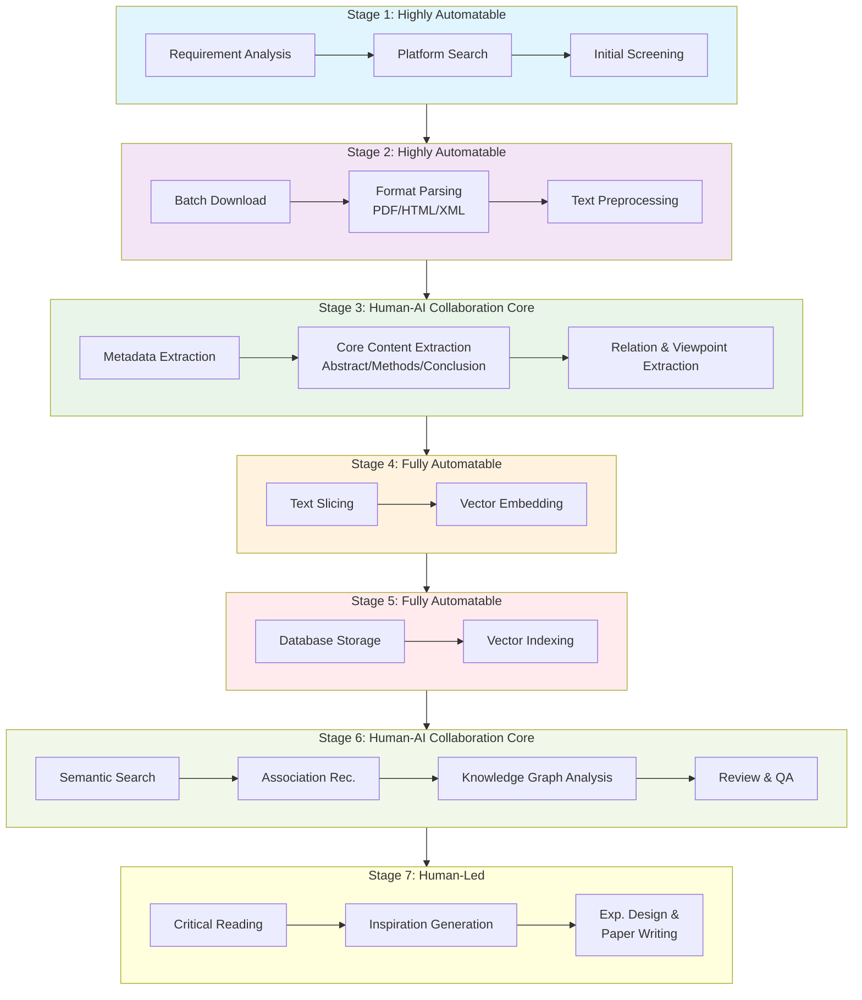
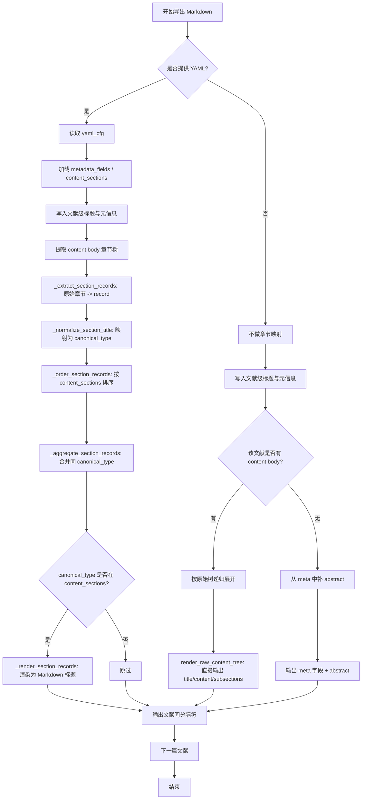

# pyPaperFlow - An Automatic Paper Reading Platform

  
 [](http://makeapullrequest.com) 


[English](README.md) | [Chinese/中文](README_zh.md)

An automated literature processing platform for scientific researchers. This tool focuses on information extraction and knowledge discovery stages, enabling researchers to efficiently complete the entire workflow from literature retrieval to knowledge internalization through a 7-stage automated process.

**Core Objectives**

- **Rapid Domain Entry**: Batch retrieve and access all available literature in a specific field
- **Batch Knowledge Extraction**: Utilize AI long-text processing capabilities to extract structured knowledge from massive amounts of text
- **Research Trend Tracking**: Quickly grasp the latest research methods, conclusions, and core papers in a field

**Positioning**

This tool is designed to complement rather than replace reference management software like Zotero. We focus on the two key steps of "Information Extraction" and "Knowledge Discovery" to build a structured knowledge base for you, laying the foundation for subsequent semantic search, association recommendation, and review generation.

**Current Implementation Scope**

Stages 1-2 and parts of Stages 4/5 (tagging system) have been implemented. Stages 3, 6, and 7 involve AI model selection, prompt strategies, and knowledge base refinement, which require user configuration based on specific needs.


## 🚀 Features

- **Automated Retrieval**: Search and fetch paper metadata from PubMed/Medline, arXiv, and bioRxiv.
- **Full-Text Access**: Automatically download open-access full text (XML/Text) from PMC.
- **Structured Storage**:
  - **Metadata**: Stored as detailed JSON files.
  - **Full Text**: Saved in multiple formats (XML, parsed JSON, Markdown) for flexible use.
- **CLI Tool**: A user-friendly command-line interface (`pyPaperFlow`) for all operations.

## 🏗️ Architecture Vision

The project is designed around a 7-stage workflow:


```mermaid
flowchart TD
    A[Retrieval &<br>Collection] --> B[Processing &<br>Parsing]
    B --> C[Structured<br>Extraction]
    C --> D[Deep Encoding &<br>Vectorization]
    D --> E[Dynamic Knowledge<br>Base Storage]
    E --> F[Intelligent Interaction &<br>Discovery]
    F --> G[Final Output &<br>Internalization]

    style A fill:#e1f5fe
    style B fill:#f3e5f5
    style C fill:#e8f5e8
    style D fill:#fff3e0
    style E fill:#ffebee
    style F fill:#f1f8e9
    
    subgraph A [Stage 1: Highly Automatable]
        direction LR
        A1[Requirement Analysis] --> A2[Platform Search]
        A2 --> A3[Initial Screening]
    end

    subgraph B [Stage 2: Highly Automatable]
        direction LR
        B1[Batch Download] --> B2[Format Parsing<br>PDF/HTML/XML]
        B2 --> B3[Text Preprocessing]
    end

    subgraph C [Stage 3: Human-AI Collaboration Core]
        direction LR
        C1[Metadata Extraction] --> C2[Core Content Extraction<br>Abstract/Methods/Conclusion]
        C2 --> C3[Relation & Viewpoint Extraction]
    end

    subgraph D [Stage 4: Fully Automatable]
        direction LR
        D1[Text Slicing] --> D2[Vector Embedding]
    end

    subgraph E [Stage 5: Fully Automatable]
        direction LR
        E1[Database Storage] --> E2[Vector Indexing]
    end

    subgraph F [Stage 6: Human-AI Collaboration Core]
        direction LR
        F1[Semantic Search] --> F2[Association Rec.] --> F3[Knowledge Graph Analysis] --> F4[Review & QA]
    end

    subgraph G [Stage 7: Human-Led]
        direction LR
        G1[Critical Reading] --> G2[Inspiration Generation] --> G3[Exp. Design &<br>Paper Writing]
    end
```

### Stage Analysis & Design Philosophy

#### Stage 1: Retrieval & Collection
The starting point of the entire workflow.
- **Manual Process**: Manually entering keywords on platforms like PubMed or Google Scholar, browsing results, and saving them.
- **Automation Entry Points**:
    - **Intelligent Retrieval Agent**: Scripts using APIs or crawlers to perform periodic automated searches based on preset keywords, journal lists, or scholar tracking.
    - **Initial Screening Algorithms**: Rule-based filtering (e.g., title terms, impact factor, date range) to sort and filter results.

#### Stage 2: Processing & Parsing
Converting raw files into computer-processable plain text and metadata.
- **Automation Entry Points**:
    - **Unified Parser**: Using tools (e.g., pdfplumber, GROBID) to extract text and charts from PDFs with high precision.
    - **Metadata Enhancement**: Automatically completing full bibliographic metadata (Title, Author, DOI, etc.) and ensuring format uniformity.

#### Stage 3: Core Information Structured Extraction
The critical leap from "Text" to "Information".
- **Automation Entry Points** (Human-AI Collaboration Core):
    - **Structured Information Extraction**: Using LLMs to act as domain experts, extracting information into fixed schemas (e.g., Problem Statement, Core Methods, Key Data, Conclusions).
    - **Relation & Viewpoint Extraction**: Identifying citation intent (support/refute) and distilling core arguments.

#### Stage 4: Deep Encoding & Vectorization
Establishing mathematical representations for information.
- **Automation Entry Points**:
    - **Text Embedding**: Using Transformer models to generate high-dimensional vectors (Embeddings) for literature.
    - **Vector Storage**: Storing vectors in specialized databases (e.g., ChromaDB, Pinecone) to enable semantic retrieval.

#### Stage 5: Dynamic Knowledge Base Storage & Indexing
The "Memory" of the system.
- **Automation Entry Points**:
    - **Multi-modal Database**: A dual-storage system combining relational databases (for structured info) and vector databases (for embeddings).
    - **Automated Indexing & Association**: Automatically establishing potential links between papers (co-citation analysis, method similarity) to build the initial edges of a knowledge graph.

#### Stage 6: Intelligent Interaction & Knowledge Discovery
Active exploration using the built knowledge base.
- **Automation Entry Points** (Human-AI Collaboration Core):
    - **Semantic Search Engine**: "Ask instead of Search" - understanding query semantics to return relevant passages.
    - **Association Recommendation & Visualization**: Recommending papers based on content similarity and visualizing the academic landscape.
    - **Intelligent QA & Review Generation**: Generating structured mini-reviews based on all literature in the database.

#### Stage 7: Final Output & Internalization
Human-led, with AI as an augmentation tool.
- **Automation Entry Points**:
    - **Assisted Writing & Citation**: Real-time recommendation of relevant citations and formatting during writing.
    - **Viewpoint Collision & Inspiration**: Presenting methodological conflicts or cross-domain associations to stimulate critical thinking.

*Currently, Stages 1, 2, and parts of 4/5 (Lite version via Tagging) are implemented.*

## 📦 Installation

```bash
git clone https://github.com/MaybeBio/pyPaperFlow.git
cd pyPaperFlow
pip install -e .
```

## 🛠️ Usage

The platform provides a CLI tool named `paperflow`.

### 1. Search PubMed
Search for papers and get a list of PMIDs.

```bash
paperflow search "COVID-19 vaccine" --retmax 5
```

### 2. Fetch Papers
Fetch metadata for papers and save them to your local storage.

**By Query:**
```bash
paperflow fetch --query "COVID-19 vaccine" --batch-size 10
```

**By PMID List:**
Create a file `pmids.txt` with one PMID per line, then run:
```bash
paperflow fetch --file pmids.txt
```

### 3. Download Full Text
Download PMC full text for fetched papers (if available).

```bash
paperflow download-fulltext --pmid 34320283
```

### 4. Search and Fetch arXiv Papers
Search arXiv first if you only want IDs, or fetch metadata and PDFs in one step.

```bash
paperflow arxiv-search "deep learning for biology" --max-results 10
paperflow arxiv-fetch "deep learning for biology" --max-results 10 --download-pdf
paperflow arxiv-fetch "deep learning for biology" --max-results 10 --download-pdf --backend paperscraper
```

Useful options:

- `--start-date` and `--end-date`: limit results to a date window in `YYYY-MM-DD` format.
- `--backend`: choose `native` for the built-in httpx-backed arXiv API path, or `paperscraper` to use the optional third-party adapter when installed.
- `--output-dir`: save the ID list or fetched records to a different directory.
- `--no-download-pdf`: skip PDF download and save metadata only.

Example with a date filter:

```bash
paperflow arxiv-fetch "protein folding" --start-date 2024-01-01 --end-date 2024-12-31 -o ./papers/arxiv
```

Search output is saved as `searched_arxiv_ids.txt`. Fetched records are stored under `source/year/source_id/` with JSON metadata and, when available, a PDF copy.

### 5. Search and Fetch bioRxiv Papers
bioRxiv now uses direct server-side query via Crossref (openRxiv records), rather than pulling large date windows first and filtering locally.

```bash
paperflow biorxiv-search "AlphaFold AND structure" --max-results 10
paperflow biorxiv-fetch "AlphaFold AND structure" --start-date 2026-01-01 --end-date 2026-01-31 --download-pdf
```

Useful options:

- `--start-date` and `--end-date`: limit results to a date window in `YYYY-MM-DD` format.
- `--output-dir`: save the ID list or fetched records to a different directory.
- `--no-download-pdf`: skip PDF download and save metadata only.

Compatibility note:

- `--window-days` is kept for CLI compatibility but is not used by the current Crossref-backed bioRxiv search path.

Example:

```bash
paperflow biorxiv-fetch "protein interaction" --max-results 50 -o ./papers/biorxiv
```

Search output is saved as `searched_biorxiv_ids.txt`. Fetched records are stored under `source/year/source_id/` with JSON metadata and, when available, a PDF copy.


## 📂 Data Structure

The platform uses a "Lite" storage approach:

-   **`paper_data/paper_lookup.csv`**: A lookup table acting as a local database.
    -   Rows: PMIDs.
    -   Columns: `json_path`, and dynamic tags (e.g., `relevant`, `topic_A`).
-   **`paper_data/papers/{pmid}.json`**: Detailed metadata and content for each paper.

We will store all datas in structures like:

output dir/year/pmid/your files


## 📝 Notes on Medline Format

The fetcher parses Medline format to extract rich metadata including:
-   **PMID**: PubMed ID
-   **DP**: Date of Publication
-   **TI**: Title
-   **AB**: Abstract
-   **FAU/AU**: Authors
-   **AD**: Affiliations
-   **PT**: Publication Type (e.g., Journal Article, Review)
-   

## ⚠️ Cautionary Notes

### PubMed Publications

For `PubMed` publications, the parsed `key-value metadata` is presented below:


```bash
content
    abstract  # abstract text, 🌟 important
    keywords  # keywords, 🌟 important
    mesh_terms  # mesh terms, 🌟 important
    pub_types # article or review, can be used for filtering, 🌟 important
contributors
    medline # contributors parsed from medline format, MIXED PERSONS PER DICT, LESS DETAILED
        affiliations # affiliations of contributors
        auids # ORCID 
        full_names # full names of contributors
        short_names # short names of contributors
    xml  # contributors parsed from xml format, ONE PERSON PER DICT, MORE DETAILED
        affiliations # same as above
        full_name
        identifiers
        short_name
identity
    doi # DOI of the paper, 🌟 important, can be used for DOI-based fetching module
    pmid # PubMed ID, 🌟 important
    title # title of the paper, 🌟 important
links
    cites # cite this paper, 🌟 important
    entrez # other entrez links
    external # other external database links, ONE LINK PER DICT, MORE DETAILED (⚠️ there may be Full text source)
        attribute
        category
        linkname
        provider
        url # URL of the external database link, 🌟 important
    pmc # PMC ID used to download full text, 🌟 important
    refs # (pmid) cited by this paper, 🌟 important
    review # (pmid) All review articles highly relevant to the theme of this paper , 🌟 important
    similar # (pmid) topic-similar papers, 🌟 important
    text_mined # links mined from PMC full text(if available), 🌟 important (there may be github links or other sources)
metadata
    entrez_date # date when the paper was added to PubMed
    fetched_at # date when the paper was fetched by our tool
source
    journal_abbrev # abbreviation abbreviation of the journal
    journal_title # full name of the journal
    pub_date # publication date
    pub_types # publication types, similar to pub_types in content above 
    pub_year # publication year
```

---

For content extraction,


## 🔗 References & Inspiration

-   [PubMed Research Extractor](https://github.com/Proveer/pubmed-research-extractor)
-   [BioLitMiner](https://github.com/akshayoo/BioLitMiner)


## search/fetch/download/full

search是搜索id
fetch是获取元数据
download是获取文本数据（pdf解析为md，或直接拿到md数据）
full是 元数据+文本数据一起获取 


## Test Cases

Seen in [Cases.md](Cases.md)


## Usage

merge markdown yourself (content is enough), or use our analysis module to merge both metadata and content(major in title+abstract+keywords+mesh_terms+introduction+discussion+conclusions+methods),

ther are both suitable for downstream LLM tasks.

Add them into your Claude Code Project Workflow!

⚠️ 关于export md部分内容
```bash

当前脚本里的“章节映射”主要发生在有 YAML 的路径里，核心链路是：

1. 先从正文树里提取章节
   - [pubmed_merger.py]( /data2/pyPaperFlow/src/pyPaperFlow/pubmed/pubmed_merger.py#L620 ) 的 `_candidate_body_nodes()` 会先找到 `content.body` 这类正文节点。
   - [pubmed_merger.py]( /data2/pyPaperFlow/src/pyPaperFlow/pubmed/pubmed_merger.py#L657 ) 的 `_extract_section_records()` 会递归遍历每个节点，取出 `title`、`content`、`subsections`，并为每个节点生成一条 record。

2. 把原始标题归一到 canonical section
   - [pubmed_merger.py]( /data2/pyPaperFlow/src/pyPaperFlow/pubmed/pubmed_merger.py#L563 ) 的 `_normalize_section_title()` 会把原始标题映射成标准类别，比如 `abstract`、`introduction`、`methods`、`results`、`discussion`，否则归到 `other`。
   - 这个映射主要靠 `SECTION_TITLE_ALIASES`，先做精确匹配，再做正则匹配，最后走少量前缀兜底。

3. 按 YAML 的章节顺序排序
   - [pubmed_merger.py]( /data2/pyPaperFlow/src/pyPaperFlow/pubmed/pubmed_merger.py#L705 ) 的 `_order_section_records()` 会按 `content_sections` 的顺序排序；如果没传 YAML，就用 `SECTION_CANONICAL_ORDER`。
   - 这一步只是排序，不是过滤。

4. 合并同类章节，避免重复标题
   - [pubmed_merger.py]( /data2/pyPaperFlow/src/pyPaperFlow/pubmed/pubmed_merger.py#L714 ) 的 `_aggregate_section_records()` 会把同一个 `canonical_type` 的多条 record 合并成一条，拼接 paragraphs 和 children。
   - `other` 不会被合并成一个大类，而是尽量保留原始标题，避免把不同“杂项”强行揉在一起。

5. 真正写 Markdown
   - [pubmed_merger.py]( /data2/pyPaperFlow/src/pyPaperFlow/pubmed/pubmed_merger.py#L757 ) 的 `_render_section_records()` 会根据 `depth` 生成 `##`、`###` 这种层级标题，并递归渲染子章节。
   - 如果是 `other`，它会尽量保留原始标题；如果是已归一章节，就用统一显示名，比如 `Methods`、`Results`。

6. `export_md_from_merged_json()` 里现在有两条路径
   - 有 YAML 时：走章节映射，按 `content_sections` 选择性输出。
   - 没有 YAML 时：不做章节映射，直接按原始树展开，使用 [pubmed_merger.py]( /data2/pyPaperFlow/src/pyPaperFlow/pubmed/pubmed_merger.py#L398 ) 的 `render_raw_content_tree()`，这条路径更接近你提到的 `_parse_section_recursive` / `_flatten_json_to_text` 的思路。

如果你要，我可以下一条直接把“有 YAML / 无 YAML”两条路径画成一个更直观的流程图，或者我可以继续说明当前 `content.abstract` 在 meta-only 文章里是怎么补出来的。


```


```mermaid
flowchart TD
    A[开始导出 Markdown] --> B{是否提供 YAML?}

    B -- 是 --> C[读取 yaml_cfg]
    C --> D[加载 metadata_fields / content_sections]
    D --> E[写入文献级标题与元信息]
    E --> F[提取 content.body 章节树]
    F --> G[_extract_section_records: 原始章节 -> record]
    G --> H[_normalize_section_title: 映射为 canonical_type]
    H --> I[_order_section_records: 按 content_sections 排序]
    I --> J[_aggregate_section_records: 合并同 canonical_type]
    J --> K{canonical_type 是否在 content_sections?}
    K -- 否 --> L[跳过]
    K -- 是 --> M[_render_section_records: 渲染为 Markdown 标题]
    M --> N[输出文献间分隔符]
    L --> N

    B -- 否 --> O[不做章节映射]
    O --> P[写入文献级标题与元信息]
    P --> Q{该文献是否有 content.body?}
    Q -- 有 --> R[按原始树递归展开]
    R --> S[render_raw_content_tree: 直接输出 title/content/subsections]
    Q -- 无 --> T[从 meta 中补 abstract]
    T --> U[输出 meta 字段 + abstract]
    S --> N
    U --> N

    N --> V[下一篇文献]
    V --> W[结束] 

```


## 📝 TODOs 

<details>
<summary><b>Stage 1: 检索与收集</b></summary>

> - [ ] 目前文献数据库仅仅只覆盖了pubmed, 对于其他预印本平台的文献数据库并不支持, 但是一个人写解析太麻烦了, 看到有一个非常棒的仓库, 可以借助其对于除了pubmed之外其他数据解析的部分，可以整个库都import进来, 作为整个依赖的一部分,就是可以完全独立, ——》声明是外部依赖库[paperscraper](https://github.com/jannisborn/paperscraper)

</details>


# 接下来要做的

pubmed完善好体系
biorxiv完善体系
arxiv完善体系
todo
参考其他文献库完善文献获取本身（https://github.com/RainerSeventeen/paper-tracker、https://github.com/Agents365-ai/paper-fetch/blob/main/README_CN.md）
构建skill补充的整个workflow（https://github.com/RainerSeventeen/paper-tracker/blob/main/docs/zh/source_arxiv_api_query.md）

# ⚠️ pubmed数据库部分完全是我一个人完成的，至于arxiv和biorxiv部分是合作的，请注意问题完善

**Case 5 — 快速示例：使用两阶段 PubMed 合并与导出**

示例演示如何使用新的两阶段 CLI：先合并为统一 JSON（或 JSONL），再根据 YAML 配置导出单一 Markdown 视图以供下游 AI 使用。

1) 合并为 JSON（或 JSONL）

        - 命令：
            `paperflow pubmed-merge-json ./Papers/pubmed ./out`

        - 说明：如果第二个参数是目录或不带扩展名的路径，程序会自动生成类似 `pubmed_2026-05-04_00-44-42.json` 的总文件名，同时在每篇文献所在目录下写入 `{PMID}.json`。

        - 写为 JSONL：
            `paperflow pubmed-merge-json ./Papers/pubmed ./out --jsonl`

        - 可选按 PMID 列表过滤：
            `paperflow pubmed-merge-json ./Papers/pubmed ./out --pmid-file pmids.txt`

2) 从合并的 JSON 导出 Markdown（可选使用 YAML 配置）

        - 简单导出：
            `paperflow pubmed-export-md ./out/merged.json ./out/merged.md`

        - 使用 YAML 配置选择字段与段落（示例 YAML 内容）：

            metadata_fields: ["identity", "source.pub_date"]
            content_sections: ["abstract", "methods"]

            `paperflow pubmed-export-md ./out/merged.json ./out/merged.md --yaml export_cfg.yaml`

3) 说明

- `pubmed-merge-json`：生成每篇论文的标准化 JSON 表示，并在每篇文献目录旁写入 `{PMID}.json`；总合并文件会使用输入文件夹名或 list 文件名加时间戳命名。
- `pubmed-export-md`：从合并的 JSON 中选择元数据与段落，输出单一 Markdown 文档，并使用 `PMID - 标题` 作为文献主标题，文献之间用显式分隔符切开，便于 LLM 语境读取与快速审阅。

以上命令在仓库中已实现并通过了快速 smoke 测试（本地临时样例），如需我帮你在真实样本上跑一遍，请提供样本路径或允许我使用仓库内的数据样例。


# how to intergrate this tool into your ResearchFlow
# ResearchFlow Skill
