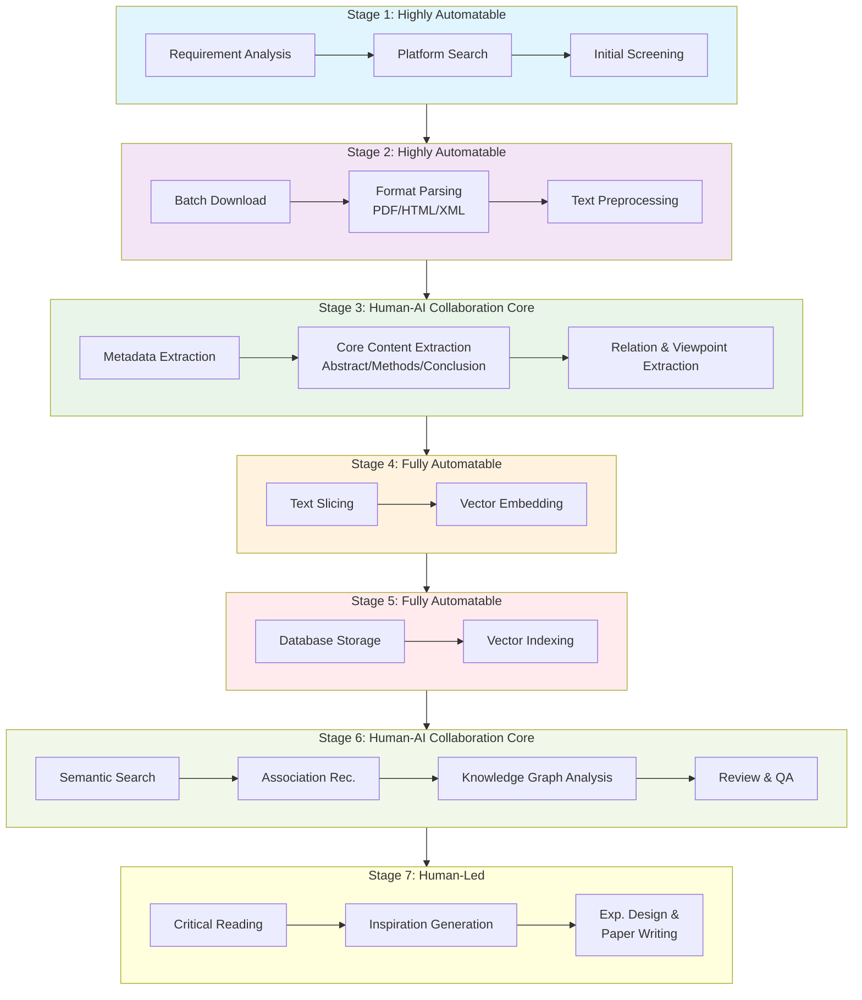

---

# pyPaperFlow - An Automatic Paper Reading Platform

  
 [](http://makeapullrequest.com) 


> 📌 **Document is here** 👉 [English](README.md) | [中文](README_zh.md)

---

An `automated literature processing platform` for scientific researchers. This tool focuses on `information extraction and knowledge discovery` stages, enabling researchers to efficiently complete the entire workflow from literature retrieval to knowledge internalization through a `7-stage automated process`.

**Core Objectives**

- **Rapid Domain Entry**: Batch retrieve and access all available literature in a specific field
- **Batch Knowledge Extraction**: Utilize AI long-text processing capabilities to extract structured knowledge from massive amounts of text
- **Research Trend Tracking**: Quickly grasp the latest research methods, conclusions, and core papers in a field

**Positioning**

This tool is designed to `complement rather than replace` reference management software like Zotero. We focus on the two key steps of "Information Extraction" and "Knowledge Discovery" to build a `structured knowledge base` for you, laying the foundation for `subsequent semantic search, content analysis, and review generation`.


## 🚀 Features

- **Automated Retrieval from Multiple Sources**: Automatically search and retrieve paper metadata and full-text records from `PubMed/Medline, arXiv, medRxiv, chemRxiv and bioRxiv`. The repository focuses primarily on biomedical research and computational interdisciplinary fields (`Biomedicine + Computational Biology`).
- **Full-Text Access**: Enable automatic downloading of open-access full texts in XML/Text format from `PMC`. For preprints and other publications without accessible PMC full texts, alternative acquisition modules are integrated to fetch `original PDFs`, with `Sci-Hub` set as the fallback provider.
- **Structured Storage**:
  - **Metadata**: Preserved in well-structured detailed JSON files.
  - **Full Text**: Stored in multiple formats including parsed JSON and Markdown for versatile downstream usage — JSON for programmatic data analysis, and Markdown optimized for LLM comprehension and processing.
  - **Standardized Structured Parsing**：All literatures are parsed and organized into `standardized JSON schemas`. The schema strictly classifies content into metadata fields (title, year, authors) and canonical academic sections (abstract, introduction, results, discussion, methods, conclusion, supplementary, availability, funding, acknowledgements, author contributions, references, other). `Custom section parsing is fully supported, allowing users to apply self-defined JSON schemas for semantic parsing of literature with special formatting structures`. Dedicated modules are provided to extract designated sections from bulk topic-related papers and `assemble them into source-verified Markdown literature corpora`, facilitating subsequent literature investigation and systematic review writing.
- **LLM & Agent Empowerment**: Integrate LLM skills and intelligent Agent capabilities to streamline the entire workflow of literature investigation and in-depth reading.
- **CLI Tool**: Provide a user-friendly command-line interface `paperflow` that supports all core operations out of the box.

## 🏗️ Architecture Vision

You can check the [Design.md](Docs/Design.md) for more details about our Design Philosophy.

The project is designed around a 7-stage workflow:


```mermaid
flowchart TD
    A[Retrieval &<br>Collection] --> B[Processing &<br>Parsing]
    B --> C[Structured<br>Extraction]
    C --> D[Deep Encoding &<br>Vectorization]
    D --> E[Dynamic Knowledge<br>Base Storage]
    E --> F[Intelligent Interaction &<br>Discovery]
    F --> G[Final Output &<br>Internalization]

    style A fill:#e1f5fe
    style B fill:#f3e5f5
    style C fill:#e8f5e8
    style D fill:#fff3e0
    style E fill:#ffebee
    style F fill:#f1f8e9
    
    subgraph A [Stage 1: Highly Automatable]
        direction LR
        A1[Requirement Analysis] --> A2[Platform Search]
        A2 --> A3[Initial Screening]
    end

    subgraph B [Stage 2: Highly Automatable]
        direction LR
        B1[Batch Download] --> B2[Format Parsing<br>PDF/HTML/XML]
        B2 --> B3[Text Preprocessing]
    end

    subgraph C [Stage 3: Human-AI Collaboration Core]
        direction LR
        C1[Metadata Extraction] --> C2[Core Content Extraction<br>Abstract/Methods/Conclusion]
        C2 --> C3[Relation & Viewpoint Extraction]
    end

    subgraph D [Stage 4: Fully Automatable]
        direction LR
        D1[Text Slicing] --> D2[Vector Embedding]
    end

    subgraph E [Stage 5: Fully Automatable]
        direction LR
        E1[Database Storage] --> E2[Vector Indexing]
    end

    subgraph F [Stage 6: Human-AI Collaboration Core]
        direction LR
        F1[Semantic Search] --> F2[Association Rec.] --> F3[Knowledge Graph Analysis] --> F4[Review & QA]
    end

    subgraph G [Stage 7: Human-Led]
        direction LR
        G1[Critical Reading] --> G2[Inspiration Generation] --> G3[Exp. Design &<br>Paper Writing]
    end
```

## 📦 Installation

```bash
# 1. install from source
git clone https://github.com/MaybeBio/pyPaperFlow.git
cd pyPaperFlow
pip install -e .

# 2. install MinerU
# follow the official installation guide: https://github.com/opendatalab/MinerU
# verify installation: mineru --help
pip install --upgrade pip -i https://mirrors.aliyun.com/pypi/simple
pip install uv -i https://mirrors.aliyun.com/pypi/simple
uv pip install -U "mineru[all]" -i https://mirrors.aliyun.com/pypi/simple 

# 3. install AI backend
pip install openai anthropic

# 4. install paperscraper backend
# follow the official installation guide: https://github.com/jannisborn/paperscraper
pip install paperscraper
```

> ⚠️ For typical usage, you only need to install the repository from source and MinerU, which are steps 1 and 2.

## 🛠️ Usage

We designed pyPaperFlow as a versatile academic research tool built strictly around the `real‑world workflow of researchers conducting literature investigation, paper reading, literature comprehension and analysis, and corpus utilization`.

Therefore, please follow our step‑by‑step operations, which mirror your full literature research process. Through this hands‑on experience, you will fully grasp the design philosophy and usage of this tool.

The platform provides a CLI tool named `paperflow`.


### Module Overview

Current available modules include (`will be continuously updated`):

```python 
❯ paperflow --help
                                                                                                                                                                                         
 Usage: paperflow [OPTIONS] COMMAND [ARGS]...                                                                                                                                            
                                                                                                                                                                                         
 pyPaperFlow CLI                                                                                                                                                                         
                                                                                                                                                                                         
╭─ Options ─────────────────────────────────────────────────────────────────────────────────────────────────────────────────────────────────────────────────────────────────────────────╮
│ --install-completion          Install completion for the current shell.                                                                                                               │
│ --show-completion             Show completion for the current shell, to copy it or customize the installation.                                                                        │
│ --help                        Show this message and exit.                                                                                                                             │
╰───────────────────────────────────────────────────────────────────────────────────────────────────────────────────────────────────────────────────────────────────────────────────────╯
╭─ Commands ────────────────────────────────────────────────────────────────────────────────────────────────────────────────────────────────────────────────────────────────────────────╮
│ pubmed-search      Search PubMed using Your customized query and return PMIDs.                                                                                                        │
│ pubmed-meta        Fetch paper metadata from PubMed using Your customized query, pmid list file and save to storage.                                                                  │
│ pubmed-content     Download full text (PMC) for given PMIDs if the paper has a PMC ID.                                                                                                │
│ pubmed-all         Fetch BOTH metadata and full text (if available) for papers.                                                                                                       │
│                    Also extracts URLs from full text and updates metadata links.                                                                                                      │
│ pubmed-merge-json  Create a merged JSON (or JSONL) file from PubMed paper directories.                                                                                                │
│ pubmed-export-md   Export a single Markdown view from a merged JSON file using optional YAML config.                                                                                  │
│ arxiv-search       Search arXiv and write matching IDs to a text file.                                                                                                                │
│ arxiv-fetch        Fetch arXiv metadata and attempt to download PDFs.                                                                                                                 │
│ biorxiv-search     Search bioRxiv and write matching IDs to a text file.                                                                                                              │
│ biorxiv-fetch      Fetch bioRxiv metadata and attempt to download PDFs.                                                                                                               │
│ paper-fetch        Fetch PDFs by DOI — passes through to the paper-fetch engine.                                                                                                      │
│ pdf-parse          Parse a PDF file using MinerU engine, and clean up the output directory.                                                                                           │
│ mineru-parse       Parse mineru output content_list_v2.json into canonical sectioned JSON.                                                                                            │
│ mineru-export-md   Export structured mineru JSON to a clean Markdown file for LLM processing.                                                                                         │
╰───────────────────────────────────────────────────────────────────────────────────────────────────────────────────────────────────────────────────────────────────────────────────────╯


```

Classify these modules according to the workflow stages:
```python
PubMed Modules:
- pubmed-search # search papers and return PMIDs
- pubmed-meta # fetch paper metadata from PubMed
- pubmed-content # download full text (PMC) for given PMIDs if the paper has a PMC ID
- pubmed-all # fetch BOTH metadata and full text (if available) for papers
- pubmed-merge-json # Batch merge a collection of PubMed papers of the same topic 
- pubmed-export-md # export PubMed paper collections as Markdown files, supporting batch export of specific sections (🌟 e.g., batch export of introductions as your research background)

arXiv Modules:
- arxiv-search # search arXiv and return matching IDs
- arxiv-fetch # fetch arXiv metadata and attempt to download PDFs

bioRxiv Modules:
- biorxiv-search # search bioRxiv and return matching IDs
- biorxiv-fetch # fetch bioRxiv metadata and attempt to download PDFs

Third-party Modules:
- paper-fetch # fetch PDFs by DOI
- pdf-parse # parse PDF files into JSON, Markdown format using the MinerU engine
- mineru-parse # Based on your custom section configuration, re-parse the MinerU output file into a structured JSON format clustered by standard literature sections
- mineru-export-md # Based on your custom section configuration, export the structured mineru JSON to a clean Markdown file for LLM processing (🌟 e.g., batch export of introductions as your research background)
```

> ⚠️ `Other preprint platforms modules are under development, please stay tuned!`

### 1. Research Start Point

The primary step in conducting a literature review is the collection and organization of literature information. When existing knowledge reserves are insufficient, academic materials need to be integrated to systematically grasp the domestic and international research status in relevant fields.

First, the intended research topic must be defined. At the initial stage of research, you may only have scattered preliminary ideas, fragmented literatures, rough investigation drafts, or even no prior materials at all—merely several core keywords.

In this phase, the research direction and scope shall be preliminarily defined based on all available information. Only broad research boundaries need to be determined here; there is no need to precisely finalize the ultimate research objective in the first iteration.

Accordingly, priori or posteriori brainstorming is required. This tool features dedicated built‑in functional modules to help you organize existing ideas and information, and refine them into well‑defined research directions and scopes.


```bash
Inputs:
- Research Direction: The intended research topic or problem domain
- Existing Information: Related literatures, investigation drafts, keywords and other prior materials you have obtained, with attachments supported

Outputs:
- Research Scope: An explicit definition covering core topics and boundary constraints. More intuitively, it can be regarded as preliminary research questions or the overall research orientation, uniformly defined as the Starting Point of Research in this document.
- Output is mainly presented as a keyword list guiding subsequent literature retrieval or standardized research question statements. Constraints can be supplemented through multiple iterations according to research requirements.
```

> Core Note: `The Starting Point of Research is not finalized once and for all. It can be continuously updated and refined through multiple iterations with newly acquired information and research progress.`

You may leverage state‑of‑the‑art large language models, combined with all materials and information at hand, to repeatedly verify and refine the Starting Point of Research until it is sufficiently clear and specific, or meets the criteria to proceed to the next step of literature retrieval.

> 🌟 Here we provide a few brainstorming skills for literature review: [Skills List](./Docs/Skills.md)

### 2. Search Papers (and Fetch Metadata)

Once the starting point of research is finalized (or any intermediate brainstorming stage requiring supplementary literature review), you may proceed with paper retrieval.

This tool does not generate search queries for you. Instead, we highly recommend crafting grammatically standardized and high‑relevance queries prior to using our search module.

Our literature database primarily covers biomedical research and computational interdisciplinary fields, with core data sources as follows:

- PubMed/Medline
- arXiv
- bioRxiv，medRxiv，chemRxiv

We recommend that you proactively learn and master the search syntax of these databases, as our built‑in search module functions similarly to the search bar on official web portals.

For instance, here is a typical complex query example tailored for PubMed:

```python
"""
(
  "Intrinsically Disordered Proteins"[Mesh] OR
  "Intrinsically Disordered Protein"[Title/Abstract] OR
  "Intrinsically Disordered Proteins"[Title/Abstract] OR
  "Intrinsically Disordered Region"[Title/Abstract] OR 
  "Intrinsically Disordered Regions"[Title/Abstract] OR 
  "Natively Unfolded Protein"[Title/Abstract] OR
  "Natively Unfolded Proteins"[Title/Abstract] OR
  "Unstructured Protein"[Title/Abstract] OR
  "Unstructured Proteins"[Title/Abstract] OR
  "IDR"[Title/Abstract] OR 
  "IDP"[Title/Abstract]
)
AND 
(
  "Protein Interaction Maps"[Mesh] OR
  "Protein Interaction Maps"[Title/Abstract] OR
  "Protein Interaction Networks"[Title/Abstract] OR
  "Protein-Protein Interaction Map"[Title/Abstract] OR
  "Protein-Protein Interaction Network"[Title/Abstract] OR

  "Protein Interaction Mapping"[Mesh] OR
  "Protein Interaction Mapping"[Title/Abstract] OR
  "Binding Sites"[Title/Abstract] OR
  "Protein Binding"[Title/Abstract] OR
  "Protein Interaction Domains and Motifs"[Title/Abstract] OR
  "Protein Interaction Maps"[Title/Abstract] OR   

  "Protein Interaction Domains and Motifs"[Mesh] OR
  
  "Protein Interaction"[Title/Abstract] OR
  "Protein-Protein Interaction"[Title/Abstract] OR
  "PPI"[Title/Abstract] OR
  "Interaction"[Title/Abstract] OR
  "Binding"[Title/Abstract] OR
  "Interface"[Title/Abstract] OR
  "Complex"[Title/Abstract]
) 
AND 
(
  "Artificial Intelligence"[Mesh] OR
  "Deep Learning"[Mesh] OR
  "Machine Learning"[Mesh] OR
  "Neural Networks, Computer"[Mesh] OR
  "Artificial Intelligence"[Title/Abstract] OR
  "Deep Learning"[Title/Abstract] OR
  "Machine Learning"[Title/Abstract] OR
  "Neural Network"[Title/Abstract] 
)
AND (
  "2023/01/01"[Date - Publication] : "2026/12/31"[Date - Publication]
)
"""
```

Once you finish constructing your search query, you can start searching for papers. We will use the PubMed-related API as an example.

```python
❯ paperflow pubmed-search --help
                                                                                                                              
 Usage: paperflow pubmed-search [OPTIONS] QUERY                                                                               
                                                                                                                              
 Search PubMed using Your customized query and return PMIDs.                                                                  
                                                                                                                              
                                                                                                                              
 Notes:                                                                                                                       
 - 1, This command only searches and returns PMIDs, it does not fetch paper metadata.                                         
 - 2, This command will print the found PMIDs and also save them to 'pubmed_searched_ids.txt' in the specified output         
 directory.                                                                                                                   
 If --output-dir is not specified, it will default to the storage directory.                                                  
 - 3, Note that storage_dir is used to initialize the fetcher for consistency, while output_dir is where the PMIDs are saved. 
 They are different parameters!                                                                                               
                                                                                                                              
                                                                                                                              
 Example usage:                                                                                                               
 - 1. Search for papers related to "machine learning" and return up to 500 PMIDs/per batch:                                   
 paperflow pubmed-search "machine learning" --retmax 500 --output-dir ./MyPapers --email "YOUR_EMAIL@example.com" --api-key   
 "YOUR_NCBI_API_KEY"                                                                                                          
                                                                                                                              
╭─ Arguments ────────────────────────────────────────────────────────────────────────────────────────────────────────────────╮
│ *    query      TEXT  PubMed search query. [required]                                                                      │
╰────────────────────────────────────────────────────────────────────────────────────────────────────────────────────────────╯
╭─ Options ──────────────────────────────────────────────────────────────────────────────────────────────────────────────────╮
│    --retmax       -n      INTEGER  Max number of PMIDs to return every batch, must less than 10000. [default: 500]         │
│ *  --email                TEXT     Entrez Email. [required]                                                                │
│    --api-key              TEXT     NCBI API Key (recommended).                                                             │
│    --storage-dir  -s      TEXT     Directory in Repository-level to store paper data for Initialization.                   │
│                                    [default: ./Papers]                                                                     │
│    --output-dir   -o      TEXT     Directory in result-level to store output IDs.                                          │
│    --max-retries          INTEGER  Maximum number of retries for Entrez API calls. [default: 3]                            │
│    --help                          Show this message and exit.                                                             │
╰────────────────────────────────────────────────────────────────────────────────────────────────────────────────────────────╯
```

At this stage, we recommend retrieving paper metadata (primarily abstracts) via literature search.

Literature collection is an iterative process. You can often identify target papers using only abstracts, then proceed to download the required papers in the next step. In some cases, you may still need to download all retrieved papers.

It is important to emphasize that you can re-enter the brainstorming phase at any stage. The output of each phase can serve as the input for subsequent literature research. Based on the output of this phase, you can conduct further brainstorming to refine your research starting point and define your research questions more precisely.


```python
❯ paperflow pubmed-meta --help
                                                                                                                                                             
 Usage: paperflow pubmed-meta [OPTIONS]                                                                                                                      
                                                                                                                                                             
 Fetch paper metadata from PubMed using Your customized query, pmid list file and save to storage.                                                           
                                                                                                                                                             
                                                                                                                                                             
 Notes:                                                                                                                                                      
 - 1, You must provide one of --query, or --file to specify which papers to fetch. Note that they are mutually exclusive.                                    
 - 2, -f can be used to fetch one or more PMIDs listed in a text file (one PMID per line).                                                                   
                                                                                                                                                             
                                                                                                                                                             
 Example usage:                                                                                                                                              
 - 1. Fetch papers for a query and save to storage:                                                                                                          
   paperflow pubmed-fetch --query "machine learning" --output-dir ./MyPapers --email "YOUR_EMAIL@example.com" --api-key "YOUR_NCBI_API_KEY"                  
 - 2. Fetch papers from a list of PMIDs in a file:                                                                                                           
   paperflow pubmed-fetch --file ./pmid_list.txt --output-dir ./MyPapers --email "YOUR_EMAIL@example.com" --api-key "YOUR_NCBI_API_KEY"                      
                                                                                                                                                             
╭─ Options ─────────────────────────────────────────────────────────────────────────────────────────────────────────────────────────────────────────────────╮
│    --query        -q      TEXT     PubMed search query.                                                                                                   │
│    --file         -f      TEXT     Text file containing PMIDs (one per line), -q and -f are mutually exclusive.                                           │
│    --batch-size   -b      INTEGER  Batch size for fetching. [default: 50]                                                                                 │
│ *  --email                TEXT     Entrez Email. [required]                                                                                               │
│    --api-key              TEXT     NCBI API Key (recommended).                                                                                            │
│    --storage-dir  -s      TEXT     Directory in Repository-level to store paper data for Initialization. [default: ./Papers]                              │
│    --max-retries          INTEGER  Maximum number of retries for Entrez API calls. [default: 3]                                                           │
│    --output-dir   -o      TEXT     Directory in result-level to store output papers, default is current directory. If not specified, will be set to root  │
│                                    directory of the repository-level which is storage_dir. 🌟 We will create a '/pubmed' subfolder under the output       │
│                                    directory to save all pubmed related data                                                                              │
│                                    [default: .]                                                                                                           │
│    --help                          Show this message and exit.                                                                                            │
╰───────────────────────────────────────────────────────────────────────────────────────────────────────────────────────────────────────────────────────────╯
```


### 3. Fetch Papers (and Download Full Text)

Once you have confirmed your target papers, or, worse case, the metadata obtained during the search phase is insufficient for further evaluation and you need to download all full‑text papers, you may start downloading the papers.

Take PubMed as an example: for PubMed papers, we prioritize downloading full texts from PMC if available. If no PMC full text exists, we only retrieve PubMed metadata (mainly abstracts) and basic paper information.

Additionally, we provide a dedicated PDF‑crawling module as a fallback strategy for paper acquisition. Manual retrieval of PDF files is only recommended when all aforementioned methods fail to obtain PubMed paper data.

Output files from the PubMed database are available in two formats: JSON and Markdown. JSON is recommended for subsequent analysis, while Markdown serves as input data for Large Language Models (LLMs). Our tool generates both file formats for your selection simultaneously.


```python
❯ paperflow pubmed-content --help
                                                                                                                                                                  
 Usage: paperflow pubmed-content [OPTIONS]                                                                                                                        
                                                                                                                                                                  
 Download full text (PMC) for given PMIDs if the paper has a PMC ID.                                                                                              
                                                                                                                                                                  
                                                                                                                                                                  
 Notes:                                                                                                                                                           
 - 1, This currently only supports PMC full text fetching if the paper has a PMC ID.                                                                              
                                                                                                                                                                  
                                                                                                                                                                  
                                                                                                                                                                  
 Example usage:                                                                                                                                                   
 - 1. Download full text for PMIDs listed in a file:                                                                                                              
   paperflow download-fulltext --file ./pmid_list.txt --email "YOUR_EMAIL@example" --api-key "YOUR_NCBI_API_KEY" --output-dir ./MyPapers                          
                                                                                                                                                                  
                                                                                                                                                                  
╭─ Options ──────────────────────────────────────────────────────────────────────────────────────────────────────────────────────────────────────────────────────╮
│    --file         -f      TEXT     File containing PMIDs (one per line).                                                                                       │
│ *  --email                TEXT     Entrez Email. [required]                                                                                                    │
│    --api-key              TEXT     NCBI API Key (recommended).                                                                                                 │
│    --storage-dir  -s      TEXT     Directory in Repository-level to store paper data for Initialization. [default: ./Papers]                                   │
│    --max-retries          INTEGER  Maximum number of retries for Entrez API calls. [default: 3]                                                                │
│    --output-dir   -o      TEXT     Directory in result-level to store output full texts, default is current directory. If not specified, will be set to root   │
│                                    directory of the repository-level which is storage_dir. 🌟 We will create a '/pubmed' subfolder under the output directory  │
│                                    to save all pubmed related data                                                                                             │
│                                    [default: .]                                                                                                                │
│    --pmid         -p      TEXT     Single PMID to download full text for, can be repeated.                                                                     │
│    --help                          Show this message and exit.                                                                                                 │
╰────────────────────────────────────────────────────────────────────────────────────────────────────────────────────────────────────────────────────────────────╯

```

Alternatively, you may perform metadata retrieval and content fetching in two separate steps; we recommend handling them separately.

```python
❯ paperflow pubmed-all --help
                                                                                                                                                                  
 Usage: paperflow pubmed-all [OPTIONS]                                                                                                                            
                                                                                                                                                                  
 Fetch BOTH metadata and full text (if available) for papers. Also extracts URLs from full text and updates metadata links.                                       
                                                                                                                                                                  
                                                                                                                                                                  
 Example usage:                                                                                                                                                   
 - 1. Fetch full papers for a query:                                                                                                                              
   paperflow pubmed-all --query "machine learning" --output-dir ./MyPapers --email "YOUR_EMAIL"                                                                   
                                                                                                                                                                  
╭─ Options ──────────────────────────────────────────────────────────────────────────────────────────────────────────────────────────────────────────────────────╮
│    --query        -q      TEXT     PubMed search query.                                                                                                        │
│    --file         -f      TEXT     Text file containing PMIDs (one per line), -q and -f are mutually exclusive.                                                │
│    --pmid         -p      TEXT     Single PMID to download full text for, can be repeated.                                                                     │
│    --batch-size   -b      INTEGER  Batch size for fetching. [default: 50]                                                                                      │
│    --max-retries          INTEGER  Maximum number of retries for Entrez API calls. [default: 3]                                                                │
│ *  --email                TEXT     Entrez Email. [required]                                                                                                    │
│    --api-key              TEXT     NCBI API Key (recommended).                                                                                                 │
│    --storage-dir  -s      TEXT     Directory in Repository-level to store paper data for Initialization. [default: ./Papers]                                   │
│    --output-dir   -o      TEXT     Directory in result-level to store output papers. If not specified, defaults to storage-dir.                                │
│    --help                          Show this message and exit.                                                                                                 │
╰────────────────────────────────────────────────────────────────────────────────────────────────────────────────────────────────────────────────────────────────╯
``` 

For PubMed papers without PMC full texts, or papers from other databases where only the DOI is available (the pubmed‑meta module guarantees DOI acquisition), you may directly download full texts by DOI (if open‑access versions exist).

```python 
❯ paperflow paper-fetch --help
usage: paper-fetch [-h] [--title TITLE] [--batch FILE] [--out DIR] [--dry-run] [--format {json,text}] [--pretty] [--stream] [--overwrite]
                   [--idempotency-key KEY] [--timeout SECONDS] [--version]
                   [doi]

Fetch legal open-access PDFs by DOI via Unpaywall, Semantic Scholar, arXiv, PMC, and bioRxiv/medRxiv.

positional arguments:
  doi                   DOI to fetch (e.g. 10.1038/s41586-020-2649-2). Use '-' to read from stdin.

options:
  -h, --help            show this help message and exit
  --title TITLE         paper title; resolved to a DOI via Crossref before download. Mutually exclusive with positional DOI / --batch.
  --batch FILE          file with one DOI per line for bulk download. Use '-' to read from stdin.
  --out DIR             output directory (default: pdfs)
  --dry-run             resolve sources without downloading; preview the PDF URL and filename
  --format {json,text}  output format. json for agents, text for humans. Default: json when stdout is not a TTY, text otherwise.
  --pretty              pretty-print JSON output (2-space indent)
  --stream              emit one NDJSON result per line on stdout as each DOI resolves (batch mode)
  --overwrite           re-download even if the destination file already exists
  --idempotency-key KEY
                        safe-retry key; re-running with the same key replays the original envelope from <out>/.paper-fetch-idem/
  --timeout SECONDS     HTTP timeout in seconds per request (default: 30)
  --version             show program's version number and exit

exit codes:
  0  all DOIs resolved successfully
  1  unresolved (some DOIs had no OA copy; no transport failure)
  3  validation error (bad arguments)
  4  transport error (network / download / IO failure; retryable class)

subcommands:
  schema                 print the machine-readable CLI schema and exit (no network)

stdin:
  paper-fetch -          read a single DOI from stdin
  paper-fetch --batch -  read DOIs line-by-line from stdin

output:
  stdout emits one JSON object per invocation (NDJSON with --stream).
  stderr emits NDJSON progress events when --format json, prose when --format text.
  stdout format auto-detects TTY: json when piped/captured, text in a terminal.

examples:
  paper-fetch 10.1038/s41586-020-2649-2
  paper-fetch 10.1038/s41586-020-2649-2 --dry-run
  paper-fetch --batch dois.txt --out ./papers --format text
  echo 10.1038/s41586-020-2649-2 | paper-fetch --batch -
  paper-fetch schema

```


We acknowledge the work of [paper-fetch](https://github.com/Agents365-ai/paper-fetch)！We have modified, refactored, and encapsulated one of its core scripts for tailored integration into our pipeline.

The workflow of our paper acquisition module is outlined below:

```bash
┌─────────────────────────────────────────┐
│  Input: DOI / Paper Title / Batch File   │
└─────────────────────────────────────────┘
                   ↓
┌─────────────────────────────────────────┐
│  Title‑based Resolution? → Crossref → Semantic Scholar
│  (Resolves to DOI with confidence score) │
└─────────────────────────────────────────┘
                   ↓
┌─────────────────────────────────────────┐
│  1. Unpaywall (requires UNPAYWALL_EMAIL) │
│     → Fastest open‑access (OA) links with metadata
└─────────────────────────────────────────┘
           Failure / Skip ↓
┌─────────────────────────────────────────┐
│  2. Semantic Scholar                    │
│     → PDF URLs + external identifiers (arXiv / PMCID)
└─────────────────────────────────────────┘
           Failure ↓
┌─────────────────────────────────────────┐
│  3. arXiv (via S2 externalIds.ArXiv)     │
│  4. Europe PMC → PMC (via PMCID)         │
│  5. bioRxiv / medRxiv (DOI prefix: 10.1101/)
└─────────────────────────────────────────┘
           Total Failure ↓
┌─────────────────────────────────────────┐
│  6. Publisher Direct Links (Institutional Mode Only)
│     Nature / Science / Elsevier / Springer, etc.
│     Requires institutional IP / subscription / EZproxy authorization
└─────────────────────────────────────────┘
           Persistent Failure ↓
┌─────────────────────────────────────────┐
│  7. Sci‑Hub Mirror Fallback (enabled by default, configurable)
│     → 1 request‑per‑second rate‑limiting to prevent CAPTCHA triggers
│     → Automatic discovery of active new mirrors
└─────────────────────────────────────────┘

```

```bash
Resolution Priority Sequence

Unpaywall: The optimal open‑access source covering the broadest range of publishers with the highest hit rate.
Semantic Scholar: Retrieves OA PDF links and cross‑platform external identifiers.
arXiv: Activated when an arXiv identifier is available for the target paper.
PubMed Central (PMC) OA Subset: Activated when a PMCID is associated with the paper.
bioRxiv / medRxiv: Triggered for preprints with the DOI prefix 10.1101/.
Publisher Direct Links: Enabled only under institutional mode (PAPER_FETCH_INSTITUTIONAL=1), authorized via the caller’s institutional subscription IP, cookies, or EZproxy access.
Sci‑Hub Mirror Fallback: Enabled by default as the final retrieval backup.
Mirrors are attempted in the order specified by the environment variable PAPER_FETCH_SCIHUB_MIRRORS (default list: sci‑hub.ru, sci‑hub.st, sci‑hub.su, sci‑hub.box, sci‑hub.red, sci‑hub.al, sci‑hub.mk, sci‑hub.ee).
If all predefined mirrors fail, the module fetches the latest live mirror list from https://www.sci‑hub.pub/ and retries.
Set PAPER_FETCH_NO_SCIHUB=1 to disable Sci‑Hub retrieval.
If all sources fail, metadata is returned with a recommendation for interlibrary loan (ILL) acquisition.

```

> ⚠️ Prior to using the paper‑fetch module, configure your Unpaywall contact email via environment variable:

```bash
export UNPAYWALL_EMAIL=you@example.com
```


Unlike PMC parsing, non‑PubMed papers can only be obtained as PDF files via the paper‑fetch module.

We recommend standardizing all paper information into Markdown or JSON formats.

Given subsequent requirements for paragraph segmentation and information extraction, JSON is the most suitable intermediate format for programmatic processing.

We provide a pdf‑parser module that parses input PDFs into preliminary Markdown and JSON files using MinerU.

Refer to official documentation for details. Since typical users lack sufficient GPU resources for acceleration, we use the basic parsing mode by default (pipeline backend).


```python
❯ paperflow pdf-parse --help
                                          
 Usage: paperflow pdf-parse [OPTIONS]     
                                          
 Parse a PDF file using MinerU engine,    
 and clean up the output directory.       
                                          
                                          
 Notes:                                   
 - 1, MinerU generates a subfolder /auto  
 under --output with .md, .json, .pdf,    
 and images/.  Use --clear to strip       
 anything unnecessary,                    
 note that we only use .md files and      
 _content_list_v2.json/_content_list.json 
 files for further processing like        
 structuring.                             
 - 2, ⚠️  Remember to switch to domestic  
 mirror source when you can not access    
 huggingface.                             
                                          
                                          
 Example usage:                           
   paperflow pdf-parse -i paper.pdf -o    
 ./output                                 
                                          
╭─ Options ──────────────────────────────╮
│ *  --input   -i      TEXT  Input PDF   │
│                            file path.  │
│                            [required]  │
│ *  --output  -o      TEXT  Output      │
│                            directory   │
│                            for parsed  │
│                            output.     │
│                            [required]  │
│    --clear                 After       │
│                            conversion, │
│                            keep only   │
│                            the .md     │
│                            files and   │
│                            necessary   │
│                            .json       │
│                            files(_con… │
│    --help                  Show this   │
│                            message and │
│                            exit.       │
╰────────────────────────────────────────╯

```


> 🌟 Regarding the PDF paper retrieval module, we also provide a suite of reference scripts, which can be integrated into existing skills or implemented independently:  [Paper pdf fetch](./Docs/Skills.md)


### 4. 


### 4. Search and Fetch arXiv Papers
Search arXiv first if you only want IDs, or fetch metadata and PDFs in one step.

```bash
paperflow arxiv-search "deep learning for biology" --max-results 10
paperflow arxiv-fetch "deep learning for biology" --max-results 10 --download-pdf
paperflow arxiv-fetch "deep learning for biology" --max-results 10 --download-pdf --backend paperscraper
```

Useful options:

- `--start-date` and `--end-date`: limit results to a date window in `YYYY-MM-DD` format.
- `--backend`: choose `native` for the built-in httpx-backed arXiv API path, or `paperscraper` to use the optional third-party adapter when installed.
- `--output-dir`: save the ID list or fetched records to a different directory.
- `--no-download-pdf`: skip PDF download and save metadata only.

Example with a date filter:

```bash
paperflow arxiv-fetch "protein folding" --start-date 2024-01-01 --end-date 2024-12-31 -o ./papers/arxiv
```

Search output is saved as `searched_arxiv_ids.txt`. Fetched records are stored under `source/year/source_id/` with JSON metadata and, when available, a PDF copy.

### 5. Search and Fetch bioRxiv Papers
bioRxiv now uses direct server-side query via Crossref (openRxiv records), rather than pulling large date windows first and filtering locally.

```bash
paperflow biorxiv-search "AlphaFold AND structure" --max-results 10
paperflow biorxiv-fetch "AlphaFold AND structure" --start-date 2026-01-01 --end-date 2026-01-31 --download-pdf
```

Useful options:

- `--start-date` and `--end-date`: limit results to a date window in `YYYY-MM-DD` format.
- `--output-dir`: save the ID list or fetched records to a different directory.
- `--no-download-pdf`: skip PDF download and save metadata only.

Compatibility note:

- `--window-days` is kept for CLI compatibility but is not used by the current Crossref-backed bioRxiv search path.

Example:

```bash
paperflow biorxiv-fetch "protein interaction" --max-results 50 -o ./papers/biorxiv
```

Search output is saved as `searched_biorxiv_ids.txt`. Fetched records are stored under `source/year/source_id/` with JSON metadata and, when available, a PDF copy.


## 📂 Data Structure

The platform uses a "Lite" storage approach:

-   **`paper_data/paper_lookup.csv`**: A lookup table acting as a local database.
    -   Rows: PMIDs.
    -   Columns: `json_path`, and dynamic tags (e.g., `relevant`, `topic_A`).
-   **`paper_data/papers/{pmid}.json`**: Detailed metadata and content for each paper.

We will store all datas in structures like:

output dir/year/pmid/your files


## 📝 Notes on Medline Format

The fetcher parses Medline format to extract rich metadata including:
-   **PMID**: PubMed ID
-   **DP**: Date of Publication
-   **TI**: Title
-   **AB**: Abstract
-   **FAU/AU**: Authors
-   **AD**: Affiliations
-   **PT**: Publication Type (e.g., Journal Article, Review)
-   

## ⚠️ Cautionary Notes


---

For content extraction


## 🔗 References & Inspiration


## search/fetch/download/full

search是搜索id
fetch是获取元数据
download是获取文本数据（pdf解析为md，或直接拿到md数据）
full是 元数据+文本数据一起获取 


## Test Cases

Seen in [Cases.md](Cases.md)


## Usage

merge markdown yourself (content is enough), or use our analysis module to merge both metadata and content(major in title+abstract+keywords+mesh_terms+introduction+discussion+conclusions+methods),

ther are both suitable for downstream LLM tasks.

Add them into your Claude Code Project Workflow!

⚠️ 关于export md部分内容


 
 

## 📝 TODOs 

<details>
<summary><b>Stage 1: 检索与收集</b></summary>

> - [ ] 目前文献数据库仅仅只覆盖了pubmed, 对于其他预印本平台的文献数据库并不支持, 但是一个人写解析太麻烦了, 看到有一个非常棒的仓库, 可以借助其对于除了pubmed之外其他数据解析的部分，可以整个库都import进来, 作为整个依赖的一部分,就是可以完全独立, ——》声明是外部依赖库[paperscraper](https://github.com/jannisborn/paperscraper)

</details>      


#### ⚠️ pubmed数据库部分个人完成的，至于arxiv和biorxiv部分为AI协作，请注意问题完善

 


## MinerU JSON 结构化解析模块 (`mineru-parse`)

### 动机

PDF 经 MinerU 处理后生成的 `content_list_v2.json` 以页面为单位组织数据——一个外层数组代表所有页面，
每个元素是该页面的渲染块列表。这些块包含论文标题、段落、行间公式、图片/图表、表格、页眉、页脚、脚注等多种类型，
混杂在一起，无法直接用于下游的语义分析或 LLM 输入。

`MinerUContentParser` 的目标是将这个原始的 JSON 转换成统一的、按文献领域规范章节归并的结构化 JSON。

### 输入 JSON 结构（MinerU 官方格式）

```json
[
  [                        // page 0
    {"type": "title",      "content": {"title_content": [...], "level": 1}},
    {"type": "paragraph",  "content": {"paragraph_content": [...]}},
    {"type": "title",      "content": {"title_content": [...], "level": 2}},
    {"type": "paragraph",  "content": {"paragraph_content": [...]}},
    {"type": "page_header", ...},     // 噪声
    {"type": "page_footnote", ...},   // 噪声
    ...
  ],
  [                        // page 1
    ...
  ]
]
```

常见的块类型（按内容价值归类）：

| 类型 | 是否正文 | 文本提取路径 |
|------|----------|-------------|
| `title` | 是（章节锚点） | `content.title_content[*].content` + `level`（1=文章标题，2=一级章节） |
| `paragraph` | 是（主文本） | `content.paragraph_content[*].content`，支持 `equation_inline` 子项 |
| `equation_interline` | 是（行间公式） | `content.math_content`（LaTeX） |
| `table` | 部分 | `content.html`（HTML 表格） + `content.table_caption` |
| `image` / `chart` | 否（保留 caption） | `content.image_caption[*].content` / `content.chart_caption` |
| `page_header` / `page_footer` / `page_footnote` | **噪声（丢弃）** | 用于元数据扫描（年份/DOI/期刊名） |

### 解析流水线

```
                   content_list_v2.json
                           │
  ───────────────── Step 1: 扁平化 ─────────────────
                           │
              _flatten() — 去掉噪声块
             (page_header/footer/footnote)
              保留 title / paragraph / table 等
                           │
  ────────────── Step 2: 元数据提取 ────────────────
                           │
              ┌─ title    ← 第一个 level=1 的 title 块
              ├─ authors  ← title 后第一个短行（含逗号、<400 字符）
              ├─ year     ← 从 page_footer 中提取 "2025"
              ├─ doi      ← 从 page_footnote 中匹配 "10.1002/..."
              └─ journal  ← 从 page_header 中选取全大写短名称
                           │
  ────────────── Step 3: 抽象提取 ──────────────────
                           │
             _extract_abstract()
             跳过作者行 → 收集第一个 section 前所有段落
                           │
  ─────────┐ Step 4: 章节分割 ─────────────────────
           │
           │  以 title 块为界切分段落：
           │    level=1 → 跳过（论文标题）
           │    level=2 → 新主节
           │    level>=3 或编号 "2.1." → 子节，归入父节
           │
  ─────────┤ Step 5: 标题归一化 ─────────────────────
           │
           │  normalize_section_title()
           │    去除数字前缀 "2.2. IDPFold..." → "IDPFold..."
           │    匹配 CANONICAL_TYPES 表 → "results"
           │
  ─────────┤ Step 6: 节归并 ───────────────────────
           │
           │  _aggregate_sections()
           │    同一 canonical_type 的内容合并
           │    保持 subsections 列表
           │
  ─────────┘ Step 7: 表格提取 ─────────────────────
                           │
             _extract_tables()
             收集所有 table 块的 html + caption
                           │
                           ▼
                   结构化输出 JSON
```

### 章节归一化映射表

解析器维护一套 `CANONICAL_ORDER` 和 `_SECTION_PATTERNS`，将论文中的原始章节标题映射到标准的 12 种类型：

```python
CANONICAL_ORDER = [
    "abstract", "introduction", "results", "discussion",
    "methods", "conclusion", "supplementary", "availability",
    "funding", "acknowledgements", "author_contributions",
    "references", "other",
]
```

映射过程分为两步：

1. **去除数字前缀**：`re.compile(r"^\s*(?:\d+[\.\)]\s*)+(.*)$")` 将 `"2.1. IDPFold Reproduces..."` 转换为 `"IDPFold Reproduces..."`，再匹配纯关键词。
2. **关键词匹配**：按 `CANONICAL_ORDER` 的顺序依次尝试正则匹配。

典型映射示例：

| 原始标题 | 去除前缀后 | 命中 pattern | 结果 |
|----------|-----------|-------------|------|
| `"1. Introduction"` | `"Introduction"` | `r"^\s*introduction\s*$"` | `introduction` |
| `"2. Results"` | `"Results"` | `r"^\s*results?\s*$"` | `results` |
| `"3. Discussion"` | `"Discussion"` | `r"^\s*discussions?\s*$"` | `discussion` |
| `"4. Experimental Section"` | `"Experimental Section"` | `r"^\s*experimental\s+section\s*$"` | `methods` |
| `"Materials and Methods"` | `"Materials and Methods"` | `r"^\s*materials?\s*(?:and\|&)\s*methods?\s*$"` | `methods` |
| `"Data Availability Statement"` | `"Data Availability Statement"` | `r"^\s*(?:data\|...)\s+availability\s*$"` | `availability` |

### 子节处理

对于具有多级编号的章节如 `"2.1."`、`"2.2."` 等，解析器将其识别为子节：

- `_build_sections` 中的 `is_sub` 判定：`level >= 3` 或匹配 `r"^\s*(?:\d+[\.\)]\s*){2,}"`（两个以上数字段，如 `2.1.`、`3.2.5.`）
- 子节的段落写入父节的 `subsections` 列表
- 子节继承父节的 `canonical_type`，不创建独立条目

### 输出 JSON 格式

```json
{
  "source": "mineru",
  "file": "xxx_content_list_v2.json",
  "metadata": {
    "title": "Accurate Generation of Conformational Ensembles...",
    "authors": "Junjie Zhu, Zhengxin Li, ...",
    "year": 2025,
    "doi": "10.1002/advs.202511636",
    "journal": "Advanced Science"
  },
  "abstract": "Intrinsically disordered proteins (IDPs) play pivotal roles...",
  "sections": [
    {
      "canonical_type": "introduction",
      "raw_title": "1. Introduction",
      "display_title": "Introduction",
      "level": 2,
      "paragraphs": ["Intrinsically disordered proteins...", "..."]
    },
    {
      "canonical_type": "results",
      "raw_title": "2. Results",
      "display_title": "Results",
      "level": 2,
      "paragraphs": ["IDPFold employs a conditional diffusion..."],
      "subsections": [
        {
          "raw_title": "2.1. IDPFold Reproduces Global Features of IDPs",
          "display_title": "2.1. IDPFold Reproduces Global Features of IDPs",
          "level": 2,
          "paragraphs": ["We first evaluated...", "..."]
        }
      ]
    },
    {
      "canonical_type": "discussion",
      "raw_title": "3. Discussion",
      "display_title": "Discussion",
      "level": 2,
      "paragraphs": ["In this study..."]
    },
    {
      "canonical_type": "methods",
      "raw_title": "4. Experimental Section",
      "display_title": "Methods",
      "level": 2,
      "paragraphs": ["Datasets: The data for training...", "..."]
    }
  ],
  "tables": [
    {"caption": "Table 1. Benchmark on IDPFold...", "html": "<table>..."}
  ]
}
```

### CLI 使用

```bash
# 解析单个 JSON
paperflow mineru-parse -i content_list_v2.json -o paper.json

# 完整流水线：PDF → Markdown → 结构化 JSON
paperflow pdf2md -i paper.pdf -o ./output --clear
paperflow mineru-parse \
  -i ./output/paper_content_list_v2.json \
  -o ./output/paper_structured.json
```


没辙了，总之这里的语段分割/语义解析比较困难，我们目前做的尝试比较困难。
现在有几个解决方案：
* mineru换更好的模型后端
* mineru目前的输出json/markdown中尝试去做进一步更加精细的边界处理以及语义分割
* 换其他的pdf parser引擎
* 直接把mineru的输出markdown当作一个整体，丢给LLM做进一步的解析和结构化（不太建议，毕竟markdown里有很多噪声），做1个纯文本分割的skill
* 只是提取markdown的层级标题，然后让它分类，但是执行完全由python脚本执行合并

### 与 PubmedMerger 的协同

输出中的 `sections[*].canonical_type` 字段复用 `pubmed_merger.py` 中定义的 `SECTION_CANONICAL_ORDER`。
这意味着后续可以将 mineru 解析结果直接导入 `PubmedMerger.export_md_from_merged_json()` 的导出管线，
生成统一的 Markdown 文献评阅文档。


⚠️ paper-fetch updated at 2026-05-08 


注意导入unpaywall的email环境变量

### 5. Markdown to PDF parser

Here we use MinerU (Magic-PDF) to parse PDF into structured JSON, which contains the original text, the title, the section hierarchy, and the coordinates of each paragraph in the PDF. 

And remember to `switch to domestic mirror source` when you can not access huggingface.
```bash
export MINERU_MODEL_SOURCE=modelscope
```

We assume that your device does not meet the GPU acceleration requirements, so we set the default backend to `pipeline` to run in a pure CPU environment:
```bash
mineru -p <input_path> -o <output_path> -b pipeline
```

You can create a pull request to add more backends if you have access to GPU resources and want to speed up the parsing process.

Anything else you want to know about the usage of MinerU, please refer to their official documentation: [MinerU](https://github.com/opendatalab/MinerU).


# todo（warning）

首先是我们的biopython api会不会修改，pubmed部分需要跟进

其次是一些第三方模块的api以及输出的内容格式是否会改变，这会影响到我们的模块维护
比如说paper-fetch是封装了第三方模块
mineru-parser是使用v2的输出json格式，但是后续可能格式会修改


上下游是严格对应的：                        

  mineru_config.yaml                    mineru_export_config.yaml                                  
  ┌──────────────────────┐              ┌──────────────────────┐                                   
  │ canonical_order:     │              │ content_sections:    │                                   
  │   - abstract         │── 定义 ──→   │   - abstract         │                                   
  │   - introduction     │   可供选择的   │   - introduction     │                                 
  │   - results          │   类型池      │   - results          │                                  
  │   - ...              │              │   - discussion       │                                   
  │   - ethics  ← 自定义 │              │   - methods          │                                   
  └──────────────────────┘              │   - ethics  ← 引用   │                                   
                                        └──────────────────────┘                                   
                                                                                                   
  如果你在 mineru_config.yaml 的 canonical_order 里新增了 ethics，并配了 aliases，解析时论文里的   
  "Ethics Statement" 标题就会被归类为 ethics，然后你在导出配置里写 - ethics                        
  就能把它选出来。如果没有在上游定义过，导出阶段就找不到这个类型。          


   if input_path.is_dir():                                            
      json_files = sorted(input_path.glob("*.json"))   # 目录 → 批量 
  elif input_path.is_file():                                         
      json_files = [input_path]                        # 单文件      
                                                                     
  单篇：                                                             
  paperflow mineru-export-md -i paper.json -o paper.md               
                                                                     
  批量：                                                             
  paperflow mineru-export-md -i ./parsed_results/ -o all_papers.md   
                                                                     
  批量模式会扫描目录下所有 .json 文件，按文件名排序，每篇论文之间用  
  --- 分隔，输出为一个合并的 Markdown 文件。                         
                                                                     
  唯一要注意的是：目录里如果混入了其他非解析产物的 JSON              
  文件，也会被读进来。建议把 mineru-parse                          
  的输出单独放一个目录，