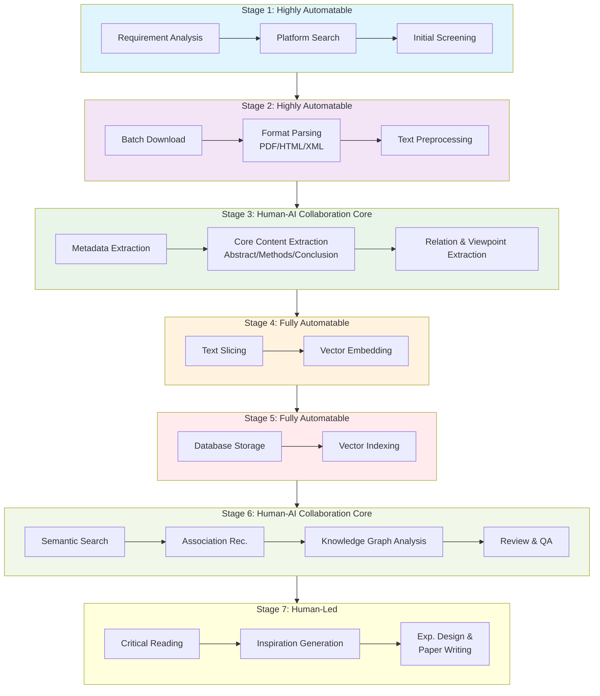
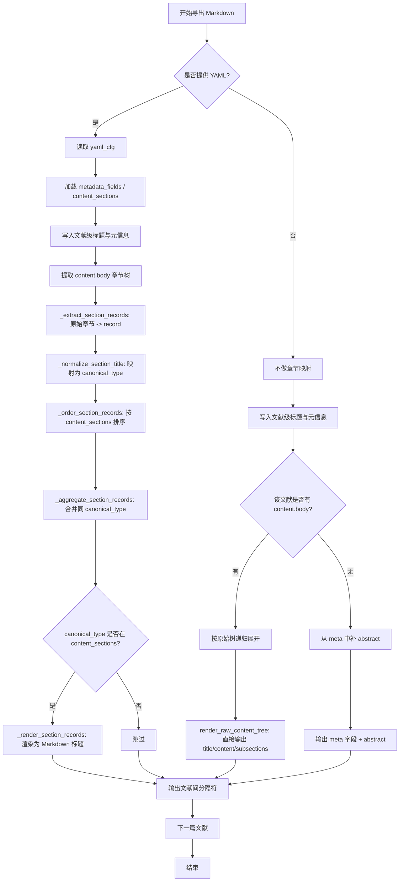

# pyPaperFlow - An Automatic Paper Reading Platform

  
 [](http://makeapullrequest.com) 


[English](README.md) | [Chinese/中文](README_zh.md)

An automated literature processing platform for scientific researchers. This tool focuses on information extraction and knowledge discovery stages, enabling researchers to efficiently complete the entire workflow from literature retrieval to knowledge internalization through a 7-stage automated process.

**Core Objectives**

- **Rapid Domain Entry**: Batch retrieve and access all available literature in a specific field
- **Batch Knowledge Extraction**: Utilize AI long-text processing capabilities to extract structured knowledge from massive amounts of text
- **Research Trend Tracking**: Quickly grasp the latest research methods, conclusions, and core papers in a field

**Positioning**

This tool is designed to complement rather than replace reference management software like Zotero. We focus on the two key steps of "Information Extraction" and "Knowledge Discovery" to build a structured knowledge base for you, laying the foundation for subsequent semantic search, association recommendation, and review generation.

**Current Implementation Scope**

Stages 1-2 and parts of Stages 4/5 (tagging system) have been implemented. Stages 3, 6, and 7 involve AI model selection, prompt strategies, and knowledge base refinement, which require user configuration based on specific needs.


## 🚀 Features

- **Automated Retrieval**: Search and fetch paper metadata from PubMed/Medline, arXiv, and bioRxiv.
- **Full-Text Access**: Automatically download open-access full text (XML/Text) from PMC.
- **Structured Storage**:
  - **Metadata**: Stored as detailed JSON files.
  - **Full Text**: Saved in multiple formats (XML, parsed JSON, Markdown) for flexible use.
- **CLI Tool**: A user-friendly command-line interface (`pyPaperFlow`) for all operations.

## 🏗️ Architecture Vision

The project is designed around a 7-stage workflow:


```mermaid
flowchart TD
    A[Retrieval &<br>Collection] --> B[Processing &<br>Parsing]
    B --> C[Structured<br>Extraction]
    C --> D[Deep Encoding &<br>Vectorization]
    D --> E[Dynamic Knowledge<br>Base Storage]
    E --> F[Intelligent Interaction &<br>Discovery]
    F --> G[Final Output &<br>Internalization]

    style A fill:#e1f5fe
    style B fill:#f3e5f5
    style C fill:#e8f5e8
    style D fill:#fff3e0
    style E fill:#ffebee
    style F fill:#f1f8e9
    
    subgraph A [Stage 1: Highly Automatable]
        direction LR
        A1[Requirement Analysis] --> A2[Platform Search]
        A2 --> A3[Initial Screening]
    end

    subgraph B [Stage 2: Highly Automatable]
        direction LR
        B1[Batch Download] --> B2[Format Parsing<br>PDF/HTML/XML]
        B2 --> B3[Text Preprocessing]
    end

    subgraph C [Stage 3: Human-AI Collaboration Core]
        direction LR
        C1[Metadata Extraction] --> C2[Core Content Extraction<br>Abstract/Methods/Conclusion]
        C2 --> C3[Relation & Viewpoint Extraction]
    end

    subgraph D [Stage 4: Fully Automatable]
        direction LR
        D1[Text Slicing] --> D2[Vector Embedding]
    end

    subgraph E [Stage 5: Fully Automatable]
        direction LR
        E1[Database Storage] --> E2[Vector Indexing]
    end

    subgraph F [Stage 6: Human-AI Collaboration Core]
        direction LR
        F1[Semantic Search] --> F2[Association Rec.] --> F3[Knowledge Graph Analysis] --> F4[Review & QA]
    end

    subgraph G [Stage 7: Human-Led]
        direction LR
        G1[Critical Reading] --> G2[Inspiration Generation] --> G3[Exp. Design &<br>Paper Writing]
    end
```

### Stage Analysis & Design Philosophy

#### Stage 1: Retrieval & Collection
The starting point of the entire workflow.
- **Manual Process**: Manually entering keywords on platforms like PubMed or Google Scholar, browsing results, and saving them.
- **Automation Entry Points**:
    - **Intelligent Retrieval Agent**: Scripts using APIs or crawlers to perform periodic automated searches based on preset keywords, journal lists, or scholar tracking.
    - **Initial Screening Algorithms**: Rule-based filtering (e.g., title terms, impact factor, date range) to sort and filter results.

#### Stage 2: Processing & Parsing
Converting raw files into computer-processable plain text and metadata.
- **Automation Entry Points**:
    - **Unified Parser**: Using tools (e.g., pdfplumber, GROBID) to extract text and charts from PDFs with high precision.
    - **Metadata Enhancement**: Automatically completing full bibliographic metadata (Title, Author, DOI, etc.) and ensuring format uniformity.

#### Stage 3: Core Information Structured Extraction
The critical leap from "Text" to "Information".
- **Automation Entry Points** (Human-AI Collaboration Core):
    - **Structured Information Extraction**: Using LLMs to act as domain experts, extracting information into fixed schemas (e.g., Problem Statement, Core Methods, Key Data, Conclusions).
    - **Relation & Viewpoint Extraction**: Identifying citation intent (support/refute) and distilling core arguments.

#### Stage 4: Deep Encoding & Vectorization
Establishing mathematical representations for information.
- **Automation Entry Points**:
    - **Text Embedding**: Using Transformer models to generate high-dimensional vectors (Embeddings) for literature.
    - **Vector Storage**: Storing vectors in specialized databases (e.g., ChromaDB, Pinecone) to enable semantic retrieval.

#### Stage 5: Dynamic Knowledge Base Storage & Indexing
The "Memory" of the system.
- **Automation Entry Points**:
    - **Multi-modal Database**: A dual-storage system combining relational databases (for structured info) and vector databases (for embeddings).
    - **Automated Indexing & Association**: Automatically establishing potential links between papers (co-citation analysis, method similarity) to build the initial edges of a knowledge graph.

#### Stage 6: Intelligent Interaction & Knowledge Discovery
Active exploration using the built knowledge base.
- **Automation Entry Points** (Human-AI Collaboration Core):
    - **Semantic Search Engine**: "Ask instead of Search" - understanding query semantics to return relevant passages.
    - **Association Recommendation & Visualization**: Recommending papers based on content similarity and visualizing the academic landscape.
    - **Intelligent QA & Review Generation**: Generating structured mini-reviews based on all literature in the database.

#### Stage 7: Final Output & Internalization
Human-led, with AI as an augmentation tool.
- **Automation Entry Points**:
    - **Assisted Writing & Citation**: Real-time recommendation of relevant citations and formatting during writing.
    - **Viewpoint Collision & Inspiration**: Presenting methodological conflicts or cross-domain associations to stimulate critical thinking.

*Currently, Stages 1, 2, and parts of 4/5 (Lite version via Tagging) are implemented.*

## 📦 Installation

```bash
git clone https://github.com/MaybeBio/pyPaperFlow.git
cd pyPaperFlow
pip install -e .
```

## 🛠️ Usage

We design pyPaperFlow to be a versatile tool for academic research, focusing on the workflow of paper collection, processing, and analysis.

So, we are going through a thorough workflow like PAPER READING, please follow me through the steps.

The platform provides a CLI tool named `paperflow`.

首先是文献调研，就是在我们信息不足的时候，我们需要进行文献信息的收集、整理，帮助我们清楚了解国内外研究现状。

### 1. Research Start Point

首先需要想清楚你要做的研究是什么，这个问题也许一开始你只有一点点零散的想法，以及一些零散的文献资料、调研草稿，或者更糟（你什么都没有，只有一些关键词）。

这一个阶段，我们需要依据目前手头上所拥有的一切信息，来大致确定研究的方向和范围，注意只是圈定1个广泛的范围，我们并不指望在第1次迭代中就直接命中你的终极研究目标。

所以，我们这里需要进行1个先验或者后验的头脑风暴，我们设计了1个skill来帮助你进行这个头脑风暴，帮助你把目前的想法和信息进行梳理，形成一个清晰的研究方向和范围。

输入：
- 研究方向：你计划研究的主题或问题领域
- 已有信息：你目前已经掌握的相关文献信息、调研草稿、关键词等

输出：
- 研究范围：一个明确的研究范围定义，包含核心主题和边界条件。其实这个表述没那么恰当，你可以认为是1个研究问题、研究方向，我们只是把它笼统地称之为为`研究起点`,

其输出形式主要是一个用于指导下一步文献检索的关键词清单，或者是一个明确的研究问题陈述，可以在多次迭代中按照需求带上约束。

关键在于这个起点不是一次性的，它可以是多次迭代，根据你提供的已有信息在整个研究的所在阶段进行不断的更新和完善。

所有的一切你都可以和最先进的文本LLM进行不断确认和讨论，直到你觉得这个起点足够清晰和具体了，或者你认为可以进入下一步文献检索了。

### 2. Search Papers (and Fetch Metadata)

当我们确定了研究起点（或者任何研究中途中需要进行文献调研的前置头脑风暴阶段），我们可以开始进行文献检索了。

这里我们不会帮你设计文献调研的query，但是我们建议你在使用我们的搜索工具前，一定要精确使用符合语法格式、高命中的query，

我们的文献数据库主要集中于生物医学以及计算交叉领域，所以主要参考的数据库是：

PubMed

bioRxiv、medRxiv、chemRxiv

arXiv

我们建议你先主动学习并掌握这些数据库的搜索语法，因为我们的search模块设计就是类似于网页端的搜索框，

比如说对于PubMed, 一个比较典型、复杂的（我的）例子是：

```python
"""
(
  "Intrinsically Disordered Proteins"[Mesh] OR
  "Intrinsically Disordered Protein"[Title/Abstract] OR
  "Intrinsically Disordered Proteins"[Title/Abstract] OR
  "Intrinsically Disordered Region"[Title/Abstract] OR 
  "Intrinsically Disordered Regions"[Title/Abstract] OR 
  "Natively Unfolded Protein"[Title/Abstract] OR
  "Natively Unfolded Proteins"[Title/Abstract] OR
  "Unstructured Protein"[Title/Abstract] OR
  "Unstructured Proteins"[Title/Abstract] OR
  "IDR"[Title/Abstract] OR 
  "IDP"[Title/Abstract]
)
AND 
(
  "Protein Interaction Maps"[Mesh] OR
  "Protein Interaction Maps"[Title/Abstract] OR
  "Protein Interaction Networks"[Title/Abstract] OR
  "Protein-Protein Interaction Map"[Title/Abstract] OR
  "Protein-Protein Interaction Network"[Title/Abstract] OR

  "Protein Interaction Mapping"[Mesh] OR
  "Protein Interaction Mapping"[Title/Abstract] OR
  "Binding Sites"[Title/Abstract] OR
  "Protein Binding"[Title/Abstract] OR
  "Protein Interaction Domains and Motifs"[Title/Abstract] OR
  "Protein Interaction Maps"[Title/Abstract] OR   

  "Protein Interaction Domains and Motifs"[Mesh] OR
  
  "Protein Interaction"[Title/Abstract] OR
  "Protein-Protein Interaction"[Title/Abstract] OR
  "PPI"[Title/Abstract] OR
  "Interaction"[Title/Abstract] OR
  "Binding"[Title/Abstract] OR
  "Interface"[Title/Abstract] OR
  "Complex"[Title/Abstract]
) 
AND 
(
  "Artificial Intelligence"[Mesh] OR
  "Deep Learning"[Mesh] OR
  "Machine Learning"[Mesh] OR
  "Neural Networks, Computer"[Mesh] OR
  "Artificial Intelligence"[Title/Abstract] OR
  "Deep Learning"[Title/Abstract] OR
  "Machine Learning"[Title/Abstract] OR
  "Neural Network"[Title/Abstract] 
)
AND (
  "2023/01/01"[Date - Publication] : "2026/12/31"[Date - Publication]
)
"""
```


Once you finish your query construction, you can search papers, we will use Pubmed-related API as an example.

```python
❯ paperflow pubmed-search --help
                                                                                                                              
 Usage: paperflow pubmed-search [OPTIONS] QUERY                                                                               
                                                                                                                              
 Search PubMed using Your customized query and return PMIDs.                                                                  
                                                                                                                              
                                                                                                                              
 Notes:                                                                                                                       
 - 1, This command only searches and returns PMIDs, it does not fetch paper metadata.                                         
 - 2, This command will print the found PMIDs and also save them to 'pubmed_searched_ids.txt' in the specified output         
 directory.                                                                                                                   
 If --output-dir is not specified, it will default to the storage directory.                                                  
 - 3, Note that storage_dir is used to initialize the fetcher for consistency, while output_dir is where the PMIDs are saved. 
 They are different parameters!                                                                                               
                                                                                                                              
                                                                                                                              
 Example usage:                                                                                                               
 - 1. Search for papers related to "machine learning" and return up to 500 PMIDs/per batch:                                   
 paperflow pubmed-search "machine learning" --retmax 500 --output-dir ./MyPapers --email "YOUR_EMAIL@example.com" --api-key   
 "YOUR_NCBI_API_KEY"                                                                                                          
                                                                                                                              
╭─ Arguments ────────────────────────────────────────────────────────────────────────────────────────────────────────────────╮
│ *    query      TEXT  PubMed search query. [required]                                                                      │
╰────────────────────────────────────────────────────────────────────────────────────────────────────────────────────────────╯
╭─ Options ──────────────────────────────────────────────────────────────────────────────────────────────────────────────────╮
│    --retmax       -n      INTEGER  Max number of PMIDs to return every batch, must less than 10000. [default: 500]         │
│ *  --email                TEXT     Entrez Email. [required]                                                                │
│    --api-key              TEXT     NCBI API Key (recommended).                                                             │
│    --storage-dir  -s      TEXT     Directory in Repository-level to store paper data for Initialization.                   │
│                                    [default: ./Papers]                                                                     │
│    --output-dir   -o      TEXT     Directory in result-level to store output IDs.                                          │
│    --max-retries          INTEGER  Maximum number of retries for Entrez API calls. [default: 3]                            │
│    --help                          Show this message and exit.                                                             │
╰────────────────────────────────────────────────────────────────────────────────────────────────────────────────────────────╯
```

这一阶段，我们建议文献搜索获取的信息是 论文的元数据（Abstract 摘要为主），

因为文献收集实际上是一个迭代的过程，你可能光靠摘要就能够确定你需要的文献，然后下一步进行针对的文献下载，或者更糟，你依然全都要，需要注意的是，我们再次强调，每一个阶段你可以再次进入到头脑风暴阶段，因为每一个阶段的输出都可以当做是你文献调研的输入，所以你完全可以在这个阶段的输出基础上再次进行头脑风暴，来进一步完善你的研究起点，或者说是研究问题的定义。

```python
❯ paperflow pubmed-meta --help
                                                                                                                                                             
 Usage: paperflow pubmed-meta [OPTIONS]                                                                                                                      
                                                                                                                                                             
 Fetch paper metadata from PubMed using Your customized query, pmid list file and save to storage.                                                           
                                                                                                                                                             
                                                                                                                                                             
 Notes:                                                                                                                                                      
 - 1, You must provide one of --query, or --file to specify which papers to fetch. Note that they are mutually exclusive.                                    
 - 2, -f can be used to fetch one or more PMIDs listed in a text file (one PMID per line).                                                                   
                                                                                                                                                             
                                                                                                                                                             
 Example usage:                                                                                                                                              
 - 1. Fetch papers for a query and save to storage:                                                                                                          
   paperflow pubmed-fetch --query "machine learning" --output-dir ./MyPapers --email "YOUR_EMAIL@example.com" --api-key "YOUR_NCBI_API_KEY"                  
 - 2. Fetch papers from a list of PMIDs in a file:                                                                                                           
   paperflow pubmed-fetch --file ./pmid_list.txt --output-dir ./MyPapers --email "YOUR_EMAIL@example.com" --api-key "YOUR_NCBI_API_KEY"                      
                                                                                                                                                             
╭─ Options ─────────────────────────────────────────────────────────────────────────────────────────────────────────────────────────────────────────────────╮
│    --query        -q      TEXT     PubMed search query.                                                                                                   │
│    --file         -f      TEXT     Text file containing PMIDs (one per line), -q and -f are mutually exclusive.                                           │
│    --batch-size   -b      INTEGER  Batch size for fetching. [default: 50]                                                                                 │
│ *  --email                TEXT     Entrez Email. [required]                                                                                               │
│    --api-key              TEXT     NCBI API Key (recommended).                                                                                            │
│    --storage-dir  -s      TEXT     Directory in Repository-level to store paper data for Initialization. [default: ./Papers]                              │
│    --max-retries          INTEGER  Maximum number of retries for Entrez API calls. [default: 3]                                                           │
│    --output-dir   -o      TEXT     Directory in result-level to store output papers, default is current directory. If not specified, will be set to root  │
│                                    directory of the repository-level which is storage_dir. 🌟 We will create a '/pubmed' subfolder under the output       │
│                                    directory to save all pubmed related data                                                                              │
│                                    [default: .]                                                                                                           │
│    --help                          Show this message and exit.                                                                                            │
╰───────────────────────────────────────────────────────────────────────────────────────────────────────────────────────────────────────────────────────────╯
```


### 3. Fetch Papers (and Download Full Text)

一旦你确认了你的目标文献，或者更糟（你认为搜索阶段的元数据不够进一步做判断，需要全部下载），你可以开始下载文献了。

还是以为pubmed为例，对于PubMed的文献，我们会优先下载PMC的全文（如果有的话），如果没有PMC全文，我们会下载PubMed上的元数据（Abstract为主）和一些基本信息。

然后输出主要是JSON和markdown格式文件，我们建议你采用后者作为后续分析的输入，以及LLM的输入，当然两者我们都会提供。

```python
❯ paperflow pubmed-content --help
                                                                                                                                                                  
 Usage: paperflow pubmed-content [OPTIONS]                                                                                                                        
                                                                                                                                                                  
 Download full text (PMC) for given PMIDs if the paper has a PMC ID.                                                                                              
                                                                                                                                                                  
                                                                                                                                                                  
 Notes:                                                                                                                                                           
 - 1, This currently only supports PMC full text fetching if the paper has a PMC ID.                                                                              
                                                                                                                                                                  
                                                                                                                                                                  
                                                                                                                                                                  
 Example usage:                                                                                                                                                   
 - 1. Download full text for PMIDs listed in a file:                                                                                                              
   paperflow download-fulltext --file ./pmid_list.txt --email "YOUR_EMAIL@example" --api-key "YOUR_NCBI_API_KEY" --output-dir ./MyPapers                          
                                                                                                                                                                  
                                                                                                                                                                  
╭─ Options ──────────────────────────────────────────────────────────────────────────────────────────────────────────────────────────────────────────────────────╮
│    --file         -f      TEXT     File containing PMIDs (one per line).                                                                                       │
│ *  --email                TEXT     Entrez Email. [required]                                                                                                    │
│    --api-key              TEXT     NCBI API Key (recommended).                                                                                                 │
│    --storage-dir  -s      TEXT     Directory in Repository-level to store paper data for Initialization. [default: ./Papers]                                   │
│    --max-retries          INTEGER  Maximum number of retries for Entrez API calls. [default: 3]                                                                │
│    --output-dir   -o      TEXT     Directory in result-level to store output full texts, default is current directory. If not specified, will be set to root   │
│                                    directory of the repository-level which is storage_dir. 🌟 We will create a '/pubmed' subfolder under the output directory  │
│                                    to save all pubmed related data                                                                                             │
│                                    [default: .]                                                                                                                │
│    --pmid         -p      TEXT     Single PMID to download full text for, can be repeated.                                                                     │
│    --help                          Show this message and exit.                                                                                                 │
╰────────────────────────────────────────────────────────────────────────────────────────────────────────────────────────────────────────────────────────────────╯

```

或者，你可以meta+content两步走，当然我们建议你分开处理

```python
❯ paperflow pubmed-all --help
                                                                                                                                                                  
 Usage: paperflow pubmed-all [OPTIONS]                                                                                                                            
                                                                                                                                                                  
 Fetch BOTH metadata and full text (if available) for papers. Also extracts URLs from full text and updates metadata links.                                       
                                                                                                                                                                  
                                                                                                                                                                  
 Example usage:                                                                                                                                                   
 - 1. Fetch full papers for a query:                                                                                                                              
   paperflow pubmed-all --query "machine learning" --output-dir ./MyPapers --email "YOUR_EMAIL"                                                                   
                                                                                                                                                                  
╭─ Options ──────────────────────────────────────────────────────────────────────────────────────────────────────────────────────────────────────────────────────╮
│    --query        -q      TEXT     PubMed search query.                                                                                                        │
│    --file         -f      TEXT     Text file containing PMIDs (one per line), -q and -f are mutually exclusive.                                                │
│    --pmid         -p      TEXT     Single PMID to download full text for, can be repeated.                                                                     │
│    --batch-size   -b      INTEGER  Batch size for fetching. [default: 50]                                                                                      │
│    --max-retries          INTEGER  Maximum number of retries for Entrez API calls. [default: 3]                                                                │
│ *  --email                TEXT     Entrez Email. [required]                                                                                                    │
│    --api-key              TEXT     NCBI API Key (recommended).                                                                                                 │
│    --storage-dir  -s      TEXT     Directory in Repository-level to store paper data for Initialization. [default: ./Papers]                                   │
│    --output-dir   -o      TEXT     Directory in result-level to store output papers. If not specified, defaults to storage-dir.                                │
│    --help                          Show this message and exit.                                                                                                 │
╰────────────────────────────────────────────────────────────────────────────────────────────────────────────────────────────────────────────────────────────────╯
``` 


那么对于那些没有PMC全文的文献，或者更多的其他数据库平台的文献，如果你只有1个DOI数据（我们pubmed-meta模块确保你能够获取到DOI信息），你可以直接使用DOI来下载全文(如果有的话).


```python 
❯ paperflow paper-fetch --help
usage: paper-fetch [-h] [--title TITLE] [--batch FILE] [--out DIR] [--dry-run] [--format {json,text}] [--pretty] [--stream] [--overwrite]
                   [--idempotency-key KEY] [--timeout SECONDS] [--version]
                   [doi]

Fetch legal open-access PDFs by DOI via Unpaywall, Semantic Scholar, arXiv, PMC, and bioRxiv/medRxiv.

positional arguments:
  doi                   DOI to fetch (e.g. 10.1038/s41586-020-2649-2). Use '-' to read from stdin.

options:
  -h, --help            show this help message and exit
  --title TITLE         paper title; resolved to a DOI via Crossref before download. Mutually exclusive with positional DOI / --batch.
  --batch FILE          file with one DOI per line for bulk download. Use '-' to read from stdin.
  --out DIR             output directory (default: pdfs)
  --dry-run             resolve sources without downloading; preview the PDF URL and filename
  --format {json,text}  output format. json for agents, text for humans. Default: json when stdout is not a TTY, text otherwise.
  --pretty              pretty-print JSON output (2-space indent)
  --stream              emit one NDJSON result per line on stdout as each DOI resolves (batch mode)
  --overwrite           re-download even if the destination file already exists
  --idempotency-key KEY
                        safe-retry key; re-running with the same key replays the original envelope from <out>/.paper-fetch-idem/
  --timeout SECONDS     HTTP timeout in seconds per request (default: 30)
  --version             show program's version number and exit

exit codes:
  0  all DOIs resolved successfully
  1  unresolved (some DOIs had no OA copy; no transport failure)
  3  validation error (bad arguments)
  4  transport error (network / download / IO failure; retryable class)

subcommands:
  schema                 print the machine-readable CLI schema and exit (no network)

stdin:
  paper-fetch -          read a single DOI from stdin
  paper-fetch --batch -  read DOIs line-by-line from stdin

output:
  stdout emits one JSON object per invocation (NDJSON with --stream).
  stderr emits NDJSON progress events when --format json, prose when --format text.
  stdout format auto-detects TTY: json when piped/captured, text in a terminal.

examples:
  paper-fetch 10.1038/s41586-020-2649-2
  paper-fetch 10.1038/s41586-020-2649-2 --dry-run
  paper-fetch --batch dois.txt --out ./papers --format text
  echo 10.1038/s41586-020-2649-2 | paper-fetch --batch -
  paper-fetch schema

```

与PMC的解析不同，如果不是PubMed的，我们只能使用paper-fetch模块获取到pdf文件，

但是我们建议你将文献信息都统一到markdown或json格式，

鉴于我们后续需要进行语段分割提取，所以为了便于使用编程手段进行，我们建议使用json格式作为中转最为合适。

我们有1个pdf-parser模块，借助mineru将输入的pdf解析为初步的markdown以及json模块，

具体参考官方文档说明，我们默认使用本工具的用户不具备足够的gpu设备来加速，所以我们都使用最基本

所以我们有pdf2md模块，用于将pdf文件转换为markdown格式。


当然，这个过程中产生的json文件也确实是有用的。

对于mineru的输出，其中的json文件其实是比较好解析的


# json2md模块，感觉mineru的json格式其实比较标准，可以提取出来成熟的JSON内容
# 然后JSON2MD就可以参考pubmed的export md模块了


### 4. Search and Fetch arXiv Papers
Search arXiv first if you only want IDs, or fetch metadata and PDFs in one step.

```bash
paperflow arxiv-search "deep learning for biology" --max-results 10
paperflow arxiv-fetch "deep learning for biology" --max-results 10 --download-pdf
paperflow arxiv-fetch "deep learning for biology" --max-results 10 --download-pdf --backend paperscraper
```

Useful options:

- `--start-date` and `--end-date`: limit results to a date window in `YYYY-MM-DD` format.
- `--backend`: choose `native` for the built-in httpx-backed arXiv API path, or `paperscraper` to use the optional third-party adapter when installed.
- `--output-dir`: save the ID list or fetched records to a different directory.
- `--no-download-pdf`: skip PDF download and save metadata only.

Example with a date filter:

```bash
paperflow arxiv-fetch "protein folding" --start-date 2024-01-01 --end-date 2024-12-31 -o ./papers/arxiv
```

Search output is saved as `searched_arxiv_ids.txt`. Fetched records are stored under `source/year/source_id/` with JSON metadata and, when available, a PDF copy.

### 5. Search and Fetch bioRxiv Papers
bioRxiv now uses direct server-side query via Crossref (openRxiv records), rather than pulling large date windows first and filtering locally.

```bash
paperflow biorxiv-search "AlphaFold AND structure" --max-results 10
paperflow biorxiv-fetch "AlphaFold AND structure" --start-date 2026-01-01 --end-date 2026-01-31 --download-pdf
```

Useful options:

- `--start-date` and `--end-date`: limit results to a date window in `YYYY-MM-DD` format.
- `--output-dir`: save the ID list or fetched records to a different directory.
- `--no-download-pdf`: skip PDF download and save metadata only.

Compatibility note:

- `--window-days` is kept for CLI compatibility but is not used by the current Crossref-backed bioRxiv search path.

Example:

```bash
paperflow biorxiv-fetch "protein interaction" --max-results 50 -o ./papers/biorxiv
```

Search output is saved as `searched_biorxiv_ids.txt`. Fetched records are stored under `source/year/source_id/` with JSON metadata and, when available, a PDF copy.


## 📂 Data Structure

The platform uses a "Lite" storage approach:

-   **`paper_data/paper_lookup.csv`**: A lookup table acting as a local database.
    -   Rows: PMIDs.
    -   Columns: `json_path`, and dynamic tags (e.g., `relevant`, `topic_A`).
-   **`paper_data/papers/{pmid}.json`**: Detailed metadata and content for each paper.

We will store all datas in structures like:

output dir/year/pmid/your files


## 📝 Notes on Medline Format

The fetcher parses Medline format to extract rich metadata including:
-   **PMID**: PubMed ID
-   **DP**: Date of Publication
-   **TI**: Title
-   **AB**: Abstract
-   **FAU/AU**: Authors
-   **AD**: Affiliations
-   **PT**: Publication Type (e.g., Journal Article, Review)
-   

## ⚠️ Cautionary Notes

### PubMed Publications

For `PubMed` publications, the parsed `key-value metadata` is presented below:


```bash
content
    abstract  # abstract text, 🌟 important
    keywords  # keywords, 🌟 important
    mesh_terms  # mesh terms, 🌟 important
    pub_types # article or review, can be used for filtering, 🌟 important
contributors
    medline # contributors parsed from medline format, MIXED PERSONS PER DICT, LESS DETAILED
        affiliations # affiliations of contributors
        auids # ORCID 
        full_names # full names of contributors
        short_names # short names of contributors, 🌟 important for citation
    xml  # contributors parsed from xml format, ONE PERSON PER DICT, MORE DETAILED
        affiliations # same as above
        full_name
        identifiers
        short_name
identity
    doi # DOI of the paper, 🌟 important, can be used for DOI-based fetching module
    pmid # PubMed ID, 🌟 important
    title # title of the paper, 🌟 important
links
    cites # cite this paper, 🌟 important
    entrez # other entrez links
    external # other external database links, ONE LINK PER DICT, MORE DETAILED (⚠️ there may be Full text source)
        attribute
        category
        linkname
        provider
        url # URL of the external database link, 🌟 important
    pmc # PMC ID used to download full text, 🌟 important
    refs # (pmid) cited by this paper, 🌟 important
    review # (pmid) All review articles highly relevant to the theme of this paper , 🌟 important
    similar # (pmid) topic-similar papers, 🌟 important
    text_mined # links mined from PMC full text(if available), 🌟 important (there may be github links or other sources)
metadata
    entrez_date # date when the paper was added to PubMed
    fetched_at # date when the paper was fetched by our tool
source
    journal_abbrev # abbreviation abbreviation of the journal
    journal_title # full name of the journal
    pub_date # publication date
    pub_types # publication types, similar to pub_types in content above 
    pub_year # publication year, 🌟 important for citation
```

---

For content extraction


## 🔗 References & Inspiration


## search/fetch/download/full

search是搜索id
fetch是获取元数据
download是获取文本数据（pdf解析为md，或直接拿到md数据）
full是 元数据+文本数据一起获取 


## Test Cases

Seen in [Cases.md](Cases.md)


## Usage

merge markdown yourself (content is enough), or use our analysis module to merge both metadata and content(major in title+abstract+keywords+mesh_terms+introduction+discussion+conclusions+methods),

ther are both suitable for downstream LLM tasks.

Add them into your Claude Code Project Workflow!

⚠️ 关于export md部分内容
```bash

当前脚本里的“章节映射”主要发生在有 YAML 的路径里，核心链路是：

1. 先从正文树里提取章节
   - [pubmed_merger.py]( /data2/pyPaperFlow/src/pyPaperFlow/pubmed/pubmed_merger.py#L620 ) 的 `_candidate_body_nodes()` 会先找到 `content.body` 这类正文节点。
   - [pubmed_merger.py]( /data2/pyPaperFlow/src/pyPaperFlow/pubmed/pubmed_merger.py#L657 ) 的 `_extract_section_records()` 会递归遍历每个节点，取出 `title`、`content`、`subsections`，并为每个节点生成一条 record。

2. 把原始标题归一到 canonical section
   - [pubmed_merger.py]( /data2/pyPaperFlow/src/pyPaperFlow/pubmed/pubmed_merger.py#L563 ) 的 `_normalize_section_title()` 会把原始标题映射成标准类别，比如 `abstract`、`introduction`、`methods`、`results`、`discussion`，否则归到 `other`。
   - 这个映射主要靠 `SECTION_TITLE_ALIASES`，先做精确匹配，再做正则匹配，最后走少量前缀兜底。

3. 按 YAML 的章节顺序排序
   - [pubmed_merger.py]( /data2/pyPaperFlow/src/pyPaperFlow/pubmed/pubmed_merger.py#L705 ) 的 `_order_section_records()` 会按 `content_sections` 的顺序排序；如果没传 YAML，就用 `SECTION_CANONICAL_ORDER`。
   - 这一步只是排序，不是过滤。

4. 合并同类章节，避免重复标题
   - [pubmed_merger.py]( /data2/pyPaperFlow/src/pyPaperFlow/pubmed/pubmed_merger.py#L714 ) 的 `_aggregate_section_records()` 会把同一个 `canonical_type` 的多条 record 合并成一条，拼接 paragraphs 和 children。
   - `other` 不会被合并成一个大类，而是尽量保留原始标题，避免把不同“杂项”强行揉在一起。

5. 真正写 Markdown
   - [pubmed_merger.py]( /data2/pyPaperFlow/src/pyPaperFlow/pubmed/pubmed_merger.py#L757 ) 的 `_render_section_records()` 会根据 `depth` 生成 `##`、`###` 这种层级标题，并递归渲染子章节。
   - 如果是 `other`，它会尽量保留原始标题；如果是已归一章节，就用统一显示名，比如 `Methods`、`Results`。

6. `export_md_from_merged_json()` 里现在有两条路径
   - 有 YAML 时：走章节映射，按 `content_sections` 选择性输出。
   - 没有 YAML 时：不做章节映射，直接按原始树展开，使用 [pubmed_merger.py]( /data2/pyPaperFlow/src/pyPaperFlow/pubmed/pubmed_merger.py#L398 ) 的 `render_raw_content_tree()`，这条路径更接近你提到的 `_parse_section_recursive` / `_flatten_json_to_text` 的思路。

如果你要，我可以下一条直接把“有 YAML / 无 YAML”两条路径画成一个更直观的流程图，或者我可以继续说明当前 `content.abstract` 在 meta-only 文章里是怎么补出来的。


```


```mermaid
flowchart TD
    A[开始导出 Markdown] --> B{是否提供 YAML?}

    B -- 是 --> C[读取 yaml_cfg]
    C --> D[加载 metadata_fields / content_sections]
    D --> E[写入文献级标题与元信息]
    E --> F[提取 content.body 章节树]
    F --> G[_extract_section_records: 原始章节 -> record]
    G --> H[_normalize_section_title: 映射为 canonical_type]
    H --> I[_order_section_records: 按 content_sections 排序]
    I --> J[_aggregate_section_records: 合并同 canonical_type]
    J --> K{canonical_type 是否在 content_sections?}
    K -- 否 --> L[跳过]
    K -- 是 --> M[_render_section_records: 渲染为 Markdown 标题]
    M --> N[输出文献间分隔符]
    L --> N

    B -- 否 --> O[不做章节映射]
    O --> P[写入文献级标题与元信息]
    P --> Q{该文献是否有 content.body?}
    Q -- 有 --> R[按原始树递归展开]
    R --> S[render_raw_content_tree: 直接输出 title/content/subsections]
    Q -- 无 --> T[从 meta 中补 abstract]
    T --> U[输出 meta 字段 + abstract]
    S --> N
    U --> N

    N --> V[下一篇文献]
    V --> W[结束] 

```


## 📝 TODOs 

<details>
<summary><b>Stage 1: 检索与收集</b></summary>

> - [ ] 目前文献数据库仅仅只覆盖了pubmed, 对于其他预印本平台的文献数据库并不支持, 但是一个人写解析太麻烦了, 看到有一个非常棒的仓库, 可以借助其对于除了pubmed之外其他数据解析的部分，可以整个库都import进来, 作为整个依赖的一部分,就是可以完全独立, ——》声明是外部依赖库[paperscraper](https://github.com/jannisborn/paperscraper)

</details>


# 接下来要做的

pubmed完善好体系
biorxiv完善体系
arxiv完善体系
todo
参考其他文献库完善文献获取本身（https://github.com/RainerSeventeen/paper-tracker、https://github.com/Agents365-ai/paper-fetch/blob/main/README_CN.md）
构建skill补充的整个workflow（https://github.com/RainerSeventeen/paper-tracker/blob/main/docs/zh/source_arxiv_api_query.md）

#### ⚠️ pubmed数据库部分个人完成的，至于arxiv和biorxiv部分为AI协作，请注意问题完善

**Case 5 — 快速示例：使用两阶段 PubMed 合并与导出**

示例演示如何使用新的两阶段 CLI：先合并为统一 JSON（或 JSONL），再根据 YAML 配置导出单一 Markdown 视图以供下游 AI 使用。

1) 合并为 JSON（或 JSONL）

        - 命令：
            `paperflow pubmed-merge-json ./Papers/pubmed ./out`

        - 说明：如果第二个参数是目录或不带扩展名的路径，程序会自动生成类似 `pubmed_2026-05-04_00-44-42.json` 的总文件名，同时在每篇文献所在目录下写入 `{PMID}.json`。

        - 写为 JSONL：
            `paperflow pubmed-merge-json ./Papers/pubmed ./out --jsonl`

        - 可选按 PMID 列表过滤：
            `paperflow pubmed-merge-json ./Papers/pubmed ./out --pmid-file pmids.txt`

2) 从合并的 JSON 导出 Markdown（可选使用 YAML 配置）

        - 简单导出：
            `paperflow pubmed-export-md ./out/merged.json ./out/merged.md`

        - 使用 YAML 配置选择字段与段落（示例 YAML 内容）：

            metadata_fields: ["identity", "source.pub_date"]
            content_sections: ["abstract", "methods"]

            `paperflow pubmed-export-md ./out/merged.json ./out/merged.md --yaml export_cfg.yaml`

3) 说明

- `pubmed-merge-json`：生成每篇论文的标准化 JSON 表示，并在每篇文献目录旁写入 `{PMID}.json`；总合并文件会使用输入文件夹名或 list 文件名加时间戳命名。
- `pubmed-export-md`：从合并的 JSON 中选择元数据与段落，输出单一 Markdown 文档，并使用 `PMID - 标题` 作为文献主标题，文献之间用显式分隔符切开，便于 LLM 语境读取与快速审阅。

以上命令在仓库中已实现并通过了快速 smoke 测试（本地临时样例），如需我帮你在真实样本上跑一遍，请提供样本路径或允许我使用仓库内的数据样例。


# how to intergrate this tool into your ResearchFlow
# ResearchFlow Skill


## PDF retrieval

For those papers without PDF or unaccessible full text, you can use the following tool to retrieve PDF by DOI:
[paper-fetch](https://github.com/Agents365-ai/paper-fetch)

Here we 封装了 paper-fetch 工具，成为一个命令行模块，用于从DOI检索PDF文件。
感谢 paper-fetch 工具的作者，为我们提供了这个方便的工具。

处理逻辑如下
```bash
┌─────────────────────────────────────────┐
│  输入：DOI / 标题 / 批量文件              │
└─────────────────────────────────────────┘
                   ↓
┌─────────────────────────────────────────┐
│  标题模式？→ Crossref → Semantic Scholar │
│  （解析为 DOI，带置信度评分）              │
└─────────────────────────────────────────┘
                   ↓
┌─────────────────────────────────────────┐
│  1. Unpaywall（需 UNPAYWALL_EMAIL）      │
│     → 最快 OA 链接，含元数据               │
└─────────────────────────────────────────┘
           失败/跳过 ↓
┌─────────────────────────────────────────┐
│  2. Semantic Scholar                     │
│     → PDF URL + 外部ID（arXiv/PMCID）     │
└─────────────────────────────────────────┘
           失败 ↓
┌─────────────────────────────────────────┐
│  3. arXiv（通过 S2 的 externalIds.ArXiv） │
│  4. Europe PMC → PMC（通过 PMCID）         │
│  5. bioRxiv/medRxiv（DOI 前缀 10.1101/）  │
└─────────────────────────────────────────┘
           全部失败 ↓
┌─────────────────────────────────────────┐
│  6. 出版商直链（仅 institutional 模式）    │
│     Nature/Science/Elsevier/Springer等    │
│     需机构IP/订阅/EZproxy授权             │
└─────────────────────────────────────────┘
           仍失败 ↓
┌─────────────────────────────────────────┐
│  7. Sci-Hub 镜像回退（默认启用，可禁用）    │
│     → 1 req/s 限速，防 CAPTCHA            │
│     → 自动发现新镜像                      │
└─────────────────────────────────────────┘

```

```bash
解析顺序 

Unpaywall — 全出版社 OA 最佳位置（命中率最高）
Semantic Scholar — openAccessPdf 字段 + externalIds
arXiv — 论文有 arXiv ID 时
PubMed Central OA 子集 — 论文有 PMCID 时
bioRxiv / medRxiv — DOI 前缀为 10.1101/
出版商直链 — 仅机构模式（PAPER_FETCH_INSTITUTIONAL=1）下启用，由调用方的订阅 IP / Cookies / EZproxy 授权
Sci-Hub 镜像 — 兜底来源，默认开启。优先按 PAPER_FETCH_SCIHUB_MIRRORS 设定的镜像顺序尝试（默认列表：sci-hub.ru、sci-hub.st、sci-hub.su、sci-hub.box、sci-hub.red、sci-hub.al、sci-hub.mk、sci-hub.ee）；全部失败时会从 https://www.sci-hub.pub/ 抓取最新镜像列表再试一次。设置 PAPER_FETCH_NO_SCIHUB=1 可关闭。
都失败 → 输出元数据提示走馆际互借

```
 透传方案的核心逻辑是：`pdf_fetch.py` 已经是第三方脚本，它有自己完整的 argparse CLI。与其用 typer
▏ 包一层重新定义参数，不如直接把参数原样喂给它。

：禁用 typer 的 --help，让 argparse 接管——显示原始脚本的完整帮助

```
● 封装原理
▏ 
▏ 双层 CLI 的冲突
▏ 
▏ cli.py 中每个命令都是 typer 子命令。typer 底层是 Click，它会：
▏ 
▏ 1. 解析 sys.argv
▏ 2. 匹配到对应子命令（比如 paper-fetch）
▏ 3. 把已定义的参数填入函数签名
▏ 4. 未知参数要么报错、要么存到 ctx.args
▏ 
▏ 问题在于 pdf_fetch.py 本身也有一个 argparse CLI。两个 CLI 框架处理 sys.argv
▏ —— 谁先拿到就是谁的。
▏ 
▏ 三层透传机制
▏ 
▏   终端输入: paperflow paper-fetch --doi 10.1038/... --format json --pretty
▏   ↓
▏   Layer 1: Click 子命令匹配
▏   paper-fetch → 找到 paper_fetch_cmd() 回调
▏   ↓
▏   Layer 2: ignore_unknown_options=True
▏   --doi, --format, --pretty 都不是 typer 已定义的参数
▏   → 不报错，全部收集到 ctx.args
▏   ctx.args = ['--doi', '10.1038/...', '--format', 'json', '--pretty']
▏   ↓
▏   Layer 3: pdf_fetch.run(["paper-fetch"] + ctx.args)
▏   argparse 拿到 ["paper-fetch", "--doi", "10.1038/...", "--format", "json",
▏   "--pretty"]
▏   像处理独立调用一样解析并执行
▏ 
▏ 三个关键配置
▏ 
▏ ┌────────────────────────────────────┬────────────────────────────────────┐
▏ │ 配置                               │ 作用                               │
▏ ├────────────────────────────────────┼────────────────────────────────────┤
▏ │ ignore_unknown_options=True        │ Click 不拒绝未知参数，收进 `ctx.a… │
▏ ├────────────────────────────────────┼────────────────────────────────────┤
▏ │ allow_extra_args=True              │ 允许函数体内访问 ctx.args          │
▏ ├────────────────────────────────────┼────────────────────────────────────┤
▏ │ add_help_option=False              │ 不让 Click 注册 --help 到命令上…   │
▏ └────────────────────────────────────┴────────────────────────────────────┘
▏ 
▏ 数据流全景
▏ 
▏   终端
▏   │ paperflow paper-fetch --title "AlphaFold" --format json --pretty
▏   ▼
▏   sys.argv = ['paperflow', 'paper-fetch', '--title', 'AlphaFold',
▏   '--format', 'json', '--pretty']
▏   │
▏   ▼ Click 匹配子命令
▏   paper-fetch 命中 → 回调 paper_fetch_cmd(ctx)
▏   │
▏   │ ctx.args = ['--title', 'AlphaFold', '--format', 'json', '--pretty']
▏   ▼
▏   pdf_fetch.run(["paper-fetch"] + ctx.args)
▏   │ argv = ['paper-fetch', '--title', 'AlphaFold', '--format', 'json',
▏   '--pretty']
▏   │
▏   ├─ argv[0] = 'paper-fetch' → argparse 的程序名
▏   ├─ argv[1:] → argparse.parse_args(argv[1:]) 解析
▏   │
▏   ▼
▏   argparse 正常执行：
▏   - args.title = "AlphaFold"
▏   - args.fmt = "json"
▏   - args.pretty = True
▏   → 调用 _resolve_title() → fetch() → 输出 JSON
▏ 
▏ 为什么 `--help` 需要单独处理
▏ 
▏ 正常情况下 Click 在 Layer 1 就把 --help 拦截了——打印自己的帮助页，
▏ sys.exit(0)，根本不进入回调。
▏ 
▏ add_help_option=False 告诉 Click：这个命令别注册 `--help`。 于是 --help
▏ 像其他未知参数一样流到 ctx.args，被 argparse 消费——argparse
▏ 的输出就是原始脚本的完整帮助页，包括退出码表、schema 子命令提示、stdin
▏ 用法、环境变量说明等所有内容。
▏ 
▏ 和传统封装方式的区别
▏ 
▏   传统方式（你之前的代码）：
▏   typer 定义参数 → 自己拼接到 fetch() 调用
▏   ～50 行代码，覆盖 5/12 个参数，不支持子命令
▏   
▏   透传方式：
▏   typer 不定义参数 → ctx.args 原样转给 argparse
▏   ～15 行代码，覆盖 12/12 个参数 + schema 子命令
▏   新增的 argparse 参数自动继承
▏ 
▏ 核心就是：不重新解析，只做管道。 Click 做子命令路由，argparse
▏ 做参数解析，两者通过 ctx.args 桥接

```

## MinerU JSON 结构化解析模块 (`mineru-parse`)

### 动机

PDF 经 MinerU 处理后生成的 `content_list_v2.json` 以页面为单位组织数据——一个外层数组代表所有页面，
每个元素是该页面的渲染块列表。这些块包含论文标题、段落、行间公式、图片/图表、表格、页眉、页脚、脚注等多种类型，
混杂在一起，无法直接用于下游的语义分析或 LLM 输入。

`MinerUContentParser` 的目标是将这个原始的 JSON 转换成统一的、按文献领域规范章节归并的结构化 JSON。

### 输入 JSON 结构（MinerU 官方格式）

```json
[
  [                        // page 0
    {"type": "title",      "content": {"title_content": [...], "level": 1}},
    {"type": "paragraph",  "content": {"paragraph_content": [...]}},
    {"type": "title",      "content": {"title_content": [...], "level": 2}},
    {"type": "paragraph",  "content": {"paragraph_content": [...]}},
    {"type": "page_header", ...},     // 噪声
    {"type": "page_footnote", ...},   // 噪声
    ...
  ],
  [                        // page 1
    ...
  ]
]
```

常见的块类型（按内容价值归类）：

| 类型 | 是否正文 | 文本提取路径 |
|------|----------|-------------|
| `title` | 是（章节锚点） | `content.title_content[*].content` + `level`（1=文章标题，2=一级章节） |
| `paragraph` | 是（主文本） | `content.paragraph_content[*].content`，支持 `equation_inline` 子项 |
| `equation_interline` | 是（行间公式） | `content.math_content`（LaTeX） |
| `table` | 部分 | `content.html`（HTML 表格） + `content.table_caption` |
| `image` / `chart` | 否（保留 caption） | `content.image_caption[*].content` / `content.chart_caption` |
| `page_header` / `page_footer` / `page_footnote` | **噪声（丢弃）** | 用于元数据扫描（年份/DOI/期刊名） |

### 解析流水线

```
                   content_list_v2.json
                           │
  ───────────────── Step 1: 扁平化 ─────────────────
                           │
              _flatten() — 去掉噪声块
             (page_header/footer/footnote)
              保留 title / paragraph / table 等
                           │
  ────────────── Step 2: 元数据提取 ────────────────
                           │
              ┌─ title    ← 第一个 level=1 的 title 块
              ├─ authors  ← title 后第一个短行（含逗号、<400 字符）
              ├─ year     ← 从 page_footer 中提取 "2025"
              ├─ doi      ← 从 page_footnote 中匹配 "10.1002/..."
              └─ journal  ← 从 page_header 中选取全大写短名称
                           │
  ────────────── Step 3: 抽象提取 ──────────────────
                           │
             _extract_abstract()
             跳过作者行 → 收集第一个 section 前所有段落
                           │
  ─────────┐ Step 4: 章节分割 ─────────────────────
           │
           │  以 title 块为界切分段落：
           │    level=1 → 跳过（论文标题）
           │    level=2 → 新主节
           │    level>=3 或编号 "2.1." → 子节，归入父节
           │
  ─────────┤ Step 5: 标题归一化 ─────────────────────
           │
           │  normalize_section_title()
           │    去除数字前缀 "2.2. IDPFold..." → "IDPFold..."
           │    匹配 CANONICAL_TYPES 表 → "results"
           │
  ─────────┤ Step 6: 节归并 ───────────────────────
           │
           │  _aggregate_sections()
           │    同一 canonical_type 的内容合并
           │    保持 subsections 列表
           │
  ─────────┘ Step 7: 表格提取 ─────────────────────
                           │
             _extract_tables()
             收集所有 table 块的 html + caption
                           │
                           ▼
                   结构化输出 JSON
```

### 章节归一化映射表

解析器维护一套 `CANONICAL_ORDER` 和 `_SECTION_PATTERNS`，将论文中的原始章节标题映射到标准的 12 种类型：

```python
CANONICAL_ORDER = [
    "abstract", "introduction", "results", "discussion",
    "methods", "conclusion", "supplementary", "availability",
    "funding", "acknowledgements", "author_contributions",
    "references", "other",
]
```

映射过程分为两步：

1. **去除数字前缀**：`re.compile(r"^\s*(?:\d+[\.\)]\s*)+(.*)$")` 将 `"2.1. IDPFold Reproduces..."` 转换为 `"IDPFold Reproduces..."`，再匹配纯关键词。
2. **关键词匹配**：按 `CANONICAL_ORDER` 的顺序依次尝试正则匹配。

典型映射示例：

| 原始标题 | 去除前缀后 | 命中 pattern | 结果 |
|----------|-----------|-------------|------|
| `"1. Introduction"` | `"Introduction"` | `r"^\s*introduction\s*$"` | `introduction` |
| `"2. Results"` | `"Results"` | `r"^\s*results?\s*$"` | `results` |
| `"3. Discussion"` | `"Discussion"` | `r"^\s*discussions?\s*$"` | `discussion` |
| `"4. Experimental Section"` | `"Experimental Section"` | `r"^\s*experimental\s+section\s*$"` | `methods` |
| `"Materials and Methods"` | `"Materials and Methods"` | `r"^\s*materials?\s*(?:and\|&)\s*methods?\s*$"` | `methods` |
| `"Data Availability Statement"` | `"Data Availability Statement"` | `r"^\s*(?:data\|...)\s+availability\s*$"` | `availability` |

### 子节处理

对于具有多级编号的章节如 `"2.1."`、`"2.2."` 等，解析器将其识别为子节：

- `_build_sections` 中的 `is_sub` 判定：`level >= 3` 或匹配 `r"^\s*(?:\d+[\.\)]\s*){2,}"`（两个以上数字段，如 `2.1.`、`3.2.5.`）
- 子节的段落写入父节的 `subsections` 列表
- 子节继承父节的 `canonical_type`，不创建独立条目

### 输出 JSON 格式

```json
{
  "source": "mineru",
  "file": "xxx_content_list_v2.json",
  "metadata": {
    "title": "Accurate Generation of Conformational Ensembles...",
    "authors": "Junjie Zhu, Zhengxin Li, ...",
    "year": 2025,
    "doi": "10.1002/advs.202511636",
    "journal": "Advanced Science"
  },
  "abstract": "Intrinsically disordered proteins (IDPs) play pivotal roles...",
  "sections": [
    {
      "canonical_type": "introduction",
      "raw_title": "1. Introduction",
      "display_title": "Introduction",
      "level": 2,
      "paragraphs": ["Intrinsically disordered proteins...", "..."]
    },
    {
      "canonical_type": "results",
      "raw_title": "2. Results",
      "display_title": "Results",
      "level": 2,
      "paragraphs": ["IDPFold employs a conditional diffusion..."],
      "subsections": [
        {
          "raw_title": "2.1. IDPFold Reproduces Global Features of IDPs",
          "display_title": "2.1. IDPFold Reproduces Global Features of IDPs",
          "level": 2,
          "paragraphs": ["We first evaluated...", "..."]
        }
      ]
    },
    {
      "canonical_type": "discussion",
      "raw_title": "3. Discussion",
      "display_title": "Discussion",
      "level": 2,
      "paragraphs": ["In this study..."]
    },
    {
      "canonical_type": "methods",
      "raw_title": "4. Experimental Section",
      "display_title": "Methods",
      "level": 2,
      "paragraphs": ["Datasets: The data for training...", "..."]
    }
  ],
  "tables": [
    {"caption": "Table 1. Benchmark on IDPFold...", "html": "<table>..."}
  ]
}
```

### CLI 使用

```bash
# 解析单个 JSON
paperflow mineru-parse -i content_list_v2.json -o paper.json

# 完整流水线：PDF → Markdown → 结构化 JSON
paperflow pdf2md -i paper.pdf -o ./output --clear
paperflow mineru-parse \
  -i ./output/paper_content_list_v2.json \
  -o ./output/paper_structured.json
```


没辙了，总之这里的语段分割/语义解析比较困难，我们目前做的尝试比较困难。
现在有几个解决方案：
* mineru换更好的模型后端
* mineru目前的输出json/markdown中尝试去做进一步更加精细的边界处理以及语义分割
* 换其他的pdf parser引擎
* 直接把mineru的输出markdown当作一个整体，丢给LLM做进一步的解析和结构化（不太建议，毕竟markdown里有很多噪声），做1个纯文本分割的skill
* 只是提取markdown的层级标题，然后让它分类，但是执行完全由python脚本执行合并

### 与 PubmedMerger 的协同

输出中的 `sections[*].canonical_type` 字段复用 `pubmed_merger.py` 中定义的 `SECTION_CANONICAL_ORDER`。
这意味着后续可以将 mineru 解析结果直接导入 `PubmedMerger.export_md_from_merged_json()` 的导出管线，
生成统一的 Markdown 文献评阅文档。


⚠️ paper-fetch updated at 2026-05-08 


注意导入unpaywall的email环境变量

### 5. Markdown to PDF parser

Here we use MinerU (Magic-PDF) to parse PDF into structured JSON, which contains the original text, the title, the section hierarchy, and the coordinates of each paragraph in the PDF. 

And remember to `switch to domestic mirror source` when you can not access huggingface.
```bash
export MINERU_MODEL_SOURCE=modelscope
```

We assume that your device does not meet the GPU acceleration requirements, so we set the default backend to `pipeline` to run in a pure CPU environment:
```bash
mineru -p <input_path> -o <output_path> -b pipeline
```

You can create a pull request to add more backends if you have access to GPU resources and want to speed up the parsing process.

Anything else you want to know about the usage of MinerU, please refer to their official documentation: [MinerU](https://github.com/opendatalab/MinerU).


# todo（warning）

首先是我们的biopython api会不会修改，pubmed部分需要跟进

其次是一些第三方模块的api以及输出的内容格式是否会改变，这会影响到我们的模块维护
比如说paper-fetch是封装了第三方模块
mineru-parser是使用v2的输出json格式，但是后续可能格式会修改