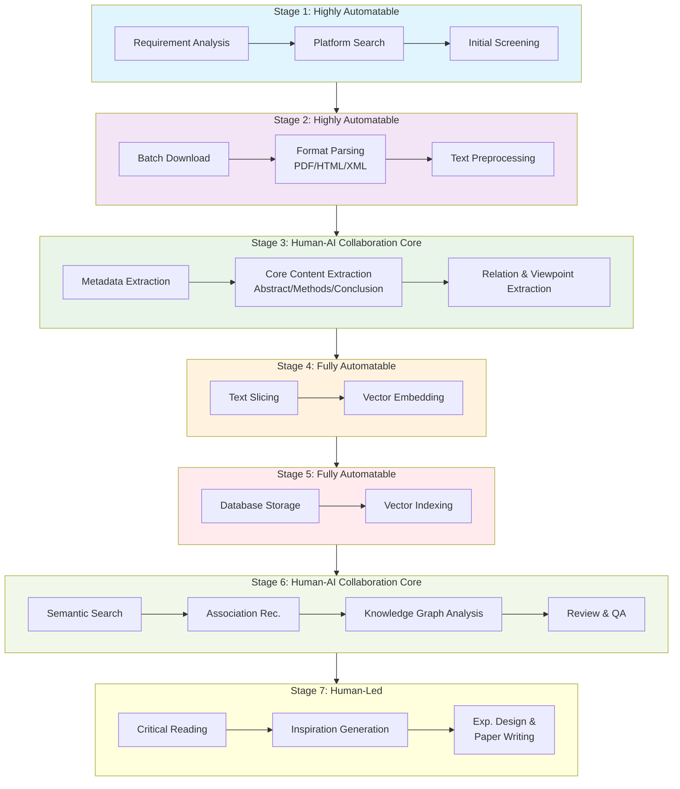

# pyPaperFlow - An Automatic Paper Reading Platform

  
 [](http://makeapullrequest.com) 


[English](README.md) | [Chinese/中文](README_zh.md)

An automated literature processing platform for scientific researchers. This tool focuses on information extraction and knowledge discovery stages, enabling researchers to efficiently complete the entire workflow from literature retrieval to knowledge internalization through a 7-stage automated process.

**Core Objectives**

- **Rapid Domain Entry**: Batch retrieve and access all available literature in a specific field
- **Batch Knowledge Extraction**: Utilize AI long-text processing capabilities to extract structured knowledge from massive amounts of text
- **Research Trend Tracking**: Quickly grasp the latest research methods, conclusions, and core papers in a field

**Positioning**

This tool is designed to complement rather than replace reference management software like Zotero. We focus on the two key steps of "Information Extraction" and "Knowledge Discovery" to build a structured knowledge base for you, laying the foundation for subsequent semantic search, association recommendation, and review generation.

**Current Implementation Scope**

Stages 1-2 and parts of Stages 4/5 (tagging system) have been implemented. Stages 3, 6, and 7 involve AI model selection, prompt strategies, and knowledge base refinement, which require user configuration based on specific needs.


## 🚀 Features

- **Automated Retrieval**: Search and fetch paper metadata from PubMed/Medline, arXiv, and bioRxiv.
- **Full-Text Access**: Automatically download open-access full text (XML/Text) from PMC.
- **Structured Storage**:
  - **Metadata**: Stored as detailed JSON files.
  - **Full Text**: Saved in multiple formats (XML, parsed JSON, Markdown) for flexible use.
- **CLI Tool**: A user-friendly command-line interface (`pyPaperFlow`) for all operations.

## 🏗️ Architecture Vision

The project is designed around a 7-stage workflow:


```mermaid
flowchart TD
    A[Retrieval &<br>Collection] --> B[Processing &<br>Parsing]
    B --> C[Structured<br>Extraction]
    C --> D[Deep Encoding &<br>Vectorization]
    D --> E[Dynamic Knowledge<br>Base Storage]
    E --> F[Intelligent Interaction &<br>Discovery]
    F --> G[Final Output &<br>Internalization]

    style A fill:#e1f5fe
    style B fill:#f3e5f5
    style C fill:#e8f5e8
    style D fill:#fff3e0
    style E fill:#ffebee
    style F fill:#f1f8e9
    
    subgraph A [Stage 1: Highly Automatable]
        direction LR
        A1[Requirement Analysis] --> A2[Platform Search]
        A2 --> A3[Initial Screening]
    end

    subgraph B [Stage 2: Highly Automatable]
        direction LR
        B1[Batch Download] --> B2[Format Parsing<br>PDF/HTML/XML]
        B2 --> B3[Text Preprocessing]
    end

    subgraph C [Stage 3: Human-AI Collaboration Core]
        direction LR
        C1[Metadata Extraction] --> C2[Core Content Extraction<br>Abstract/Methods/Conclusion]
        C2 --> C3[Relation & Viewpoint Extraction]
    end

    subgraph D [Stage 4: Fully Automatable]
        direction LR
        D1[Text Slicing] --> D2[Vector Embedding]
    end

    subgraph E [Stage 5: Fully Automatable]
        direction LR
        E1[Database Storage] --> E2[Vector Indexing]
    end

    subgraph F [Stage 6: Human-AI Collaboration Core]
        direction LR
        F1[Semantic Search] --> F2[Association Rec.] --> F3[Knowledge Graph Analysis] --> F4[Review & QA]
    end

    subgraph G [Stage 7: Human-Led]
        direction LR
        G1[Critical Reading] --> G2[Inspiration Generation] --> G3[Exp. Design &<br>Paper Writing]
    end
```

### Stage Analysis & Design Philosophy

#### Stage 1: Retrieval & Collection
The starting point of the entire workflow.
- **Manual Process**: Manually entering keywords on platforms like PubMed or Google Scholar, browsing results, and saving them.
- **Automation Entry Points**:
    - **Intelligent Retrieval Agent**: Scripts using APIs or crawlers to perform periodic automated searches based on preset keywords, journal lists, or scholar tracking.
    - **Initial Screening Algorithms**: Rule-based filtering (e.g., title terms, impact factor, date range) to sort and filter results.

#### Stage 2: Processing & Parsing
Converting raw files into computer-processable plain text and metadata.
- **Automation Entry Points**:
    - **Unified Parser**: Using tools (e.g., pdfplumber, GROBID) to extract text and charts from PDFs with high precision.
    - **Metadata Enhancement**: Automatically completing full bibliographic metadata (Title, Author, DOI, etc.) and ensuring format uniformity.

#### Stage 3: Core Information Structured Extraction
The critical leap from "Text" to "Information".
- **Automation Entry Points** (Human-AI Collaboration Core):
    - **Structured Information Extraction**: Using LLMs to act as domain experts, extracting information into fixed schemas (e.g., Problem Statement, Core Methods, Key Data, Conclusions).
    - **Relation & Viewpoint Extraction**: Identifying citation intent (support/refute) and distilling core arguments.

#### Stage 4: Deep Encoding & Vectorization
Establishing mathematical representations for information.
- **Automation Entry Points**:
    - **Text Embedding**: Using Transformer models to generate high-dimensional vectors (Embeddings) for literature.
    - **Vector Storage**: Storing vectors in specialized databases (e.g., ChromaDB, Pinecone) to enable semantic retrieval.

#### Stage 5: Dynamic Knowledge Base Storage & Indexing
The "Memory" of the system.
- **Automation Entry Points**:
    - **Multi-modal Database**: A dual-storage system combining relational databases (for structured info) and vector databases (for embeddings).
    - **Automated Indexing & Association**: Automatically establishing potential links between papers (co-citation analysis, method similarity) to build the initial edges of a knowledge graph.

#### Stage 6: Intelligent Interaction & Knowledge Discovery
Active exploration using the built knowledge base.
- **Automation Entry Points** (Human-AI Collaboration Core):
    - **Semantic Search Engine**: "Ask instead of Search" - understanding query semantics to return relevant passages.
    - **Association Recommendation & Visualization**: Recommending papers based on content similarity and visualizing the academic landscape.
    - **Intelligent QA & Review Generation**: Generating structured mini-reviews based on all literature in the database.

#### Stage 7: Final Output & Internalization
Human-led, with AI as an augmentation tool.
- **Automation Entry Points**:
    - **Assisted Writing & Citation**: Real-time recommendation of relevant citations and formatting during writing.
    - **Viewpoint Collision & Inspiration**: Presenting methodological conflicts or cross-domain associations to stimulate critical thinking.

*Currently, Stages 1, 2, and parts of 4/5 (Lite version via Tagging) are implemented.*

## 📦 Installation

```bash
git clone https://github.com/MaybeBio/pyPaperFlow.git
cd pyPaperFlow
pip install -e .
```

## 🛠️ Usage

The platform provides a CLI tool named `paperflow`.

### 1. Search PubMed
Search for papers and get a list of PMIDs.

```bash
paperflow search "COVID-19 vaccine" --retmax 5
```

### 2. Fetch Papers
Fetch metadata for papers and save them to your local storage.

**By Query:**
```bash
paperflow fetch --query "COVID-19 vaccine" --batch-size 10
```

**By PMID List:**
Create a file `pmids.txt` with one PMID per line, then run:
```bash
paperflow fetch --file pmids.txt
```

### 3. Download Full Text
Download PMC full text for fetched papers (if available).

```bash
paperflow download-fulltext --pmid 34320283
```

### 4. Search and Fetch arXiv Papers
Search arXiv first if you only want IDs, or fetch metadata and PDFs in one step.

```bash
paperflow arxiv-search "deep learning for biology" --max-results 10
paperflow arxiv-fetch "deep learning for biology" --max-results 10 --download-pdf
paperflow arxiv-fetch "deep learning for biology" --max-results 10 --download-pdf --backend paperscraper
```

Useful options:

- `--start-date` and `--end-date`: limit results to a date window in `YYYY-MM-DD` format.
- `--backend`: choose `native` for the built-in httpx-backed arXiv API path, or `paperscraper` to use the optional third-party adapter when installed.
- `--output-dir`: save the ID list or fetched records to a different directory.
- `--no-download-pdf`: skip PDF download and save metadata only.

Example with a date filter:

```bash
paperflow arxiv-fetch "protein folding" --start-date 2024-01-01 --end-date 2024-12-31 -o ./papers/arxiv
```

Search output is saved as `searched_arxiv_ids.txt`. Fetched records are stored under `source/year/source_id/` with JSON metadata and, when available, a PDF copy.

### 5. Search and Fetch bioRxiv Papers
bioRxiv now uses direct server-side query via Crossref (openRxiv records), rather than pulling large date windows first and filtering locally.

```bash
paperflow biorxiv-search "AlphaFold AND structure" --max-results 10
paperflow biorxiv-fetch "AlphaFold AND structure" --start-date 2026-01-01 --end-date 2026-01-31 --download-pdf
```

Useful options:

- `--start-date` and `--end-date`: limit results to a date window in `YYYY-MM-DD` format.
- `--output-dir`: save the ID list or fetched records to a different directory.
- `--no-download-pdf`: skip PDF download and save metadata only.

Compatibility note:

- `--window-days` is kept for CLI compatibility but is not used by the current Crossref-backed bioRxiv search path.

Example:

```bash
paperflow biorxiv-fetch "protein interaction" --max-results 50 -o ./papers/biorxiv
```

Search output is saved as `searched_biorxiv_ids.txt`. Fetched records are stored under `source/year/source_id/` with JSON metadata and, when available, a PDF copy.


## 📂 Data Structure

The platform uses a "Lite" storage approach:

-   **`paper_data/paper_lookup.csv`**: A lookup table acting as a local database.
    -   Rows: PMIDs.
    -   Columns: `json_path`, and dynamic tags (e.g., `relevant`, `topic_A`).
-   **`paper_data/papers/{pmid}.json`**: Detailed metadata and content for each paper.

We will store all datas in structures like:

output dir/year/pmid/your files


## 📝 Notes on Medline Format

The fetcher parses Medline format to extract rich metadata including:
-   **PMID**: PubMed ID
-   **DP**: Date of Publication
-   **TI**: Title
-   **AB**: Abstract
-   **FAU/AU**: Authors
-   **AD**: Affiliations
-   **PT**: Publication Type (e.g., Journal Article, Review)

## 🔗 References & Inspiration

-   [PubMed Research Extractor](https://github.com/Proveer/pubmed-research-extractor)
-   [BioLitMiner](https://github.com/akshayoo/BioLitMiner)


## search/fetch/download/full

search是搜索id
fetch是获取元数据
download是获取文本数据（pdf解析为md，或直接拿到md数据）
full是 元数据+文本数据一起获取

## Test Cases

### 🧬 Case 1: Get PMIDs from Query

run the command:
```bash
paperflow pubmed-search "alphafold3 AND conformation AND ensemble" --email YOUR_EMAIL --api-key YOUR_NCBI_API_KEY -o ./test
```
the log shows:
```bash
✅ NCBI API Key set successfully. Rate limit increased to 10 req/s.
Now searching PubMed with query [alphafold3 AND conformation AND ensemble] at [2026-05-02 17:03:20] ...
found 19 related articles about [alphafold3 AND conformation AND ensemble] at [2026-05-02 17:03:22] ...
Retrieving 19 PMIDs from history server at [2026-05-02 17:03:22] ...
Fetching PMIDs 1 to 19 at [2026-05-02 17:03:22] ...
  -> Retrieved 19 PMIDs in this batch.
Total PMIDs retrieved: 19 out of 19 at [2026-05-02 17:03:23] ...
Found 19 PMIDs.
['41914502', '41779774', '41639320', '41502950', '41478913', '41432299', '41249430', '41147497', '41047853', '41014267', '40950168', '40938899', '40714407', '40549150', '40490178', '39574676', '39186607', '38996889', '38995731']
PMIDs saved to ./test/pubmed_searched_ids_2026-05-02_17-03-23.txt.
```
As you can see, we will print the PMIDs list for you and save it in a text file which can be used further.

⚠️ We also recommend using the `Search & Save plugin` on the PubMed webpage to obtain the PMID list for subsequent use.


### 🧬 Case 2: Fetch Metadata for pubmed papers from query or PMIDs list

If you do not have detailed PMID list and want to fetch meta information from query, run the command:
```bash
paperflow pubmed-meta -q "alphafold3 AND conformation AND ensemble" --email YOUR_EMAIL --api-key YOUR_NCBI_API_KEY -o ./test/alphafold3_ensemble_meta
```

the log shows:
```bash
✅ NCBI API Key set successfully. Rate limit increased to 10 req/s.
Fetching papers for query: alphafold3 AND conformation AND ensemble
Now searching PubMed with query [alphafold3 AND conformation AND ensemble] at [2026-05-02 17:07:55] ...
found 19 related articles about [alphafold3 AND conformation AND ensemble] at [2026-05-02 17:07:56] ...
Fetching articles 1 to 19 at [2026-05-02 17:07:56] ...
  -> Retrieved 19 Medline records and 19 Xml articles. Please check whether they equal and the efetch number here with esearch count.
  -> Deep mining 5 types of internal connections for 19 PMIDs at [2026-05-02 17:07:59] ...
     Fetching pubmed_pubmed_refs from pubmed for 19 PMIDs at [2026-05-02 17:07:59] ...
     Fetching pubmed_pubmed from pubmed for 19 PMIDs at [2026-05-02 17:08:02] ...
     Fetching pubmed_pubmed_reviews from pubmed for 19 PMIDs at [2026-05-02 17:08:05] ...
     Fetching pubmed_pmc from pmc for 19 PMIDs at [2026-05-02 17:08:08] ...
     Fetching pubmed_pubmed_citedin from pubmed for 19 PMIDs at [2026-05-02 17:08:12] ...
  -> Fetching external LinkOuts (Datasets, Full Text, etc.) for 19 PMIDs at [2026-05-02 17:08:15] ...
  -> Saved 41914502 metadata to ./test/alphafold3_ensemble_meta/pubmed/2026/41914502/41914502_meta.json
  -> Saved 41779774 metadata to ./test/alphafold3_ensemble_meta/pubmed/2026/41779774/41779774_meta.json
  -> Saved 41639320 metadata to ./test/alphafold3_ensemble_meta/pubmed/2026/41639320/41639320_meta.json
  -> Saved 41502950 metadata to ./test/alphafold3_ensemble_meta/pubmed/2026/41502950/41502950_meta.json
  -> Saved 41478913 metadata to ./test/alphafold3_ensemble_meta/pubmed/2026/41478913/41478913_meta.json
  -> Saved 41432299 metadata to ./test/alphafold3_ensemble_meta/pubmed/2026/41432299/41432299_meta.json
  -> Saved 41249430 metadata to ./test/alphafold3_ensemble_meta/pubmed/2025/41249430/41249430_meta.json
  -> Saved 41147497 metadata to ./test/alphafold3_ensemble_meta/pubmed/2026/41147497/41147497_meta.json
  -> Saved 41047853 metadata to ./test/alphafold3_ensemble_meta/pubmed/2026/41047853/41047853_meta.json
  -> Saved 41014267 metadata to ./test/alphafold3_ensemble_meta/pubmed/2026/41014267/41014267_meta.json
  -> Saved 40950168 metadata to ./test/alphafold3_ensemble_meta/pubmed/2025/40950168/40950168_meta.json
  -> Saved 40938899 metadata to ./test/alphafold3_ensemble_meta/pubmed/2025/40938899/40938899_meta.json
  -> Saved 40714407 metadata to ./test/alphafold3_ensemble_meta/pubmed/2025/40714407/40714407_meta.json
  -> Saved 40549150 metadata to ./test/alphafold3_ensemble_meta/pubmed/2025/40549150/40549150_meta.json
  -> Saved 40490178 metadata to ./test/alphafold3_ensemble_meta/pubmed/2025/40490178/40490178_meta.json
  -> Saved 39574676 metadata to ./test/alphafold3_ensemble_meta/pubmed/2024/39574676/39574676_meta.json
  -> Saved 39186607 metadata to ./test/alphafold3_ensemble_meta/pubmed/2024/39186607/39186607_meta.json
  -> Saved 38996889 metadata to ./test/alphafold3_ensemble_meta/pubmed/2024/38996889/38996889_meta.json
  -> Saved 38995731 metadata to ./test/alphafold3_ensemble_meta/pubmed/2024/38995731/38995731_meta.json
```

you can check the result here: [alphafold3_ensemble_meta](./test/alphafold3_ensemble_meta/)

As shown above, a `/pubmed` subfolder will be automatically created under your output directory, with all metadata JSON files saved inside this folder.

Otherwise, if you have detailed PMID list,
run the command below:
```bash
# here we use search list in case1 as an example
paperflow pubmed-meta -f ./test/pubmed_searched_ids_2026-05-02_17-03-23.txt  --email YOUR_EMAIL --api-key YOUR_NCBI_API_KEY -o ./test/alphafold3_ensemble_meta_try2
```

the log shows the same way:

```bash
✅ NCBI API Key set successfully. Rate limit increased to 10 req/s.
Fetching 19 papers from file /data2/pyPaperFlow/test/pubmed_searched_ids_2026-05-02_17-03-23.txt.
Total PMIDs to fetch: 19 at [2026-05-02 17:14:40] ...
Fetching articles 1 to 19 (PMID: ['41914502', '41779774', '41639320', '41502950', '41478913', '41432299', '41249430', '41147497', '41047853', '41014267', '40950168', '40938899', '40714407', '40549150', '40490178', '39574676', '39186607', '38996889', '38995731']) at [2026-05-02 17:14:40] ...
  -> Retrieved 19 Medline records and 19 Xml articles. Please check whether they equal and whether they match the number of this batch.
  -> Deep mining 5 types of internal connections for 19 PMIDs at [2026-05-02 17:14:43] ...
     Fetching pubmed_pmc from pmc for 19 PMIDs at [2026-05-02 17:14:43] ...
     Fetching pubmed_pubmed_citedin from pubmed for 19 PMIDs at [2026-05-02 17:14:46] ...
     Fetching pubmed_pubmed_refs from pubmed for 19 PMIDs at [2026-05-02 17:14:49] ...
     Fetching pubmed_pubmed_reviews from pubmed for 19 PMIDs at [2026-05-02 17:14:53] ...
     Fetching pubmed_pubmed from pubmed for 19 PMIDs at [2026-05-02 17:14:57] ...
  -> Fetching external LinkOuts (Datasets, Full Text, etc.) for 19 PMIDs at [2026-05-02 17:15:01] ...
  -> Saved 41914502 metadata to ./test/alphafold3_ensemble_meta_try2/pubmed/2026/41914502/41914502_meta.json
  -> Saved 41779774 metadata to ./test/alphafold3_ensemble_meta_try2/pubmed/2026/41779774/41779774_meta.json
  -> Saved 41639320 metadata to ./test/alphafold3_ensemble_meta_try2/pubmed/2026/41639320/41639320_meta.json
  -> Saved 41502950 metadata to ./test/alphafold3_ensemble_meta_try2/pubmed/2026/41502950/41502950_meta.json
  -> Saved 41478913 metadata to ./test/alphafold3_ensemble_meta_try2/pubmed/2026/41478913/41478913_meta.json
  -> Saved 41432299 metadata to ./test/alphafold3_ensemble_meta_try2/pubmed/2026/41432299/41432299_meta.json
  -> Saved 41249430 metadata to ./test/alphafold3_ensemble_meta_try2/pubmed/2025/41249430/41249430_meta.json
  -> Saved 41147497 metadata to ./test/alphafold3_ensemble_meta_try2/pubmed/2026/41147497/41147497_meta.json
  -> Saved 41047853 metadata to ./test/alphafold3_ensemble_meta_try2/pubmed/2026/41047853/41047853_meta.json
  -> Saved 41014267 metadata to ./test/alphafold3_ensemble_meta_try2/pubmed/2026/41014267/41014267_meta.json
  -> Saved 40950168 metadata to ./test/alphafold3_ensemble_meta_try2/pubmed/2025/40950168/40950168_meta.json
  -> Saved 40938899 metadata to ./test/alphafold3_ensemble_meta_try2/pubmed/2025/40938899/40938899_meta.json
  -> Saved 40714407 metadata to ./test/alphafold3_ensemble_meta_try2/pubmed/2025/40714407/40714407_meta.json
  -> Saved 40549150 metadata to ./test/alphafold3_ensemble_meta_try2/pubmed/2025/40549150/40549150_meta.json
  -> Saved 40490178 metadata to ./test/alphafold3_ensemble_meta_try2/pubmed/2025/40490178/40490178_meta.json
  -> Saved 39574676 metadata to ./test/alphafold3_ensemble_meta_try2/pubmed/2024/39574676/39574676_meta.json
  -> Saved 39186607 metadata to ./test/alphafold3_ensemble_meta_try2/pubmed/2024/39186607/39186607_meta.json
  -> Saved 38996889 metadata to ./test/alphafold3_ensemble_meta_try2/pubmed/2024/38996889/38996889_meta.json
  -> Saved 38995731 metadata to ./test/alphafold3_ensemble_meta_try2/pubmed/2024/38995731/38995731_meta.json
```

We store the meta data of the paper in a json file.
 
One example [PMID 41249430](./test/alphafold3_ensemble_meta/pubmed/2025/41249430/41249430_meta.json) listed as below:

```python
{
    "content": {
        "abstract": "AlphaFold2 and AlphaFold3 have revolutionized protein structure prediction by enabling high-accuracy structure predictions for most single-chain proteins. However, obtaining high-quality predictions for difficult targets with shallow or noisy multiple sequence alignments and complicated multi-domain architectures remains challenging. We present MULTICOM4, an integrative structure prediction system that uses diverse MSA generation, large-scale model sampling, and an ensemble model quality assessment strategy to improve model generation and ranking of AlphaFold2 and AlphaFold3. In the 16th Critical Assessment of Techniques for Protein Structure Prediction, our predictors built on MULTICOM4 ranked among the top out of 120 predictors in tertiary structure prediction and outperformed a standard AlphaFold3 predictor. Our best predictor achieved an average TM-score of 0.902 for 84 CASP16 domains, with top-1 predictions reaching high accuracy (TM-score>0.9) for 73.8% and correct folds (TM-score>0.5) for 97.6% of domains. For best-of-top-5 predictions, all domains were correctly folded. The results show that MSA engineering using different sequence databases, alignment tools, and domain segmentation along with extensive model sampling is critical to generate accurate structural models. Combining complementary QA methods with model clustering further improves ranking reliability. These advances provide practical strategies for modeling difficult single-chain proteins in structural biology and drug discovery.",
        "keywords": [],
        "mesh_terms": [
            "*Computational Biology/methods",
            "Protein Folding",
            "Models, Molecular",
            "*Protein Structure, Tertiary",
            "*Proteins/chemistry",
            "Sequence Alignment/methods",
            "*Software",
            "Sequence Analysis, Protein/methods",
            "Algorithms"
        ],
        "pub_types": [
            "Journal Article"
        ]
    },
    "contributors": {
        "medline": {
            "affiliations": [
                "Department of Electrical Engineering & Computer Science, University of Missouri, Columbia, MO, USA.",
                "NextGen Precision Health, University of Missouri, Columbia, MO, USA.",
                "Department of Electrical Engineering & Computer Science, University of Missouri, Columbia, MO, USA.",
                "NextGen Precision Health, University of Missouri, Columbia, MO, USA.",
                "Department of Electrical Engineering & Computer Science, University of Missouri, Columbia, MO, USA. chengji@missouri.edu.",
                "NextGen Precision Health, University of Missouri, Columbia, MO, USA. chengji@missouri.edu."
            ],
            "auids": [
                "ORCID: 0000-0003-0305-2853"
            ],
            "full_names": [
                "Liu, Jian",
                "Neupane, Pawan",
                "Cheng, Jianlin"
            ],
            "short_names": [
                "Liu J",
                "Neupane P",
                "Cheng J"
            ]
        },
        "xml": [
            {
                "affiliations": [
                    "Department of Electrical Engineering & Computer Science, University of Missouri, Columbia, MO, USA.",
                    "NextGen Precision Health, University of Missouri, Columbia, MO, USA."
                ],
                "full_name": "Liu, Jian",
                "identifiers": [],
                "short_name": "Liu J"
            },
            {
                "affiliations": [
                    "Department of Electrical Engineering & Computer Science, University of Missouri, Columbia, MO, USA.",
                    "NextGen Precision Health, University of Missouri, Columbia, MO, USA."
                ],
                "full_name": "Neupane, Pawan",
                "identifiers": [],
                "short_name": "Neupane P"
            },
            {
                "affiliations": [
                    "Department of Electrical Engineering & Computer Science, University of Missouri, Columbia, MO, USA. chengji@missouri.edu.",
                    "NextGen Precision Health, University of Missouri, Columbia, MO, USA. chengji@missouri.edu."
                ],
                "full_name": "Cheng, Jianlin",
                "identifiers": [
                    "0000-0003-0305-2853"
                ],
                "short_name": "Cheng J"
            }
        ]
    },
    "identity": {
        "doi": "10.1038/s42003-025-08960-6",
        "pmid": "41249430",
        "title": "Boosting AlphaFold protein tertiary structure prediction through MSA engineering and extensive model sampling and ranking in CASP16."
    },
    "links": {
        "cites": [
            "41178755",
            "40672254"
        ],
        "entrez": {},
        "external": [
            {
                "attribute": "free resource",
                "category": "Full Text Sources",
                "linkname": "",
                "provider": "Nature Publishing Group",
                "url": "https://doi.org/10.1038/s42003-025-08960-6"
            },
            {
                "attribute": "free resource",
                "category": "Full Text Sources",
                "linkname": "",
                "provider": "PubMed Central",
                "url": "https://pmc.ncbi.nlm.nih.gov/articles/pmid/41249430/"
            },
            {
                "attribute": "free resource",
                "category": "Research Materials",
                "linkname": "",
                "provider": "NCI CPTC Antibody Characterization Program",
                "url": "https://antibodies.cancer.gov/detail/CPTC-TOP1-1"
            }
        ],
        "pmc": [
            "12623963"
        ],
        "refs": [
            "40799498",
            "40452318",
            "39123049",
            "38718835",
            "38167654",
            "37949999",
            "37679431",
            "36927031",
            "36734597",
            "34873061",
            "34453465",
            "34291486",
            "34282049",
            "34265844",
            "31942072",
            "31696235",
            "31676016",
            "31399549",
            "31235882",
            "30395287",
            "29959318",
            "29228193",
            "29228185",
            "27899574",
            "25391399",
            "24225321",
            "23047561",
            "22198341",
            "20718988",
            "18542861",
            "11159328"
        ],
        "review": [
            "41249430",
            "38316555",
            "38986287",
            "40973394",
            "39970826",
            "40332289"
        ],
        "similar": [
            "41249430",
            "40661500",
            "40585263",
            "40452318",
            "40161604",
            "41170922",
            "41014267",
            "40820259",
            "40851426",
            "40501681",
            "40762404",
            "41147497",
            "40751131",
            "37650367",
            "19077267",
            "40847537",
            "17553833",
            "40874652",
            "40799498",
            "41104652",
            "34599769",
            "37949999",
            "34382712",
            "26369671",
            "40502139",
            "38316555",
            "34331351",
            "31344267",
            "19701941",
            "41313605",
            "20066664",
            "19777061",
            "34240477",
            "34162922",
            "30985027",
            "28093407",
            "38986287",
            "24637808",
            "41165252",
            "40950168",
            "14579329",
            "34455641",
            "37293073",
            "37679431",
            "40195868",
            "19722267",
            "40810260",
            "40488225",
            "25431331",
            "28748648",
            "41047853",
            "37565699",
            "18452616",
            "34291486",
            "18487301",
            "16187361",
            "26445311",
            "41201924",
            "16187348",
            "18215316",
            "37321965",
            "41257887",
            "24018415",
            "34884640",
            "41081541",
            "35034173",
            "39052676",
            "29082551",
            "17452345",
            "22069035",
            "41454828",
            "41325379",
            "40778521",
            "31365149",
            "31471916",
            "40973394",
            "39970826",
            "15359422",
            "27028541",
            "17570145",
            "14579328",
            "29139163",
            "22168237",
            "40332289",
            "21301031",
            "23812990",
            "40696837",
            "33850214",
            "26713437",
            "41045049",
            "26343917",
            "38913900",
            "31918654",
            "40067116",
            "20470364",
            "15939584",
            "22545707",
            "17680686",
            "41261173",
            "31634369"
        ],
        "text_mined": []
    },
    "metadata": {
        "entrez_date": "2025/11/18 00:28",
        "fetched_at": "2026-05-02 15:17:48"
    },
    "source": {
        "journal_abbrev": [
            "Commun Biol"
        ],
        "journal_title": [
            "Communications biology"
        ],
        "pub_date": "2025 Nov 17",
        "pub_types": [
            "Journal Article"
        ],
        "pub_year": "2025"
    }
}

```


### 🧬 Case 3: Fetch full text data for pubmed papers from PMIDs list

If you only need to fetch the full text from PMIDs — where the `full text refers to the main body of a paper` (the complete textual content equivalent to that parsed from PDF files) — you can simply run
```bash
# we choose pmid 39570595 here as an example
paperflow pubmed-content -p 39570595  --email YOUR_EMAIL --api-key YOUR_NCBI_API_KEY -o ./test/full_text
```

the log shows
```bash
✅ NCBI API Key set successfully. Rate limit increased to 10 req/s.
Downloading full texts for 1 PMIDs from file provided PMIDs.
Fetching full text for 1 Pubmed articles at [2026-05-02 17:25:41] ...
 -> Converting Pubmed articles 1 to 1 (PMID : ['39570595']) to PMC IDs at [2026-05-02 17:25:41] ...
  -> Mapped 1 out of 1 PMIDs to valid PMC IDs. Downloading full text XML for these PMC IDs at [2026-05-02 17:25:42] ...
  -> Saved XML to ./test/full_text/pubmed/2024/39570595/39570595_content.xml
  -> Saved parsed JSON to ./test/full_text/pubmed/2024/39570595/39570595_content.json
  -> Saved parsed text to ./test/full_text/pubmed/2024/39570595/39570595_content.md
```

As you can see, for full-text data, we handle it differently from metadata—while metadata is simply stored in a JSON file named `{PMID}_meta.json`, full-text data is output into three files with distinct formats, each serving a specific purpose:
* **{PMID}_content.xml**: Stores the raw XML content retrieved directly from the response, preserving the original data structure.
* **{PMID}_content.json**: Contains detailed, structured full-text content. This format allows for direct extraction of specific sections (e.g., introduction, results, discussion), making it ideal for quick exploration or targeted analysis of particular parts of the text.
* **{PMID}_content.md**: Saves the full text of the paper in Markdown format. Its clean, human-readable structure makes it well-suited for high-throughput summarization tasks using LLMs/AI tools (such as ChatGPT or other preferred models).

`Core Principle: JSON for coding, Markdown for LLM prompting.`


or you can batch download what you want 
```bash
# we use searched_pmids.txt generated by Case1
paperflow download-fulltext  -f ./test/pubmed_searched_ids_2026-05-02_17-03-23.txt  --email YOUR_EMAIL --api-key YOUR_NCBI_API_KEY -o ./test/alphafold_ensemble_content_try3
```

the log shows 
```bash
✅ NCBI API Key set successfully. Rate limit increased to 10 req/s.
Downloading full texts for 19 PMIDs from file /data2/pyPaperFlow/test/pubmed_searched_ids_2026-05-02_17-03-23.txt.
Fetching full text for 19 Pubmed articles at [2026-05-02 18:09:34] ...
 -> Converting Pubmed articles 1 to 19 (PMID : ['41914502', '41779774', '41639320', '41502950', '41478913', '41432299', '41249430', '41147497', '41047853', '41014267', '40950168', '40938899', '40714407', '40549150', '40490178', '39574676', '39186607', '38996889', '38995731']) to PMC IDs at [2026-05-02 18:09:34] ...
  -> Mapped 10 out of 19 PMIDs to valid PMC IDs. Downloading full text XML for these PMC IDs at [2026-05-02 18:09:36] ...
  -> Saved XML to ./test/alphafold_ensemble_content_try3/pubmed/2025/40950168/40950168_content.xml
  -> Saved parsed JSON to ./test/alphafold_ensemble_content_try3/pubmed/2025/40950168/40950168_content.json
  -> Saved parsed text to ./test/alphafold_ensemble_content_try3/pubmed/2025/40950168/40950168_content.md
  -> Saved XML to ./test/alphafold_ensemble_content_try3/pubmed/2026/41914502/41914502_content.xml
  -> Saved parsed JSON to ./test/alphafold_ensemble_content_try3/pubmed/2026/41914502/41914502_content.json
  -> Saved parsed text to ./test/alphafold_ensemble_content_try3/pubmed/2026/41914502/41914502_content.md
  -> Saved XML to ./test/alphafold_ensemble_content_try3/pubmed/2025/41432299/41432299_content.xml
  -> Saved parsed JSON to ./test/alphafold_ensemble_content_try3/pubmed/2025/41432299/41432299_content.json
  -> Saved parsed text to ./test/alphafold_ensemble_content_try3/pubmed/2025/41432299/41432299_content.md
  -> Saved XML to ./test/alphafold_ensemble_content_try3/pubmed/2025/40549150/40549150_content.xml
  -> Saved parsed JSON to ./test/alphafold_ensemble_content_try3/pubmed/2025/40549150/40549150_content.json
  -> Saved parsed text to ./test/alphafold_ensemble_content_try3/pubmed/2025/40549150/40549150_content.md
  -> Saved XML to ./test/alphafold_ensemble_content_try3/pubmed/2026/41147497/41147497_content.xml
  -> Saved parsed JSON to ./test/alphafold_ensemble_content_try3/pubmed/2026/41147497/41147497_content.json
  -> Saved parsed text to ./test/alphafold_ensemble_content_try3/pubmed/2026/41147497/41147497_content.md
  -> Saved XML to ./test/alphafold_ensemble_content_try3/pubmed/2024/39574676/39574676_content.xml
  -> Saved parsed JSON to ./test/alphafold_ensemble_content_try3/pubmed/2024/39574676/39574676_content.json
  -> Saved parsed text to ./test/alphafold_ensemble_content_try3/pubmed/2024/39574676/39574676_content.md
  -> Saved XML to ./test/alphafold_ensemble_content_try3/pubmed/2025/41249430/41249430_content.xml
  -> Saved parsed JSON to ./test/alphafold_ensemble_content_try3/pubmed/2025/41249430/41249430_content.json
  -> Saved parsed text to ./test/alphafold_ensemble_content_try3/pubmed/2025/41249430/41249430_content.md
  -> Saved XML to ./test/alphafold_ensemble_content_try3/pubmed/2024/38995731/38995731_content.xml
  -> Saved parsed JSON to ./test/alphafold_ensemble_content_try3/pubmed/2024/38995731/38995731_content.json
  -> Saved parsed text to ./test/alphafold_ensemble_content_try3/pubmed/2024/38995731/38995731_content.md
  -> Saved XML to ./test/alphafold_ensemble_content_try3/pubmed/2025/40938899/40938899_content.xml
  -> Saved parsed JSON to ./test/alphafold_ensemble_content_try3/pubmed/2025/40938899/40938899_content.json
  -> Saved parsed text to ./test/alphafold_ensemble_content_try3/pubmed/2025/40938899/40938899_content.md
  -> Saved XML to ./test/alphafold_ensemble_content_try3/pubmed/2026/41502950/41502950_content.xml
  -> Saved parsed JSON to ./test/alphafold_ensemble_content_try3/pubmed/2026/41502950/41502950_content.json
  -> Saved parsed text to ./test/alphafold_ensemble_content_try3/pubmed/2026/41502950/41502950_content.md

```
as you can imagine, not all pmids have a validated pmc id, you can try other tools for free full text extraction. 


### 🧬 Case 4: Fetch full paper data (including metadata and full text data) for pubmed papers from PMIDs list

Now if you want to get everything of papers you want, not just metadata or full text but BOTH!

You can simply run 
```bash
# from query 
paperflow pubmed-all --query "IDR AND interaction AND deep learning" --email YOUR_EMAIL --api-key YOUR_NCBI_API_KEY -o ./test/full_paper_test

# from PMID list, same as above
```

for query subcommand, the log shows 
```bash
✅ NCBI API Key set successfully. Rate limit increased to 10 req/s.
=== Step 1: Fetching Metadata ===
Now searching PubMed with query [IDR AND interaction AND deep learning] at [2026-05-02 18:19:06] ...
found 6 related articles about [IDR AND interaction AND deep learning] at [2026-05-02 18:19:07] ...
Fetching articles 1 to 6 at [2026-05-02 18:19:07] ...
  -> Retrieved 6 Medline records and 6 Xml articles. Please check whether they equal and the efetch number here with esearch count.
  -> Deep mining 5 types of internal connections for 6 PMIDs at [2026-05-02 18:19:10] ...
     Fetching pubmed_pubmed from pubmed for 6 PMIDs at [2026-05-02 18:19:10] ...
     Fetching pubmed_pubmed_reviews from pubmed for 6 PMIDs at [2026-05-02 18:19:12] ...
     Fetching pubmed_pmc from pmc for 6 PMIDs at [2026-05-02 18:19:14] ...
     Fetching pubmed_pubmed_refs from pubmed for 6 PMIDs at [2026-05-02 18:19:15] ...
     Fetching pubmed_pubmed_citedin from pubmed for 6 PMIDs at [2026-05-02 18:19:17] ...
  -> Fetching external LinkOuts (Datasets, Full Text, etc.) for 6 PMIDs at [2026-05-02 18:19:19] ...
  -> Saved 41534519 metadata to ./test/full_paper_test/pubmed/2026/41534519/41534519_meta.json
  -> Saved 41378882 metadata to ./test/full_paper_test/pubmed/2025/41378882/41378882_meta.json
  -> Saved 40286477 metadata to ./test/full_paper_test/pubmed/2025/40286477/40286477_meta.json
  -> Saved 39763873 metadata to ./test/full_paper_test/pubmed/2025/39763873/39763873_meta.json
  -> Saved 38701796 metadata to ./test/full_paper_test/pubmed/2024/38701796/38701796_meta.json
  -> Saved 36851914 metadata to ./test/full_paper_test/pubmed/2023/36851914/36851914_meta.json

=== Step 2: Fetching Full Text ===
Fetching full text for 6 Pubmed articles at [2026-05-02 18:19:22] ...
 -> Converting Pubmed articles 1 to 6 (PMID : ['41534519', '41378882', '40286477', '39763873', '38701796', '36851914']) to PMC IDs at [2026-05-02 18:19:22] ...
  -> Mapped 3 out of 6 PMIDs to valid PMC IDs. Downloading full text XML for these PMC IDs at [2026-05-02 18:19:24] ...
  -> Saved XML to ./test/full_paper_test/pubmed/2023/36851914/36851914_content.xml
  -> Saved parsed JSON to ./test/full_paper_test/pubmed/2023/36851914/36851914_content.json
  -> Saved parsed text to ./test/full_paper_test/pubmed/2023/36851914/36851914_content.md
  -> Saved XML to ./test/full_paper_test/pubmed/2025/41378882/41378882_content.xml
  -> Saved parsed JSON to ./test/full_paper_test/pubmed/2025/41378882/41378882_content.json
  -> Saved parsed text to ./test/full_paper_test/pubmed/2025/41378882/41378882_content.md
  -> Saved XML to ./test/full_paper_test/pubmed/2025/39763873/39763873_content.xml
  -> Saved parsed JSON to ./test/full_paper_test/pubmed/2025/39763873/39763873_content.json
  -> Saved parsed text to ./test/full_paper_test/pubmed/2025/39763873/39763873_content.md

=== Step 3: Processing and Saving Metadata ===
  -> Saved 41534519 metadata to ./test/full_paper_test/pubmed/2026/41534519/41534519_meta.json
  -> Extracted 2 URLs from full text for PMID 41378882
  -> Saved 41378882 metadata to ./test/full_paper_test/pubmed/2025/41378882/41378882_meta.json
  -> Saved 40286477 metadata to ./test/full_paper_test/pubmed/2025/40286477/40286477_meta.json
  -> Extracted 2 URLs from full text for PMID 39763873
  -> Saved 39763873 metadata to ./test/full_paper_test/pubmed/2025/39763873/39763873_meta.json
  -> Saved 38701796 metadata to ./test/full_paper_test/pubmed/2024/38701796/38701796_meta.json
  -> Extracted 29 URLs from full text for PMID 36851914
  -> Saved 36851914 metadata to ./test/full_paper_test/pubmed/2023/36851914/36851914_meta.json

```

As shown above, two types of files will be generated: `{PMID}_meta.*` and `{PMID}_content.*`.


#### 🧬 Case 5: Prepare batch Markdown-formatted paper data for downstream LLMs. 

Once you have retrieved all relevant papers(meta+content) on a specific topic or theme, the next step is to aggregate them into a unified collection.
In this step, we merge all papers with complete metadata and full content into a `paper-level JSON file` for consolidated summarization.
You may also extract designated sections of these papers—such as the abstract, discussion, and conclusion—and compile them into a well-structured Markdown file, which is fully compatible with `downstream LLM text-based parsing tasks`.

```bash
# paper directory from Case4 result
paperflow pubmed-merge-json -i /data2/pyPaperFlow/test/full_paper_test -o /data2/pyPaperFlow/test/full_paper_test --jsonl -s /data2/pyPaperFlow/test/full_paper_test
```
the log shows

```
✅ Please check the merged pubmed JSON/JSONL file at /data2/pyPaperFlow/test/full_paper_test and the merge statistics file at /data2/pyPaperFlow/test/full_paper_test. Also, a JSON file per paper is created within the PMID subfolders.
```

You can access the merged JSONL file [here](./test/full_paper_test/full_paper_test_2026-05-05_22-02-51.jsonl), where each line corresponds to one paper in JSON format. The statistical results are also available [here](./test/full_paper_test/full_paper_test_stats_2026-05-05_22-02-51.json).

In statistical JSON file, you can see PMID `"38701796","40286477","41534519"` paper is content-missing. 

For these papers, we provide a DOI-based PDF retrieval module, along with another module that parses PDF files into Markdown format, which is fully compatible with the aforementioned `{PMID}.json` files.

Additionally, each paper has a corresponding `{PMID}.json` file containing both metadata and full content information. 


## 📝 TODOs 

<details>
<summary><b>Stage 1: 检索与收集</b></summary>

> - [ ] 目前文献数据库仅仅只覆盖了pubmed, 对于其他预印本平台的文献数据库并不支持, 但是一个人写解析太麻烦了, 看到有一个非常棒的仓库, 可以借助其对于除了pubmed之外其他数据解析的部分，可以整个库都import进来, 作为整个依赖的一部分,就是可以完全独立, ——》声明是外部依赖库[paperscraper](https://github.com/jannisborn/paperscraper)

</details>


# 接下来要做的

pubmed完善好体系
biorxiv完善体系
arxiv完善体系
todo
参考其他文献库完善文献获取本身（https://github.com/RainerSeventeen/paper-tracker、https://github.com/Agents365-ai/paper-fetch/blob/main/README_CN.md）
构建skill补充的整个workflow（https://github.com/RainerSeventeen/paper-tracker/blob/main/docs/zh/source_arxiv_api_query.md）

# ⚠️ pubmed数据库部分完全是我一个人完成的，至于arxiv和biorxiv部分是合作的，请注意问题完善

**Case 5 — 快速示例：使用两阶段 PubMed 合并与导出**

示例演示如何使用新的两阶段 CLI：先合并为统一 JSON（或 JSONL），再根据 YAML 配置导出单一 Markdown 视图以供下游 AI 使用。

1) 合并为 JSON（或 JSONL）

        - 命令：
            `paperflow pubmed-merge-json ./Papers/pubmed ./out`

        - 说明：如果第二个参数是目录或不带扩展名的路径，程序会自动生成类似 `pubmed_2026-05-04_00-44-42.json` 的总文件名，同时在每篇文献所在目录下写入 `{PMID}.json`。

        - 写为 JSONL：
            `paperflow pubmed-merge-json ./Papers/pubmed ./out --jsonl`

        - 可选按 PMID 列表过滤：
            `paperflow pubmed-merge-json ./Papers/pubmed ./out --pmid-file pmids.txt`

2) 从合并的 JSON 导出 Markdown（可选使用 YAML 配置）

        - 简单导出：
            `paperflow pubmed-export-md ./out/merged.json ./out/merged.md`

        - 使用 YAML 配置选择字段与段落（示例 YAML 内容）：

            metadata_fields: ["identity", "source.pub_date"]
            content_sections: ["abstract", "methods"]

            `paperflow pubmed-export-md ./out/merged.json ./out/merged.md --yaml export_cfg.yaml`

3) 说明

- `pubmed-merge-json`：生成每篇论文的标准化 JSON 表示，并在每篇文献目录旁写入 `{PMID}.json`；总合并文件会使用输入文件夹名或 list 文件名加时间戳命名。
- `pubmed-export-md`：从合并的 JSON 中选择元数据与段落，输出单一 Markdown 文档，并使用 `PMID - 标题` 作为文献主标题，文献之间用显式分隔符切开，便于 LLM 语境读取与快速审阅。

以上命令在仓库中已实现并通过了快速 smoke 测试（本地临时样例），如需我帮你在真实样本上跑一遍，请提供样本路径或允许我使用仓库内的数据样例。


# how to intergrate this tool into your ResearchFlow
# ResearchFlow Skill