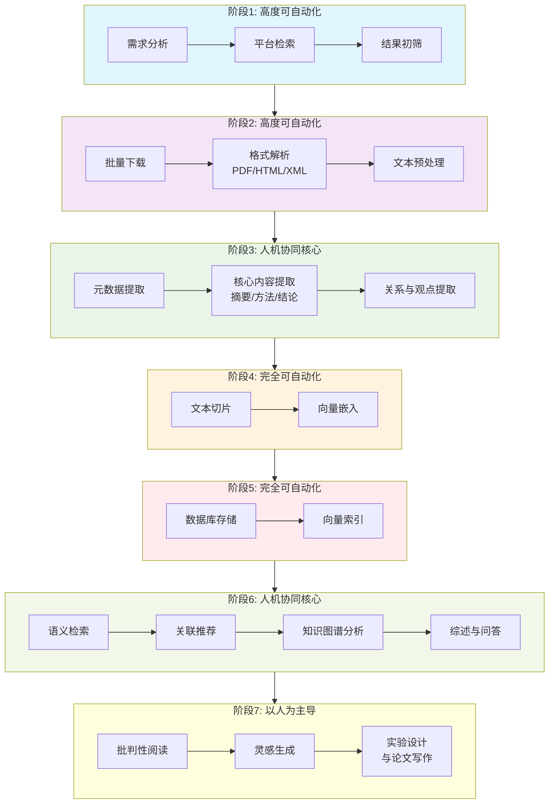

# 文献阅读自动化平台 (Automatic Paper Reading Platform) ———— pyPaperFlow

[English Version](README.md) | [中文版本](README_zh.md)

一个旨在简化科学文献阅读流程的自动化平台。从检索和收集到结构化提取和智能分析，该工具旨在帮助研究人员高效地管理和消化大量论文。

## 🚀 功能特性

- **自动化检索**：从 PubMed/Medline 搜索并获取论文元数据。
- **全文获取**：自动从 PMC 下载开放获取的全文（XML/文本）。
- **结构化存储**：
  - **元数据**：存储为详细的 JSON 文件。
  - **查找表**：基于 CSV 的哈希表，用于快速索引和管理。
- **标签系统**：手动或编程方式为论文打标签，创建特征向量（例如 `relevant=1`, `reviewed=0`）。
- **命令行工具**：一个用户友好的命令行界面 (`paperflow`)，用于所有操作。

## 🏗️ 架构愿景

本项目围绕一个 7 阶段的工作流进行设计：



### 阶段分析与设计理念

#### 阶段一：检索与收集
这是整个工作流的起点。
- **人工流程**：在 PubMed、Google Scholar 等平台手动输入关键词，浏览结果并保存。
- **自动化切入点**：
    - **智能检索代理**：利用 API 或爬虫，根据预设关键词、期刊列表、学者追踪等进行周期性自动化检索。
    - **初筛算法**：基于规则（如标题术语、影响因子、时间范围）对结果进行初步过滤。

#### 阶段二：处理与解析
将原始文件转换为计算机可处理的纯文本和元数据。
- **自动化切入点**：
    - **统一解析器**：使用工具（如 pdfplumber, GROBID）从 PDF 中高精度提取文本和图表。
    - **元数据增强**：自动补全完整的文献元数据（标题、作者、DOI 等）并统一格式。

#### 阶段三：核心信息结构化提取
从“文本”到“信息”的关键跃迁。
- **自动化切入点**（人机协同核心）：
    - **结构化信息抽取**：利用大模型（LLM）扮演领域专家，抽取固定 Schema 的信息（如问题陈述、核心方法、关键数据、结论）。
    - **关系与观点提取**：识别引用意图（支持/反驳），提炼核心论点。

#### 阶段四：深度编码与向量化
为信息建立数学表示。
- **自动化切入点**：
    - **文本嵌入**：使用 Transformer 模型为文献生成高维向量（Embedding）。
    - **向量存储**：将向量存入向量数据库（如 ChromaDB, Pinecone），支持语义检索。

#### 阶段五：动态知识库存储与索引
系统的“记忆体”。
- **自动化切入点**：
    - **多模态数据库**：结合关系型数据库（存储结构化信息）和向量数据库（存储 Embedding）。
    - **自动化索引与关联**：自动建立文献间的潜在关联（共引分析、方法相似度），构建知识图谱的初始边。

#### 阶段六：智能交互与知识发现
利用知识库进行主动探索。
- **自动化切入点**（人机协同核心）：
    - **语义搜索引擎**：实现“以问代搜”，理解问题语义并返回相关段落。
    - **关联推荐与可视化**：基于内容相似性推荐文献，可视化学术版图。
    - **智能问答与综述生成**：基于库中所有文献生成结构化综述。

#### 阶段七：最终产出与内化
以人为主导，AI 作为增强工具。
- **自动化切入点**：
    - **辅助写作与引用**：写作时实时推荐相关引用并格式化。
    - **观点碰撞与灵感生成**：呈现方法论冲突，进行跨领域关联提示，激发批判性思考。

*目前，阶段 1、2 以及阶段 4/5 的部分功能（通过标签实现的精简版）已实现。*

## 📦 安装

确保已安装 Python 3.9+。

```bash
git clone <repository-url>
cd pyPaperFlow
pip install -e .
```

## 🛠️ 使用方法

本平台提供了一个名为 `paperflow` 的命令行工具。

### 1. 搜索 PubMed
搜索论文并获取 PMID 列表。

```bash
paperflow search "COVID-19 vaccine" --retmax 5
```

### 2. 获取论文
获取论文元数据并保存到本地存储。

**通过查询：**
```bash
paperflow fetch --query "COVID-19 vaccine" --batch-size 10
```

**通过 PMID 列表：**
创建一个包含 PMID 的文件 `pmids.txt`（每行一个），然后运行：
```bash
paperflow fetch --file pmids.txt
```

### 3. 下载全文
下载已获取论文的 PMC 全文（如果可用）。

```bash
paperflow download-fulltext --pmid 34320283
```

### 4. 管理标签（特征向量）
通过分配标签来组织论文。这会在查找表中为每篇论文创建一个特征向量。

```bash
# 将论文标记为相关
paperflow tag 34320283 relevant 1

# 将论文标记为已读
paperflow tag 34320283 read 1
```

### 5. 查询与检索
根据标签查找论文或检索完整详情。

**按标签查询：**
```bash
# 查找所有相关论文
paperflow query --tag relevant=1
```

**获取论文详情：**
```bash
paperflow get 34320283
```

## 📂 数据结构

本平台采用“精简版”存储方案：

-   **`paper_data/paper_lookup.csv`**：作为本地数据库的查找表。
    -   行：PMID。
    -   列：`json_path` 以及动态标签（如 `relevant`, `topic_A`）。
-   **`paper_data/papers/{pmid}.json`**：每篇论文的详细元数据和内容。

## 📝 关于 Medline 格式的说明

获取器解析 Medline 格式以提取丰富的元数据，包括：
-   **PMID**: PubMed ID
-   **DP**: 出版日期
-   **TI**: 标题
-   **AB**: 摘要
-   **FAU/AU**: 作者
-   **AD**: 所属机构
-   **PT**: 出版类型（如期刊文章、综述）

## 🔗 参考与灵感

-   [PubMed Research Extractor](https://github.com/Proveer/pubmed-research-extractor)
-   [BioLitMiner](https://github.com/akshayoo/BioLitMiner)


一个原则: 一切皆token, 一切皆text文本, 我们将获取的一切数据都转换为text文本, 喂给LLM