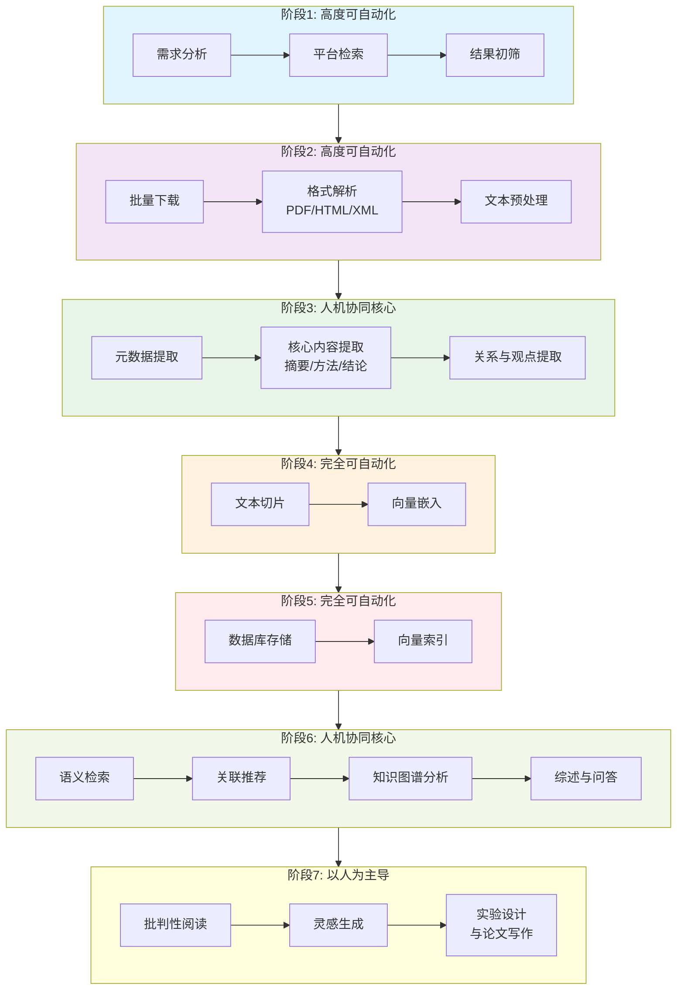

# 文献阅读自动化平台 (Automatic Paper Reading Platform) — pyPaperFlow

[English Version](README.md) | [中文版本](README_zh.md)

一个面向科研工作者的自动化文献处理平台。本工具专注于“信息提取”和“知识发现”两个阶段，通过一个 7 阶段自动化流程，帮助研究人员高效完成从文献检索到知识内化的全流程。

**核心目标**

- **快速进入研究领域**：批量检索并获取某一特定领域内所有可获取的文献
- **批量知识提取**：利用 AI 长文本处理能力，从海量文本中提取结构化知识
- **研究趋势追踪**：快速掌握某一领域最新的研究方法、结论和核心论文

**定位说明**

本工具旨在**补充而非替代** Zotero 等文献参考管理软件。我们专注于“信息提取”和“知识发现”这两个关键步骤，为你构建一个**结构化知识库**，为后续的语义搜索、内容分析和综述生成奠定基础。


## 🚀 功能特性

- **多来源自动检索**：自动从 `PubMed/Medline`、`arXiv`、`medRxiv`、`chemRxiv` 和 `bioRxiv` 搜索并获取论文元数据与全文记录。项目主要聚焦于生物医学与计算交叉领域（`Biomedicine + Computational Biology`）。
- **全文获取**：支持自动从 `PMC` 下载开放获取的 XML/Text 全文。对于预印本及其他没有 PMC 全文的文献，集成了额外的获取模块以下载 `原始 PDF`，并将 `Sci-Hub` 作为兜底来源。
- **结构化存储**：
    - **元数据**：保存为结构清晰的详细 JSON 文件。
    - **全文**：保存为多种格式，包括解析后的 JSON 和 Markdown，方便下游使用。其中 JSON 适合程序化分析，Markdown 更适合 LLM 理解与处理。
    - **标准化结构解析**：所有文献都会被解析并组织为 `标准化 JSON schema`。该 schema 严格区分元数据字段（标题、年份、作者）和标准学术章节（abstract、introduction、results、discussion、methods、conclusion、supplementary、availability、funding、acknowledgements、author contributions、references、other）。同时支持 `自定义章节解析`，允许用户使用自定义 JSON schema 对具有特殊结构的文献进行语义解析。项目还提供了专门模块，用于从大批量主题相关论文中提取指定章节，并将其汇总为可溯源的 Markdown 文献语料，便于后续文献调研和系统综述写作。
- **LLM 与 Agent 增强**：集成 LLM 技能和智能 Agent 能力，帮助用户串联文献调研与深度阅读的整个工作流。
- **CLI 工具**：提供易用的命令行工具 `paperflow`，开箱即可完成所有核心操作。

## 🏗️ 架构愿景

本项目围绕一个 7 阶段的工作流进行设计：


```mermaid
flowchart TD
    A[文献检索<br>与收集] --> B[文献处理<br>与解析]
    B --> C[核心信息<br>结构化提取]
    C --> D[深度编码<br>与向量化]
    D --> E[动态知识库<br>存储与索引]
    E --> F[智能交互<br>与知识发现]
    F --> G[最终产出<br>与内化]

    style A fill:#e1f5fe
    style B fill:#f3e5f5
    style C fill:#e8f5e8
    style D fill:#fff3e0
    style E fill:#ffebee
    style F fill:#f1f8e9
    
    subgraph A [阶段1: 高度可自动化]
        direction LR
        A1[需求分析] --> A2[平台检索]
        A2 --> A3[结果初筛]
    end

    subgraph B [阶段2: 高度可自动化]
        direction LR
        B1[批量下载] --> B2[格式解析<br>PDF/HTML/XML]
        B2 --> B3[文本预处理]
    end

    subgraph C [阶段3: 人机协同核心]
        direction LR
        C1[元数据提取] --> C2[核心内容提取<br>摘要/方法/结论]
        C2 --> C3[关系与观点提取]
    end

    subgraph D [阶段4: 完全可自动化]
        direction LR
        D1[文本切片] --> D2[向量嵌入]
    end

    subgraph E [阶段5: 完全可自动化]
        direction LR
        E1[数据库存储] --> E2[向量索引]
    end

    subgraph F [阶段6: 人机协同核心]
        direction LR
        F1[语义检索] --> F2[关联推荐] --> F3[知识图谱分析] --> F4[综述与问答]
    end

    subgraph G [阶段7: 以人为主导]
        direction LR
        G1[批判性阅读] --> G2[灵感生成] --> G3[实验设计<br>与论文写作]
    end
```

详细设计理念参考 [设计文档](./Docs/Design.md)

## 📦 安装

```bash
# 1. 源码安装本仓库
git clone https://github.com/MaybeBio/pyPaperFlow.git
cd pyPaperFlow
pip install -e .

# 2. 如果你要使用 PDF 解析 / mineru-parse / pdf-parse 这一条链路，请额外安装 MinerU
# 因为mineru安装依赖较多，且需要手动配置环境变量，不添加在pyproject.toml中
# 参考官方文档：https://github.com/opendatalab/MinerU
# 安装完成之后输入 `mineru --help` 来验证安装是否成功
pip install --upgrade pip -i https://mirrors.aliyun.com/pypi/simple
pip install uv -i https://mirrors.aliyun.com/pypi/simple
uv pip install -U "mineru[all]" -i https://mirrors.aliyun.com/pypi/simple 

# 3. 如果你要使用 AI backend，再安装对应 SDK
pip install openai anthropic

# 4. 如果你要使用 paperscraper 后端，再额外安装 (⚠️ 目前还在集成中)
# 参考官方文档：https://github.com/jannisborn/paperscraper
pip install paperscraper
```

> ⚠️ 正常使用情况下你只需要源码安装本仓库+MinerU即可，也就是1、2两步

## 🛠️ 使用方法

本工具 pyPaperFlow 专为学术研究打造，整体设计严格贴合科研人员开展`文献调研、文献研读、文献理解分析及文献语料复用`的真实工作逻辑。

因此，请跟随指引逐步完成操作 —— 该流程与您自身开展文献调研的完整过程完全一致，亲身体验后即可充分理解本工具的设计理念与使用方法。

本平台提供了一个名为 `paperflow` 的命令行工具。

### 模块概述

目前可用模块包括(`会持续更新`)：

```python
❯ paperflow --help
                                                                                                                                                                                         
 Usage: paperflow [OPTIONS] COMMAND [ARGS]...                                                                                                                                            
                                                                                                                                                                                         
 pyPaperFlow CLI                                                                                                                                                                         
                                                                                                                                                                                         
╭─ Options ─────────────────────────────────────────────────────────────────────────────────────────────────────────────────────────────────────────────────────────────────────────────╮
│ --install-completion          Install completion for the current shell.                                                                                                               │
│ --show-completion             Show completion for the current shell, to copy it or customize the installation.                                                                        │
│ --help                        Show this message and exit.                                                                                                                             │
╰───────────────────────────────────────────────────────────────────────────────────────────────────────────────────────────────────────────────────────────────────────────────────────╯
╭─ Commands ────────────────────────────────────────────────────────────────────────────────────────────────────────────────────────────────────────────────────────────────────────────╮
│ pubmed-search      Search PubMed using Your customized query and return PMIDs.                                                                                                        │
│ pubmed-meta        Fetch paper metadata from PubMed using Your customized query, pmid list file and save to storage.                                                                  │
│ pubmed-content     Download full text (PMC) for given PMIDs if the paper has a PMC ID.                                                                                                │
│ pubmed-all         Fetch BOTH metadata and full text (if available) for papers.                                                                                                       │
│                    Also extracts URLs from full text and updates metadata links.                                                                                                      │
│ pubmed-merge-json  Create a merged JSON (or JSONL) file from PubMed paper directories.                                                                                                │
│ pubmed-export-md   Export a single Markdown view from a merged JSON file using optional YAML config.                                                                                  │
│ arxiv-search       Search arXiv and write matching IDs to a text file.                                                                                                                │
│ arxiv-fetch        Fetch arXiv metadata and attempt to download PDFs.                                                                                                                 │
│ biorxiv-search     Search bioRxiv and write matching IDs to a text file.                                                                                                              │
│ biorxiv-fetch      Fetch bioRxiv metadata and attempt to download PDFs.                                                                                                               │
│ paper-fetch        Fetch PDFs by DOI — passes through to the paper-fetch engine.                                                                                                      │
│ pdf-parse          Parse a PDF file using MinerU engine, and clean up the output directory.                                                                                           │
│ mineru-parse       Parse mineru output content_list_v2.json into canonical sectioned JSON.                                                                                            │
│ mineru-export-md   Export structured mineru JSON to a clean Markdown file for LLM processing.                                                                                         │
╰───────────────────────────────────────────────────────────────────────────────────────────────────────────────────────────────────────────────────────────────────────────────────────╯

```


其中模块归属
```python
PubMed 相关模块：
- pubmed-search # 用自然语言搜索 PubMed 文献并返回 PMID 列表 
- pubmed-meta # 从 PubMed 获取论文元数据
- pubmed-content # 从 PubMed 获取论文全文
- pubmed-all # 从 PubMed 获取论文元数据和全文
- pubmed-merge-json # 批量合并同主题的 PubMed 论文集合
- pubmed-export-md # 导出 PubMed 论文集合为 Markdown 文件，支持批量导出该主题所有论文的某一核心章节（🌟如批量导出introduction作为你的研究背景）


arXiv 相关模块：
- arxiv-search # 搜索 arXiv 并返回 文献ID 列表
- arxiv-fetch # 从 arXiv 获取论文元数据和 PDF 文件


bioRxiv 相关模块：
- biorxiv-search # 搜索 bioRxiv 并返回 文献ID 列表
- biorxiv-fetch # 从 bioRxiv 获取论文元数据和 PDF 文件


第3方辅助解析模块：
- paper-fetch # 从 DOI 获取 PDF 文件
- pdf-parse # 利用mineru引擎解析 PDF 文件为 JSON、Markdown 格式文本
- mineru-parse # 按照自定义章节配置, 二次解析 MinerU 输出文件为文献标准章节聚类的结构化JSON 格式
- mineru-export-md # 按照需求章节，导出 结构化JSON 格式文件为 Markdown 文件（🌟如批量导出同主题所有论文的introduction作为你的研究背景）

```

> ⚠️ `其他文献预印本平台模块正在开发中，敬请期待！`

### 1. 研究起点

开展文献调研的首要环节为文献信息的搜集与梳理。当现有信息储备不足时，需通过整合学术资料，清晰掌握国内外相关领域的研究现状。

首先需明确拟开展的研究主题。研究初期，你可能仅有零散的初步构想、碎片化文献、调研草稿，甚至无任何前置资料，仅掌握若干核心关键词。

本阶段需基于手头全部现有信息，初步划定研究方向与范畴。此处仅需确定宽泛的研究边界，无需在首次迭代中精准锁定最终研究目标。

因此，需开展先验或后验式头脑风暴。本工具内置专属功能模块，可协助你梳理现有思路与信息，凝练出清晰的研究方向及范畴。

```bash
输入项：
- 研究方向：计划开展研究的主题或问题领域
- 已有信息：已掌握的相关文献、调研草稿、关键词及其他前置资料, 添加附件

输出项：
- 研究范围：包含核心主题与边界约束的明确定义。更通俗地讲，可理解为初步研究问题或整体研究方向，本文统一定义为研究起点。
- 输出形式主要为指导后续文献检索的关键词清单，或规范化的研究问题表述，可根据研究需求在多轮迭代中补充约束条件。
```

核心要点：`该研究起点并非一次性确定，可依据新增信息与研究推进进度，通过多次迭代持续更新、完善。`

你可借助前沿大语言模型，结合你目前所掌握的所有资料信息，反复核验、探讨研究起点，直至其足够清晰具体，或满足进入下一步文献检索的条件。


### 1. 搜索 PubMed
搜索论文并获取 PMID 列表。

```bash
paperflow search "COVID-19 vaccine" --retmax 5
```

### 2. 获取论文
获取论文元数据并保存到本地存储。

**通过查询：**
```bash
paperflow fetch --query "COVID-19 vaccine" --batch-size 10
```

**通过 PMID 列表：**
创建一个包含 PMID 的文件 `pmids.txt`（每行一个），然后运行：
```bash
paperflow fetch --file pmids.txt
```

### 3. 下载全文
下载已获取论文的 PMC 全文（如果可用, 如果有PMC全文）。

```bash
paperflow download-fulltext --pmid 34320283
```

### 4. 搜索并获取 arXiv 论文
如果你只想先拿到 ID，可以先搜索；如果想同时获取元数据和 PDF，可以直接 fetch。

```bash
paperflow arxiv-search "deep learning for biology" --max-results 10
paperflow arxiv-fetch "deep learning for biology" --max-results 10 --download-pdf
paperflow arxiv-fetch "deep learning for biology" --max-results 10 --download-pdf --backend paperscraper
```

常用参数：

- `--start-date` / `--end-date`：按 `YYYY-MM-DD` 格式限制日期范围。
- `--backend`：可选 `native`（内置的 httpx 方案）或 `paperscraper`（安装了第三方包时可用）。
- `--output-dir`：把 ID 列表或抓取结果保存到其他目录。
- `--no-download-pdf`：只保存元数据，不下载 PDF。

日期过滤示例：

```bash
paperflow arxiv-fetch "protein folding" --start-date 2024-01-01 --end-date 2024-12-31 -o ./papers/arxiv
```

搜索结果会保存为 `searched_arxiv_ids.txt`。抓取结果会按 `source/year/source_id/` 结构保存，包含 JSON 元数据，PDF 则按可用情况尽量下载。

# 🌟🌟🌟
#### arXiv 命令变体与使用示例

- **arxiv-search**: 仅检索匹配的 arXiv 记录并输出 ID 列表（不下载内容）。

    用法示例：

    ```bash
    paperflow arxiv-search "protein folding" --max-results 50 --start-date 2024-01-01 --end-date 2024-12-31
    # 将会在默认存储目录下生成 searched_arxiv_ids.txt，或使用 --output-dir 指定保存位置
    ```

- **arxiv-fetch**: 检索并保存每篇论文的标准化元数据（JSON），可选地下载 PDF 文件（默认开启）。

    常用选项：
    - `--download-pdf/--no-download-pdf`：是否下载 PDF（默认 `--download-pdf`）。
    - `--backend`：`native`（默认，使用 arXiv Atom API）或 `paperscraper`（需安装 `paperscraper` 包）。
    - `--output-dir`：指定保存结果的目录（默认使用全局存储目录）。
    - `--start-date` / `--end-date`：按 `YYYY-MM-DD` 限制提交时间范围。

    用法示例：

    ```bash
    # 仅保存元数据（不下载 PDF）
    paperflow arxiv-fetch "deep learning for biology" --max-results 20 --no-download-pdf -o ./papers/arxiv

    # 使用 paperscraper 后端并下载 PDF
    paperflow arxiv-fetch "deep learning for biology" --max-results 20 --download-pdf --backend paperscraper -o ./papers/arxiv
    ```

- **输出与存储**：
    - 元数据：每篇论文保存为 `{source_id}.json`，包含 `title`, `authors`, `abstract`, `published_date`, `landing_url`, `pdf_url` 等字段（存储路径示例：`{output_dir}/arxiv/2024/2301.01234v1/2301.01234v1.json`）。
    - PDF：如果可用且下载成功，则保存为 `{source_id}.pdf`，并在对应 JSON 中更新 `pdf_downloaded` 和 `pdf_path` 字段。

- **注意事项**：
    - arXiv 的抓取流程只负责元数据标准化与 PDF 下载；当前仓库没有内建将 arXiv PDF 自动解析为 Markdown/结构化全文的步骤。若需后续文本解析，请在下载后接入 PDF 解析器（例如 `pdfplumber`、`minerU`、或 OCR/布局解析管线），并将解析结果保存为 `*_parsed.md` 或结构化 JSON，以便 `merge` 等下游工具使用。

如果需要，我可以继续为你实现一个简单的 PDF -> Markdown 解析示例脚本，并把使用说明也追加到 README 中。

### 5. 搜索并获取 bioRxiv 论文
bioRxiv 目前走 Crossref（openRxiv）服务端直接检索，不再先拉取大范围日期窗口再在本地做匹配。

```bash
paperflow biorxiv-search "AlphaFold AND structure" --max-results 10
paperflow biorxiv-fetch "AlphaFold AND structure" --start-date 2026-01-01 --end-date 2026-01-31 --download-pdf
```

常用参数：

- `--start-date` / `--end-date`：按 `YYYY-MM-DD` 格式限制日期范围。
- `--output-dir`：把 ID 列表或抓取结果保存到其他目录。
- `--no-download-pdf`：只保存元数据，不下载 PDF。

兼容性说明：

- `--window-days` 作为 CLI 兼容参数保留，但当前 Crossref 检索路径不会使用该参数。

示例：

```bash
paperflow biorxiv-fetch "protein interaction" --max-results 50 -o ./papers/biorxiv
```

搜索结果会保存为 `searched_biorxiv_ids.txt`。抓取结果会按 `source/year/source_id/` 结构保存，包含 JSON 元数据，并在可用时下载 PDF。


### 6. 获取全文数据（元数据+文本内容）

```bash
paperflow fetch-full 


```


### 7. 管理标签（特征向量）
通过分配标签来组织论文。这会在查找表中为每篇论文创建一个特征向量。

```bash
# 将论文标记为相关
paperflow tag 34320283 relevant 1

# 将论文标记为已读
paperflow tag 34320283 read 1
```

### 6. 查询与检索
根据标签查找论文或检索完整详情。

**按标签查询：**
```bash
# 查找所有相关论文
paperflow query --tag relevant=1
```

**获取论文详情：**
```bash
paperflow get 34320283
```

## 📂 数据结构

本平台采用“精简版”存储方案：

-   **`paper_data/paper_lookup.csv`**：作为本地数据库的查找表。
    -   行：PMID。
    -   列：`json_path` 以及动态标签（如 `relevant`, `topic_A`）。
-   **`paper_data/papers/{pmid}.json`**：每篇论文的详细元数据和内容。

## 📝 关于 Medline 格式的说明

获取器解析 Medline 格式以提取丰富的元数据，包括：
-   **PMID**: PubMed ID
-   **DP**: 出版日期
-   **TI**: 标题
-   **AB**: 摘要
-   **FAU/AU**: 作者
-   **AD**: 所属机构
-   **PT**: 出版类型（如期刊文章、综述）
  


## 📌 局限性

本工具旨在为科研工作者提供基础的文献检索和数据处理能力，但在实际应用中存在以下局限：

### 1. 工具定位与功能边界

**基础数据层 vs 应用层分离**
- 本工具专注于**数据获取与预处理**阶段，即构建原始的知识语料库
- 文献的深度解读、知识提取、智能分析等**应用层功能**不在当前实现范围内
- 用户需要根据自身需求，结合其他工具或AI模型来完成后续的知识内化工作

**工作流完整性限制**
- 完整的7阶段工作流中，目前仅实现了阶段1-2的基础功能
- 阶段3（核心信息提取）、阶段6（智能交互）、阶段7（最终产出）需要大量的人工干预和策略设计
- 这意味着用户无法一键完成从检索到内化的全流程，需要在各个环节进行人工决策

### 2. 知识库构建的基础性

**原始数据提供**
- 我们提供的是未经深度处理的"原始"知识库，包含元数据和全文文本
- 知识库的质量取决于：原始文献的质量、检索策略的合理性、数据清洗的完善程度
- 不保证知识库的准确性、时效性和完整性，用户需要进行二次验证

**缺乏语义增强**
- 当前版本不包含实体识别、关系抽取、知识图谱构建等语义处理
- 存储的是平面化的文本数据，而非结构化的知识表示
- 用户需要自行处理语义层面的信息提取和组织

### 3. 文献解读与知识提取的用户依赖

**策略定制必要性**
- 不同研究领域有不同的信息提取重点（方法创新、实验设计、结论验证等）
- 不同研究方向需要不同的知识组织方式（按时间、按方法、按应用场景等）
- 用户必须根据自身研究需求，设计专属的文献解读策略

**AI模型选择自由**
- 工具不绑定任何特定的AI模型或框架
- 用户需要根据任务特点选择合适的模型（GPT、Claude、开源模型等）
- 需要用户自行设计Prompt工程策略，优化提取效果

**技术门槛要求**
- 需要用户具备一定的AI/LLM使用经验
- 需要理解如何与大型语言模型进行有效交互
- 需要掌握基本的文本处理和数据分析技能

### 4. 知识库优化的用户责任

**持续维护需求**
- 随着新论文的发表，知识库需要定期更新
- 过时的信息需要被标记或移除
- 冲突的结论需要人工判断和协调

**质量控制机制**
- 缺乏自动化的质量评估机制
- 用户需要建立自己的评价体系来判断文献质量
- 需要手动处理重复、错误、不完整的数据

**个性化适配**
- 通用工具无法满足所有用户的特殊需求
- 用户需要根据自己的研究偏好进行个性化定制
- 可能需要编写额外的脚本或工具来补充功能

### 5. 高级功能的复杂性与专业门槛

**本体论构建**
- 本体论（Ontology）构建是知识工程中的高级任务
- 涉及复杂的概念建模、关系定义、逻辑推理
- 需要领域专家的深度参与和持续的迭代优化
- **建议**：此功能留给数学、逻辑学、知识工程相关专业人员探索

**形式化证明**
- 将自然语言论点转化为数学逻辑表达式具有极高的技术难度
- 需要使用专门的定理证明工具（如LEAN、Coq、Isabelle）
- 需要深厚的数学基础和形式化方法的训练
- **建议**：此功能面向形式化验证领域的专业研究人员，社区探索为主
- 参考资源：[Lean Zulip论坛](https://leanprover.zulipchat.com/#channels/395462/Natural.20sciences/general)

**知识图谱构建**
- 自动构建高质量知识图谱需要复杂的实体对齐、关系抽取算法
- 需要处理歧义消解、多源数据融合等技术挑战
- 目前缺乏自动化的图谱构建工具
- **建议**：用户需要使用专业的知识图谱工具（如Neo4j、Protégé）进行后续处理

### 6. 技术实现的现实限制

**数据源限制**
- 目前主要支持PubMed/Medline数据库
- 对其他预印本平台（如arXiv、bioRxiv）的支持有限
- 非开放获取的全文无法自动获取
- **建议**：结合其他工具或手动补充数据源

**性能与扩展性**
- 大规模文献检索和下载可能遇到API限流
- 本地存储和管理大量文件需要充足的磁盘空间
- 未针对百万级文献库进行性能优化
- **建议**：合理规划检索策略，分批次处理数据

**错误处理与恢复**
- 网络不稳定时可能导致数据下载失败
- 部分失败后缺乏完善的断点续传机制
- 用户需要监控日志并手动处理失败项

### 7. 使用建议

为了更好地使用本工具，建议遵循以下原则：

1. **循序渐进**：先熟悉基础的检索和下载功能，再尝试高级功能
2. **合理期望**：理解工具的边界，将其作为工作流中的一个环节而非完整解决方案
3. **主动定制**：根据自己的需求设计提示词和分析策略
4. **社区参与**：关注工具更新，参与讨论，贡献改进建议
5. **组合使用**：与其他工具（如Zotero、Obsidian、Notion）配合使用，构建完整的研究工作流

`核心原则：一切皆token，一切皆text，我们将获取的一切数据都转换为text，喂给LLM`


## 🔗 模块更新说明

### 1. 模块功能设计调整

原始版本模块功能设计如下:

```python

! paperflow --help                                                                                                                                                                                           
  ⎿   Usage: paperflow [OPTIONS] COMMAND [ARGS]...
                                                                                                                                                                                                             
      pyPaperFlow CLI                                                                                                                                                                                        
   
     ╭─ Options ────────────────────────────────────────────────────────────────────╮                                                                                                                        
     │ --install-completion          Install completion for the current shell.      │
     │ --show-completion             Show completion for the current shell, to copy │
     │                               it or customize the installation.              │
     │ --help                        Show this message and exit.                    │
     ╰──────────────────────────────────────────────────────────────────────────────╯
     ╭─ Commands ───────────────────────────────────────────────────────────────────╮
     │ search              Search PubMed using Your customized query and return     │
     │                     PMIDs.                                                   │
     │ fetch               Fetch paper metadata from PubMed using Your customized   │
     │                     query, pmid list file and save to storage.               │
     │ download-fulltext   Download full text (PMC) for given PMIDs if the paper    │
     │                     has a PMC ID.                                            │
     │ fetch-full          Fetch BOTH metadata and full text (if available) for     │
     │                     papers. Also extracts URLs from full text and updates    │
     │                     metadata links.                                          │
     │ tag                 Add/remove tags for a paper.                             │
     │ tag-set             Set a tag explicitly to 0/1 (backward-compatible).       │
     │ query               Query papers by tags.                                    │
     │ get                 Get paper details.                                       │
     │ build-query         Interactive wizard to build complex PubMed queries with  │
     │                     AI assistance.                                           │
     ╰──────────────────────────────────────────────────────────────────────────────╯

```

我们将依然保留原始模块：`search`, `fetch`, `download-fulltext`, `fetch-full`, `get`，因为这些模块与我们最初的设计初衷依然兼容，而对于模块：`tag`, `query`, `tag-set`, `build-query`，这些模块原本的设计初衷是为了替代部分文献管理工具，但是鉴于我们已经更改了整体的设计理念以及逻辑执行流程，我们依然建议正式的文献管理、标记功能由专业的Zotero等工具来完成，因此我们将不再维护这些模块，并且在后续的版本中将会被移除。

### 2. 新增Merge模块以及后续下游分析模块

Merge模块用于合并所获取的pubmed文献的元数据与文本数据，

其主要职责在于规范化原始文献内容的模块化整理，并且后续分析模块设计为直接衔接merge的标准化结果，而不是再回头从原始目录和元数据再提取一遍。

此处的设计规划有三点考虑：
* 所有分析模块共享同一份规范化输入，减少重复解析和字段不一致
* Merge模块可以承担起`数据规范层`的职责，把pubmed原始结构统一成我们的分析有好格式
* 后续的AI分析和流程化分析可以分流，比如说输出的Markdown给LLM进行语义分析、文本分析，而JSON给代码模块
* 

### 2. 下游AI模块接入建议

* 终端交互：比如说Claude Code @ 
* Agent 框架：借助文献阅读、科研助手相关的MCP、Skill工具


### 3. 主题文献抓取更新需求

* 原始模块中，使用同1个组合式topic query语句抓取所有相关文献，后续进行更新时，对于已经抓取过的PMID文献的文件夹，如果存在则跳过，抓取新的文献。

* 修改之后：但是考虑到已抓取的文献存在元数据（比如说引用数据）更新的问题，我们原本设计为详细比对引用数据列表是否一致，只有不一致才进行更新。但是考虑到工作量上与全量更新一致，所以我们建议在文献更新中，每次抓取都进行全量更新，或者只在乎文献抓取到与否、而不在于文献引用数据更新与否的，可以直接在query中设置1个具体时间限制，比如说第一次抓取是在 2024-01-01 到 2026-01-20，那么后续更新时，可以设置时间限制为2026-01-01到 now，这样就可以保证只抓取到新的文献，而不在乎已抓取文献的引用数据是否更新了。


## 

开头的query设计，建议可以留给pubmed、biorxiv等query builder的类似skill来完成


# 3个文献数据库，pubmed、arxiv、biorxiv，1个数据库单独1个文件夹
# 每个数据库的文件夹下按照年份进行划分，年份下按照source_id进行划分（pmid、arxiv_id、biorxiv_id）
接口全部改过，改为v 1.0.0
