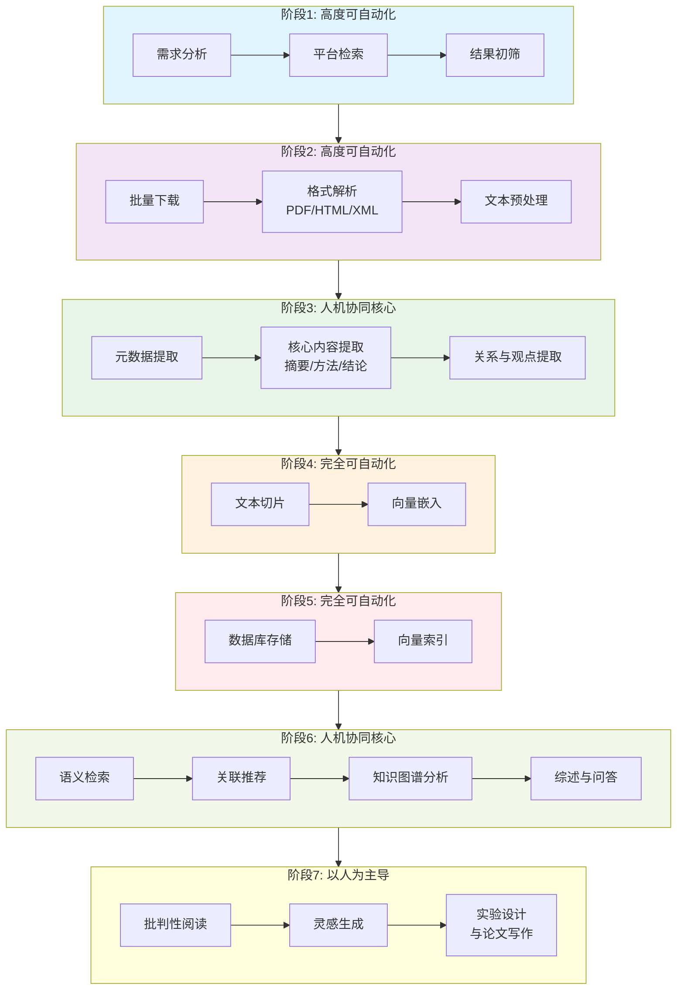
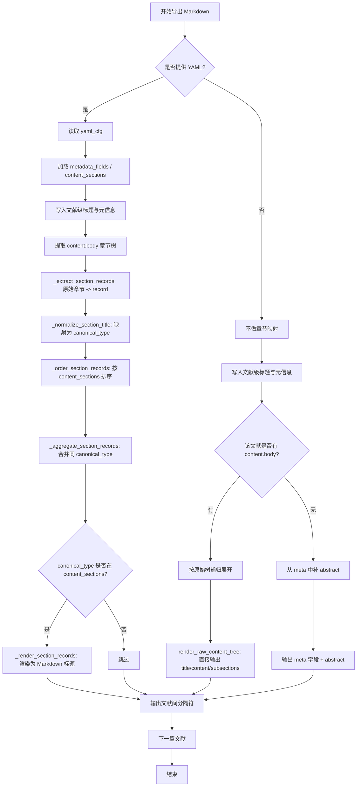

<div align="center">

# pyPaperFlow - 文献阅读自动化 🔬


<p><strong>面向科研工作者的自动化文献处理与知识发现平台</strong></p>

<p>批量检索、批量获取、批量解析、批量结构化，把文献真正变成可计算、可复用、可追踪的研究资产。</p>

<p>从文献检索到知识内化，把重复劳动交给流程，把关键判断留给你。</p>


[](https://www.gnu.org/licenses/gpl-3.0) 
[](http://makeapullrequest.com)
[](./docs/Design.md)
[](#功能特性)
[](https://pypi.org/project/pyPaperFlow/)
[](https://pypi.org/project/pyPaperFlow/)
[](https://pepy.tech/project/pyPaperFlow)

<p>
  文档阅读👉
  <a href="README.md">English</a> |
  <a href="README_zh.md">中文</a> 
</p>

<p>
  <a href="./docs/Design.md">设计文档</a> |
  <a href="./docs/Cases.md">测试示例</a>
</p>

</div>

> **如果该项目对你有帮助, 请麻烦点一个 Star ⭐, 谢谢!**

---

## 目录

- [pyPaperFlow - 文献阅读自动化 🔬](#pypaperflow---文献阅读自动化-)
  - [目录](#目录)
  - [📖 简介](#-简介)
  - [🚀 功能特性](#-功能特性)
  - [🏗️ 架构设计哲学](#️-架构设计哲学)
  - [📦 安装](#-安装)
  - [🛠️ 使用方法](#️-使用方法)
    - [模块概述](#模块概述)
    - [1. 研究起点](#1-研究起点)
    - [2. 文献检索（及元数据抓取）](#2-文献检索及元数据抓取)
    - [3. 文献获取（及全文下载）](#3-文献获取及全文下载)
    - [4. 文献内容提取与结构化处理](#4-文献内容提取与结构化处理)
    - [5. 其他文献数据平台的处理](#5-其他文献数据平台的处理)
    - [6. 批判性阅读与知识图谱分析：下游终点](#6-批判性阅读与知识图谱分析下游终点)
  - [🔍 测试示例](#-测试示例)
  - [📌 后续维护待办](#-后续维护待办)


## 📖 简介

一个面向科研工作者的自动化文献处理平台。本工具专注于“信息提取”和“知识发现”两个阶段，通过一个 7 阶段自动化流程，帮助研究人员高效完成从文献检索到知识内化的全流程。

**核心目标**

- **快速进入研究领域**：批量检索并获取某一特定领域内所有可获取的文献
- **批量知识提取**：利用 AI 长文本处理能力，从海量文本中提取结构化知识
- **研究趋势追踪**：快速掌握某一领域最新的研究方法、结论和核心论文

**定位说明**

本工具旨在**补充而非替代** Zotero 等文献参考管理软件。我们专注于“信息提取”和“知识发现”这两个关键步骤，为你构建一个**结构化知识库**，为后续的语义搜索、内容分析和综述生成奠定基础。


## 🚀 功能特性

- **多来源自动检索**：自动从 `PubMed/Medline`、`arXiv`、`medRxiv`、`chemRxiv` 和 `bioRxiv` 搜索并获取论文元数据与全文记录。项目主要聚焦于生物医学与计算交叉领域（`Biomedicine + Computational Biology`）。
- **全文获取**：支持自动从 `PMC` 下载开放获取的 XML/Text 全文。对于预印本及其他没有 PMC 全文的文献，集成了额外的获取模块以下载 `原始 PDF`，并将 `Sci-Hub` 作为兜底来源。
- **结构化存储**：
    - **元数据**：保存为结构清晰的详细 JSON 文件。
    - **全文**：保存为多种格式，包括解析后的 JSON 和 Markdown，方便下游使用。其中 JSON 适合程序化分析，Markdown 更适合 LLM 理解与处理。
    - **标准化结构解析**：所有文献都会被解析并组织为 `标准化 JSON schema`。该 schema 严格区分元数据字段（标题、年份、作者）和标准学术章节（abstract、introduction、results、discussion、methods、conclusion、supplementary、availability、funding、acknowledgements、author contributions、references、other）。同时支持 `自定义章节解析`，允许用户使用自定义 JSON schema 对具有特殊结构的文献进行语义解析。项目还提供了专门模块，用于从大批量主题相关论文中提取指定章节，并将其汇总为可溯源的 Markdown 文献语料，便于后续文献调研和系统综述写作。
- **LLM 与 Agent 增强**：集成 LLM 技能和智能 Agent 能力，帮助用户串联文献调研与深度阅读的整个工作流。
- **CLI 工具**：提供易用的命令行工具 `paperflow`，开箱即可完成所有核心操作。

## 🏗️ 架构设计哲学

本项目围绕一个 7 阶段的工作流进行设计：


```mermaid
flowchart TD
    A[文献检索<br>与收集] --> B[文献处理<br>与解析]
    B --> C[核心信息<br>结构化提取]
    C --> D[深度编码<br>与向量化]
    D --> E[动态知识库<br>存储与索引]
    E --> F[智能交互<br>与知识发现]
    F --> G[最终产出<br>与内化]

    style A fill:#e1f5fe
    style B fill:#f3e5f5
    style C fill:#e8f5e8
    style D fill:#fff3e0
    style E fill:#ffebee
    style F fill:#f1f8e9
    
    subgraph A [阶段1: 高度可自动化]
        direction LR
        A1[需求分析] --> A2[平台检索]
        A2 --> A3[结果初筛]
    end

    subgraph B [阶段2: 高度可自动化]
        direction LR
        B1[批量下载] --> B2[格式解析<br>PDF/HTML/XML]
        B2 --> B3[文本预处理]
    end

    subgraph C [阶段3: 人机协同核心]
        direction LR
        C1[元数据提取] --> C2[核心内容提取<br>摘要/方法/结论]
        C2 --> C3[关系与观点提取]
    end

    subgraph D [阶段4: 完全可自动化]
        direction LR
        D1[文本切片] --> D2[向量嵌入]
    end

    subgraph E [阶段5: 完全可自动化]
        direction LR
        E1[数据库存储] --> E2[向量索引]
    end

    subgraph F [阶段6: 人机协同核心]
        direction LR
        F1[语义检索] --> F2[关联推荐] --> F3[知识图谱分析] --> F4[综述与问答]
    end

    subgraph G [阶段7: 以人为主导]
        direction LR
        G1[批判性阅读] --> G2[灵感生成] --> G3[实验设计<br>与论文写作]
    end
```

详细设计理念参考 [设计文档](./docs/Design.md)

## 📦 安装

```bash
# 1. 安装本仓库工具
## ✏️1️⃣ 方案1：通过pip（推荐）
pip install pyPaperFlow

## ✏️2️⃣ 方案2：从源码安装
git clone https://github.com/MaybeBio/pyPaperFlow.git
cd pyPaperFlow
pip install -e .

--------------------------------------------------------

# 2. 如果你要使用 PDF 解析 / mineru-parse / pdf-parse 这一条链路，请额外安装 MinerU
# 因为mineru安装依赖较多，且需要手动配置环境变量，不添加在pyproject.toml中
# 参考官方文档：https://github.com/opendatalab/MinerU
# 安装完成之后输入 `mineru --help` 来验证安装是否成功
pip install --upgrade pip -i https://mirrors.aliyun.com/pypi/simple
pip install uv -i https://mirrors.aliyun.com/pypi/simple
uv pip install -U "mineru[all]" -i https://mirrors.aliyun.com/pypi/simple 

--------------------------------------------------------

# 3. 如果你要使用 AI backend，再安装对应 SDK
pip install openai anthropic

--------------------------------------------------------

# 4. 如果你要使用 paperscraper 后端，再额外安装 (⚠️ 目前还在集成中)
# 参考官方文档：https://github.com/jannisborn/paperscraper
pip install paperscraper
```

> ⚠️ 正常使用情况下你只需要源码安装本仓库+MinerU即可，也就是1、2两步

## 🛠️ 使用方法

本工具 pyPaperFlow 专为学术研究打造，整体设计严格贴合科研人员开展`文献调研、文献研读、文献理解分析及文献语料复用`的真实工作逻辑。

因此，请跟随指引逐步完成操作 —— 该流程与您自身开展文献调研的完整过程完全一致，亲身体验后即可充分理解本工具的设计理念与使用方法。

本平台提供了一个名为 `paperflow` 的命令行工具。

### 模块概述

目前可用模块包括(`会持续更新`)：

```python
❯ paperflow --help
                                                                                                                                                                                         
 Usage: paperflow [OPTIONS] COMMAND [ARGS]...                                                                                                                                            
                                                                                                                                                                                         
 pyPaperFlow CLI                                                                                                                                                                         
                                                                                                                                                                                         
╭─ Options ─────────────────────────────────────────────────────────────────────────────────────────────────────────────────────────────────────────────────────────────────────────────╮
│ --install-completion          Install completion for the current shell.                                                                                                               │
│ --show-completion             Show completion for the current shell, to copy it or customize the installation.                                                                        │
│ --help                        Show this message and exit.                                                                                                                             │
╰───────────────────────────────────────────────────────────────────────────────────────────────────────────────────────────────────────────────────────────────────────────────────────╯
╭─ Commands ────────────────────────────────────────────────────────────────────────────────────────────────────────────────────────────────────────────────────────────────────────────╮
│ pubmed-search      Search PubMed using Your customized query and return PMIDs.                                                                                                        │
│ pubmed-meta        Fetch paper metadata from PubMed using Your customized query, pmid list file and save to storage.                                                                  │
│ pubmed-content     Download full text (PMC) for given PMIDs if the paper has a PMC ID.                                                                                                │
│ pubmed-all         Fetch BOTH metadata and full text (if available) for papers.                                                                                                       │
│                    Also extracts URLs from full text and updates metadata links.                                                                                                      │
│ pubmed-merge-json  Create a merged JSON (or JSONL) file from PubMed paper directories.                                                                                                │
│ pubmed-export-md   Export a single Markdown view from a merged JSON file using optional YAML config.                                                                                  │
│ arxiv-search       Search arXiv and write matching IDs to a text file.                                                                                                                │
│ arxiv-fetch        Fetch arXiv metadata and attempt to download PDFs.                                                                                                                 │
│ biorxiv-search     Search bioRxiv and write matching IDs to a text file.                                                                                                              │
│ biorxiv-fetch      Fetch bioRxiv metadata and attempt to download PDFs.                                                                                                               │
│ paper-fetch        Fetch PDFs by DOI — passes through to the paper-fetch engine.                                                                                                      │
│ pdf-parse          Parse a PDF file using MinerU engine, and clean up the output directory.                                                                                           │
│ mineru-parse       Parse mineru output content_list_v2.json into canonical sectioned JSON.                                                                                            │
│ mineru-export-md   Export structured mineru JSON to a clean Markdown file for LLM processing.                                                                                         │
╰───────────────────────────────────────────────────────────────────────────────────────────────────────────────────────────────────────────────────────────────────────────────────────╯

```


其中模块归属
```python
PubMed 相关模块：
- pubmed-search # 用自然语言搜索 PubMed 文献并返回 PMID 列表 
- pubmed-meta # 从 PubMed 获取论文元数据
- pubmed-content # 从 PubMed 获取论文全文
- pubmed-all # 从 PubMed 获取论文元数据和全文
- pubmed-merge-json # 批量合并同主题的 PubMed 论文集合
- pubmed-export-md # 导出 PubMed 论文集合为 Markdown 文件，支持批量导出该主题所有论文的某一核心章节（🌟如批量导出introduction作为你的研究背景）


arXiv 相关模块：
- arxiv-search # 搜索 arXiv 并返回 文献ID 列表
- arxiv-fetch # 从 arXiv 获取论文元数据和 PDF 文件


bioRxiv 相关模块：
- biorxiv-search # 搜索 bioRxiv 并返回 文献ID 列表
- biorxiv-fetch # 从 bioRxiv 获取论文元数据和 PDF 文件


第3方辅助解析模块：
- paper-fetch # 从 DOI 获取 PDF 文件
- pdf-parse # 利用mineru引擎解析 PDF 文件为 JSON、Markdown 格式文本
- mineru-parse # 按照自定义章节配置, 二次解析 MinerU 输出文件为文献标准章节聚类的结构化JSON 格式
- mineru-export-md # 按照需求章节，导出 结构化JSON 格式文件为 Markdown 文件（🌟如批量导出同主题所有论文的introduction作为你的研究背景）

```

> ⚠️ `其他文献预印本平台模块正在开发中，敬请期待！`

### 1. 研究起点

开展文献调研的首要环节为文献信息的搜集与梳理。当现有信息储备不足时，需通过整合学术资料，清晰掌握国内外相关领域的研究现状。

首先需明确拟开展的研究主题。研究初期，你可能仅有零散的初步构想、碎片化文献、调研草稿，甚至无任何前置资料，仅掌握若干核心关键词。

本阶段需基于手头全部现有信息，初步划定研究方向与范畴。此处仅需确定宽泛的研究边界，无需在首次迭代中精准锁定最终研究目标。

因此，需开展先验或后验式头脑风暴。本工具内置专属功能模块，可协助你梳理现有思路与信息，凝练出清晰的研究方向及范畴。

```bash
输入项：
- 研究方向：计划开展研究的主题或问题领域
- 已有信息：已掌握的相关文献、调研草稿、关键词及其他前置资料, 添加附件

输出项：
- 研究范围：包含核心主题与边界约束的明确定义。更通俗地讲，可理解为初步研究问题或整体研究方向，本文统一定义为研究起点。
- 输出形式主要为指导后续文献检索的关键词清单，或规范化的研究问题表述，可根据研究需求在多轮迭代中补充约束条件。
```

> 核心要点：`该研究起点并非一次性确定，可依据新增信息与研究推进进度，通过多次迭代持续更新、完善。`

你可借助前沿大语言模型，结合你目前所掌握的所有资料信息，反复核验、探讨研究起点，直至其足够清晰具体，或满足进入下一步文献检索的条件。


> 🌟 这里我们为你提供几个用于文献调研的brainstorm skill: [Research brainstorm skill](./docs/Skills.md)


### 2. 文献检索（及元数据抓取）

当我们确定了研究起点（或者任何研究中途中需要进行文献调研的前置头脑风暴阶段），我们可以开始进行文献检索了。

这里我们不会帮你设计文献调研的query，但是我们建议你在使用我们的搜索工具前，一定要精确使用符合语法格式、高命中的query语句，以确保检索到相关文献。

我们工具囊括的文献数据库主要集中于生物医学以及计算交叉领域，包括但不限于：

- PubMed/Medline
- arXiv
- bioRxiv，medRxiv，chemRxiv 等预印本平台

建议用户提前学习并熟练掌握上述数据库的检索语法，本工具内置搜索模块的运行逻辑与数据库网页端搜索框基本一致。

> ✨ 这里我们为你提供了几个特定文献数据库构建搜索query的skill，[Paper query skill](./docs/Skills.md)

以 PubMed 为例，以下为一组典型且结构较复杂的检索式示例：

```python
"""
(
  "Intrinsically Disordered Proteins"[Mesh] OR
  "Intrinsically Disordered Protein"[Title/Abstract] OR
  "Intrinsically Disordered Proteins"[Title/Abstract] OR
  "Intrinsically Disordered Region"[Title/Abstract] OR 
  "Intrinsically Disordered Regions"[Title/Abstract] OR 
  "Natively Unfolded Protein"[Title/Abstract] OR
  "Natively Unfolded Proteins"[Title/Abstract] OR
  "Unstructured Protein"[Title/Abstract] OR
  "Unstructured Proteins"[Title/Abstract] OR
  "IDR"[Title/Abstract] OR 
  "IDP"[Title/Abstract]
)
AND 
(
  "Protein Interaction Maps"[Mesh] OR
  "Protein Interaction Maps"[Title/Abstract] OR
  "Protein Interaction Networks"[Title/Abstract] OR
  "Protein-Protein Interaction Map"[Title/Abstract] OR
  "Protein-Protein Interaction Network"[Title/Abstract] OR

  "Protein Interaction Mapping"[Mesh] OR
  "Protein Interaction Mapping"[Title/Abstract] OR
  "Binding Sites"[Title/Abstract] OR
  "Protein Binding"[Title/Abstract] OR
  "Protein Interaction Domains and Motifs"[Title/Abstract] OR
  "Protein Interaction Maps"[Title/Abstract] OR   

  "Protein Interaction Domains and Motifs"[Mesh] OR
  
  "Protein Interaction"[Title/Abstract] OR
  "Protein-Protein Interaction"[Title/Abstract] OR
  "PPI"[Title/Abstract] OR
  "Interaction"[Title/Abstract] OR
  "Binding"[Title/Abstract] OR
  "Interface"[Title/Abstract] OR
  "Complex"[Title/Abstract]
) 
AND 
(
  "Artificial Intelligence"[Mesh] OR
  "Deep Learning"[Mesh] OR
  "Machine Learning"[Mesh] OR
  "Neural Networks, Computer"[Mesh] OR
  "Artificial Intelligence"[Title/Abstract] OR
  "Deep Learning"[Title/Abstract] OR
  "Machine Learning"[Title/Abstract] OR
  "Neural Network"[Title/Abstract] 
)
AND (
  "2023/01/01"[Date - Publication] : "2026/12/31"[Date - Publication]
)
"""
```

完成检索query构建后，即可开始检索文献，我们将以PubMed相关 API 为例进演示。

```python
❯ paperflow pubmed-search --help
                                                                                                                              
 Usage: paperflow pubmed-search [OPTIONS] QUERY                                                                               
                                                                                                                              
 Search PubMed using Your customized query and return PMIDs.                                                                  
                                                                                                                              
                                                                                                                              
 Notes:                                                                                                                       
 - 1, This command only searches and returns PMIDs, it does not fetch paper metadata.                                         
 - 2, This command will print the found PMIDs and also save them to 'pubmed_searched_ids.txt' in the specified output         
 directory.                                                                                                                   
 If --output-dir is not specified, it will default to the storage directory.                                                  
 - 3, Note that storage_dir is used to initialize the fetcher for consistency, while output_dir is where the PMIDs are saved. 
 They are different parameters!                                                                                               
                                                                                                                              
                                                                                                                              
 Example usage:                                                                                                               
 - 1. Search for papers related to "machine learning" and return up to 500 PMIDs/per batch:                                   
 paperflow pubmed-search "machine learning" --retmax 500 --output-dir ./MyPapers --email "YOUR_EMAIL@example.com" --api-key   
 "YOUR_NCBI_API_KEY"                                                                                                          
                                                                                                                              
╭─ Arguments ────────────────────────────────────────────────────────────────────────────────────────────────────────────────╮
│ *    query      TEXT  PubMed search query. [required]                                                                      │
╰────────────────────────────────────────────────────────────────────────────────────────────────────────────────────────────╯
╭─ Options ──────────────────────────────────────────────────────────────────────────────────────────────────────────────────╮
│    --retmax       -n      INTEGER  Max number of PMIDs to return every batch, must less than 10000. [default: 500]         │
│ *  --email                TEXT     Entrez Email. [required]                                                                │
│    --api-key              TEXT     NCBI API Key (recommended).                                                             │
│    --storage-dir  -s      TEXT     Directory in Repository-level to store paper data for Initialization.                   │
│                                    [default: ./Papers]                                                                     │
│    --output-dir   -o      TEXT     Directory in result-level to store output IDs.                                          │
│    --max-retries          INTEGER  Maximum number of retries for Entrez API calls. [default: 3]                            │
│    --help                          Show this message and exit.                                                             │
╰────────────────────────────────────────────────────────────────────────────────────────────────────────────────────────────╯
```

在本阶段，我们建议通过文献检索获取论文元数据（以摘要为主）。

文献收集本质是一个迭代优化的过程：通常仅通过摘要即可筛选出目标文献，随后在下一步针对性下载所需论文；特殊情况下也可下载全部检索结果。

需要重点强调：`你可以在任意阶段重新开展头脑风暴。每个阶段的输出结果，均可作为后续文献调研的输入依据`。基于本阶段的产出，你可进一步完善研究起点，精准定义研究问题。

```python
❯ paperflow pubmed-meta --help
                                                                                                                                                             
 Usage: paperflow pubmed-meta [OPTIONS]                                                                                                                      
                                                                                                                                                             
 Fetch paper metadata from PubMed using Your customized query, pmid list file and save to storage.                                                           
                                                                                                                                                             
                                                                                                                                                             
 Notes:                                                                                                                                                      
 - 1, You must provide one of --query, or --file to specify which papers to fetch. Note that they are mutually exclusive.                                    
 - 2, -f can be used to fetch one or more PMIDs listed in a text file (one PMID per line).                                                                   
                                                                                                                                                             
                                                                                                                                                             
 Example usage:                                                                                                                                              
 - 1. Fetch papers for a query and save to storage:                                                                                                          
   paperflow pubmed-fetch --query "machine learning" --output-dir ./MyPapers --email "YOUR_EMAIL@example.com" --api-key "YOUR_NCBI_API_KEY"                  
 - 2. Fetch papers from a list of PMIDs in a file:                                                                                                           
   paperflow pubmed-fetch --file ./pmid_list.txt --output-dir ./MyPapers --email "YOUR_EMAIL@example.com" --api-key "YOUR_NCBI_API_KEY"                      
                                                                                                                                                             
╭─ Options ─────────────────────────────────────────────────────────────────────────────────────────────────────────────────────────────────────────────────╮
│    --query        -q      TEXT     PubMed search query.                                                                                                   │
│    --file         -f      TEXT     Text file containing PMIDs (one per line), -q and -f are mutually exclusive.                                           │
│    --batch-size   -b      INTEGER  Batch size for fetching. [default: 50]                                                                                 │
│ *  --email                TEXT     Entrez Email. [required]                                                                                               │
│    --api-key              TEXT     NCBI API Key (recommended).                                                                                            │
│    --storage-dir  -s      TEXT     Directory in Repository-level to store paper data for Initialization. [default: ./Papers]                              │
│    --max-retries          INTEGER  Maximum number of retries for Entrez API calls. [default: 3]                                                           │
│    --output-dir   -o      TEXT     Directory in result-level to store output papers, default is current directory. If not specified, will be set to root  │
│                                    directory of the repository-level which is storage_dir. 🌟 We will create a '/pubmed' subfolder under the output       │
│                                    directory to save all pubmed related data                                                                              │
│                                    [default: .]                                                                                                           │
│    --help                          Show this message and exit.                                                                                            │
╰───────────────────────────────────────────────────────────────────────────────────────────────────────────────────────────────────────────────────────────╯
```


### 3. 文献获取（及全文下载）

一旦确定目标文献，或因检索阶段获取的元数据不足以支撑进一步筛选、需批量下载全文时，即可启动文献下载流程。

以 PubMed 数据库为例：针对 PubMed 收录文献，优先下载 PMC 开放获取全文（若存在）；若无 PMC 全文资源，则仅抓取 PubMed 平台的元数据（以摘要为主）及基础文献信息。此外，我们还提供了一个文献 pdf 文件抓取模块作为文献获取兜底策略。只有上述手段获取 PubMed文献数据都失败了，我们才建议你通过人工手段去搜索并获取文献pdf 文本数据。

pubmed 数据库输出文件支持 JSON 格式与 Markdown 格式两种，推荐采用JSON格式后续分析，markdown 格式为大语言模型（LLM）的输入数据，我们的工具会同时生成两类文件供选择。


```python
❯ paperflow pubmed-content --help
                                                                                                                                                                  
 Usage: paperflow pubmed-content [OPTIONS]                                                                                                                        
                                                                                                                                                                  
 Download full text (PMC) for given PMIDs if the paper has a PMC ID.                                                                                              
                                                                                                                                                                  
                                                                                                                                                                  
 Notes:                                                                                                                                                           
 - 1, This currently only supports PMC full text fetching if the paper has a PMC ID.                                                                              
                                                                                                                                                                  
                                                                                                                                                                  
                                                                                                                                                                  
 Example usage:                                                                                                                                                   
 - 1. Download full text for PMIDs listed in a file:                                                                                                              
   paperflow download-fulltext --file ./pmid_list.txt --email "YOUR_EMAIL@example" --api-key "YOUR_NCBI_API_KEY" --output-dir ./MyPapers                          
                                                                                                                                                                  
                                                                                                                                                                  
╭─ Options ──────────────────────────────────────────────────────────────────────────────────────────────────────────────────────────────────────────────────────╮
│    --file         -f      TEXT     File containing PMIDs (one per line).                                                                                       │
│ *  --email                TEXT     Entrez Email. [required]                                                                                                    │
│    --api-key              TEXT     NCBI API Key (recommended).                                                                                                 │
│    --storage-dir  -s      TEXT     Directory in Repository-level to store paper data for Initialization. [default: ./Papers]                                   │
│    --max-retries          INTEGER  Maximum number of retries for Entrez API calls. [default: 3]                                                                │
│    --output-dir   -o      TEXT     Directory in result-level to store output full texts, default is current directory. If not specified, will be set to root   │
│                                    directory of the repository-level which is storage_dir. 🌟 We will create a '/pubmed' subfolder under the output directory  │
│                                    to save all pubmed related data                                                                                             │
│                                    [default: .]                                                                                                                │
│    --pmid         -p      TEXT     Single PMID to download full text for, can be repeated.                                                                     │
│    --help                          Show this message and exit.                                                                                                 │
╰────────────────────────────────────────────────────────────────────────────────────────────────────────────────────────────────────────────────────────────────╯

```


此外，可采用元数据获取 + 全文下载的分步执行模式，建议两类操作分开处理。

```python
❯ paperflow pubmed-all --help
                                                                                                                                                                  
 Usage: paperflow pubmed-all [OPTIONS]                                                                                                                            
                                                                                                                                                                  
 Fetch BOTH metadata and full text (if available) for papers. Also extracts URLs from full text and updates metadata links.                                       
                                                                                                                                                                  
                                                                                                                                                                  
 Example usage:                                                                                                                                                   
 - 1. Fetch full papers for a query:                                                                                                                              
   paperflow pubmed-all --query "machine learning" --output-dir ./MyPapers --email "YOUR_EMAIL"                                                                   
                                                                                                                                                                  
╭─ Options ──────────────────────────────────────────────────────────────────────────────────────────────────────────────────────────────────────────────────────╮
│    --query        -q      TEXT     PubMed search query.                                                                                                        │
│    --file         -f      TEXT     Text file containing PMIDs (one per line), -q and -f are mutually exclusive.                                                │
│    --pmid         -p      TEXT     Single PMID to download full text for, can be repeated.                                                                     │
│    --batch-size   -b      INTEGER  Batch size for fetching. [default: 50]                                                                                      │
│    --max-retries          INTEGER  Maximum number of retries for Entrez API calls. [default: 3]                                                                │
│ *  --email                TEXT     Entrez Email. [required]                                                                                                    │
│    --api-key              TEXT     NCBI API Key (recommended).                                                                                                 │
│    --storage-dir  -s      TEXT     Directory in Repository-level to store paper data for Initialization. [default: ./Papers]                                   │
│    --output-dir   -o      TEXT     Directory in result-level to store output papers. If not specified, defaults to storage-dir.                                │
│    --help                          Show this message and exit.                                                                                                 │
╰────────────────────────────────────────────────────────────────────────────────────────────────────────────────────────────────────────────────────────────────╯
``` 


对于无 PMC 全文的 PubMed 文献，或其他数据库来源的文献，若仅持有 DOI（pubmed‑meta 模块可确保获取 DOI 信息），可直接通过 DOI 下载开放获取全文。

```python 
❯ paperflow paper-fetch --help
usage: paper-fetch [-h] [--title TITLE] [--batch FILE] [--out DIR] [--dry-run] [--format {json,text}] [--pretty] [--stream] [--overwrite]
                   [--idempotency-key KEY] [--timeout SECONDS] [--version]
                   [doi]

Fetch legal open-access PDFs by DOI via Unpaywall, Semantic Scholar, arXiv, PMC, and bioRxiv/medRxiv.

positional arguments:
  doi                   DOI to fetch (e.g. 10.1038/s41586-020-2649-2). Use '-' to read from stdin.

options:
  -h, --help            show this help message and exit
  --title TITLE         paper title; resolved to a DOI via Crossref before download. Mutually exclusive with positional DOI / --batch.
  --batch FILE          file with one DOI per line for bulk download. Use '-' to read from stdin.
  --out DIR             output directory (default: pdfs)
  --dry-run             resolve sources without downloading; preview the PDF URL and filename
  --format {json,text}  output format. json for agents, text for humans. Default: json when stdout is not a TTY, text otherwise.
  --pretty              pretty-print JSON output (2-space indent)
  --stream              emit one NDJSON result per line on stdout as each DOI resolves (batch mode)
  --overwrite           re-download even if the destination file already exists
  --idempotency-key KEY
                        safe-retry key; re-running with the same key replays the original envelope from <out>/.paper-fetch-idem/
  --timeout SECONDS     HTTP timeout in seconds per request (default: 30)
  --version             show program's version number and exit

exit codes:
  0  all DOIs resolved successfully
  1  unresolved (some DOIs had no OA copy; no transport failure)
  3  validation error (bad arguments)
  4  transport error (network / download / IO failure; retryable class)

subcommands:
  schema                 print the machine-readable CLI schema and exit (no network)

stdin:
  paper-fetch -          read a single DOI from stdin
  paper-fetch --batch -  read DOIs line-by-line from stdin

output:
  stdout emits one JSON object per invocation (NDJSON with --stream).
  stderr emits NDJSON progress events when --format json, prose when --format text.
  stdout format auto-detects TTY: json when piped/captured, text in a terminal.

examples:
  paper-fetch 10.1038/s41586-020-2649-2
  paper-fetch 10.1038/s41586-020-2649-2 --dry-run
  paper-fetch --batch dois.txt --out ./papers --format text
  echo 10.1038/s41586-020-2649-2 | paper-fetch --batch -
  paper-fetch schema

```


感谢[paper-fetch](https://github.com/Agents365-ai/paper-fetch)的工作！我们魔改并封装了其中的一个脚本。

目前我们的文献获取模块处理逻辑如下：

```bash
┌─────────────────────────────────────────┐
│  输入：DOI / 标题 / 批量文件              │
└─────────────────────────────────────────┘
                   ↓
┌─────────────────────────────────────────┐
│  标题模式？→ Crossref → Semantic Scholar │
│  （解析为 DOI，带置信度评分）              │
└─────────────────────────────────────────┘
                   ↓
┌─────────────────────────────────────────┐
│  1. Unpaywall（需 UNPAYWALL_EMAIL）      │
│     → 最快 OA 链接，含元数据               │
└─────────────────────────────────────────┘
           失败/跳过 ↓
┌─────────────────────────────────────────┐
│  2. Semantic Scholar                     │
│     → PDF URL + 外部ID（arXiv/PMCID）     │
└─────────────────────────────────────────┘
           失败 ↓
┌─────────────────────────────────────────┐
│  3. arXiv（通过 S2 的 externalIds.ArXiv） │
│  4. Europe PMC → PMC（通过 PMCID）         │
│  5. bioRxiv/medRxiv（DOI 前缀 10.1101/）  │
└─────────────────────────────────────────┘
           全部失败 ↓
┌─────────────────────────────────────────┐
│  6. 出版商直链（仅 institutional 模式）    │
│     Nature/Science/Elsevier/Springer等    │
│     需机构IP/订阅/EZproxy授权             │
└─────────────────────────────────────────┘
           仍失败 ↓
┌─────────────────────────────────────────┐
│  7. Sci-Hub 镜像回退（默认启用，可禁用）    │
│     → 1 req/s 限速，防 CAPTCHA            │
│     → 自动发现新镜像                      │
└─────────────────────────────────────────┘

```

```bash
解析顺序 

Unpaywall — 全出版社 OA 最佳位置（命中率最高）
Semantic Scholar — openAccessPdf 字段 + externalIds
arXiv — 论文有 arXiv ID 时
PubMed Central OA 子集 — 论文有 PMCID 时
bioRxiv / medRxiv — DOI 前缀为 10.1101/
出版商直链 — 仅机构模式（PAPER_FETCH_INSTITUTIONAL=1）下启用，由调用方的订阅 IP / Cookies / EZproxy 授权
Sci-Hub 镜像 — 兜底来源，默认开启。优先按 PAPER_FETCH_SCIHUB_MIRRORS 设定的镜像顺序尝试（默认列表：sci-hub.ru、sci-hub.st、sci-hub.su、sci-hub.box、sci-hub.red、sci-hub.al、sci-hub.mk、sci-hub.ee）；全部失败时会从 https://www.sci-hub.pub/ 抓取最新镜像列表再试一次。设置 PAPER_FETCH_NO_SCIHUB=1 可关闭。
都失败 → 输出元数据提示走馆际互借

```

> ⚠️ 在使用 `paper-fetch` 模块前，建议先设置 unpaywall联系邮箱
```bash
export UNPAYWALL_EMAIL=you@example.com
```


与 PMC 全文解析逻辑不同，非 PubMed 来源文献仅可通过 paper‑fetch 模块获取 PDF 格式原文。

建议统一将所有文献信息标准化为 Markdown 格式或 JSON 格式。

鉴于后续需开展语段分割与信息提取，从编程调用便捷性角度，优先选用 JSON 格式作为中间转换载体。

工具内置 pdf‑parser 模块，依托 MinerU 解析引擎将 PDF 文件解析为基础 Markdown 文件与结构化 JSON 文件。

具体规范参考 MinerU 官方文档。考虑到普通用户通常无 GPU 算力用于加速解析，本工具默认启用基础解析模式（即 pipeline 后端）。

```python
❯ paperflow pdf-parse --help
                                                                                                                                                                   
 Usage: paperflow pdf-parse [OPTIONS]                                                                                                                              
                                                                                                                                                                   
 Parse a PDF file using MinerU engine, and clean up the output directory.                                                                                          
                                                                                                                                                                   
                                                                                                                                                                   
 Notes:                                                                                                                                                            
 - 1, MinerU generates a subfolder /auto under --output with .md, .json, .pdf, and images/.  Use --clear to strip anything unnecessary,                            
 note that we only use .md files and _content_list_v2.json/_content_list.json files for further processing like structuring.                                       
 - 2, ⚠️  Remember to switch to domestic mirror source when you can not access huggingface.                                                                        
                                                                                                                                                                   
                                                                                                                                                                   
 Example usage:                                                                                                                                                    
   paperflow pdf-parse -i paper.pdf -o ./output                                                                                                                    
                                                                                                                                                                   
╭─ Options ───────────────────────────────────────────────────────────────────────────────────────────────────────────────────────────────────────────────────────╮
│ *  --input   -i      TEXT  Input PDF file path. [required]                                                                                                      │
│ *  --output  -o      TEXT  Output directory for parsed output. [required]                                                                                       │
│    --clear                 After conversion, keep only the .md files and necessary .json files(_content_list_v2.json/_content_list.json).                       │
│    --help                  Show this message and exit.                                                                                                          │
╰─────────────────────────────────────────────────────────────────────────────────────────────────────────────────────────────────────────────────────────────────╯


```


> 🌟 关于pdf文献获取模块，我们也提供了一系列脚本参考，你可以将其整合到 skill 中或独立实现: [Paper pdf fetch](./docs/Skills.md)


### 4. 文献内容提取与结构化处理

在上一个阶段，我们获取了文献的元数据+文本内容：
- 对于 pubmed文献：我们获取了元数据，并通过PMC下载了全文文本内容（如果有的话）, 然后解析输出为 markdown 和 json 格式
- 对于非 pubmed 文献：我们通过 doi 获取了 pdf 文件，使用 mineru 解析引擎将其解析，输出格式也是统一到 markdown 和 json 格式
  
这两者输出的 markdown 文件都可以作为全文文本内容替代，可以作为文献本体阅读使用，但是难以进行章节提取和规范化处理。

而json 文件则是包含复杂结构的原始解析结果，包含了丰富的文本内容和位置信息，但不够规范化，难以直接使用。

我们这一步从 json 文件出发，将原始 json 文件依据语段内容解析与分类，划分整理为规范化的/章节化的 json 文件，

即尽可能按照下列文献经典章节进行划分提取(具体章节划分配置上会有些差异)：

```bash
metadata(title,year,authors)
abstract
introduction
results
discussion
methods
conclusion
supplementary
availability
funding
acknowledgements
author contributions
references
other

```

我们的目的就是能够依据不同文献本身章节划分的标准规范，考虑到科研人员下游阅读解析文献的核心需求，从目的论上将文献根本性地划分为固定的 section，让科研人员在固定的思考框架下去巡视/使用文献知识。

其中，对于 pubmed 文献，因为我们的文本数据是从 PMC 数据库获取的，所以我们解析的出发点是PMC 解析响应之后的 json 文件，

为了后续数据资料的完整性（因为有些pubmed 文献没有 pmc 全文），我们设计了两个模块来结构化提取和表征一篇 pubmed 文献。

首先是合并元数据和文本数据（如果有 pmc 的话），生成一个包含完整信息的 json 文件：

```python
❯ paperflow pubmed-merge-json --help
                                                                                                                    
 Usage: paperflow pubmed-merge-json [OPTIONS]                                                                       
                                                                                                                    
 Create a merged JSON (or JSONL) file from PubMed paper directories.                                                
                                                                                                                    
 This produces a canonical merged JSON representation per paper and is                                              
 intended as the first stage in a two-stage pipeline (merge-json -> export-md).                                     
                                                                                                                    
                                                                                                                    
 Example usage:                                                                                                     
 - 1. Merge JSON files for all papers in a directory:                                                               
   paperflow pubmed-merge-json --input ./MyPapers --output ./MyPapers                                               
 - 2. Merge JSON files for PMIDs listed in a file:                                                                  
   paperflow pubmed-merge-json --input ./MyPapers --output ./MyPapers --pmid-file ./pmid_list.txt --jsonl           
 --stats-path ./MyPapers/stats                                                                                      
                                                                                                                    
╭─ Options ────────────────────────────────────────────────────────────────────────────────────────────────────────╮
│ *  --input       -i      TEXT  Directory containing paper data                                                   │
│                                ({INPUT_PAPER_DIR_HERE}/pubmed/year/pmid/structure).                              │
│                                [required]                                                                        │
│ *  --output      -o      TEXT  Output directory or file path. If a directory or path without extension is given, │
│                                the merged file is auto-named as                                                  │
│                                <input-directory-base-name>_<datetime>.json/.jsonl.                               │
│                                [required]                                                                        │
│    --pmid-file   -p      TEXT  File containing PMIDs to merge (one per line).                                    │
│    --jsonl                     Write output as JSONL, one JSON per line.                                         │
│    --stats-path  -s      TEXT  Optional path to save merge statistics file, defaults to current directory.       │
│                                [default: .]                                                                      │
│    --help                      Show this message and exit.                                                       │
╰──────────────────────────────────────────────────────────────────────────────────────────────────────────────────╯
```

因为我们结构化文献的目的是为了能够从统一章节设置中进行批量内容提取，所以我们的上述模块设计优先应用于批量文献场景，当然你可以通过文件指定某一篇文献进行单独处理。

我们默认会对你所提供的输入文件夹下的所有 pubmed 文献进行独立的文献合并，并汇总你所指定清单范围内的 json 文件，进行二次合并为 1 个汇总的 json 文件（这通常发生在你希望将同一个研究主题的文献进行汇总/构造初步文献知识库的情况下）。

而这个汇总的 json 文件，是我们下一步进行结构化归类提取的起点：

```python
❯ paperflow pubmed-export-md --help
                                                                                                 
 Usage: paperflow pubmed-export-md [OPTIONS]                                                     
                                                                                                 
 Export a single Markdown view from a merged JSON file using optional YAML config.               
                                                                                                 
                                                                                                 
 Notes:                                                                                          
 - 1, The input merged JSON/JSONL should be produced by the pubmed-merge-json command, which     
 creates a canonical representation of paper metadata and content.                               
 - 2, The optional YAML config can specify which metadata fields and content sections to include 
 in the Markdown output. If not provided, it defaults to including basic metadata and the FULL   
 content.                                                                                        
                                                                                                 
                                                                                                 
 Example usage:                                                                                  
 - 1. Export Markdown for all papers in a merged JSON:                                           
 paperflow pubmed-export-md --input ./MyPapers/merged.jsonl --output ./MyPapers/exported.md      
 --config ./config.yaml                                                                          
 - 2. Export Markdown for PMIDs listed in a file:                                                
 paperflow pubmed-export-md --input ./MyPapers/merged.jsonl --output ./MyPapers/exported.md      
 --config ./config.yaml --pmid-file ./pmid_list.txt                                              
                                                                                                 
╭─ Options ─────────────────────────────────────────────────────────────────────────────────────╮
│ *  --input      -i      TEXT  Path to merged JSON or JSONL produced by pubmed-merge-json.     │
│                               [required]                                                      │
│ *  --output     -o      TEXT  Output Markdown file path. [required]                           │
│    --config     -c      TEXT  YAML config file specifying metadata_fields and                 │
│                               content_sections. If not provided, defaults to basic metadata   │
│                               and FULL content.                                               │
│    --pmid-file  -p      TEXT  Optional PMID file to filter exported papers.                   │
│    --help                     Show this message and exit.                                     │
╰───────────────────────────────────────────────────────────────────────────────────────────────╯

```

对于每一篇文献，其元数据的键值对是固定的：
```bash
content
    abstract  # abstract text, 🌟 important
    keywords  # keywords, 🌟 important
    mesh_terms  # mesh terms, 🌟 important
    pub_types # article or review, can be used for filtering, 🌟 important
contributors
    medline # contributors parsed from medline format, MIXED PERSONS PER DICT, LESS DETAILED
        affiliations # affiliations of contributors
        auids # ORCID 
        full_names # full names of contributors
        short_names # short names of contributors, 🌟 important for citation
    xml  # contributors parsed from xml format, ONE PERSON PER DICT, MORE DETAILED
        affiliations # same as above
        full_name
        identifiers
        short_name
identity
    doi # DOI of the paper, 🌟 important, can be used for DOI-based fetching module
    pmid # PubMed ID, 🌟 important
    title # title of the paper, 🌟 important
links
    cites # cite this paper, 🌟 important
    entrez # other entrez links
    external # other external database links, ONE LINK PER DICT, MORE DETAILED (⚠️ there may be Full text source)
        attribute
        category
        linkname
        provider
        url # URL of the external database link, 🌟 important
    pmc # PMC ID used to download full text, 🌟 important
    refs # (pmid) cited by this paper, 🌟 important
    review # (pmid) All review articles highly relevant to the theme of this paper , 🌟 important
    similar # (pmid) topic-similar papers, 🌟 important
    text_mined # links mined from PMC full text(if available), 🌟 important (there may be github links or other sources)
metadata
    entrez_date # date when the paper was added to PubMed
    fetched_at # date when the paper was fetched by our tool
source
    journal_abbrev # abbreviation abbreviation of the journal
    journal_title # full name of the journal
    pub_date # publication date
    pub_types # publication types, similar to pub_types in content above 
    pub_year # publication year, 🌟 important for citation
```

需要进行语义分类划分处理的是其文本数据。    
 
我们在批量文献导出模块`pubmed-export-md`中为`-c`参数提供了章节提取yaml配置文件[pubmed export yaml](./config/pubmed_export_config.yaml)，可以依据配置文件中的设置批量提取对应文献的指定章节内容，比如说批量提取引言作为背景调研。

> ⚠️ 这个yaml配置文件的键值是固定的，你只能注释掉部分键值以获取指定章节，或者默认全部章节提取
 
```yaml
metadata_fields:
  - identity.title
  - identity.pmid
  - identity.doi
  - content.keywords
  - content.mesh_terms
  - content.pub_types
  - content.abstract # abstract in metadata first, fall back in content sections(deprecated)
  - contributors.medline
  - contributors.xml
  - links.cites
  - links.entrez
  - links.external
  - links.pmc
  - links.refs
  - links.review
  - links.similar
  - links.text_mined
  - metadata.entrez_date
  - metadata.fetched_at
  - source.journal_abbrev
  - source.journal_title
  - source.pub_date
  - source.pub_types
  - source.pub_year

content_sections:
  - abstract
  - introduction
  - methods
  - results
  - discussion
  - conclusion
  - supplementary
  - availability
  - funding
  - acknowledgements
  - author_contributions

```

具体解析逻辑如下


```mermaid
flowchart TD
    A[开始导出 Markdown] --> B{是否提供 YAML?}

    B -- 是 --> C[读取 yaml_cfg]
    C --> D[加载 metadata_fields / content_sections]
    D --> E[写入文献级标题与元信息]
    E --> F[提取 content.body 章节树]
    F --> G[_extract_section_records: 原始章节 -> record]
    G --> H[_normalize_section_title: 映射为 canonical_type]
    H --> I[_order_section_records: 按 content_sections 排序]
    I --> J[_aggregate_section_records: 合并同 canonical_type]
    J --> K{canonical_type 是否在 content_sections?}
    K -- 否 --> L[跳过]
    K -- 是 --> M[_render_section_records: 渲染为 Markdown 标题]
    M --> N[输出文献间分隔符]
    L --> N

    B -- 否 --> O[不做章节映射]
    O --> P[写入文献级标题与元信息]
    P --> Q{该文献是否有 content.body?}
    Q -- 有 --> R[按原始树递归展开]
    R --> S[render_raw_content_tree: 直接输出 title/content/subsections]
    Q -- 无 --> T[从 meta 中补 abstract]
    T --> U[输出 meta 字段 + abstract]
    S --> N
    U --> N

    N --> V[下一篇文献]
    V --> W[结束] 

```


以上是对pubmed 文献进行的结构化提取操作，但是对于非 pubmed 数据库，我们能够解析的起点是 mineru 解析引擎解析获取的初步 json 文件（`content_list_v2.json`）。

PDF 经 MinerU 处理后生成的 `content_list_v2.json` 以页面为单位组织数据——一个外层数组代表所有页面，
每个元素是该页面的渲染块列表。这些块包含论文标题、段落、行间公式、图片/图表、表格、页眉、页脚、脚注等多种类型，
混杂在一起，无法直接用于下游的语义分析或 LLM 输入。

我们的目标就是将这个原始的json转换为统一的、按文献领域规范章节归并的结构化json。

输入的json结构：
```json
[
  [                        // page 0
    {"type": "title",      "content": {"title_content": [...], "level": 1}},
    {"type": "paragraph",  "content": {"paragraph_content": [...]}},
    {"type": "title",      "content": {"title_content": [...], "level": 2}},
    {"type": "paragraph",  "content": {"paragraph_content": [...]}},
    {"type": "page_header", ...},     // 噪声
    {"type": "page_footnote", ...},   // 噪声
    ...
  ],
  [                        // page 1
    ...
  ]
]
```

常见的块类型（按内容取值归类）：

| 类型 | 是否正文 | 文本提取路径 |
|------|----------|-------------|
| `title` | 是（章节锚点） | `content.title_content[*].content` + `level`（1=文章标题，2=一级章节） |
| `paragraph` | 是（主文本） | `content.paragraph_content[*].content`，支持 `equation_inline` 子项 |
| `equation_interline` | 是（行间公式） | `content.math_content`（LaTeX） |
| `table` | 部分 | `content.html`（HTML 表格） + `content.table_caption` |
| `image` / `chart` | 否（保留 caption） | `content.image_caption[*].content` / `content.chart_caption` |
| `page_header` / `page_footer` / `page_footnote` | **噪声（丢弃）** | 用于元数据扫描（年份/DOI/期刊名） |

我们的解析流水线如下：

```
                   content_list_v2.json
                           │
  ───────────────── Step 1: 扁平化 ─────────────────
                           │
              _flatten() — 去掉噪声块
             (page_header/footer/footnote)
              保留 title / paragraph / table 等
                           │
  ────────────── Step 2: 元数据提取 ────────────────
                           │
              ┌─ title    ← 第一个 level=1 的 title 块
              ├─ authors  ← title 后第一个短行（含逗号、<400 字符）
              ├─ year     ← 从 page_footer 中提取 "2025"
              ├─ doi      ← 从 page_footnote 中匹配 "10.1002/..."
              └─ journal  ← 从 page_header 中选取全大写短名称
                           │
  ────────────── Step 3: 抽象提取 ──────────────────
                           │
             _extract_abstract()
             跳过作者行 → 收集第一个 section 前所有段落
                           │
  ─────────┐ Step 4: 章节分割 ─────────────────────
           │
           │  以 title 块为界切分段落：
           │    level=1 → 跳过（论文标题）
           │    level=2 → 新主节
           │    level>=3 或编号 "2.1." → 子节，归入父节
           │
  ─────────┤ Step 5: 标题归一化 ─────────────────────
           │
           │  normalize_section_title()
           │    去除数字前缀 "2.2. IDPFold..." → "IDPFold..."
           │    匹配 CANONICAL_TYPES 表 → "results"
           │
  ─────────┤ Step 6: 节归并 ───────────────────────
           │
           │  _aggregate_sections()
           │    同一 canonical_type 的内容合并
           │    保持 subsections 列表
           │
  ─────────┘ Step 7: 表格提取 ─────────────────────
                           │
             _extract_tables()
             收集所有 table 块的 html + caption
                           │
                           ▼
                   结构化输出 JSON
```


总之，这个文件相比 pmc 输出的 json 格式会更加复杂和难以解析。

和 pubmed 文献处理类似，我们同样提供了两个串行的模块合作来处理 json 结构化提取解析工作。  

`mineru-parse + mineru-export-md` 可以看作是复杂版的 `pubmed-merge-json + pubmed-export-md` 功能组合。
  
```python
❯ paperflow mineru-parse --help
                                                                                                                      
 Usage: paperflow mineru-parse [OPTIONS]                                                                              
                                                                                                                       
 Parse mineru output content_list_v2.json into canonical sectioned JSON.                                              
                                                                                                                      
 Extracts metadata (title, authors, year, DOI, journal),                                                              
 and sections normalised to canonical types (abstract, introduction, results,                                         
 discussion, methods, etc.). Tables are preserved as HTML.                                                            
                                                                                                                       
                                                                                                                      
 Notes:                                                                                                               
 - 1, Two backends: 'regex' (pattern + context, no API) and 'ai' (LLM batch classification).                          
 - 2, AI backend supports Anthropic native, OpenAI native, and any OpenAI-compatible                                  
 endpoint via --base-url (DeepSeek, university proxies, self-hosted, etc.).                                           
 - 3, Set the appropriate API key env var (ANTHROPIC_API_KEY, OPENAI_API_KEY,                                         
 DEEPSEEK_API_KEY) or pass --api-key.                                                                                 
 - 4, Configure provider/model via --model, --base-url, or a YAML config file.                                        
                                                                                                                      
                                                                                                                      
 Examples:                                                                                                            
   paperflow mineru-parse -i content_list_v2.json -o paper.json                                                       
   paperflow mineru-parse -i content_list_v2.json -o paper.json --backend ai                                          
   paperflow mineru-parse -i content_list_v2.json -o paper.json --backend ai \                                        
       --base-url https://api.deepseek.com --model deepseek-v4-pro --api-key sk-xxx                                   
   paperflow mineru-parse -i content_list_v2.json -o paper.json --backend ai \                                        
       --base-url https://models.sjtu.edu.cn/api/v1 --model deepseek-chat                                             
   paperflow mineru-parse -i content_list_v2.json -o paper.json --backend regex --config custom.yaml                  
                                                                                                                      
╭─ Options ──────────────────────────────────────────────────────────────────────────────────────────────────────────╮
│ *  --input     -i      TEXT  Path to mineru content_list_v2.json. [required]                                       │
│ *  --output    -o      TEXT  Output path for the structured JSON file. [required]                                  │
│    --backend   -b      TEXT  Section classification backend: 'regex' (default, no API needed) or 'ai'.             │
│                              [default: regex]                                                                      │
│    --config    -c      TEXT  Path to YAML config file for canonical types, aliases, and AI settings.               │
│    --api-key           TEXT  API key for AI backend. Overrides config file and env var.                            │
│    --model             TEXT  Override AI model (e.g. 'deepseek-v4-pro', 'claude-haiku-4-5', 'gpt-4o-mini').        │
│    --base-url          TEXT  Custom API base URL for OpenAI-compatible endpoints (e.g.                             │
│                              'https://api.deepseek.com').                                                          │
│    --help                    Show this message and exit.                                                           │
╰────────────────────────────────────────────────────────────────────────────────────────────────────────────────────╯


``` 

`mineru-parse` 将 MinerU 输出的扁平 JSON 转换为结构化的规范 JSON，每个章节被归类到标准的学术章节类型中，同时提取元数据（标题、作者、年份、DOI、期刊）和图片注释。
 
在这里我们提供了两种后端用于语段解析， 

>  Two Backends / 两种后端   

| Backend | How it works | API needed? | Best for |
|---------|-------------|-------------|----------|
| **regex** (default) | Pattern matching: exact string → regex → context keyword. Configurable via YAML. | No | Common papers, batch processing |
| **ai** | Sends all section titles + context to an LLM in one batch API call. | Yes | Non-standard titles, multi-publisher |
---
 
**1. Regex matching layers / Regex 匹配层级：**

```
1. strong (exact match)   → "Introduction" == "introduction"  ✓
2. weak (regex search)    → "1. Introduction" matches r"introduction"  ✓
3. context_keywords       → "Overview" → check text for "we used..." → methods
4. fallback               → classify as "other"
```

系统采用滑动游标追踪文档行文顺序，以降低章节误匹配概率；即前一个章节匹配成功之后，下一个章节不从头开始匹配，而是从前一个章节匹配的位置开始。

**2. AI workflow / AI 工作流程：**

```
content_list_v2.json
    → extract all titles + surrounding text (~200 chars)
    → build JSON payload: [{index, title, context_preview}, ...]
    → one API call → AI returns {classifications: [{index, canonical_type}]}
    → merge classifications into structured JSON
```
 
> ⚠️ 目前默认使用正则表达式后端，`ai 后端正在维护开发中`
                    
> 🌟 对于当前模块`mineru-parse`的`-c`参数输入 yaml 配置文件，请参考使用我们提供的模板文件[mineru config file](./config/mineru_config.yaml)，正常使用情况下我们不需要修改配置文件，全部使用默认项即可。这份配置文件就是按照兼容两个后端设计的，regex后端以及 ai后端。相关的说明以及具体修改注意事项都可以在文件中进行查看。

再次强调，所有匹配规则都在上面的[mineru_config.yaml](./config/mineru_config.yaml)中，内置了合理默认值，正常使用不需要提供，仅在需要适配特定期刊时修改。 

而修改时你可以全局定制你自己想要的章节模块分类，按照你自己实际文献阅读、下游分析处理的需求去对文章的任意语段内容进行个性化归类。

> 🌟 所以这意味着我们的章节解析是高度个性化 的，理论上你可以依据你手头上的任意类型的文献定制任意章节类别以及解析逻辑
---
**Config file layout / 配置文件结构：**

| Section | Purpose |
|---------|---------|
| `ai` | `model`, `api_key`, `base_url` for AI backend |
| `canonical_order` | Which types exist + their output order |
| `display_names` | Human-readable labels (can be Chinese, etc.) |
| `aliases` | Matching rules: `strong` (exact), `weak` (regex), `context_keywords` |
--- 

**Common customization scenarios / 常见自定义场景：**

| Scenario | Where to edit |
|----------|--------------|
| Title misclassified as "other" / 标题被归入 other | Add to matching type's `strong` or `weak` |
| Need a new section type / 需要新类型 | Add to `canonical_order` + `display_names` + `aliases` |
| Switch AI model / 切换模型 | Edit `ai.model` and `ai.base_url` |
| Chinese labels / 中文标签 | Edit `display_names` |

---


 比如说输出的 1 个典型的 json 文件如下：
 ```json
{
  "source": "mineru",
  "file": "paper_content_list_v2.json",
  "backend": "regex",
  "metadata": {
    "title": "Accurate Generation of Conformational Ensembles...",
    "authors": "Junjie Zhu, Zhengxin Li, ...",
    "year": 2025,
    "doi": "10.1002/advs.202511636",
    "journal": "Advanced Science"
  },
  "sections": [
    {
      "canonical_type": "abstract",
      "raw_title": "Abstract",
      "display_title": "Abstract",
      "level": 2,
      "paragraphs": ["In this paper, we..."],
      "subsections": []
    },
    {
      "canonical_type": "introduction",
      "raw_title": "1. Introduction",
      "display_title": "Introduction",
      "paragraphs": ["...", "[Figure: Figure 1. Architecture overview...]"],
      "subsections": []
    },
    {
      "canonical_type": "results",
      "raw_title": "2. Results",
      "display_title": "Results",
      "subsections": [
        {"raw_title": "2.1. Global Features", "paragraphs": ["..."]}
      ]
    }
  ]
}
```

基本上都是按照我们平时阅读文献的规范章节类型，大约在 15 种左右：
`abstract` `introduction` `results` `discussion` `methods` `conclusion` `supplementary` `availability` `funding` `acknowledgements` `author_contributions` `keywords` `conflicts` `references` `other`
            

在整理输出结构化的 json 文件之后，我们就可以按需求进行批量章节选择并导出了。

可以说，pubmed-export-md 模块对 pubmed 文献做的任务实际上就是 mineru-parse和 mineru-export-md 的组合。

```python
❯ paperflow mineru-export-md --help
                                                                    
 Usage: paperflow mineru-export-md [OPTIONS]                        
                                                                    
 Export structured mineru JSON to a clean Markdown file for LLM     
 processing.                                                        
                                                                    
 Reads one or more JSON files produced by ``mineru-parse`` and      
 writes a                                                           
 single Markdown file.  Metadata (title, authors, year, DOI,        
 journal) is                                                        
 always included.  Content sections are included based on the       
 optional                                                           
 YAML config.                                                       
                                                                    
                                                                    
 YAML config format:                                                
   content_sections:                                                
     - abstract                                                     
     - introduction                                                 
     - methods                                                      
     - results                                                      
     - discussion                                                   
     - conclusion                                                   
                                                                    
                                                                    
 Examples:                                                          
   paperflow mineru-export-md -i paper.json -o paper.md             
   paperflow mineru-export-md -i paper.json -o paper.md --config    
 extract.yaml                                                       
   paperflow mineru-export-md -i ./parsed_dir -o all_papers.md      
                                                                    
╭─ Options ────────────────────────────────────────────────────────╮
│ *  --input   -i      TEXT  Path to structured JSON file (from    │
│                            mineru-parse), or a directory of such │
│                            files.                                │
│                            [required]                            │
│ *  --output  -o      TEXT  Output Markdown file path. [required] │
│    --config  -c      TEXT  YAML config specifying                │
│                            content_sections to include. If not   │
│                            provided, all sections are included.  │
│    --help                  Show this message and exit.           │
╰──────────────────────────────────────────────────────────────────╯

```

> 🌟 同样的，`mineru-export-md`模块也可以指定`-c`配置文件，请参考使用我们提供的模板文件[mineru export config file](./config/mineru_export_config.yaml)，按照你需要批量导出的章节进行设置，相关说明以及具体修改注意事项都可以在文件中进行查看。
> ⚠️ 另外注意，该配置文件中的章节类型必须是在 mineru_config.yaml 的 canonical_order 中定义过的。如果你在解析阶段自定义了新类型（比如 - ethics），在这里才能引用它。换句话说，上游 parse 定义了什么类型，下游 export 才能选择什么。总之[mineru export config file](./config/mineru_export_config.yaml)和 [mineru config file](./config/mineru_config.yaml) 得对应。


```python
mineru_config.yaml                mineru_export_config.yaml

┌──────────────────────┐          ┌──────────────────────┐
│ canonical_order:     │          │ content_sections:    │
│   - abstract         │── 定义 → │   - abstract         │
│   - introduction     │  类型池  │   - introduction     │
│   - results          │          │   - results          │
│   - ...              │          │   - discussion       │
│   - ethics  ← 自定义 │          │   - methods          │
└──────────────────────┘          │   - ethics  ← 引用   │
                                   └──────────────────────┘

```

如果你在 mineru_config.yaml 的 canonical_order 里新增了ethics，并配了 aliases，解析时论文里的"Ethics Statement" 标题就会被归类为 ethics，然后你在导出配置里写 - ethics，就能把它选出来。如果没有在上游定义过，导出阶段就找不到这个类型。

同样的，`mineru-export-md`功能也是为了批量处理而设计的，批量模式下提供非pubmed文献解析的文件夹，我们会扫描目录下所有.json文件（建议把mineru-parse的输出放单独1个目录，确保没有其他非解析产物的json文件），按文件名排序，每篇论文之间用`---`分隔，输出为1个合并的Markdown文件


### 5. 其他文献数据平台的处理

上述步骤1-4我们都是以pubmed文献平台为例进行的介绍，对于其他文献数据平台，
比如说arXiv、bioRxiv、medRxiv、chemRxiv等，处理逻辑同理。

理论上一切基于DOI出发的文献处理流程，都可以按照上文我们提到的处理逻辑进行统一：
`基于doi获取pdf -> pdf初步解析 -> 内容提取与结构化处理`。

> ⚠️ `针对上述预印本平台的模块还在开发完善中，目前提供的预印本相关子命令仅测试使用`, 相关测试细节详情见[Cases](./docs/Cases.md)


### 6. 批判性阅读与知识图谱分析：下游终点

在完成了上述的文献获取、解析、结构化处理之后，我们就可以得到一个个章节化的Markdown文件或者结构化的JSON文件，这些都是我们后续开展批判性阅读和知识图谱分析的基础输入。

无论是追踪最前沿持续更新的单篇文献解析，还是文献调研同一主题的批量文献解析，现在我们的起点都是markdown文件，你完全可以使用最前沿的SOTA文本处理和逻辑分析模型来辅助你进行知识图谱的构建，或者是简单的即时文献阅读。

> 🌟 文献阅读作为下游最主观的一一环，我们依然可以将其纳入到可定量的重复性工作中，最常见的形式是使用高度个性化的skill来辅助文献解析，这里我们依然为你提供了一些参考[paper reading skill](./docs/Skills.md)


## 🔍 测试示例

我们在[测试文档](./docs/Cases.md)中提供了一些测试示例，包含了不同类型的文献数据（pubmed、arxiv、biorxiv等），以及`非常详细的、按照文献调研逻辑顺序展开的逐步脚本执行示例记录`，你可以直接运行测试脚本来验证功能的正确性和完整性。

> 🌟 结合前面的`使用方法`和此处的`测试示例`, 用户能够很快上手我们的工具

## 📌 后续维护待办

<details>
<summary><b>1. 研究起点</b></summary>

> - [ ] BrainStorm skill的补充，考虑如何可编程地融合背景先验知识

</details>


<details>
<summary><b>2. 文献检索（及元数据抓取）</b></summary>

> - [ ] 各文献数据库Query搜索语法的补充，尝试skill化，目前仅实现pubmed mesh部分语法先验结合
> - [ ] 从这一步开始，关于pubmed数据库解析部分，考虑BioPython库的更新与维护(E-utility的接口)。目前biopython version 1.87，详情参考[biopython仓库](https://github.com/biopython/biopython)

</details>


<details>
<summary><b>3. 文献获取（及全文下载）</b></summary>

> - [ ] paper-fetch 模块的完善封装，目前参考[2026-05-08 封装paper-fetch](https://github.com/Agents365-ai/paper-fetch)，考虑加入或替换为更鲁棒、命中率更高的模块
> - [ ] pdf-parse 模块目前封装了mineru的简单解析指令，默认使用cpu后端（-b pipeline），后续考虑gpu等进行深入功能集成，详情参考[mineru仓库](https://github.com/opendatalab/MinerU)


</details>


<details>
<summary><b>4. 文献内容提取与结构化处理</b></summary>

> - [ ] PMC文本内容的json结构化解析（pubmed-export-md模块），尝试加强语义边界规范检测（即扩大正则匹配边界范围），或者尝试像mineru-export-md模块一样引入AI后端
> - [ ] mineru-parse模块是针对 content_list_v2.json 文件进行解析的，但官网显示该文件解析格式仍在更新中，后续追踪维护，详情参考[mineru 输出文件说明](https://opendatalab.github.io/MinerU/zh/reference/output_files/)
> - [ ] mineru-parse模块，regex正则后端，尝试加强语义边界规范检测（即扩大正则匹配边界范围）
> - [ ] mineru-parse模块，ai后端，深入集成ai模块，比如说只是提取markdown的层级标题，然后让它分类，但是执行完全由python脚本执行合并
> - [ ] mineru-parse/mineru-export-md 模块的yaml配置文件进行协同优化，如何高效对应起来     
> - [ ] 考虑设计1个纯skill，用于原始解析markdown内容的语段提取和结构化处理，因为我们默认行为都是使用json文件，并没有用上markdown文件

</details>

<details>
<summary><b>5. 其他文献数据平台的处理</b></summary>

> - [ ] 对于其他非pubmed数据库，也需要做一套`search-fetch-parse`解析方案，完善相应模块，可以参考一些开源实现[paperscraper](https://github.com/jannisborn/paperscraper)、[paper-tracker](https://github.com/RainerSeventeen/paper-tracker)


</details>

<details>
<summary><b>6. 批判性阅读与知识图谱分析：下游终点</b></summary>

> - [ ] 文献深度解析，考虑加入几个高度定制化的skill，最好是可以借下游流程
> - [ ] 考虑加入数据库，考虑做大做深，不局限于纯python项目


</details>


 