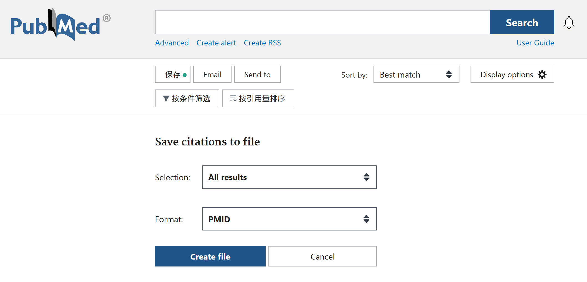
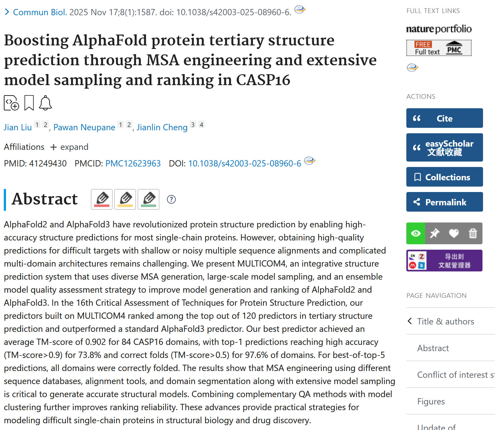

# Test Cases

[Back to README](../README.md)

---

## Index

[Case1: Get PMIDs from Query](#-case-1-get-pmids-from-query)

[Case2: Fetch Metadata for pubmed papers from query or PMIDs list](#-case-2-fetch-metadata-for-pubmed-papers-from-query-or-pmids-list)

[Case3: Fetch full text data for pubmed papers from PMIDs list](#-case-3-fetch-full-text-data-for-pubmed-papers-from-pmids-list)

[Case4: Fetch full paper data (including metadata and full text data) for pubmed papers from PMIDs list](#-case-4-fetch-full-paper-data-including-metadata-and-full-text-data-for-pubmed-papers-from-pmids-list)

[Case5: Prepare batch Markdown-formatted paper data for downstream LLMs.](#-case-5-prepare-batch-markdown-formatted-pubmed-paper-data-for-downstream-llms)

[Case6: Fetch full text data for unaccessible papers based on DOI - fetch PDF then parsing it into markdown](#-case-6-fetch-full-text-data-for-unaccessible-papers-based-on-doi---fetch-pdf-then-parsing-it-into-markdown)

[Case7: Parse MinerU content_list_v2.json into canonical sectioned JSON](#-case-7-parse-mineru-content_list_v2json-into-canonical-sectioned-json)

[Case8: Search and fetch papers on other databases](#-case-8-search-and-fetch-papers-on-other-databases-preprint)


## 🧬 Case 1: Get PMIDs from Query

run the command:
```bash
paperflow pubmed-search "alphafold3 AND conformation AND ensemble" --email YOUR_EMAIL --api-key YOUR_NCBI_API_KEY -o ./test
```
the log shows:
```bash
✅ NCBI API Key set successfully. Rate limit increased to 10 req/s.
Now searching PubMed with query [alphafold3 AND conformation AND ensemble] at [2026-05-02 17:03:20] ...
found 19 related articles about [alphafold3 AND conformation AND ensemble] at [2026-05-02 17:03:22] ...
Retrieving 19 PMIDs from history server at [2026-05-02 17:03:22] ...
Fetching PMIDs 1 to 19 at [2026-05-02 17:03:22] ...
  -> Retrieved 19 PMIDs in this batch.
Total PMIDs retrieved: 19 out of 19 at [2026-05-02 17:03:23] ...
Found 19 PMIDs.
['41914502', '41779774', '41639320', '41502950', '41478913', '41432299', '41249430', '41147497', '41047853', '41014267', '40950168', '40938899', '40714407', '40549150', '40490178', '39574676', '39186607', '38996889', '38995731']
PMIDs saved to ./test/pubmed_searched_ids_2026-05-02_17-03-23.txt.
```
As you can see, we will print the PMIDs list for you and save it in a text file which can be used further.

⚠️ We also recommend using the `Search & Save plugin` on the PubMed webpage to obtain the PMID list for subsequent use.



## 🧬 Case 2: Fetch Metadata for pubmed papers from query or PMIDs list

If you do not have detailed PMID list and want to fetch meta information from query, run the command:
```bash
paperflow pubmed-meta -q "alphafold3 AND conformation AND ensemble" --email YOUR_EMAIL --api-key YOUR_NCBI_API_KEY -o ./test/alphafold3_ensemble_meta
```

the log shows:
```bash
✅ NCBI API Key set successfully. Rate limit increased to 10 req/s.
Fetching papers for query: alphafold3 AND conformation AND ensemble
Now searching PubMed with query [alphafold3 AND conformation AND ensemble] at [2026-05-02 17:07:55] ...
found 19 related articles about [alphafold3 AND conformation AND ensemble] at [2026-05-02 17:07:56] ...
Fetching articles 1 to 19 at [2026-05-02 17:07:56] ...
  -> Retrieved 19 Medline records and 19 Xml articles. Please check whether they equal and the efetch number here with esearch count.
  -> Deep mining 5 types of internal connections for 19 PMIDs at [2026-05-02 17:07:59] ...
     Fetching pubmed_pubmed_refs from pubmed for 19 PMIDs at [2026-05-02 17:07:59] ...
     Fetching pubmed_pubmed from pubmed for 19 PMIDs at [2026-05-02 17:08:02] ...
     Fetching pubmed_pubmed_reviews from pubmed for 19 PMIDs at [2026-05-02 17:08:05] ...
     Fetching pubmed_pmc from pmc for 19 PMIDs at [2026-05-02 17:08:08] ...
     Fetching pubmed_pubmed_citedin from pubmed for 19 PMIDs at [2026-05-02 17:08:12] ...
  -> Fetching external LinkOuts (Datasets, Full Text, etc.) for 19 PMIDs at [2026-05-02 17:08:15] ...
  -> Saved 41914502 metadata to ./test/alphafold3_ensemble_meta/pubmed/2026/41914502/41914502_meta.json
  -> Saved 41779774 metadata to ./test/alphafold3_ensemble_meta/pubmed/2026/41779774/41779774_meta.json
  -> Saved 41639320 metadata to ./test/alphafold3_ensemble_meta/pubmed/2026/41639320/41639320_meta.json
  -> Saved 41502950 metadata to ./test/alphafold3_ensemble_meta/pubmed/2026/41502950/41502950_meta.json
  -> Saved 41478913 metadata to ./test/alphafold3_ensemble_meta/pubmed/2026/41478913/41478913_meta.json
  -> Saved 41432299 metadata to ./test/alphafold3_ensemble_meta/pubmed/2026/41432299/41432299_meta.json
  -> Saved 41249430 metadata to ./test/alphafold3_ensemble_meta/pubmed/2025/41249430/41249430_meta.json
  -> Saved 41147497 metadata to ./test/alphafold3_ensemble_meta/pubmed/2026/41147497/41147497_meta.json
  -> Saved 41047853 metadata to ./test/alphafold3_ensemble_meta/pubmed/2026/41047853/41047853_meta.json
  -> Saved 41014267 metadata to ./test/alphafold3_ensemble_meta/pubmed/2026/41014267/41014267_meta.json
  -> Saved 40950168 metadata to ./test/alphafold3_ensemble_meta/pubmed/2025/40950168/40950168_meta.json
  -> Saved 40938899 metadata to ./test/alphafold3_ensemble_meta/pubmed/2025/40938899/40938899_meta.json
  -> Saved 40714407 metadata to ./test/alphafold3_ensemble_meta/pubmed/2025/40714407/40714407_meta.json
  -> Saved 40549150 metadata to ./test/alphafold3_ensemble_meta/pubmed/2025/40549150/40549150_meta.json
  -> Saved 40490178 metadata to ./test/alphafold3_ensemble_meta/pubmed/2025/40490178/40490178_meta.json
  -> Saved 39574676 metadata to ./test/alphafold3_ensemble_meta/pubmed/2024/39574676/39574676_meta.json
  -> Saved 39186607 metadata to ./test/alphafold3_ensemble_meta/pubmed/2024/39186607/39186607_meta.json
  -> Saved 38996889 metadata to ./test/alphafold3_ensemble_meta/pubmed/2024/38996889/38996889_meta.json
  -> Saved 38995731 metadata to ./test/alphafold3_ensemble_meta/pubmed/2024/38995731/38995731_meta.json
```

you can check the result here: [alphafold3_ensemble_meta](../test/alphafold3_ensemble_meta/)

As shown above, a `/pubmed` subfolder will be automatically created under your output directory, with all metadata JSON files saved inside this folder.

Otherwise, if you have detailed PMID list,
run the command below:
```bash
# here we use search list in case1 as an example
paperflow pubmed-meta -f ./test/pubmed_searched_ids_2026-05-02_17-03-23.txt  --email YOUR_EMAIL --api-key YOUR_NCBI_API_KEY -o ./test/alphafold3_ensemble_meta_try2
```

the log shows the same way:

```bash
✅ NCBI API Key set successfully. Rate limit increased to 10 req/s.
Fetching 19 papers from file /data2/pyPaperFlow/test/pubmed_searched_ids_2026-05-02_17-03-23.txt.
Total PMIDs to fetch: 19 at [2026-05-02 17:14:40] ...
Fetching articles 1 to 19 (PMID: ['41914502', '41779774', '41639320', '41502950', '41478913', '41432299', '41249430', '41147497', '41047853', '41014267', '40950168', '40938899', '40714407', '40549150', '40490178', '39574676', '39186607', '38996889', '38995731']) at [2026-05-02 17:14:40] ...
  -> Retrieved 19 Medline records and 19 Xml articles. Please check whether they equal and whether they match the number of this batch.
  -> Deep mining 5 types of internal connections for 19 PMIDs at [2026-05-02 17:14:43] ...
     Fetching pubmed_pmc from pmc for 19 PMIDs at [2026-05-02 17:14:43] ...
     Fetching pubmed_pubmed_citedin from pubmed for 19 PMIDs at [2026-05-02 17:14:46] ...
     Fetching pubmed_pubmed_refs from pubmed for 19 PMIDs at [2026-05-02 17:14:49] ...
     Fetching pubmed_pubmed_reviews from pubmed for 19 PMIDs at [2026-05-02 17:14:53] ...
     Fetching pubmed_pubmed from pubmed for 19 PMIDs at [2026-05-02 17:14:57] ...
  -> Fetching external LinkOuts (Datasets, Full Text, etc.) for 19 PMIDs at [2026-05-02 17:15:01] ...
  -> Saved 41914502 metadata to ./test/alphafold3_ensemble_meta_try2/pubmed/2026/41914502/41914502_meta.json
  -> Saved 41779774 metadata to ./test/alphafold3_ensemble_meta_try2/pubmed/2026/41779774/41779774_meta.json
  -> Saved 41639320 metadata to ./test/alphafold3_ensemble_meta_try2/pubmed/2026/41639320/41639320_meta.json
  -> Saved 41502950 metadata to ./test/alphafold3_ensemble_meta_try2/pubmed/2026/41502950/41502950_meta.json
  -> Saved 41478913 metadata to ./test/alphafold3_ensemble_meta_try2/pubmed/2026/41478913/41478913_meta.json
  -> Saved 41432299 metadata to ./test/alphafold3_ensemble_meta_try2/pubmed/2026/41432299/41432299_meta.json
  -> Saved 41249430 metadata to ./test/alphafold3_ensemble_meta_try2/pubmed/2025/41249430/41249430_meta.json
  -> Saved 41147497 metadata to ./test/alphafold3_ensemble_meta_try2/pubmed/2026/41147497/41147497_meta.json
  -> Saved 41047853 metadata to ./test/alphafold3_ensemble_meta_try2/pubmed/2026/41047853/41047853_meta.json
  -> Saved 41014267 metadata to ./test/alphafold3_ensemble_meta_try2/pubmed/2026/41014267/41014267_meta.json
  -> Saved 40950168 metadata to ./test/alphafold3_ensemble_meta_try2/pubmed/2025/40950168/40950168_meta.json
  -> Saved 40938899 metadata to ./test/alphafold3_ensemble_meta_try2/pubmed/2025/40938899/40938899_meta.json
  -> Saved 40714407 metadata to ./test/alphafold3_ensemble_meta_try2/pubmed/2025/40714407/40714407_meta.json
  -> Saved 40549150 metadata to ./test/alphafold3_ensemble_meta_try2/pubmed/2025/40549150/40549150_meta.json
  -> Saved 40490178 metadata to ./test/alphafold3_ensemble_meta_try2/pubmed/2025/40490178/40490178_meta.json
  -> Saved 39574676 metadata to ./test/alphafold3_ensemble_meta_try2/pubmed/2024/39574676/39574676_meta.json
  -> Saved 39186607 metadata to ./test/alphafold3_ensemble_meta_try2/pubmed/2024/39186607/39186607_meta.json
  -> Saved 38996889 metadata to ./test/alphafold3_ensemble_meta_try2/pubmed/2024/38996889/38996889_meta.json
  -> Saved 38995731 metadata to ./test/alphafold3_ensemble_meta_try2/pubmed/2024/38995731/38995731_meta.json
```

We store the meta data of the paper in a json file.
 
One example [PMID 41249430](../test/alphafold3_ensemble_meta/pubmed/2025/41249430/41249430_meta.json) listed as below:

```python
{
    "content": {
        "abstract": "AlphaFold2 and AlphaFold3 have revolutionized protein structure prediction by enabling high-accuracy structure predictions for most single-chain proteins. However, obtaining high-quality predictions for difficult targets with shallow or noisy multiple sequence alignments and complicated multi-domain architectures remains challenging. We present MULTICOM4, an integrative structure prediction system that uses diverse MSA generation, large-scale model sampling, and an ensemble model quality assessment strategy to improve model generation and ranking of AlphaFold2 and AlphaFold3. In the 16th Critical Assessment of Techniques for Protein Structure Prediction, our predictors built on MULTICOM4 ranked among the top out of 120 predictors in tertiary structure prediction and outperformed a standard AlphaFold3 predictor. Our best predictor achieved an average TM-score of 0.902 for 84 CASP16 domains, with top-1 predictions reaching high accuracy (TM-score>0.9) for 73.8% and correct folds (TM-score>0.5) for 97.6% of domains. For best-of-top-5 predictions, all domains were correctly folded. The results show that MSA engineering using different sequence databases, alignment tools, and domain segmentation along with extensive model sampling is critical to generate accurate structural models. Combining complementary QA methods with model clustering further improves ranking reliability. These advances provide practical strategies for modeling difficult single-chain proteins in structural biology and drug discovery.",
        "keywords": [],
        "mesh_terms": [
            "*Computational Biology/methods",
            "Protein Folding",
            "Models, Molecular",
            "*Protein Structure, Tertiary",
            "*Proteins/chemistry",
            "Sequence Alignment/methods",
            "*Software",
            "Sequence Analysis, Protein/methods",
            "Algorithms"
        ],
        "pub_types": [
            "Journal Article"
        ]
    },
    "contributors": {
        "medline": {
            "affiliations": [
                "Department of Electrical Engineering & Computer Science, University of Missouri, Columbia, MO, USA.",
                "NextGen Precision Health, University of Missouri, Columbia, MO, USA.",
                "Department of Electrical Engineering & Computer Science, University of Missouri, Columbia, MO, USA.",
                "NextGen Precision Health, University of Missouri, Columbia, MO, USA.",
                "Department of Electrical Engineering & Computer Science, University of Missouri, Columbia, MO, USA. chengji@missouri.edu.",
                "NextGen Precision Health, University of Missouri, Columbia, MO, USA. chengji@missouri.edu."
            ],
            "auids": [
                "ORCID: 0000-0003-0305-2853"
            ],
            "full_names": [
                "Liu, Jian",
                "Neupane, Pawan",
                "Cheng, Jianlin"
            ],
            "short_names": [
                "Liu J",
                "Neupane P",
                "Cheng J"
            ]
        },
        "xml": [
            {
                "affiliations": [
                    "Department of Electrical Engineering & Computer Science, University of Missouri, Columbia, MO, USA.",
                    "NextGen Precision Health, University of Missouri, Columbia, MO, USA."
                ],
                "full_name": "Liu, Jian",
                "identifiers": [],
                "short_name": "Liu J"
            },
            {
                "affiliations": [
                    "Department of Electrical Engineering & Computer Science, University of Missouri, Columbia, MO, USA.",
                    "NextGen Precision Health, University of Missouri, Columbia, MO, USA."
                ],
                "full_name": "Neupane, Pawan",
                "identifiers": [],
                "short_name": "Neupane P"
            },
            {
                "affiliations": [
                    "Department of Electrical Engineering & Computer Science, University of Missouri, Columbia, MO, USA. chengji@missouri.edu.",
                    "NextGen Precision Health, University of Missouri, Columbia, MO, USA. chengji@missouri.edu."
                ],
                "full_name": "Cheng, Jianlin",
                "identifiers": [
                    "0000-0003-0305-2853"
                ],
                "short_name": "Cheng J"
            }
        ]
    },
    "identity": {
        "doi": "10.1038/s42003-025-08960-6",
        "pmid": "41249430",
        "title": "Boosting AlphaFold protein tertiary structure prediction through MSA engineering and extensive model sampling and ranking in CASP16."
    },
    "links": {
        "cites": [
            "41178755",
            "40672254"
        ],
        "entrez": {},
        "external": [
            {
                "attribute": "free resource",
                "category": "Full Text Sources",
                "linkname": "",
                "provider": "Nature Publishing Group",
                "url": "https://doi.org/10.1038/s42003-025-08960-6"
            },
            {
                "attribute": "free resource",
                "category": "Full Text Sources",
                "linkname": "",
                "provider": "PubMed Central",
                "url": "https://pmc.ncbi.nlm.nih.gov/articles/pmid/41249430/"
            },
            {
                "attribute": "free resource",
                "category": "Research Materials",
                "linkname": "",
                "provider": "NCI CPTC Antibody Characterization Program",
                "url": "https://antibodies.cancer.gov/detail/CPTC-TOP1-1"
            }
        ],
        "pmc": [
            "12623963"
        ],
        "refs": [
            "40799498",
            "40452318",
            "39123049",
            "38718835",
            "38167654",
            "37949999",
            "37679431",
            "36927031",
            "36734597",
            "34873061",
            "34453465",
            "34291486",
            "34282049",
            "34265844",
            "31942072",
            "31696235",
            "31676016",
            "31399549",
            "31235882",
            "30395287",
            "29959318",
            "29228193",
            "29228185",
            "27899574",
            "25391399",
            "24225321",
            "23047561",
            "22198341",
            "20718988",
            "18542861",
            "11159328"
        ],
        "review": [
            "41249430",
            "38316555",
            "38986287",
            "40973394",
            "39970826",
            "40332289"
        ],
        "similar": [
            "41249430",
            "40661500",
            "40585263",
            "40452318",
            "40161604",
            "41170922",
            "41014267",
            "40820259",
            "40851426",
            "40501681",
            "40762404",
            "41147497",
            "40751131",
            "37650367",
            "19077267",
            "40847537",
            "17553833",
            "40874652",
            "40799498",
            "41104652",
            "34599769",
            "37949999",
            "34382712",
            "26369671",
            "40502139",
            "38316555",
            "34331351",
            "31344267",
            "19701941",
            "41313605",
            "20066664",
            "19777061",
            "34240477",
            "34162922",
            "30985027",
            "28093407",
            "38986287",
            "24637808",
            "41165252",
            "40950168",
            "14579329",
            "34455641",
            "37293073",
            "37679431",
            "40195868",
            "19722267",
            "40810260",
            "40488225",
            "25431331",
            "28748648",
            "41047853",
            "37565699",
            "18452616",
            "34291486",
            "18487301",
            "16187361",
            "26445311",
            "41201924",
            "16187348",
            "18215316",
            "37321965",
            "41257887",
            "24018415",
            "34884640",
            "41081541",
            "35034173",
            "39052676",
            "29082551",
            "17452345",
            "22069035",
            "41454828",
            "41325379",
            "40778521",
            "31365149",
            "31471916",
            "40973394",
            "39970826",
            "15359422",
            "27028541",
            "17570145",
            "14579328",
            "29139163",
            "22168237",
            "40332289",
            "21301031",
            "23812990",
            "40696837",
            "33850214",
            "26713437",
            "41045049",
            "26343917",
            "38913900",
            "31918654",
            "40067116",
            "20470364",
            "15939584",
            "22545707",
            "17680686",
            "41261173",
            "31634369"
        ],
        "text_mined": []
    },
    "metadata": {
        "entrez_date": "2025/11/18 00:28",
        "fetched_at": "2026-05-02 15:17:48"
    },
    "source": {
        "journal_abbrev": [
            "Commun Biol"
        ],
        "journal_title": [
            "Communications biology"
        ],
        "pub_date": "2025 Nov 17",
        "pub_types": [
            "Journal Article"
        ],
        "pub_year": "2025"
    }
}

```




## 🧬 Case 3: Fetch full text data for pubmed papers from PMIDs list

If you only need to fetch the full text from PMIDs — where the `full text refers to the main body of a paper` (the complete textual content equivalent to that parsed from PDF files) — you can simply run
```bash
# we choose pmid 39570595 here as an example
paperflow pubmed-content -p 39570595  --email YOUR_EMAIL --api-key YOUR_NCBI_API_KEY -o ./test/full_text
```

the log shows
```bash
✅ NCBI API Key set successfully. Rate limit increased to 10 req/s.
Downloading full texts for 1 PMIDs from file provided PMIDs.
Fetching full text for 1 Pubmed articles at [2026-05-02 17:25:41] ...
 -> Converting Pubmed articles 1 to 1 (PMID : ['39570595']) to PMC IDs at [2026-05-02 17:25:41] ...
  -> Mapped 1 out of 1 PMIDs to valid PMC IDs. Downloading full text XML for these PMC IDs at [2026-05-02 17:25:42] ...
  -> Saved XML to ./test/full_text/pubmed/2024/39570595/39570595_content.xml
  -> Saved parsed JSON to ./test/full_text/pubmed/2024/39570595/39570595_content.json
  -> Saved parsed text to ./test/full_text/pubmed/2024/39570595/39570595_content.md
```

As you can see, for full-text data, we handle it differently from metadata—while metadata is simply stored in a JSON file named `{PMID}_meta.json`, full-text data is output into three files with distinct formats, each serving a specific purpose:
* **{PMID}_content.xml**: Stores the raw XML content retrieved directly from the response, preserving the original data structure.
* **{PMID}_content.json**: Contains detailed, structured full-text content. This format allows for direct extraction of specific sections (e.g., introduction, results, discussion), making it ideal for quick exploration or targeted analysis of particular parts of the text.
* **{PMID}_content.md**: Saves the full text of the paper in Markdown format. Its clean, human-readable structure makes it well-suited for high-throughput summarization tasks using LLMs/AI tools (such as ChatGPT or other preferred models).

`Core Principle: JSON for coding, Markdown for LLM prompting.`


or you can batch download what you want 
```bash
# we use searched_pmids.txt generated by Case1
paperflow download-fulltext  -f ./test/pubmed_searched_ids_2026-05-02_17-03-23.txt  --email YOUR_EMAIL --api-key YOUR_NCBI_API_KEY -o ./test/alphafold_ensemble_content_try3
```

the log shows 
```bash
✅ NCBI API Key set successfully. Rate limit increased to 10 req/s.
Downloading full texts for 19 PMIDs from file /data2/pyPaperFlow/test/pubmed_searched_ids_2026-05-02_17-03-23.txt.
Fetching full text for 19 Pubmed articles at [2026-05-02 18:09:34] ...
 -> Converting Pubmed articles 1 to 19 (PMID : ['41914502', '41779774', '41639320', '41502950', '41478913', '41432299', '41249430', '41147497', '41047853', '41014267', '40950168', '40938899', '40714407', '40549150', '40490178', '39574676', '39186607', '38996889', '38995731']) to PMC IDs at [2026-05-02 18:09:34] ...
  -> Mapped 10 out of 19 PMIDs to valid PMC IDs. Downloading full text XML for these PMC IDs at [2026-05-02 18:09:36] ...
  -> Saved XML to ./test/alphafold_ensemble_content_try3/pubmed/2025/40950168/40950168_content.xml
  -> Saved parsed JSON to ./test/alphafold_ensemble_content_try3/pubmed/2025/40950168/40950168_content.json
  -> Saved parsed text to ./test/alphafold_ensemble_content_try3/pubmed/2025/40950168/40950168_content.md
  -> Saved XML to ./test/alphafold_ensemble_content_try3/pubmed/2026/41914502/41914502_content.xml
  -> Saved parsed JSON to ./test/alphafold_ensemble_content_try3/pubmed/2026/41914502/41914502_content.json
  -> Saved parsed text to ./test/alphafold_ensemble_content_try3/pubmed/2026/41914502/41914502_content.md
  -> Saved XML to ./test/alphafold_ensemble_content_try3/pubmed/2025/41432299/41432299_content.xml
  -> Saved parsed JSON to ./test/alphafold_ensemble_content_try3/pubmed/2025/41432299/41432299_content.json
  -> Saved parsed text to ./test/alphafold_ensemble_content_try3/pubmed/2025/41432299/41432299_content.md
  -> Saved XML to ./test/alphafold_ensemble_content_try3/pubmed/2025/40549150/40549150_content.xml
  -> Saved parsed JSON to ./test/alphafold_ensemble_content_try3/pubmed/2025/40549150/40549150_content.json
  -> Saved parsed text to ./test/alphafold_ensemble_content_try3/pubmed/2025/40549150/40549150_content.md
  -> Saved XML to ./test/alphafold_ensemble_content_try3/pubmed/2026/41147497/41147497_content.xml
  -> Saved parsed JSON to ./test/alphafold_ensemble_content_try3/pubmed/2026/41147497/41147497_content.json
  -> Saved parsed text to ./test/alphafold_ensemble_content_try3/pubmed/2026/41147497/41147497_content.md
  -> Saved XML to ./test/alphafold_ensemble_content_try3/pubmed/2024/39574676/39574676_content.xml
  -> Saved parsed JSON to ./test/alphafold_ensemble_content_try3/pubmed/2024/39574676/39574676_content.json
  -> Saved parsed text to ./test/alphafold_ensemble_content_try3/pubmed/2024/39574676/39574676_content.md
  -> Saved XML to ./test/alphafold_ensemble_content_try3/pubmed/2025/41249430/41249430_content.xml
  -> Saved parsed JSON to ./test/alphafold_ensemble_content_try3/pubmed/2025/41249430/41249430_content.json
  -> Saved parsed text to ./test/alphafold_ensemble_content_try3/pubmed/2025/41249430/41249430_content.md
  -> Saved XML to ./test/alphafold_ensemble_content_try3/pubmed/2024/38995731/38995731_content.xml
  -> Saved parsed JSON to ./test/alphafold_ensemble_content_try3/pubmed/2024/38995731/38995731_content.json
  -> Saved parsed text to ./test/alphafold_ensemble_content_try3/pubmed/2024/38995731/38995731_content.md
  -> Saved XML to ./test/alphafold_ensemble_content_try3/pubmed/2025/40938899/40938899_content.xml
  -> Saved parsed JSON to ./test/alphafold_ensemble_content_try3/pubmed/2025/40938899/40938899_content.json
  -> Saved parsed text to ./test/alphafold_ensemble_content_try3/pubmed/2025/40938899/40938899_content.md
  -> Saved XML to ./test/alphafold_ensemble_content_try3/pubmed/2026/41502950/41502950_content.xml
  -> Saved parsed JSON to ./test/alphafold_ensemble_content_try3/pubmed/2026/41502950/41502950_content.json
  -> Saved parsed text to ./test/alphafold_ensemble_content_try3/pubmed/2026/41502950/41502950_content.md

```
as you can imagine, not all pmids have a validated pmc id, you can try other tools for free full text extraction. 


## 🧬 Case 4: Fetch full paper data (including metadata and full text data) for pubmed papers from PMIDs list

Now if you want to get everything of papers you want, not just metadata or full text but BOTH!

You can simply run 
```bash
# from query 
paperflow pubmed-all --query "IDR AND interaction AND deep learning" --email YOUR_EMAIL --api-key YOUR_NCBI_API_KEY -o ./test/full_paper_test

# from PMID list, same as above
```

for query subcommand, the log shows 
```bash
✅ NCBI API Key set successfully. Rate limit increased to 10 req/s.
=== Step 1: Fetching Metadata ===
Now searching PubMed with query [IDR AND interaction AND deep learning] at [2026-05-02 18:19:06] ...
found 6 related articles about [IDR AND interaction AND deep learning] at [2026-05-02 18:19:07] ...
Fetching articles 1 to 6 at [2026-05-02 18:19:07] ...
  -> Retrieved 6 Medline records and 6 Xml articles. Please check whether they equal and the efetch number here with esearch count.
  -> Deep mining 5 types of internal connections for 6 PMIDs at [2026-05-02 18:19:10] ...
     Fetching pubmed_pubmed from pubmed for 6 PMIDs at [2026-05-02 18:19:10] ...
     Fetching pubmed_pubmed_reviews from pubmed for 6 PMIDs at [2026-05-02 18:19:12] ...
     Fetching pubmed_pmc from pmc for 6 PMIDs at [2026-05-02 18:19:14] ...
     Fetching pubmed_pubmed_refs from pubmed for 6 PMIDs at [2026-05-02 18:19:15] ...
     Fetching pubmed_pubmed_citedin from pubmed for 6 PMIDs at [2026-05-02 18:19:17] ...
  -> Fetching external LinkOuts (Datasets, Full Text, etc.) for 6 PMIDs at [2026-05-02 18:19:19] ...
  -> Saved 41534519 metadata to ./test/full_paper_test/pubmed/2026/41534519/41534519_meta.json
  -> Saved 41378882 metadata to ./test/full_paper_test/pubmed/2025/41378882/41378882_meta.json
  -> Saved 40286477 metadata to ./test/full_paper_test/pubmed/2025/40286477/40286477_meta.json
  -> Saved 39763873 metadata to ./test/full_paper_test/pubmed/2025/39763873/39763873_meta.json
  -> Saved 38701796 metadata to ./test/full_paper_test/pubmed/2024/38701796/38701796_meta.json
  -> Saved 36851914 metadata to ./test/full_paper_test/pubmed/2023/36851914/36851914_meta.json

=== Step 2: Fetching Full Text ===
Fetching full text for 6 Pubmed articles at [2026-05-02 18:19:22] ...
 -> Converting Pubmed articles 1 to 6 (PMID : ['41534519', '41378882', '40286477', '39763873', '38701796', '36851914']) to PMC IDs at [2026-05-02 18:19:22] ...
  -> Mapped 3 out of 6 PMIDs to valid PMC IDs. Downloading full text XML for these PMC IDs at [2026-05-02 18:19:24] ...
  -> Saved XML to ./test/full_paper_test/pubmed/2023/36851914/36851914_content.xml
  -> Saved parsed JSON to ./test/full_paper_test/pubmed/2023/36851914/36851914_content.json
  -> Saved parsed text to ./test/full_paper_test/pubmed/2023/36851914/36851914_content.md
  -> Saved XML to ./test/full_paper_test/pubmed/2025/41378882/41378882_content.xml
  -> Saved parsed JSON to ./test/full_paper_test/pubmed/2025/41378882/41378882_content.json
  -> Saved parsed text to ./test/full_paper_test/pubmed/2025/41378882/41378882_content.md
  -> Saved XML to ./test/full_paper_test/pubmed/2025/39763873/39763873_content.xml
  -> Saved parsed JSON to ./test/full_paper_test/pubmed/2025/39763873/39763873_content.json
  -> Saved parsed text to ./test/full_paper_test/pubmed/2025/39763873/39763873_content.md

=== Step 3: Processing and Saving Metadata ===
  -> Saved 41534519 metadata to ./test/full_paper_test/pubmed/2026/41534519/41534519_meta.json
  -> Extracted 2 URLs from full text for PMID 41378882
  -> Saved 41378882 metadata to ./test/full_paper_test/pubmed/2025/41378882/41378882_meta.json
  -> Saved 40286477 metadata to ./test/full_paper_test/pubmed/2025/40286477/40286477_meta.json
  -> Extracted 2 URLs from full text for PMID 39763873
  -> Saved 39763873 metadata to ./test/full_paper_test/pubmed/2025/39763873/39763873_meta.json
  -> Saved 38701796 metadata to ./test/full_paper_test/pubmed/2024/38701796/38701796_meta.json
  -> Extracted 29 URLs from full text for PMID 36851914
  -> Saved 36851914 metadata to ./test/full_paper_test/pubmed/2023/36851914/36851914_meta.json

```

As shown above, two types of files will be generated: `{PMID}_meta.*` and `{PMID}_content.*`.


## 🧬 Case 5: Prepare batch Markdown-formatted Pubmed paper data for downstream LLMs. 

Once you have retrieved all relevant papers(meta+content) on a specific topic or theme, the next step is to aggregate them into a unified collection.
In this step, we merge all papers with complete metadata and full content into a `paper-level JSON file` for consolidated summarization.
You may also extract designated sections of these papers—such as the abstract, discussion, and conclusion—and compile them into a well-structured Markdown file, which is fully compatible with `downstream LLM text-based parsing tasks`.

```bash
# paper directory from Case4 result
paperflow pubmed-merge-json -i /data2/pyPaperFlow/test/full_paper_test -o /data2/pyPaperFlow/test/full_paper_test --jsonl -s /data2/pyPaperFlow/test/full_paper_test
```
the log shows

```
✅ Please check the merged pubmed JSON/JSONL file at /data2/pyPaperFlow/test/full_paper_test and the merge statistics file at /data2/pyPaperFlow/test/full_paper_test. Also, a JSON file per paper is created within the PMID subfolders.
```

You can access the merged JSONL file [here](../test/full_paper_test/full_paper_test_2026-05-05_22-02-51.jsonl), where each line corresponds to one paper in JSON format. The statistical results are also available [here](../test/full_paper_test/full_paper_test_stats_2026-05-05_22-02-51.json).

In statistical JSON file, you can see PMID `"38701796","40286477","41534519"` paper is content-missing. 

For these papers, we provide a DOI-based PDF retrieval module, along with another module that parses PDF files into Markdown format, which is fully compatible with the aforementioned `{PMID}.json` files.

Additionally, each paper has a corresponding `{PMID}.json` file containing both metadata and full content information. 

Next, you can use the merged JSONL/JSON file to extract specific sections of interest (e.g., abstract, discussion, conclusion) and compile them into a well-structured Markdown file for downstream LLM text-based parsing tasks.

But you need to provide a configuration file to specify the sections to extract.

Here is an example configuration file:
```bash
metadata_fields:
  - identity.title
  - identity.pmid
  - identity.doi
  - content.keywords
  - content.mesh_terms
  - content.pub_types
  - content.abstract # abstract in metadata first, fall back in content sections(deprecated)
  - contributors.medline
  - contributors.xml
  - links.cites
  - links.entrez
  - links.external
  - links.pmc
  - links.refs
  - links.review
  - links.similar
  - links.text_mined
  - metadata.entrez_date
  - metadata.fetched_at
  - source.journal_abbrev
  - source.journal_title
  - source.pub_date
  - source.pub_types
  - source.pub_year

content_sections:
  - abstract
  - introduction
  - methods
  - results
  - discussion
  - conclusion
  - supplementary
  - availability
  - funding
  - acknowledgements
  - author_contributions

```

As you can see, the `metadata_fields` are actually the keys in the metadata JSON file, and you can specify which fields to extract based on your needs. 
However, the `content_sections` differ from one another, as we extract hierarchical nodes from XML files.
We initially parse distinct nodes in XML format. Fortunately, the `first-level nodes` under the body hierarchy closely correspond to `standard academic sections including abstract, introduction, methods, results, discussion, and conclusion`. For this reason, we directly designate these nodes as content_sections for selective content extraction.
With `simple regular expression matching and string manipulation`, we can realize the mapping and extraction of unified content_sections across different texts.
You may customize which parts to extract by configuring the content_sections field in the `config.yaml` file.
If no custom YAML configuration file is provided, all the above content_sections will be extracted by default, i.e., the full text of the main content.


You can try the following command:
```bash
paperflow pubmed-extract-md -i ./test/full_paper_test/full_paper_test_2026-05-05_22-02-51.jsonl -o ./test/full_paper_test/test_no_yaml.md 

```

the log shows
```bash
Successfully exported 6 papers to /data2/pyPaperFlow/test/full_paper_test/test_no_yaml.md
```

the output markdown file is [here](../test/full_paper_test/test_no_yaml.md)

Each paper is separated by `---` in the markdown file, which is suitable for downstream LLM text-based parsing tasks.

If you want to use a custom YAML configuration file(an example is in [test.yaml](../test/full_paper_test/test.yaml)), you can run the following command:
```bash
paperflow pubmed-extract-md -i ./test/full_test_20_test_2026-05-05_22-02-51.jsonl -o ./test/full_paper_test/test_with_yaml.md -c ./test.yaml
```

the output markdown file is [here](../test/full_paper_test/test_with_yaml.md), where only the sections specified in the YAML file are extracted and compiled into the markdown file.

And next, you can use the generated markdown file for downstream LLM-based summarization or other text-based parsing tasks (e.g. Summarize over the conclusion and discussion sections of all these papers to put forward a research question).


## 🧬 Case 6: Fetch full text data for unaccessible papers based on DOI - fetch PDF then parsing it into markdown 

For those papers that are content-missing (Pubmed papers missing PMC links, or papers with DOI in other databases but no PDF available), we provide a DOI-based PDF retrieval module, along with another module that parses PDF files into Markdown format.

```python 
❯ paperflow paper-fetch --help
usage: paper-fetch [-h] [--title TITLE] [--batch FILE] [--out DIR] [--dry-run]
                   [--format {json,text}] [--pretty] [--stream] [--overwrite]
                   [--idempotency-key KEY] [--timeout SECONDS] [--version]
                   [doi]

Fetch legal open-access PDFs by DOI via Unpaywall, Semantic Scholar, arXiv, PMC, and bioRxiv/medRxiv.

positional arguments:
  doi                   DOI to fetch (e.g. 10.1038/s41586-020-2649-2). Use '-' to
                        read from stdin.

options:
  -h, --help            show this help message and exit
  --title TITLE         paper title; resolved to a DOI via Crossref before download.
                        Mutually exclusive with positional DOI / --batch.
  --batch FILE          file with one DOI per line for bulk download. Use '-' to read
                        from stdin.
  --out DIR             output directory (default: pdfs)
  --dry-run             resolve sources without downloading; preview the PDF URL and
                        filename
  --format {json,text}  output format. json for agents, text for humans. Default:
                        json when stdout is not a TTY, text otherwise.
  --pretty              pretty-print JSON output (2-space indent)
  --stream              emit one NDJSON result per line on stdout as each DOI
                        resolves (batch mode)
  --overwrite           re-download even if the destination file already exists
  --idempotency-key KEY
                        safe-retry key; re-running with the same key replays the
                        original envelope from <out>/.paper-fetch-idem/
  --timeout SECONDS     HTTP timeout in seconds per request (default: 30)
  --version             show program's version number and exit

exit codes:
  0  all DOIs resolved successfully
  1  unresolved (some DOIs had no OA copy; no transport failure)
  3  validation error (bad arguments)
  4  transport error (network / download / IO failure; retryable class)

subcommands:
  schema                 print the machine-readable CLI schema and exit (no network)

stdin:
  paper-fetch -          read a single DOI from stdin
  paper-fetch --batch -  read DOIs line-by-line from stdin

output:
  stdout emits one JSON object per invocation (NDJSON with --stream).
  stderr emits NDJSON progress events when --format json, prose when --format text.
  stdout format auto-detects TTY: json when piped/captured, text in a terminal.

examples:
  paper-fetch 10.1038/s41586-020-2649-2
  paper-fetch 10.1038/s41586-020-2649-2 --dry-run
  paper-fetch --batch dois.txt --out ./papers --format text
  echo 10.1038/s41586-020-2649-2 | paper-fetch --batch -
  paper-fetch schema
```

We recommend you using only arguments below for pdf fetching and leave the rest arguments as default values.
```
--title
--batch
--out
--dry-run
--timeout
```

Here we use paper [IDPFold](https://pubmed.ncbi.nlm.nih.gov/41082321/) as an example, its DOI is `10.1002/advs.202511636`

so you can run the following command to fetch its PDF file:
```bash
paperflow paper-fetch  --out ./test/Other_database --timeout 30  10.1002/advs.202511636
```

the log shows
```bash
==> 10.1002/advs.202511636
  [unpaywall] trying…
  [unpaywall] no PDF
  [semantic_scholar] trying…
  [semantic_scholar] no PDF
  [europe_pmc] https://europepmc.org/articles/PMC12752595?pdf=render
  [pmc] https://www.ncbi.nlm.nih.gov/pmc/articles/PMC12752595/pdf/
  saved → /data2/pyPaperFlow/test/Other_database/Zhu_2025_AdvancedScience_Accurate_Generation_of_Conformational_En.pdf
[europe_pmc] 10.1002/advs.202511636 → /data2/pyPaperFlow/test/Other_database/Zhu_2025_AdvancedScience_Accurate_Generation_of_Conformational_En.pdf  (saved)

1/1 succeeded  (0 failed)
```

the output pdf file is [here](../test/Other_database/Zhu_2025_AdvancedScience_Accurate_Generation_of_Conformational_En.pdf)

After you get the PDF file, you can use the following command to parse it into Markdown format:
```bash
paperflow pdf2md 

```

a typical log shows the following:
```
2026-05-09 09:12:55.360 | INFO     | mineru.cli.client:run_orchestrated_cli:874 - Started local mineru-api at http://127.0.0.1:48227
2026-05-09 09:12:56.342 | INFO     | __main__:create_app:260 - Request concurrency limited to 3
Start MinerU FastAPI Service: http://127.0.0.1:48227
API documentation: http://127.0.0.1:48227/docs
INFO:     Started server process [2957300]
INFO:     Waiting for application startup.
INFO:     Application startup complete.
INFO:     Uvicorn running on http://127.0.0.1:48227 (Press CTRL+C to quit)
2026-05-09 09:12:56.364 | INFO     | mineru.cli.client:run_planned_task:771 - Submitting batch 1/1 | 1 document, 12 pages in this batch | 12 pages total | task#1 [Zhu_2025_AdvancedScience_Accurate_Generation_of_Conformational_En]
2026-05-09 09:12:57.588 | INFO     | mineru.backend.pipeline.pipeline_analyze:doc_analyze_streaming:183 - Pipeline processing-window multi-file run. doc_count=1, total_pages=12, window_size=64, total_batches=1
2026-05-09 09:12:58.938 | INFO     | mineru.backend.pipeline.pipeline_analyze:doc_analyze_streaming:235 - Pipeline processing window batch 1/1: 12/12 pages, batch_pages=12, doc_slices=doc0:1-12
2026-05-09 09:12:58.939 | INFO     | mineru.backend.pipeline.pipeline_analyze:batch_image_analyze:328 - GPU Memory: 1 GB, Batch Ratio: 1. 
2026-05-09 09:12:58.939 | INFO     | mineru.backend.pipeline.model_init:__init__:207 - DocAnalysis init, this may take some times......
Downloading Model from https://www.modelscope.cn to directory: /home/nicai_zht/.cache/modelscope/hub/models/OpenDataLab/PDF-Extract-Kit-1.0
2026-05-09 09:12:59,851 - modelscope - INFO - Target directory already exists, skipping creation.
Downloading Model from https://www.modelscope.cn to directory: /home/nicai_zht/.cache/modelscope/hub/models/OpenDataLab/PDF-Extract-Kit-1.0
2026-05-09 09:13:00,845 - modelscope - INFO - Target directory already exists, skipping creation.
Downloading Model from https://www.modelscope.cn to directory: /home/nicai_zht/.cache/modelscope/hub/models/OpenDataLab/PDF-Extract-Kit-1.0
2026-05-09 09:13:01,841 - modelscope - INFO - Target directory already exists, skipping creation.
Downloading Model from https://www.modelscope.cn to directory: /home/nicai_zht/.cache/modelscope/hub/models/OpenDataLab/PDF-Extract-Kit-1.0
2026-05-09 09:13:02,767 - modelscope - INFO - Target directory already exists, skipping creation.
Downloading Model from https://www.modelscope.cn to directory: /home/nicai_zht/.cache/modelscope/hub/models/OpenDataLab/PDF-Extract-Kit-1.0
2026-05-09 09:13:04,033 - modelscope - INFO - Target directory already exists, skipping creation.
Downloading Model from https://www.modelscope.cn to directory: /home/nicai_zht/.cache/modelscope/hub/models/OpenDataLab/PDF-Extract-Kit-1.0
2026-05-09 09:13:04,919 - modelscope - INFO - Target directory already exists, skipping creation.
Downloading Model from https://www.modelscope.cn to directory: /home/nicai_zht/.cache/modelscope/hub/models/OpenDataLab/PDF-Extract-Kit-1.0
2026-05-09 09:13:05,979 - modelscope - INFO - Target directory already exists, skipping creation.
Downloading Model from https://www.modelscope.cn to directory: /home/nicai_zht/.cache/modelscope/hub/models/OpenDataLab/PDF-Extract-Kit-1.0
2026-05-09 09:13:06,825 - modelscope - INFO - Target directory already exists, skipping creation.
Downloading Model from https://www.modelscope.cn to directory: /home/nicai_zht/.cache/modelscope/hub/models/OpenDataLab/PDF-Extract-Kit-1.0
2026-05-09 09:13:07,760 - modelscope - INFO - Target directory already exists, skipping creation.
Downloading Model from https://www.modelscope.cn to directory: /home/nicai_zht/.cache/modelscope/hub/models/OpenDataLab/PDF-Extract-Kit-1.0
2026-05-09 09:13:08,620 - modelscope - INFO - Target directory already exists, skipping creation.
Downloading Model from https://www.modelscope.cn to directory: /home/nicai_zht/.cache/modelscope/hub/models/OpenDataLab/PDF-Extract-Kit-1.0
2026-05-09 09:13:09,448 - modelscope - INFO - Target directory already exists, skipping creation.
Downloading Model from https://www.modelscope.cn to directory: /home/nicai_zht/.cache/modelscope/hub/models/OpenDataLab/PDF-Extract-Kit-1.0
2026-05-09 09:13:10,450 - modelscope - INFO - Target directory already exists, skipping creation.
2026-05-09 09:13:10.470 | INFO     | mineru.backend.pipeline.model_init:__init__:260 - DocAnalysis init done!
2026-05-09 09:13:10.470 | INFO     | mineru.backend.pipeline.pipeline_analyze:custom_model_init:83 - model init cost: 11.531244039535522
Layout Predict: 100%|█████████████████████████████████████████████████████████████████████████████████████████████████████| 12/12 [00:02<00:00,  4.16it/s]
MFR Predict: 100%|██████████████████████████████████████████████████████████████████████████████████████████████████████| 102/102 [00:47<00:00,  2.15it/s]
Table-ocr det: 100%|████████████████████████████████████████████████████████████████████████████████████████████████████████| 2/2 [00:00<00:00, 24.41it/s]
Downloading Model from https://www.modelscope.cn to directory: /home/nicai_zht/.cache/modelscope/hub/models/OpenDataLab/PDF-Extract-Kit-1.0
2026-05-09 09:14:02,209 - modelscope - INFO - Target directory already exists, skipping creation.
Downloading Model from https://www.modelscope.cn to directory: /home/nicai_zht/.cache/modelscope/hub/models/OpenDataLab/PDF-Extract-Kit-1.0
2026-05-09 09:14:03,144 - modelscope - INFO - Target directory already exists, skipping creation.
Table-ocr rec ch: 100%|███████████████████████████████████████████████████████████████████████████████████████████████████| 99/99 [00:00<00:00, 99.01it/s]
Table-wireless Predict: 100%|███████████████████████████████████████████████████████████████████████████████████████████████| 2/2 [00:00<00:00, 14.78it/s]
Table-wired Predict:   0%|                                                                                                          | 0/1 [00:00<?, ?it/s]Downloading Model from https://www.modelscope.cn to directory: /home/nicai_zht/.cache/modelscope/hub/models/OpenDataLab/PDF-Extract-Kit-1.0
2026-05-09 09:14:05,469 - modelscope - INFO - Target directory already exists, skipping creation.
Table-wired Predict: 100%|██████████████████████████████████████████████████████████████████████████████████████████████████| 1/1 [00:01<00:00,  1.21s/it]
Downloading Model from https://www.modelscope.cn to directory: /home/nicai_zht/.cache/modelscope/hub/models/OpenDataLab/PDF-Extract-Kit-1.0
2026-05-09 09:14:06,604 - modelscope - INFO - Target directory already exists, skipping creation.
Downloading Model from https://www.modelscope.cn to directory: /home/nicai_zht/.cache/modelscope/hub/models/OpenDataLab/PDF-Extract-Kit-1.0
2026-05-09 09:14:07,692 - modelscope - INFO - Target directory already exists, skipping creation.
OCR-det ch: 100%|█████████████████████████████████████████████████████████████████████████████████████████████████████████| 42/42 [00:03<00:00, 12.36it/s]
Seal Predict: 0it [00:00, ?it/s]
OCR-rec Predict: 100%|████████████████████████████████████████████████████████████████████████████████████████████████████| 57/57 [00:00<00:00, 93.73it/s]
Processing pages: 100%|███████████████████████████████████████████████████████████████████████████████████████████████████| 12/12 [00:01<00:00,  7.93it/s]
2026-05-09 09:14:14.019 | INFO     | mineru.cli.client:run_planned_task:807 - Completed batch 1/1 | Processed 12/12 pages | 1 of 1 batch finished | task#1 [Zhu_2025_AdvancedScience_Accurate_Generation_of_Conformational_En]
INFO:     Shutting down
INFO:     Waiting for application shutdown.
INFO:     Application shutdown complete.
INFO:     Finished server process [2957300]
Done.

```

the output is not merely a file, but a directory containing the parsed markdown file and the original PDF file, which is useful for you to check the parsing quality by comparing the markdown file with the original PDF file.

Its hierarchy is as follows:

```bash
# test history
./test/Other_database/Zhu_2025_AdvancedScience_Accurate_Generation_of_Conformational_En
└── auto
    ├── images
    │   ├── 108ab5199f55198dabe5235a25c47d5948d7a1f94c7f8ad21820772ea5f302e4.jpg
    |   ├── # lots of .jpg files
    ├── Zhu_2025_AdvancedScience_Accurate_Generation_of_Conformational_En_content_list.json
    ├── Zhu_2025_AdvancedScience_Accurate_Generation_of_Conformational_En_content_list_v2.json
    ├── Zhu_2025_AdvancedScience_Accurate_Generation_of_Conformational_En_layout.pdf
    ├── Zhu_2025_AdvancedScience_Accurate_Generation_of_Conformational_En.md
    ├── Zhu_2025_AdvancedScience_Accurate_Generation_of_Conformational_En_middle.json
    ├── Zhu_2025_AdvancedScience_Accurate_Generation_of_Conformational_En_model.json
    ├── Zhu_2025_AdvancedScience_Accurate_Generation_of_Conformational_En_origin.pdf
    └── Zhu_2025_AdvancedScience_Accurate_Generation_of_Conformational_En_span.pdf

3 directories, 45 files

```

And we only use the `.md files and _content_list_v2.json/_content_list.json files` for further processing like structuring.

So, if you only do not want to spare time dealing with the rest of the files, you can use the `--clear` argument to strip anything unnecessary.

you can run the following command 
```bash
paperflow pdf-parse -i ./test/Other_database/Zhu_2025_AdvancedScience_Accurate_Generation_of_Conformational_En.pdf  -o ./test/Other_database/  --clear
```

the log shows the same
```bash
Running: mineru -p /data2/pyPaperFlow/test/Other_database/Zhu_2025_AdvancedScience_Accurate_Generation_of_Conformational_En.pdf -o /data2/pyPaperFlow/test/Other_database -b pipeline
2026-05-11 14:19:36.551 | INFO     | mineru.cli.client:run_orchestrated_cli:874 - Started local mineru-api at http://127.0.0.1:51213
2026-05-11 14:19:37.548 | INFO     | __main__:create_app:260 - Request concurrency limited to 3
Start MinerU FastAPI Service: http://127.0.0.1:51213
API documentation: http://127.0.0.1:51213/docs
INFO:     Started server process [3574652]
INFO:     Waiting for application startup.
INFO:     Application startup complete.
INFO:     Uvicorn running on http://127.0.0.1:51213 (Press CTRL+C to quit)
2026-05-11 14:19:38.557 | INFO     | mineru.cli.client:run_planned_task:771 - Submitting batch 1/1 | 1 document, 12 pages in this batch | 12 pages total | task#1 [Zhu_2025_AdvancedScience_Accurate_Generation_of_Conformational_En]
2026-05-11 14:19:39.860 | INFO     | mineru.backend.pipeline.pipeline_analyze:doc_analyze_streaming:183 - Pipeline processing-window multi-file run. doc_count=1, total_pages=12, window_size=64, total_batches=1
2026-05-11 14:19:41.235 | INFO     | mineru.backend.pipeline.pipeline_analyze:doc_analyze_streaming:235 - Pipeline processing window batch 1/1: 12/12 pages, batch_pages=12, doc_slices=doc0:1-12
2026-05-11 14:19:41.236 | INFO     | mineru.backend.pipeline.pipeline_analyze:batch_image_analyze:328 - GPU Memory: 1 GB, Batch Ratio: 1. 
2026-05-11 14:19:41.236 | INFO     | mineru.backend.pipeline.model_init:__init__:207 - DocAnalysis init, this may take some times......
Downloading Model from https://www.modelscope.cn to directory: /home/nicai_zht/.cache/modelscope/hub/models/OpenDataLab/PDF-Extract-Kit-1.0
2026-05-11 14:19:42,150 - modelscope - INFO - Target directory already exists, skipping creation.
Downloading Model from https://www.modelscope.cn to directory: /home/nicai_zht/.cache/modelscope/hub/models/OpenDataLab/PDF-Extract-Kit-1.0
2026-05-11 14:19:43,195 - modelscope - INFO - Target directory already exists, skipping creation.
Downloading Model from https://www.modelscope.cn to directory: /home/nicai_zht/.cache/modelscope/hub/models/OpenDataLab/PDF-Extract-Kit-1.0
2026-05-11 14:19:44,141 - modelscope - INFO - Target directory already exists, skipping creation.
Downloading Model from https://www.modelscope.cn to directory: /home/nicai_zht/.cache/modelscope/hub/models/OpenDataLab/PDF-Extract-Kit-1.0
2026-05-11 14:19:44,949 - modelscope - INFO - Target directory already exists, skipping creation.
Downloading Model from https://www.modelscope.cn to directory: /home/nicai_zht/.cache/modelscope/hub/models/OpenDataLab/PDF-Extract-Kit-1.0
2026-05-11 14:19:46,272 - modelscope - INFO - Target directory already exists, skipping creation.
Downloading Model from https://www.modelscope.cn to directory: /home/nicai_zht/.cache/modelscope/hub/models/OpenDataLab/PDF-Extract-Kit-1.0
2026-05-11 14:19:47,155 - modelscope - INFO - Target directory already exists, skipping creation.
Downloading Model from https://www.modelscope.cn to directory: /home/nicai_zht/.cache/modelscope/hub/models/OpenDataLab/PDF-Extract-Kit-1.0
2026-05-11 14:19:48,168 - modelscope - INFO - Target directory already exists, skipping creation.
Downloading Model from https://www.modelscope.cn to directory: /home/nicai_zht/.cache/modelscope/hub/models/OpenDataLab/PDF-Extract-Kit-1.0
2026-05-11 14:19:48,942 - modelscope - INFO - Target directory already exists, skipping creation.
Downloading Model from https://www.modelscope.cn to directory: /home/nicai_zht/.cache/modelscope/hub/models/OpenDataLab/PDF-Extract-Kit-1.0
2026-05-11 14:19:49,836 - modelscope - INFO - Target directory already exists, skipping creation.
Downloading Model from https://www.modelscope.cn to directory: /home/nicai_zht/.cache/modelscope/hub/models/OpenDataLab/PDF-Extract-Kit-1.0
2026-05-11 14:19:50,785 - modelscope - INFO - Target directory already exists, skipping creation.
Downloading Model from https://www.modelscope.cn to directory: /home/nicai_zht/.cache/modelscope/hub/models/OpenDataLab/PDF-Extract-Kit-1.0
2026-05-11 14:19:51,640 - modelscope - INFO - Target directory already exists, skipping creation.
Downloading Model from https://www.modelscope.cn to directory: /home/nicai_zht/.cache/modelscope/hub/models/OpenDataLab/PDF-Extract-Kit-1.0
2026-05-11 14:19:52,685 - modelscope - INFO - Target directory already exists, skipping creation.
2026-05-11 14:19:52.700 | INFO     | mineru.backend.pipeline.model_init:__init__:260 - DocAnalysis init done!
2026-05-11 14:19:52.700 | INFO     | mineru.backend.pipeline.pipeline_analyze:custom_model_init:83 - model init cost: 11.464261293411255
Layout Predict: 100%|██████████████████████████████████| 12/12 [00:03<00:00,  3.96it/s]
MFR Predict: 100%|███████████████████████████████████| 102/102 [00:48<00:00,  2.10it/s]
Table-ocr det: 100%|█████████████████████████████████████| 2/2 [00:00<00:00, 24.59it/s]
Downloading Model from https://www.modelscope.cn to directory: /home/nicai_zht/.cache/modelscope/hub/models/OpenDataLab/PDF-Extract-Kit-1.0
2026-05-11 14:20:45,866 - modelscope - INFO - Target directory already exists, skipping creation.
Downloading Model from https://www.modelscope.cn to directory: /home/nicai_zht/.cache/modelscope/hub/models/OpenDataLab/PDF-Extract-Kit-1.0
2026-05-11 14:20:46,730 - modelscope - INFO - Target directory already exists, skipping creation.
Table-ocr rec ch: 100%|███████████████████████████████| 99/99 [00:00<00:00, 102.41it/s]
Table-wireless Predict: 100%|████████████████████████████| 2/2 [00:00<00:00, 19.19it/s]
Table-wired Predict:   0%|                                       | 0/1 [00:00<?, ?it/s]Downloading Model from https://www.modelscope.cn to directory: /home/nicai_zht/.cache/modelscope/hub/models/OpenDataLab/PDF-Extract-Kit-1.0
2026-05-11 14:20:48,937 - modelscope - INFO - Target directory already exists, skipping creation.
Table-wired Predict: 100%|███████████████████████████████| 1/1 [00:01<00:00,  1.11s/it]
Downloading Model from https://www.modelscope.cn to directory: /home/nicai_zht/.cache/modelscope/hub/models/OpenDataLab/PDF-Extract-Kit-1.0
2026-05-11 14:20:49,964 - modelscope - INFO - Target directory already exists, skipping creation.
Downloading Model from https://www.modelscope.cn to directory: /home/nicai_zht/.cache/modelscope/hub/models/OpenDataLab/PDF-Extract-Kit-1.0
2026-05-11 14:20:50,892 - modelscope - INFO - Target directory already exists, skipping creation.
OCR-det ch: 100%|██████████████████████████████████████| 42/42 [00:03<00:00, 12.27it/s]
Seal Predict: 0it [00:00, ?it/s]
OCR-rec Predict: 100%|█████████████████████████████████| 57/57 [00:00<00:00, 98.48it/s]
Processing pages: 100%|████████████████████████████████| 12/12 [00:01<00:00,  8.16it/s]
2026-05-11 14:20:57.180 | INFO     | mineru.cli.client:run_planned_task:807 - Completed batch 1/1 | Processed 12/12 pages | 1 of 1 batch finished | task#1 [Zhu_2025_AdvancedScience_Accurate_Generation_of_Conformational_En]
INFO:     Shutting down
INFO:     Waiting for application shutdown.
INFO:     Application shutdown complete.
INFO:     Finished server process [3574652]
Done.
✅Removed 5 source files. Only .md and necessary .json files are kept in the output directory test/Other_database.

```

now the output directory is much cleaner, it will be much more disk-space-saving for you to perform batch processing on a large number of papers.
```bash
Zhu_2025_AdvancedScience_Accurate_Generation_of_Conformational_En
└── auto
    ├── images
    │   ├── 108ab5199f55198dabe5235a25c47d5948d7a1f94c7f8ad21820772ea5f302e4.jpg
    │   ├── # lots of .jpg files
    ├── Zhu_2025_AdvancedScience_Accurate_Generation_of_Conformational_En_content_list.json
    ├── Zhu_2025_AdvancedScience_Accurate_Generation_of_Conformational_En_content_list_v2.json
    └── Zhu_2025_AdvancedScience_Accurate_Generation_of_Conformational_En.md

3 directories, 40 files
```

Because the JSON file is hard to parse into a Section-based hierarchical structure markdown file, all we need is the markdown file. But you can use other original output files for analysis or debugging.

Remember: 
- We only need the structured markdown file like what we have done in PMC papers.
Structured section like `Introduction`, `Methods`, `Results`, `Discussion`, `Conclusion`. 
- All begin with a JSON file, we parse everything and do post-processing job only for a JSON output, which contains the metadata 
and the content sections we mentioned above.
- We do selection/aggregation step ONLY on the final JSON file mentioned above, and you provide a YAML configuration file to specify which sections to extract and compile into the final markdown file. 


Because the `original JSON file generated by mineru` is hard to use directly, so we currently only use the markdown and _content_list_v2.json files for further structuring.

## 🧬 Case 7: Parse MinerU content_list_v2.json into canonical sectioned JSON

### Overview

After running MinerU's `pdf-parse` (Case 6), you get a `content_list_v2.json` file. This JSON contains raw, page-by-page block data from the PDF — titles, paragraphs, images, tables, etc. — but with no semantic structure. Section headings like "1. Introduction" or "Experimental Section" are just text strings.

The `mineru-parse` command transforms this flat JSON into a structured, canonical JSON where every section is classified into a standard academic type (abstract, introduction, methods, results, discussion, etc.). Metadata (title, authors, year, DOI, journal) and figure captions are also extracted.

   
---

   
### Usage     

```bash
# Regex backend (default, no API key needed)
paperflow mineru-parse -i content_list_v2.json -o paper.json

# AI backend with Claude
export ANTHROPIC_API_KEY="sk-ant-..."
paperflow mineru-parse -i content_list_v2.json -o paper.json --backend ai

# AI backend with DeepSeek    
export OPENAI_API_KEY="sk-..."
paperflow mineru-parse -i content_list_v2.json -o paper.json --backend ai \
  --base-url https://api.deepseek.com --model deepseek-v4-pro

# AI backend with university proxy / 大学代理
paperflow mineru-parse -i content_list_v2.json -o paper.json --backend ai \
  --base-url https://models.sjtu.edu.cn/api/v1 --model deepseek-chat --api-key your-key

# Custom config / 使用自定义配置
paperflow mineru-parse -i content_list_v2.json -o paper.json --config my_rules.yaml
```


**15 canonical section types：**

`abstract` `introduction` `results` `discussion` `methods` `conclusion` `supplementary` `availability` `funding` `acknowledgements` `author_contributions` `keywords` `conflicts` `references` `other`

---  
 

### Notes & Limitations 


It is currently recommended to continuously refine the edge‑case handling for structure parsing using your own test samples. Proceed with batch processing only when you believe most papers can be parsed correctly.


the following table shows


| CLI | Log |
| :--- | :--- |
| `paperflow mineru-parse -i /data2/pyPaperFlow/test/Other_database/Zhu_2025_AdvancedScience_Accurate_Generation_of_Conformational_En/auto/Zhu_2025_AdvancedScience_Accurate_Generation_of_Conformational_En_content_list_v2.json -o idpfold1.json --backend regex --config /data2/pyPaperFlow/src/pyPaperFlow/integrations/mineru_config.yaml` | Using regex backend with configurable aliases<br>Parsed 10 sections -> idpfold1.json<br>Sections: abstract(Abstract), introduction(Introduction), results(Results), discussion(Discussion), methods(Methods), supplementary(Supplementary Material), availability(Data & Code Availability), acknowledgements(Acknowledgements), keywords(Keywords), conflicts(Competing Interests) |
| `paperflow mineru-parse -i /data2/pyPaperFlow/test/Other_database/staring/auto/staring_content_list_v2.json  -o staring.json --backend regex --config /data2/pyPaperFlow/src/pyPaperFlow/integrations/mineru_config.yaml`  | Using regex backend with configurable aliases<br>Parsed 14 sections -> staring.json<br>Sections: abstract(Abstract), discussion(Discussion), methods(Methods), supplementary(Supplementary Material), availability(Data & Code Availability), other(Online content), other(Article), other(Additional information), other(Article), other(Statistics), other(Software and code), other(Data), other(Field-specific reporting), other(Plants)  |
| `paperflow mineru-parse -i /data2/pyPaperFlow/test/Other_database/idpfold2/auto/idpfold2_content_list_v2.json  -o idpfold2.json --backend regex --config /data2/pyPaperFlow/src/pyPaperFlow/integrations/mineru_config.yaml` | Using regex backend with configurable aliases<br>Parsed 14 sections -> idpfold2.json<br>Sections: abstract(Abstract), introduction(Introduction), discussion(Discussion), methods(Methods), availability(Data & Code Availability), acknowledgements(Acknowledgements), keywords(Keywords), conflicts(Competing Interests), references(References), other(Overview), other(Predicting global compaction across the order-disorder continuum), other(Fitting global and local experimental observations), other(Modelling multiple conformations for protein assemblies), other(Prediction conformational changes in IDR-binding) |
| `paperflow mineru-parse -i /data2/pyPaperFlow/test/Other_database/disobind/auto/disobind_content_list_v2.json  -o disobind.json --backend regex --config /data2/pyPaperFlow/src/pyPaperFlow/integrations/mineru_config.yaml`  | Using regex backend with configurable aliases<br>Parsed 36 sections -> disobind.json<br>Sections: abstract(Abstract), introduction(Introduction), discussion(Discussion), methods(Methods), supplementary(Supplementary Material), availability(Data & Code Availability), funding(Funding), acknowledgements(Acknowledgements), author_contributions(Author Contributions), conflicts(Competing Interests), references(References), other(Inter-protein contact map prediction), other(Interface residue prediction), other(Coarse-graining improves the performance), other(Comparison to AlphaFold2 and AlphaFold3), other(Using different ipTM cutoffs for AF2 and AF3), other(AF2 performs better than AF3), other(Combining Disobind and AlphaFold2 predictions), other(Performance by residue types), other(Comparison with interface predictors for IDRs), other(Protein language models allow for a shallow architecture), other(Diversity and inclusion statement), other(Declaration of generative AI and AI-assisted technologies), other(Tables), other(Key resources table), other(Gathering PDB structures of IDRs in complexes), other(Defining binary complexes containing IDRs), other(Creating merged binary complexes), other(Notations), other(Inputs and outputs for training), other(Projection dimension), other(Number of layers in the MLP), other(,  for SE loss), other(Disobind+AF2 predictions), other(Performance by residue type), other(Comparison with interface predictors for IDRs)  |
| `paperflow mineru-parse -i /data2/pyPaperFlow/test/Other_database/alphafold3/auto/alphafold3_content_list_v2.json  -o alphafold3.json --backend regex --config /data2/pyPaperFlow/src/pyPaperFlow/integrations/mineru_config.yaml`   |  Using regex backend with configurable aliases<br>Parsed 14 sections -> alphafold3.json<br>Sections: abstract(Abstract), discussion(Discussion), methods(Methods), supplementary(Supplementary Material), availability(Data & Code Availability), other(Model limitations), other(Online content), other(Metrics), other(Nucleic acid prediction baseline), other(Model performance analysis and visualization), other(Additional information), other(Article), other(Statistics), other(Software and code)  |
| `paperflow mineru-parse -i /data2/pyPaperFlow/test/Other_database/2409.02240v1/auto/2409.02240v1_content_list_v2.json -o 2409.02240v1.json --backend regex --config /data2/pyPaperFlow/src/pyPaperFlow/integrations/mineru_config.yaml` | Using regex backend with configurable aliases<br>Parsed 13 sections -> 2409.02240v1.json<br>Sections: abstract(Abstract), introduction(Introduction), methods(Methods), conclusion(Conclusion), acknowledgements(Acknowledgements), author_contributions(Author Contributions), conflicts(Competing Interests), references(References), other(Ensemble Generation), other(Ensemble Validation), other(Experimental Observables), other(ML Ensemble Generation and Validation), other(Software and Data Repositories for IDPs/IDRs)  |

you can check all the output JSON files here : [parse](../test/Other_database/parse/)

## 🧬 Case 8: Search and fetch papers on other databases: Preprint 

### 1. Search and Fetch arXiv Papers
Search arXiv first if you only want IDs, or fetch metadata and PDFs in one step.

```bash
paperflow arxiv-search "deep learning for biology" --max-results 10
paperflow arxiv-fetch "deep learning for biology" --max-results 10 --download-pdf
paperflow arxiv-fetch "deep learning for biology" --max-results 10 --download-pdf --backend paperscraper
```

Useful options:

- `--max-results`: cap the number of results. Default is **no limit** (return all matches). Unlimited retrieval is supported by the `native` backend only; `--backend paperscraper` requires an explicit `--max-results`.
- `--start-date` and `--end-date`: limit results to a date window in `YYYY-MM-DD` format.
- `--backend`: choose `native` for the built-in httpx-backed arXiv API path, or `paperscraper` to use the optional third-party adapter when installed.
- `--output-dir`: save the ID list or fetched records to a different directory.
- `--no-download-pdf`: skip PDF download and save metadata only.

Example with a date filter:

```bash
paperflow arxiv-fetch "protein folding" --start-date 2024-01-01 --end-date 2024-12-31 -o ./papers/arxiv
```

Search output is saved as `searched_arxiv_ids.txt`. Fetched records are stored under `source/year/source_id/` with JSON metadata and, when available, a PDF copy.

Fetch by ID or file: `arxiv-fetch` accepts one or more `--id` values or a `--file` of arXiv IDs (one per line) in place of a query, so you can consume `arxiv-search` output directly.

```bash
paperflow arxiv-fetch --id 1706.03762 --no-download-pdf -o ./papers/arxiv
paperflow arxiv-fetch --file ./searched_arxiv_ids.txt --no-download-pdf -o ./papers/arxiv
```

### 2. Search and Fetch bioRxiv Papers
bioRxiv query search is by default a **two-backend union**: Crossref (openRxiv, metadata relevance search + local AND) ∪ Europe PMC (preprint full-text boolean AND), deduplicated by DOI. Europe PMC's full-text search catches papers Crossref misses because it only indexes titles/abstracts (e.g. a gene written as `Zfp263` instead of `zinc finger 263`). Use `--no-europepmc` to fall back to Crossref only. When the query is itself a DOI (e.g. `10.1101/2023.06.22.546069`), it resolves the paper directly via `/works/{doi}` instead of a bibliographic search.

```bash
paperflow biorxiv-search "AlphaFold AND structure" --max-results 10
paperflow biorxiv-fetch "AlphaFold AND structure" --start-date 2026-01-01 --end-date 2026-01-31 --download-pdf
# Crossref only (no Europe PMC full text)
paperflow biorxiv-search "AlphaFold AND structure" --no-europepmc -o ./papers
```

Useful options:

- `--start-date` and `--end-date`: limit results to a date window in `YYYY-MM-DD` format (applies to both backends).
- `--europepmc` / `--no-europepmc`: whether to union Europe PMC full-text results (default `--europepmc`).
- `--output-dir`: save the ID list or fetched records to a different directory.
- `--no-download-pdf`: skip PDF download and save metadata only.

Compatibility note:

- `--window-days` is kept for CLI compatibility but is not used by the current bioRxiv search path.

Example:

```bash
paperflow biorxiv-fetch "protein interaction" --max-results 50 -o ./papers/biorxiv
```

Search output is saved as `searched_biorxiv_ids.txt`. Fetched records are stored under `source/year/source_id/` with JSON metadata and, when available, a PDF copy.

Fetch by DOI or file: `biorxiv-fetch` accepts one or more `--doi` values or a `--file` of DOIs (one per line) in place of a query, so you can consume `biorxiv-search` output directly.

```bash
paperflow biorxiv-fetch --doi 10.1101/2023.06.22.546069 --no-download-pdf -o ./papers/biorxiv
paperflow biorxiv-fetch --file ./searched_biorxiv_ids.txt --no-download-pdf -o ./papers/biorxiv
```

### 3. Search and Fetch medRxiv Papers
medRxiv query search is by default the same **two-backend union** as bioRxiv: Crossref (openRxiv, metadata relevance search + local AND) ∪ Europe PMC (preprint full-text boolean AND), deduplicated by DOI. The two platforms are distinguished by DOI accession digit count (medRxiv 8 digits vs bioRxiv 6 digits), and Europe PMC results are filtered the same way. Use `--no-europepmc` to fall back to Crossref only. When the query is itself a DOI, it resolves the paper directly.

```bash
paperflow medrxiv-search "vaccine AND efficacy" --max-results 10
paperflow medrxiv-fetch "vaccine AND efficacy" --start-date 2024-01-01 --end-date 2024-12-31 --download-pdf
# Crossref only (no Europe PMC full text)
paperflow medrxiv-search "vaccine AND efficacy" --no-europepmc -o ./papers
```

Useful options:

- `--start-date` and `--end-date`: limit results to a date window in `YYYY-MM-DD` format (medRxiv dates back to 2019-06-01; applies to both backends).
- `--max-results`: cap the number of results. Default is **no limit** (return all matches for the query).
- `--europepmc` / `--no-europepmc`: whether to union Europe PMC full-text results (default `--europepmc`).
- `--output-dir`: save the ID list or fetched records to a different directory.
- `--no-download-pdf`: skip PDF download and save metadata only.

Example:

```bash
paperflow medrxiv-fetch "long covid" --max-results 50 -o ./papers/medrxiv
```

Search output is saved as `searched_medrxiv_ids.txt`. Fetched records are stored under `source/year/source_id/` (with `source` set to `medrxiv`) with JSON metadata and, when available, a PDF copy.

Fetch by DOI or file: `medrxiv-fetch` accepts one or more `--doi` values or a `--file` of DOIs (one per line) in place of a query, so you can consume `medrxiv-search` output directly.

```bash
paperflow medrxiv-fetch --doi 10.1101/2023.06.22.546069 --no-download-pdf -o ./papers/medrxiv
paperflow medrxiv-fetch --file ./searched_medrxiv_ids.txt --no-download-pdf -o ./papers/medrxiv
```

Note: bioRxiv/medRxiv PDFs are served by `www.biorxiv.org` / `www.medrxiv.org` behind Cloudflare bot protection — **non-browser clients (curl / httpx / requests, etc.) or data-center IPs get a 403 challenge page or 429 instead of PDF bytes**. Switching to `curl` does not help: Cloudflare checks the browser TLS fingerprint + JS challenge execution, which is independent of the HTTP client.

`--download-pdf` tries the following fallback chain in order (see `biorxiv_fetcher.py::_download_pdf`):

1. `{doi}.full.pdf` (unversioned)
2. resolve the exact version via `api.biorxiv.org/details/{platform}/{doi}`, then `{doi}v{version}.full.pdf`
3. the HighWire `early` path `/content/{platform}/early/{y}/{m}/{d}/{accession}.full.pdf`
4. scrape the landing page's `<meta name="citation_pdf_url">`
5. (only when `PAPER_FETCH_CLOAK=1`) retry via CloakBrowser (needs `cloakbrowser`; optional `CLOAKBROWSER_PYTHON` / `PAPER_FETCH_CLOAK_HEADED`)
6. (only when `PAPER_FETCH_UNDETECTED=1`) retry via undetected_chromedriver + Xvfb headed Chrome, which actually solves the Cloudflare challenge and returns PDF bytes

From a Cloudflare-flagged IP, steps 1–5 (including CloakBrowser, headless or headed) can all return 403/429 or stall at "Just a moment…". Step 6 is the only path verified to reliably download PDF bytes, but it needs Chrome + chromedriver + `undetected-chromedriver` + Xvfb installed.

> **New machine / another user wants biorxiv or medRxiv PDF download — do this**: full install steps, environment variables, and debugging notes are in [undetected_fallback.md](undetected_fallback.md). In short:
>
> 1. Install Chrome (`dpkg -x` into a user dir, no sudo) + a version-matched chromedriver (Chrome for Testing)
> 2. `pip install undetected-chromedriver` (into the env that runs `paperflow`)
> 3. Install `xvfb` (on headless Linux)
> 4. Set:
>    ```bash
>    export PAPER_FETCH_UNDETECTED=1
>    export UNDETECTED_CHROME_PATH="$HOME/.local/chrome/opt/google/chrome/chrome"
>    export UNDETECTED_DRIVER_PATH="$HOME/.local/bin/chromedriver"
>    ```
>
> With `PAPER_FETCH_UNDETECTED` unset (the default), the biorxiv/medrxiv commands behave exactly as before this feature was added — no impact.

### 4. Search and Fetch ChemRxiv Papers

ChemRxiv metadata is fetched from **Crossref only** (a single backend — no Europe PMC union): the platform's official public API (`chemrxiv.org/engage/chemrxiv/public-api/v1/items`) is Cloudflare-walled to non-browser clients (HTTP 403), whereas ChemRxiv deposits every preprint to Crossref under prefix `10.26434` (publisher recorded as "American Chemical Society (ACS)", type `posted-content`). The trade-offs vs. the official API (newest-post deposit lag, metadata-only relevance search, per-version DOI duplication) are discussed in the "Why Crossref instead of the official API" note in the README. When the query is itself a DOI, it resolves the paper directly.

```bash
paperflow chemrxiv-search "base editing"
paperflow chemrxiv-fetch "base editing" --start-date 2026-08-01 --end-date 2026-12-31 --download-pdf
```

Useful options:

- `--start-date` and `--end-date`: limit results to a date window in `YYYY-MM-DD` format (ChemRxiv dates back to 2017-08-01).
- `--max-results`: cap the number of results. Default is **no limit** (return all matches for the query).
- `--output-dir`: save the ID list or fetched records to a different directory.
- `--no-download-pdf`: skip PDF download and save metadata only.

Example:

```bash
paperflow chemrxiv-fetch "AI for drug design" --max-results 50 -o ./papers/chemrxiv
```

Search output is saved as `searched_chemrxiv_ids.txt`. Fetched records are stored under `source/year/source_id/` (with `source` set to `chemrxiv`; the `/` in the DOI becomes `_` in the directory name) with JSON metadata and, when available, a PDF copy.

Fetch by DOI or file: `chemrxiv-fetch` accepts one or more `--doi` values or a `--file` of DOIs (one per line) in place of a query, so you can consume `chemrxiv-search` output directly.

```bash
paperflow chemrxiv-fetch --doi 10.26434/chemrxiv.15007590/v1 --no-download-pdf -o ./papers/chemrxiv
paperflow chemrxiv-fetch --file ./searched_chemrxiv_ids.txt --download-pdf -o ./papers/chemrxiv
```

Unlike bioRxiv/medRxiv, ChemRxiv PDFs are **not** Cloudflare-walled on the PDF route: the deterministic `https://chemrxiv.org/doi/pdf/{doi}` URL downloads directly over plain httpx (`%PDF` bytes), so no browser fallback is normally needed. If an individual fetch ever fails, `--download-pdf` still falls back to the same opt-in CloakBrowser / undetected_chromedriver chain. One caveat: Crossref registers every ChemRxiv revision as its own DOI work (`.../v1` and `.../v2` both match a search), so keep only the latest version if you do not want both.

A real chemrxiv-* run — committed sample data under [`test/chemrxiv_demo/`](../test/chemrxiv_demo/):

```bash
❯ paperflow chemrxiv-search "base editing" --start-date 2026-08-01 --end-date 2026-12-31 -o ./test/chemrxiv_demo
Found 3 ChemRxiv papers.
10.26434/chemrxiv.15007500/v1
10.26434/chemrxiv.15007500/v2
10.26434/chemrxiv.15007590/v1
ChemRxiv IDs saved to ./test/chemrxiv_demo/searched_chemrxiv_ids.txt.
```

Over roughly the last month ChemRxiv has very few "base editing" hits — and these **3 DOI records are only 2 distinct papers**:

- `10.26434/chemrxiv.15007500/v1` (posted 2026-08-17) and `/v2` (2026-08-19) are the **same** paper, *Phenonium-Ion-Mediated Skeletal Editing of Paracyclophanes*, re-submitted after a revision — Crossref registers v1 and v2 as two separate DOI works.
- `10.26434/chemrxiv.15007590/v1` (2026-08-18) is the other paper, *Multicomponent Molecular Editing of Polybutadiene: From Design Space to Battery Function*.

This is the per-version duplication caveat above: drop the stale-version DOIs from a `--file` list before fetching if you only want the newest. Now fetch the metadata and PDFs for the found DOIs:

```bash
❯ paperflow chemrxiv-fetch -f ./test/chemrxiv_demo/searched_chemrxiv_ids.txt -o ./test/chemrxiv_demo --download-pdf
Fetching 3 ChemRxiv DOIs from file /data2/pyPaperFlow/test/chemrxiv_demo/searched_chemrxiv_ids.txt.
Fetched 3 ChemRxiv papers.
Saved to /data2/pyPaperFlow/test/chemrxiv_demo/chemrxiv
```

> ✅ Unlike bioRxiv/medRxiv, all 3 PDFs downloaded **directly** over `https://chemrxiv.org/doi/pdf/{doi}` (`%PDF` bytes) — no Cloudflare 403, no browser fallback.

Browse the committed results under [`chemrxiv`](../test/chemrxiv_demo/chemrxiv/): each paper lives in `{source}/{year}/{source_id}/` (the `/` in the DOI becomes `_`, e.g. `10.26434_chemrxiv.15007590_v1/`) with JSON metadata plus the downloaded PDF.


<hr style="border: 3px solid #dd4c44; border-radius:4px;">


> 🌟 因为预印本平台的文献处理这一块，是我们工具的特色所在，所以此处对于 Case8，我们用中文将需要注意的细节具体展开讨论


### 0. 命令速查 (TL;DR)

三个平台统一:搜索命令产出 ID 清单(txt),抓取命令既能按 query 搜,也能用 `--file` 承接清单或 `--id`/`--doi` 单个抓。

**通用约定**

- **query 写法**:空格 = AND(所有词都命中);`OR` 显式或;引号 `"..."` 短语。例:`zinc finger` = zinc 且 finger;`zinc OR finger` = 任一。
- **搜索 vs 抓取**:`*-search` 只产出 ID 清单 txt;`*-fetch` 抓元数据(JSON)+ 可选 PDF。
- **输出结构**:`{输出目录}/{source}/{year}/{source_id}/`(例:`./papers/biorxiv/2023/10.1101_2023.06.22.546069/`)。
- **搜索默认不限量**;`--max-results` 限量;`--start-date/--end-date` 限日期;三者可叠加。
- **抓取的 query 模式默认上限 100**(避免一次狂下 PDF);`--file`/`--id`/`--doi` 天然不限量。
- **PDF 默认开启下载**(`--download-pdf`);只想拿元数据用 `--no-download-pdf`。

**arXiv**

```bash
# 搜索:返回全部命中
paperflow arxiv-search "protein folding" -o ./papers
# 限量 / 限日期
paperflow arxiv-search "protein folding" --max-results 50 -o ./papers
paperflow arxiv-search "protein folding" --start-date 2024-01-01 --end-date 2024-12-31 -o ./papers
# → ./papers/searched_arxiv_ids.txt

# 抓取:按 query(默认最多 100 条)
paperflow arxiv-fetch "protein folding" --max-results 50 -o ./papers
# 单个 ID(可重复 --id)
paperflow arxiv-fetch --id 1706.03762 --no-download-pdf -o ./papers
paperflow arxiv-fetch --id 1706.03762 --id 1602.02644 -o ./papers
# 承接搜索输出的清单文件(全部下载 PDF)
paperflow arxiv-fetch --file ./papers/searched_arxiv_ids.txt --download-pdf -o ./papers
```

**bioRxiv**

```bash
# 搜索:返回全部命中
paperflow biorxiv-search "zinc finger" -o ./papers
paperflow biorxiv-search "zinc finger" --max-results 20 -o ./papers
paperflow biorxiv-search "zinc finger" --start-date 2024-01-01 --end-date 2024-12-31 -o ./papers
# → ./papers/searched_biorxiv_ids.txt   (内容是 DOI)

# 抓取:按 query
paperflow biorxiv-fetch "zinc finger" --max-results 50 -o ./papers
# 单个 DOI(可重复 --doi)
paperflow biorxiv-fetch --doi 10.1101/2023.06.22.546069 --no-download-pdf -o ./papers
# 承接搜索输出的 DOI 清单
paperflow biorxiv-fetch --file ./papers/searched_biorxiv_ids.txt --download-pdf -o ./papers
```

**medRxiv**

```bash
# 搜索:返回全部命中
paperflow medrxiv-search "vaccine efficacy" -o ./papers
paperflow medrxiv-search "vaccine efficacy" --start-date 2020-01-01 --end-date 2024-12-31 -o ./papers
# → ./papers/searched_medrxiv_ids.txt

# 抓取:按 query
paperflow medrxiv-fetch "vaccine efficacy" --max-results 50 -o ./papers
# 单个 DOI
paperflow medrxiv-fetch --doi 10.1101/2020.03.20.20039555 --no-download-pdf -o ./papers
# 承接搜索输出的 DOI 清单
paperflow medrxiv-fetch --file ./papers/searched_medrxiv_ids.txt --download-pdf -o ./papers
```

**ChemRxiv**

```bash
# 搜索:返回全部命中(单一后端 Crossref,prefix 10.26434,无 Europe PMC 并集)
paperflow chemrxiv-search "AI drug design" -o ./papers
paperflow chemrxiv-search "AI drug design" --start-date 2024-01-01 --end-date 2024-12-31 -o ./papers
# → ./papers/searched_chemrxiv_ids.txt   (内容是 DOI,前缀 10.26434/...)

# 抓取:按 query(默认最多 100 条)
paperflow chemrxiv-fetch "AI drug design" --max-results 50 -o ./papers
# 单个 DOI
paperflow chemrxiv-fetch --doi 10.26434/chemrxiv.15007590/v1 --no-download-pdf -o ./papers
# 承接搜索输出的 DOI 清单
paperflow chemrxiv-fetch --file ./papers/searched_chemrxiv_ids.txt --download-pdf -o ./papers
```

**检索并集(bioRxiv / medRxiv,默认开启)**

`*-search` 与 `*-fetch` 的 **query 模式**现在默认 = Crossref(元数据相关性)∪ Europe PMC(预印本全文布尔 AND),按 DOI 去重。要点:

1. **只有 query 模式走并集**:`--file` / `--doi` 是按 DOI 直接抓,不涉及搜索,行为不变。
2. **裸词 = AND**:`zinc finger 263` → `zinc AND finger AND 263`;写 `AND/OR/NOT` 就原样透传给 Europe PMC。Crossref 侧仍按原有相关性 + 本地 AND。
3. **日期依然生效**:`--start-date/--end-date` 同时约束两个后端;若某个日期窗口内 Europe PMC 全文无命中,结果就是 0(不是没生效)。
4. 用 `--no-europepmc` 可回退到纯 Crossref。

Europe PMC 走的是预印本全文,能补上 Crossref 只看标题摘要而漏掉的「基因缩写写法」(例:`Zfp263` vs `zinc finger 263`)。

> 上面这套 **Crossref ∪ Europe PMC 并集只作用于 bioRxiv / medRxiv**。**ChemRxiv 是纯 Crossref 单后端**(prefix `10.26434`,publisher 记为 "American Chemical Society (ACS)",type `posted-content`),query 模式也**不并入 Europe PMC**。

**注意点**

1. **bioRxiv/medRxiv 的 DOI 都是 `10.1101/...`**,靠 6 位(bioRxiv) vs 8 位(medRxiv)accession 区分,所以 `--doi` 直接给 `10.1101/...` 即可,平台由命令本身决定。
2. **PDF 403 反爬**:bioRxiv/medRxiv 对非浏览器客户端常返回 403,直连失败会自动走 CloakBrowser 回退——前提是设置 `PAPER_FETCH_CLOAK=1`(可选 `CLOAKBROWSER_PYTHON` / `PAPER_FETCH_CLOAK_HEADED`)。arXiv 无此问题。
3. **推荐工作流**:先 `*-search`(不限量拿全量清单)→ 人工筛选 → `*-fetch --file`(精确抓取元数据 + 下载 PDF),避免一次抓取过多。
4. **排序说明**:并集结果中,Crossref 命中(相关性排序,`sort=relevance`)在前,Europe PMC 新增命中按其后端顺序追加。日期只能做过滤(`--start-date/--end-date`),不能"按日期排序+返回全部"(Crossref 限制日期排序不能配合 cursor 深度分页)。arXiv 按提交时间倒序。
5. **ChemRxiv 检索走 Crossref,不用官方 API**:ChemRxiv 的公开 API(`chemrxiv.org/engage/chemrxiv/public-api/v1`)对非浏览器客户端(httpx/curl)返回 Cloudflare 403,而 Crossref 侧(prefix `10.26434`)是稳定、最全的元数据通道,故 `chemrxiv-*` 只查 Crossref(也不并入 Europe PMC)。⚠️ 代价见下(版本重复 / 新贴有入库延迟 / 只看标题摘要)。完整讨论见 README「注意点:为什么预印本检索走 Crossref 元数据」。
6. **ChemRxiv PDF 直连可下**:PDF 端点固定为 `https://chemrxiv.org/doi/pdf/{doi}`,本网络实测经 httpx 直连即返回 `%PDF` 字节,**不需要** CloakBrowser / undetected_chromedriver 回退(与 bioRxiv/medRxiv 的 Cloudflare 403 相反)。万一某篇直连失败,`--download-pdf` 仍会自动走浏览器回退链。
7. **版本重复(去重要手动)**:Crossref 把 ChemRxiv 每次改版都单独注册成一个 DOI work——`10.26434/chemrxiv-2025-tj4pr-v2` 与 `chemrxiv-2025-tj4pr`、`10.26434/chemrxiv.15007500/v2` 与 `/v1` 都会作为独立结果同时命中(见下方实测,3 条 DOI 实为 2 篇论文)。`chemrxiv-*` 不去重,用 `--file` 清单抓取前可自行剔除旧版 DOI。

### 1. 搜索并获取 arXiv 论文
如果你只想先拿到 ID，可以先搜索；如果想同时获取元数据和 PDF，可以直接 fetch。

```bash
paperflow arxiv-search "deep learning for biology" --max-results 10
paperflow arxiv-fetch "deep learning for biology" --max-results 10 --download-pdf
paperflow arxiv-fetch "deep learning for biology" --max-results 10 --download-pdf --backend paperscraper
```

常用参数：

- `--start-date` / `--end-date`：按 `YYYY-MM-DD` 格式限制日期范围。
- `--backend`：可选 `native`（内置的 httpx 方案）或 `paperscraper`（安装了第三方包时可用, ⚠️ 暂时未测试paperscraper）。
- `--output-dir`：把 ID 列表或抓取结果保存到其他目录。
- `--no-download-pdf`：只保存元数据，不下载 PDF。

日期过滤示例：

```bash
paperflow arxiv-fetch "protein folding" --start-date 2024-01-01 --end-date 2024-12-31 -o ./papers/arxiv
```

搜索结果会保存为 `searched_arxiv_ids.txt`。抓取结果会按 `source/year/source_id/` 结构保存，包含 JSON 元数据，PDF 则按可用情况尽量下载。


#### arXiv 命令变体与使用示例

- **arxiv-search**: 仅检索匹配的 arXiv 记录并输出 ID 列表（不下载内容）。

    用法示例：

    ```bash
    paperflow arxiv-search "protein folding" --max-results 50 --start-date 2024-01-01 --end-date 2024-12-31
    # 将会在默认存储目录下生成 searched_arxiv_ids.txt，或使用 --output-dir 指定保存位置
    ```

    说明：`--max-results` 缺省为**不限量（返回该 query 全部命中）**，只有 `native` 后端支持不限量；`--backend paperscraper` 需要显式指定 `--max-results`。`--start-date` / `--end-date` 按 `YYYY-MM-DD` 限制提交时间范围。
    
- **arxiv-fetch**: 检索并保存每篇论文的标准化元数据（JSON），可选地下载 PDF 文件（默认开启）。

    常用选项：
    - `--download-pdf/--no-download-pdf`：是否下载 PDF（默认 `--download-pdf`）。
    - `--backend`：`native`（默认，使用 arXiv Atom API）或 `paperscraper`（需安装 `paperscraper` 包）。
    - `--output-dir`：指定保存结果的目录（默认使用全局存储目录）。
    - `--start-date` / `--end-date`：按 `YYYY-MM-DD` 限制提交时间范围。

    用法示例：

    ```bash
    # 仅保存元数据（不下载 PDF）
    paperflow arxiv-fetch "deep learning for biology" --max-results 20 --no-download-pdf -o ./papers/arxiv

    # 使用 paperscraper 后端并下载 PDF
    paperflow arxiv-fetch "deep learning for biology" --max-results 20 --download-pdf --backend paperscraper -o ./papers/arxiv
    ```

- **按 ID / 文件抓取**：`arxiv-search` 输出的是 `searched_arxiv_ids.txt`（每行一个 arXiv ID），`arxiv-fetch` 支持直接消费这些 ID，无需重新搜索。query、`--file`、`--id` 三者互斥，取其一即可。

    ```bash
    # 单个 ID（可重复 --id）
    paperflow arxiv-fetch --id 1706.03762 --no-download-pdf -o ./papers/arxiv
    paperflow arxiv-fetch --id 1706.03762 --id 1602.02644 --no-download-pdf -o ./papers/arxiv

    # 从 arxiv-search 生成的 ID 文件抓取
    paperflow arxiv-fetch --file ./searched_arxiv_ids.txt --no-download-pdf -o ./papers/arxiv
    ```

- **输出与存储**：
    - 元数据：每篇论文保存为 `{source_id}.json`，包含 `title`, `authors`, `abstract`, `published_date`, `landing_url`, `pdf_url` 等字段（存储路径示例：`{output_dir}/arxiv/2024/2301.01234v1/2301.01234v1.json`）。
    - PDF：如果可用且下载成功，则保存为 `{source_id}.pdf`，并在对应 JSON 中更新 `pdf_downloaded` 和 `pdf_path` 字段。

- **注意事项**：
    - arXiv 的抓取流程只负责元数据标准化与 PDF 下载；当前仓库没有内建将 arXiv PDF 自动解析为 Markdown/结构化全文的步骤。若需后续文本解析，请在下载后接入 PDF 解析器（例如 `pdfplumber`、`minerU`、或 OCR/布局解析管线），并将解析结果保存为 `*_parsed.md` 或结构化 JSON，以便 `merge` 等下游工具使用。


> ⚠️ 下面是 arxiv-* 模块实测用例

```python
❯ paperflow arxiv-search "zinc finger" --start-date 2025-01-01 --end-date 2026-12-31 -o ./test

Found 2 arXiv papers.
2507.06458v1
2502.09135v1
arXiv IDs saved to ./test/searched_arxiv_ids.txt.

```

此处可以查看 [searched_arxiv_ids.txt](../test/searched_arxiv_ids.txt)

然后我们可以使用 `arxiv-fetch` 来抓取这些论文的元数据和 PDF：

```python
❯  paperflow arxiv-fetch -f ./test/searched_arxiv_ids.txt -o ./test --download-pdf

Fetching 2 arXiv IDs from file /data2/pyPaperFlow/test/searched_arxiv_ids.txt.
Fetched 2 arXiv papers.
Saved to /data2/pyPaperFlow/test/arxiv
```

论文获取结果可以查看 [arxiv](../test/arxiv/)，可以发现每篇论文都按 `{source}/{year}/{source_id}/` 结构保存，包含 JSON 元数据和 PDF 文件。

至于pdf文件，我们可以使用 MinerU 或其他 PDF 解析工具来进一步处理，提取结构化内容或转换为 Markdown，然后可以和前面的 PMC 论文处理流程结合，进行后续分析和整理。


### 2. 搜索并获取 bioRxiv 论文
bioRxiv 的 query 检索(我们此处设计是)默认是**双后端并集**：Crossref（openRxiv，元数据相关性检索 + 本地 AND）∪ Europe PMC（预印本全文布尔 AND），按 DOI 去重。Europe PMC 走全文，能补上 Crossref 只看标题摘要而漏掉的「基因缩写写法」。用 `--no-europepmc` 可回退到纯 Crossref。若 query 本身是一个 DOI（如 `10.1101/2023.06.22.546069`），会直接走 `/works/{doi}` 精确取回该论文，不再做书目检索。

```bash
paperflow biorxiv-search "AlphaFold AND structure" --max-results 10
paperflow biorxiv-fetch "AlphaFold AND structure" --start-date 2026-01-01 --end-date 2026-01-31 --download-pdf
# 回退到纯 Crossref（不用 Europe PMC 全文）
paperflow biorxiv-search "AlphaFold AND structure" --no-europepmc -o ./papers
```

常用参数：

- `--start-date` / `--end-date`：按 `YYYY-MM-DD` 格式限制日期范围（对两个后端都生效）。
- `--max-results`：限制返回条数；**缺省为不限量（返回该 query 全部命中）**。
- `--europepmc` / `--no-europepmc`：是否并入 Europe PMC 全文检索（默认 `--europepmc`，开启并集）。
- `--output-dir`：把 ID 列表或抓取结果保存到其他目录。
- `--no-download-pdf`：只保存元数据，不下载 PDF。

兼容性说明：

- `--window-days` 作为 CLI 兼容参数保留，但当前检索路径不会使用该参数。

示例：  

```bash
paperflow biorxiv-fetch "protein interaction" --max-results 50 -o ./papers/biorxiv
```

搜索结果会保存为 `searched_biorxiv_ids.txt`。抓取结果会按 `source/year/source_id/` 结构保存，包含 JSON 元数据，并在可用时下载 PDF。

按 DOI / 文件抓取：`biorxiv-search` 输出的是 `searched_biorxiv_ids.txt`（每行一个 DOI），`biorxiv-fetch` 支持直接消费这些 DOI。query、`--file`、`--doi` 三者互斥，取其一即可。

```bash
# 单个 DOI（可重复 --doi）
paperflow biorxiv-fetch --doi 10.1101/2023.06.22.546069 --no-download-pdf -o ./papers/biorxiv

# 从 biorxiv-search 生成的 DOI 文件抓取
paperflow biorxiv-fetch --file ./searched_biorxiv_ids.txt --no-download-pdf -o ./papers/biorxiv
```

> ⚠️ 下面是 biorxiv-* 模块实测用例

```python
❯ paperflow biorxiv-search "zinc finger 263 OR zfp263 OR znf263" --start-date 2026-08-01 --end-date 2026-12-31 -o ./test

Found 18 bioRxiv papers.
10.64898/2026.08.25.746729
10.64898/2026.08.26.747357
10.64898/2026.08.25.747015
10.64898/2026.08.20.744945
10.64898/2026.08.13.744650
10.64898/2026.08.28.747767
10.64898/2026.08.29.747956
10.64898/2026.07.31.742039
10.64898/2026.08.20.746118
10.64898/2026.08.19.745795
10.64898/2026.08.13.744713
10.64898/2026.08.23.746472
10.64898/2026.08.22.746471
10.64898/2026.08.12.744261
10.64898/2026.08.04.740911
10.64898/2026.08.03.742597
10.64898/2026.08.19.745709
10.64898/2026.08.20.746080
bioRxiv IDs saved to ./test/searched_biorxiv_ids.txt.

```

此处可以查看 [searched_biorxiv_ids.txt](../test/searched_biorxiv_ids.txt)

然后我们可以使用 `biorxiv-fetch` 来抓取这些论文的元数据和 PDF：

```python
❯  paperflow biorxiv-fetch -f ./test/searched_biorxiv_ids.txt -o ./test --download-pdf

Fetching 18 bioRxiv DOIs from file /data2/pyPaperFlow/test/searched_biorxiv_ids.txt.
Fetched 18 bioRxiv papers.
Saved to /data2/pyPaperFlow/test/biorxiv
```

获取的论文结果可以查看 [biorxiv](../test/biorxiv/)，可以发现每篇论文都按 `{source}/{year}/{source_id}/` 结构保存，包含 JSON 元数据。

> 🌟 bioRxiv 因为有cloudflare验证，我们无法确保能够下载到pdf文件数据(尽管我们也设置了cloakbrowser)，目前测试数据一般都无法获取pdf文件。但是我们已经在 必然获取的json文件中 提供了pdf文件的url，所以`建议是人工复核下载`

我们以 [10.64898_2026.07.31.742039.json](../test/biorxiv/2026/10.64898_2026.07.31.742039/10.64898_2026.07.31.742039.json) 为例

```bash
# 关于pdf路径的两个字段信息已经在json文件中提供了
"landing_url": "https://www.biorxiv.org/content/10.64898/2026.07.31.742039",
"pdf_url": "https://www.biorxiv.org/content/10.64898/2026.07.31.742039.full.pdf"
```

目前使用 `--download-pdf` 选项下载pdf文件，会给出终端提醒
```python 
❯ paperflow biorxiv-fetch -f ./test/searched_biorxiv_ids.txt -o ./test --download-pdf
Fetching 18 bioRxiv DOIs from file /data2/pyPaperFlow/test/searched_biorxiv_ids.txt.
Fetched 18 bioRxiv papers.
PDF download: 0/18 succeeded; 18 failed. bioRxiv serves PDFs behind Cloudflare bot protection — try a different network, or set PAPER_FETCH_CLOAK=1 (needs cloakbrowser) and retry.
Saved to /data2/pyPaperFlow/test/biorxiv
```

> ⚠️ 2026-09-02 更新: 新增了 `PAPER_FETCH_UNDETECTED` 环境变量，用于启用 `undetected-chromedriver` 回退机制，以解决 Cloudflare 验证问题

现在命令运行如下:

```python
# paperflow 需要在 安装 undetected-chromedriver 的环境中运行
# 以下都可以直接在 ~/.bashrc 或 ~/.zshrc 中设置，或者在终端中直接 export
export PAPER_FETCH_UNDETECTED=1
export UNDETECTED_CHROME_PATH="$HOME/.local/chrome/opt/google/chrome/chrome"
export UNDETECTED_DRIVER_PATH="$HOME/.local/bin/chromedriver"

# 然后命令依旧
# ⚠️ 注意该命令因为需要运行浏览器，所以运行时间会比较长
paperflow biorxiv-fetch -f ./test/searched_biorxiv_ids.txt -o ./test --download-pdf      
```

现在是能够支持获取所有的biorxiv文献的pdf文件了
```bash
Fetching 18 bioRxiv DOIs from file /data2/pyPaperFlow/test/searched_biorxiv_ids.txt.
Fetched 18 bioRxiv papers.
Saved to /data2/pyPaperFlow/test/biorxiv
```

获取的论文结果可以查看 [biorxiv](../test/biorxiv/)，可以发现每篇论文都按 `{source}/{year}/{source_id}/` 结构保存，包含 JSON 元数据以及新增下载的 PDF 文件。

另外一个biorxiv文献抓取示例，参考[2026年8-9月期间一个月的base-editing关键词文献](../test/base_editing/)

### 3. 搜索并获取 medRxiv 论文
medRxiv 与 bioRxiv 共用同一套检索：默认是 Crossref（openRxiv，元数据相关性检索）∪ Europe PMC（预印本全文布尔 AND）的并集，按 DOI 去重；通过 DOI accession 位数（medRxiv 8 位 vs bioRxiv 6 位）区分平台，Europe PMC 结果同样按此过滤。query 为 DOI 时直接精确取回该论文。

```bash
paperflow medrxiv-search "vaccine AND efficacy" --max-results 10
paperflow medrxiv-fetch "vaccine AND efficacy" --start-date 2024-01-01 --end-date 2024-12-31 --download-pdf
# 回退到纯 Crossref（不用 Europe PMC 全文）
paperflow medrxiv-search "vaccine AND efficacy" --no-europepmc -o ./papers
```

常用参数：

- `--start-date` / `--end-date`：按 `YYYY-MM-DD` 格式限制日期范围（medRxiv 最早日期为 2019-06-01；对两个后端都生效）。
- `--max-results`：限制返回条数；**缺省为不限量（返回该 query 全部命中）**。
- `--europepmc` / `--no-europepmc`：是否并入 Europe PMC 全文检索（默认 `--europepmc`，开启并集）。
- `--output-dir`：把 ID 列表或抓取结果保存到其他目录。
- `--no-download-pdf`：只保存元数据，不下载 PDF。

示例：

```bash
paperflow medrxiv-fetch "long covid" --max-results 50 -o ./papers/medrxiv
```

搜索结果会保存为 `searched_medrxiv_ids.txt`。抓取结果会按 `source/year/source_id/` 结构保存（`source` 为 `medrxiv`），包含 JSON 元数据，并在可用时下载 PDF。

按 DOI / 文件抓取：`medrxiv-search` 输出的是 `searched_medrxiv_ids.txt`（每行一个 DOI），`medrxiv-fetch` 支持直接消费这些 DOI。query、`--file`、`--doi` 三者互斥，取其一即可。

```bash
# 单个 DOI（可重复 --doi）
paperflow medrxiv-fetch --doi 10.1101/2023.06.22.546069 --no-download-pdf -o ./papers/medrxiv

# 从 medrxiv-search 生成的 DOI 文件抓取
paperflow medrxiv-fetch --file ./searched_medrxiv_ids.txt --no-download-pdf -o ./papers/medrxiv
```


> ⚠️ 下面是 medrxiv-* 模块实测用例

```python 
❯ paperflow medrxiv-search "base editing" --start-date 2026-08-01 --end-date 2026-12-31 -o ./test/base_editing
Found 9 medRxiv papers.
10.64898/2026.08.11.26360004
10.64898/2026.08.20.26360670
10.64898/2026.08.24.26361180
10.64898/2026.08.11.26360205
10.64898/2026.07.30.26358885
10.64898/2026.08.05.26359678
10.64898/2026.08.03.26359558
10.64898/2026.08.11.26360119
10.64898/2026.08.10.26359569
medRxiv IDs saved to ./test/base_editing/searched_medrxiv_ids.txt.

```

可以看到，基本上在这过去的一个月中，medRxiv 上关于 base editing 的预印本论文数量不多，只有 9 篇。

我们紧接着进行抓取这些论文的元数据和 PDF：

```python
❯ paperflow medrxiv-fetch -f ./test/base_editing/searched_medrxiv_ids.txt  -o ./test/base_editing  --download-pdf
Fetching 9 medRxiv DOIs from file /data2/pyPaperFlow/test/base_editing/searched_medrxiv_ids.txt.
Fetched 9 medRxiv papers.
Saved to /data2/pyPaperFlow/test/base_editing/medrxiv
```

对于下载下来的论文结果，可以查看 [medrxiv](../test/base_editing/medrxiv/)，可以发现每篇论文都按 `{source}/{year}/{source_id}/` 结构保存，包含 JSON 元数据以及新增下载的 PDF 文件。


----

> ⚠️ 注意：bioRxiv / medRxiv 的 PDF 由 `www.biorxiv.org` / `www.medrxiv.org` 提供，其 PDF 端点走 Cloudflare 反爬——**非浏览器客户端（curl / httpx / requests 等）或数据中心 IP 会拿到 403 挑战页或 429，而不是 PDF 字节**；换用 curl 也一样，因为 Cloudflare 校验的是浏览器 TLS 指纹 + JS 挑战执行，跟用哪个 HTTP 客户端无关。

`--download-pdf` 会按顺序尝试以下回退链（实现见 `biorxiv_fetcher.py::_download_pdf`）：

1. `{doi}.full.pdf`（无版本号）
2. 通过 `api.biorxiv.org/details/{platform}/{doi}` 取精确版本号，构造 `{doi}v{version}.full.pdf`
3. HighWire `early` 路径 `/content/{platform}/early/{y}/{m}/{d}/{accession}.full.pdf`
4. 抓 landing 页的 `<meta name="citation_pdf_url">` 地址
5. （仅当 `PAPER_FETCH_CLOAK=1`）用 CloakBrowser 回退重试（需 `cloakbrowser` 环境，可选 `CLOAKBROWSER_PYTHON` / `PAPER_FETCH_CLOAK_HEADED`）
6. （仅当 `PAPER_FETCH_UNDETECTED=1`）用 undetected_chromedriver + Xvfb 有头 Chrome 回退，能真正解掉 Cloudflare 挑战并拿到 PDF 字节

从被 Cloudflare 标记的 IP 出发，前 5 步（含 CloakBrowser 无头/有头）都可能拿到 403/429 或卡 "Just a moment…"。第 6 步是唯一经实测能稳定下载到 PDF 字节的解法，但需要额外装 Chrome + chromedriver + `undetected-chromedriver` + Xvfb。

> **换机器 / 别人要用 biorxiv 或 medRxiv 的 PDF 下载，按这个做**：完整安装步骤、环境变量、以及调试手册见 [undetected_fallback.md](undetected_fallback.md)。简言之：
>
> 1. 装 Chrome（`dpkg -x` 解包到用户目录，零 sudo）+ 版本匹配的 chromedriver（Chrome for Testing）
> 2. `pip install undetected-chromedriver`（装进跑 `paperflow` 的那个环境）
> 3. 装 `xvfb`（Linux 无桌面时）
> 4. 设环境变量：
>    ```bash
>    export PAPER_FETCH_UNDETECTED=1
>    export UNDETECTED_CHROME_PATH="$HOME/.local/chrome/opt/google/chrome/chrome"
>    export UNDETECTED_DRIVER_PATH="$HOME/.local/bin/chromedriver"
>    ```
>
> 默认（不设 `PAPER_FETCH_UNDETECTED`）时，biorxiv/medrxiv 命令的行为与此功能加入前完全一致，无任何影响。

### 4. 搜索并获取 ChemRxiv 论文

ChemRxiv 挂在 Cambridge "engage" 平台，官方有公开 API，但它的 endpoint（`chemrxiv.org/engage/chemrxiv/public-api/v1/items`）对非浏览器客户端是 **Cloudflare 403 墙**，httpx/curl 直接访问拿不到数据。ChemRxiv 的元数据会沉积到 Crossref（prefix `10.26434`，publisher 记为 "American Chemical Society (ACS)"，type `posted-content`），所以 `chemrxiv-*` 走**单一后端 = Crossref**（元数据 relevance 检索，`sort=relevance` + 本地布尔 AND），**不并入 Europe PMC**。query 为 DOI 时直接精确取回该论文。为什么用 Crossref 而不是官方 API，见 README「注意点」。

```bash
paperflow chemrxiv-search "base editing"
paperflow chemrxiv-fetch "base editing" --start-date 2026-08-01 --end-date 2026-12-31 --download-pdf
```

常用参数：

- `--start-date` / `--end-date`：按 `YYYY-MM-DD` 格式限制日期范围（ChemRxiv 最早日期为 2017-08-01）。
- `--max-results`：限制返回条数；**缺省为不限量（返回该 query 全部命中）**。
- `--output-dir`：把 ID 列表或抓取结果保存到其他目录。
- `--no-download-pdf`：只保存元数据，不下载 PDF。

示例：

```bash
paperflow chemrxiv-fetch "AI for drug design" --max-results 50 -o ./papers/chemrxiv
```

搜索结果会保存为 `searched_chemrxiv_ids.txt`。抓取结果会按 `source/year/source_id/` 结构保存（`source` 为 `chemrxiv`），包含 JSON 元数据，并在可用时下载 PDF。

按 DOI / 文件抓取：`chemrxiv-search` 输出的是 `searched_chemrxiv_ids.txt`（每行一个 DOI，前缀 `10.26434/...`），`chemrxiv-fetch` 支持直接消费这些 DOI。query、`--file`、`--doi` 三者互斥，取其一即可。

```bash
# 单个 DOI（可重复 --doi）
paperflow chemrxiv-fetch --doi 10.26434/chemrxiv.15007590/v1 --no-download-pdf -o ./papers/chemrxiv

# 从 chemrxiv-search 生成的 DOI 文件抓取
paperflow chemrxiv-fetch --file ./searched_chemrxiv_ids.txt --download-pdf -o ./papers/chemrxiv
```


> ⚠️ 下面是 chemrxiv-* 模块实测用例

```python 
❯ paperflow chemrxiv-search "base editing" --start-date 2026-08-01 --end-date 2026-12-31 -o ./test/base_editing
Found 3 ChemRxiv papers.
10.26434/chemrxiv.15007500/v1
10.26434/chemrxiv.15007500/v2
10.26434/chemrxiv.15007590/v1
ChemRxiv IDs saved to ./test/base_editing/searched_chemrxiv_ids.txt.
```

可以看到，过去一个多月 ChemRxiv 上 "base editing" 的命中很少——但这 **3 条 DOI 实际只有 2 篇论文**：

- `10.26434/chemrxiv.15007500/v1`（2026-08-17）与 `/v2`（2026-08-19）是**同一篇** *Phenonium-Ion-Mediated Skeletal Editing of Paracyclophanes*（作者更新后重新提交，Crossref 把 v1/v2 各自注册成独立的 DOI work）；
- `10.26434/chemrxiv.15007590/v1`（2026-08-18）是另一篇 *Multicomponent Molecular Editing of Polybutadiene: From Design Space to Battery Function*。

这就是上面注意点第 7 条说的**版本重复**：抓取前若只想留最新版，需自行剔除旧版 DOI。

紧接着抓取这些论文的元数据和 PDF：

```python
❯ paperflow chemrxiv-fetch -f ./test/base_editing/searched_chemrxiv_ids.txt -o ./test/base_editing   --download-pdf
Fetching 3 ChemRxiv DOIs from file /data2/pyPaperFlow/test/base_editing/searched_chemrxiv_ids.txt.
Fetched 3 ChemRxiv papers.
Saved to /data2/pyPaperFlow/test/base_editing/chemrxiv
```

> ✅ 与 bioRxiv/medRxiv 不同，这次 **3 份 PDF 全部经 `chemrxiv.org/doi/pdf/{doi}` httpx 直连下载成功**（返回 `%PDF` 字节），没遇到 Cloudflare 403，无需浏览器回退。

下载下来的结果可查看 [chemrxiv](../test/base_editing/chemrxiv/)，每篇都按 `{source}/{year}/{source_id}/` 结构保存（目录名里 DOI 的 `/` 换成 `_`，如 `10.26434_chemrxiv.15007590_v1/`），包含 JSON 元数据以及新增下载的 PDF 文件。


