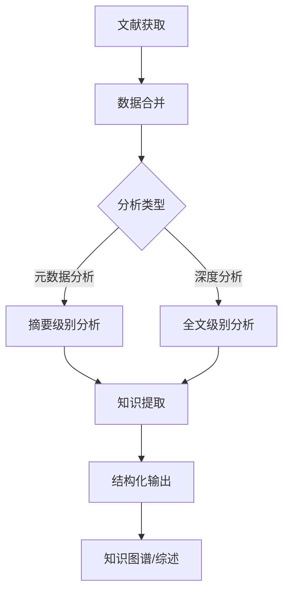

# Paper Merge Module - 设计说明与优化建议

## 📋 模块概览

`merger.py` 模块提供了一套完整的文献数据合并功能，支持多种输入方式和输出格式，专为AI分析优化。

## 🎯 核心功能

### 1. 多种输入方式

**目录合并：**
- 自动遍历 `year/pmid/` 目录结构
- 支持年份范围过滤（如 `2023-2024`）
- 按年份自动排序，保证输出有序性

**文件列表合并：**
- 支持 TXT 文件（每行一个 PMID）
- 支持 CSV 文件（读取第一列作为 PMID）
- 自动在年份子目录中查找对应的论文数据

### 2. 三种合并模式

| 模式 | 说明 | 使用场景 |
|------|------|----------|
| `metadata_only` | 仅合并元数据 | 快速浏览、文献统计、元数据批量分析 |
| `metadata_content` | 合并元数据 + 全文 | 综合阅读、深度分析、知识库构建 |
| `full_structured` | 完全结构化输出 | 专业化处理、程序化分析、知识图谱构建 |

### 3. 三种输出格式

| 格式 | 特点 | 推荐用途 |
|------|------|----------|
| Markdown | 结构清晰、易于阅读、AI友好 | 人机协作、AI直接分析、文档生成 |
| JSONL | 程序可读、一行为一单位 | 批量处理、数据流处理、数据库导入 |
| Plain Text | 简单直接、通用性强 | 简单摘要、日志记录、基础分析 |

---

## 🧠 AI分析优化建议

### 1. 文本结构化策略

#### 🎯 为什么需要结构化？

LLM 处理长文本时面临挑战：
- **上下文限制**：无法一次性处理超长内容
- **信息过载**：结构混乱导致信息提取困难
- **注意力分散**：缺乏清晰边界的文本影响理解质量

#### 📐 推荐的结构化格式

**Markdown 层级结构：**

```markdown
## 📄 Paper 1
**PMID**: `12345678`
**Title**: Paper Title

### Abstract
[摘要内容...]

### Full Text
[正文内容...]

---

## 📄 Paper 2
[下篇论文...]
```

**关键优化点：**
- 使用 `---` 或 `====================` 作为清晰分隔符
- 标题使用 `##` 级别，便于识别
- 关键信息使用粗体/代码块强调
- 保持一致的格式模式

### 2. 内容增强策略

#### 🔖 摘要处理优化

**问题：** 摘要可能过长或格式混乱

**解决方案：**
```python
# 句子切分
sentences = abstract.split('.')
# 去除空白
normalized = [s.strip() for s in sentences if s.strip()]
# 重组
clean_abstract = '. '.join(normalized)
```

**AI友好提示：**
- 每句独立成行，便于逐句处理
- 保留句号，保持语义完整
- 移除多余空白，减少干扰

#### 📊 数据表格化

**建议：** 将列表型数据转换为表格格式

**优化前：**
```
Keywords: ['keyword1', 'keyword2', 'keyword3']
MeSH Terms: ['term1', 'term2', 'term3']
```

**优化后（Markdown）：**
```markdown
| Keywords | MeSH Terms |
|----------|-------------|
| keyword1, keyword2, keyword3 | term1, term2, term3 |
```

**优势：**
- 便于AI识别结构化数据
- 减少列表解析的复杂度
- 提高数据提取的准确性

### 3. AI提示词优化

#### 💡 结构化提示框架

在 `--ai-prompts` 模式下，输出包含AI友好的提示结构：

```markdown
# 📚 Literature Corpus for AI Analysis

**任务指令**：
1. 提取每篇论文的核心方法
2. 总结研究发现和结论
3. 识别论文间的方法差异
4. 构建研究趋势分析

---

## 📄 Paper 1
[论文内容...]

---

## 📄 Paper 2
[论文内容...]
```

**效果：**
- 为LLM提供明确的任务目标
- 便于批量处理时保持一致性
- 提高回答的准确性和完整性

#### 🎯 上下文管理策略

**问题：** 一次性处理多篇论文超出上下文限制

**解决方案：**

**策略1：分批处理**
```python
# 每批处理5篇论文
batch_size = 5
for i in range(0, len(papers), batch_size):
    batch = papers[i:i+batch_size]
    process_with_llm(batch)
```

**策略2：分级处理**
```python
# 第一轮：提取摘要信息
abstracts = extract_abstracts(papers)
summary = llm.summarize(abstracts)

# 第二轮：基于摘要选择论文进行深度分析
selected = select_papers(summary)
for paper in selected:
    full_analysis = llm.analyze_full_text(paper.full_text)
```

### 4. 内容质量控制

#### ✅ 数据完整性检查

**实现代码示例：**

```python
def validate_paper_data(paper: Dict) -> bool:
    """验证论文数据完整性"""
    checks = {
        'has_pmid': bool(paper.get('pmid')),
        'has_title': bool(paper.get('identity', {}).get('title')),
        'has_abstract': bool(paper.get('content', {}).get('abstract')),
        'has_full_text': paper.get('has_full_text', False)
    }
    return all(checks.values()), checks
```

**使用建议：**
- 在合并时进行完整性验证
- 记录缺失数据的论文
- 输出质量报告

#### 🔍 重复内容检测

**实现思路：**

```python
def detect_duplicates(papers: List[Dict]) -> List[str]:
    """检测重复或高度相似的论文"""
    duplicates = []

    # 按标题检测
    titles = {}
    for paper in papers:
        title = paper['identity']['title'].lower()
        if title in titles:
            duplicates.append((paper['pmid'], titles[title]))
        else:
            titles[title] = paper['pmid']

    return duplicates
```

---

## 🚀 高级功能扩展建议

### 1. 智能章节过滤

**场景：** 只需要论文的特定部分（方法、结果、结论）

**实现方案：**

```python
class MergeConfig:
    # 新增章节过滤
    include_sections: List[str] = None  # ['abstract', 'methods', 'results']
    exclude_sections: List[str] = None  # ['references', 'acknowledgments']

    def should_include_section(self, section_name: str) -> bool:
        if self.include_sections:
            return section_name in self.include_sections
        if self.exclude_sections:
            return section_name not in self.exclude_sections
        return True
```

### 2. 多语言支持

**场景：** 处理多语言文献（中英文混合）

**实现方案：**

```python
def detect_language(text: str) -> str:
    """检测文本语言"""
    # 简单实现：基于字符集统计
    chinese_chars = sum(1 for c in text if '一' <= c <= '鿿')
    english_chars = sum(1 for c in text if c.isalpha() and c <= 'z')

    if chinese_chars > english_chars * 2:
        return 'zh'
    return 'en'

# 在输出中标记语言
f.write(f"**Language:** {detect_language(text)}\n")
```

### 3. 引用关系提取

**场景：** 构建论文间的引用图谱

**实现方案：**

```python
def extract_citations(papers: List[Dict]) -> Dict[str, List[str]]:
    """提取论文间的引用关系"""
    citations = {}

    for paper in papers:
        pmid = paper['pmid']
        paper_citations = []

        # 从全文或元数据中提取引用
        if paper.get('references'):
            for ref in paper['references']:
                paper_citations.append(ref['pmid'])

        citations[pmid] = paper_citations

    return citations
```

### 4. 统计信息增强

**当前统计：**
- 处理总数
- 成功/失败数量

**建议增强：**

```python
class MergeStatistics:
    total_processed: int
    successful: int
    failed: int
    skipped: int
    failed_pmids: List[str]

    # 新增统计项
    papers_by_year: Dict[int, int]  # 按年份统计
    papers_with_full_text: int
    average_abstract_length: int
    average_full_text_length: int
    language_distribution: Dict[str, int]
```

---

## 📝 最佳实践总结

### 1. 输入数据组织

**推荐结构：**
```
papers_dir/
├── 2023/
│   ├── 12345678/
│   │   ├── 12345678.json
│   │   └── 12345678_parsed.md
│   └── 23456789/
│       ├── 23456789.json
│       └── 23456789_parsed.md
├── 2024/
│   └── ...
└── selected_pmids.txt  # 指定PMID列表
```

### 2. 输出文件命名

**推荐命名规范：**

| 用途 | 文件名 | 示例 |
|------|----------|--------|
| 所有论文 | `all_papers_YYYY-MM-DD.md` | `all_papers_2026-04-24.md` |
| 按年份 | `papers_2023_2024.md` | `papers_2023_2024.md` |
| 按主题 | `protein_folding_papers.md` | `protein_folding_papers.md` |
| AI输入 | `ai_corpus_structured.md` | `ai_corpus_structured.md` |

### 3. AI工作流集成

**推荐工作流：**



**具体步骤：**
1. 使用 `paperflow merge` 合并数据
2. 选择合适的合并模式和格式
3. 使用LLM进行信息提取
4. 结构化存储提取结果
5. 基于结果进行知识发现

### 4. 错误处理与恢复

**推荐策略：**

```python
def robust_merge(paper_dir: str, output_path: str):
    """带错误恢复的合并"""
    # 1. 检查输出文件是否已存在
    if os.path.exists(output_path):
        backup = output_path + '.backup'
        os.rename(output_path, backup)
        print(f"Existing file backed up to: {backup}")

    # 2. 合并数据
    try:
        merger.merge_from_directory(paper_dir, output_path)
    except Exception as e:
        # 3. 保存已合并的数据
        partial_output = output_path.replace('.md', '_partial.md')
        if os.path.exists(partial_output):
            print(f"Partial merge saved to: {partial_output}")
        raise
```

---

## 🔮 未来发展方向

### 短期目标（1-3个月）

1. **章节级精确提取**
   - 基于常见论文结构（引言、方法、结果、讨论）
   - 支持自定义章节映射规则

2. **实体识别集成**
   - 自动识别蛋白质、基因、化合物等科学实体
   - 构建实体标准化和链接关系

3. **智能摘要生成**
   - 为长论文自动生成多级摘要
   - 支持摘要重写和对比功能

### 中期目标（3-6个月）

1. **知识图谱生成**
   - 自动提取论文间关系
   - 生成GraphML/JSON格式的图谱数据

2. **多模态支持**
   - 处理图表、表格、公式
   - 将非文本内容转换为文本描述

3. **API服务化**
   - 将合并功能封装为REST API
   - 支持远程批量处理

### 长期目标（6-12个月）

1. **智能排序算法**
   - 基于相关性、重要性、新颖性排序
   - 支持用户自定义排序权重

2. **增量更新机制**
   - 只处理新增或修改的论文
   - 大幅提升大规模文献库的更新效率

3. **协作分析支持**
   - 多用户协同分析功能
   - 支持标注、评论、讨论

---

## 📊 性能优化建议

### 1. 大规模数据处理

**优化策略：**

```python
from multiprocessing import Pool
from concurrent.futures import ThreadPoolExecutor

def parallel_merge(paper_dirs: List[str], output_dir: str):
    """并行合并多个目录"""

    def merge_single(paper_dir: str) -> str:
        output = os.path.join(output_dir, f"merged_{paper_dir}.md")
        merger.merge_from_directory(paper_dir, output)
        return output

    # 使用多进程处理
    with Pool(processes=min(4, len(paper_dirs))) as pool:
        results = pool.map(merge_single, paper_dirs)

    return results
```

### 2. 内存管理

**问题：** 处理大量论文时内存占用过高

**解决方案：**

```python
def memory_efficient_merge(paper_dir: str, output_path: str):
    """内存高效的合并实现"""

    with open(output_path, 'w', encoding='utf-8') as out_f:
        year_list = sorted(os.listdir(paper_dir))

        for year in year_list:
            year_dir = os.path.join(paper_dir, year)

            if not os.path.isdir(year_dir):
                continue

            pmid_list = os.listdir(year_dir)

            for pmid in pmid_list:
                # 逐个处理，避免一次性加载所有数据
                process_and_write_single_paper(
                    os.path.join(year_dir, pmid),
                    out_f
                )
```

---

## 🎓 总结与行动建议

### 立即可以实施的优化

1. ✅ 使用新创建的 `merger` 模块进行数据合并
2. ✅ 选择合适的合并模式和输出格式
3. ✅ 实施内容验证和质量检查
4. ✅ 建立规范的文件组织结构

### 中期规划

1. 🔄 集成实体识别和关系提取
2. 🔄 开发章节级智能提取
3. 🔄 构建AI辅助分析工作流

### 长期展望

1. 🚀 构建完整的知识图谱系统
2. 🚀 开发多模态文献处理能力
3. 🚀 建立协作分析平台

---

**核心原则：一切皆token，一切皆text文本**

我们的目标是将获取的一切数据都转换为高质量的文本格式，优化喂给LLM的过程，提高信息提取的准确性和效率。