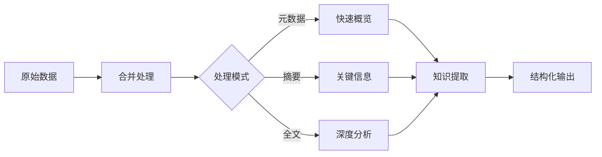

# 🚀 Paper Merge 模块 - 快速上手指南

## 📚 快速开始

### 基本用法

```bash
# 1. 合并目录中的所有论文（元数据+全文）
paperflow merge ./papers_dir ./merged_papers.md

# 2. 只合并元数据
paperflow merge ./papers_dir ./metadata_only.md --mode meta

# 3. 合并特定年份的论文
paperflow merge ./papers_dir ./papers_2023_2024.md --years 2023-2024

# 4. 从PMID列表文件合并
paperflow merge ./papers_dir ./selected_papers.md --pmid-file pmids.txt

# 5. 输出为JSONL格式（程序化处理）
paperflow merge ./papers_dir ./papers.jsonl --format jsonl
```

### 高级用法

```bash
# AI优化输出（包含提示结构）
paperflow merge ./papers_dir ./ai_input.md --ai-prompts --mode structured

# 限制内容长度（避免超长文本）
paperflow merge ./papers_dir ./limited_papers.md --max-length 50000

# 无分隔符输出（用于单篇连续处理）
paperflow merge ./papers_dir ./continuous.txt --no-separator
```

---

## 🧠 文本内容优化建议

### 1. 结构化增强

**现状问题：**
- 论文内容缺乏清晰边界
- 关键信息分散在长文本中
- LLM难以定位关键部分

**优化方案：**

#### 📋 标准化章节标识

在每篇论文前后添加明确的标识符：

```markdown
>>> START_PAPER PMID:12345678
【标题】XXX
【摘要】XXX
【正文】XXX
>>> END_PAPER PMID:12345678
```

#### 🎯 关键信息高亮

使用特殊符号突出关键信息：

```markdown
【核心方法】✨ 使用深度学习进行蛋白质结构预测
【主要发现】💡 在XXX条件下准确率提升了25%
【技术优势】⚡ 处理速度比传统方法快10倍
```

### 2. 信息分层处理

**三级信息架构：**

| 层级 | 内容 | 处理方式 |
|------|------|----------|
| **一级：核心摘要** | 标题、摘要、关键词 | 第一轮LLM处理 |
| **二级：关键发现** | 方法、结果、结论 | 第二轮重点分析 |
| **三级：完整内容** | 全文、引用、附件 | 按需深度处理 |

**实现代码示例：**

```python
def extract_three_tier_info(paper: Dict) -> Dict:
    """提取三级信息"""

    return {
        'tier1': {
            'pmid': paper['pmid'],
            'title': paper['identity']['title'],
            'abstract': paper['content']['abstract'],
            'keywords': paper['content']['keywords']
        },
        'tier2': {
            'methods': extract_methods(paper['full_text']),
            'results': extract_results(paper['full_text']),
            'conclusions': extract_conclusions(paper['full_text'])
        },
        'tier3': {
            'full_text': paper['full_text'],
            'references': paper.get('references', []),
            'supplements': paper.get('supplements', [])
        }
    }
```

### 3. 智能内容压缩

**场景：** 论文内容过长，需要保留关键信息

**策略1：重要性评分**

```python
def score_section_importance(section_text: str, section_name: str) -> int:
    """评分章节重要性（0-10）"""

    section_weights = {
        'abstract': 10,
        'methods': 9,
        'results': 9,
        'conclusions': 10,
        'introduction': 7,
        'discussion': 8,
        'references': 3,
        'supplementary': 2
    }

    base_score = section_weights.get(section_name.lower(), 5)

    # 根据文本长度调整
    length_bonus = min(2, len(section_text) / 5000)

    return min(10, base_score + length_bonus)
```

**策略2：智能摘要**

```python
def create_smart_summary(paper: Dict, max_length: int = 3000) -> str:
    """创建智能摘要"""

    sections = []
    total_length = 0

    # 按重要性排序处理章节
    priority_order = ['abstract', 'conclusions', 'results', 'methods']

    for section_name in priority_order:
        section_text = extract_section(paper, section_name)

        if section_text and total_length + len(section_text) <= max_length:
            sections.append(f"## {section_name.title()}\n\n{section_text}")
            total_length += len(section_text)

    return "\n\n".join(sections)
```

### 4. 上下文优化

**为LLM提供更好的上下文：**

```markdown
# 📚 文献分析任务

你是一个专业的科学文献分析师。请分析以下论文集合，并完成以下任务：

## 分析目标
1. 识别核心研究方法和技术路线
2. 总结主要研究发现和结论
3. 分析不同论文间的方法差异和演变
4. 提出可能的研究空白和未来方向

## 分析约束
- 每篇论文的PMID为唯一标识
- 重点关注2023-2024年的研究进展
- 优先考虑方法创新和技术突破

---

## 📄 Paper 1
【PMID】12345678
【标题】...
【内容】...

---

## 📄 Paper 2
【PMID】23456789
【标题】...
【内容】...

---

## 输出格式
请以结构化的Markdown格式输出分析结果，包括：
- ### 方法总结
- ### 发现综述
- ### 趋势分析
- ### 建议与展望
```

### 5. 多视角处理

**从不同角度分析同一内容：**

#### 🔬 技术视角
```markdown
【技术栈】深度学习、Transformer、蛋白质折叠
【创新点】XXX方法改进，准确率提升25%
【技术限制】计算资源需求高，推理速度慢
```

#### 🧪 实验视角
```markdown
【实验设计】对照实验，样本量N=1000
【数据质量】公开数据集，标注准确率98%
【可复现性】代码开源，数据完整
```

#### 📊 应用视角
```markdown
【应用场景】药物设计、蛋白质工程
【临床价值】潜在的治疗靶点发现
【商业化】已申请专利，技术可转移
```

---

## 🎯 最佳实践

### 1. 文件组织

```
project_root/
├── papers/              # 原始论文数据
│   ├── 2023/
│   └── 2024/
├── merged/             # 合并后的文件
│   ├── all_papers.md
│   ├── metadata_only.jsonl
│   └── tier1_summary.md
├── analysis/           # 分析结果
│   ├── method_analysis.md
│   ├── trend_report.md
│   └── knowledge_graph.json
└── scripts/            # 自定义脚本
    ├── custom_merge.py
    └── ai_pipeline.py
```

### 2. 处理流程



### 3. 质量检查清单

- [ ] 确认每篇论文都有唯一的PMID标识
- [ ] 检查摘要和全文的完整性
- [ ] 验证输出格式的正确性
- [ ] 测试分隔符的有效性
- [ ] 评估内容长度的合理性

---

## 💡 创新思路

### 1. 论文对话式接口

创建基于论文的对话系统：

```python
class PaperDialogueSystem:
    """论文对话系统"""

    def ask_question(self, question: str, papers: List[Dict]) -> str:
        """
        向论文集合提问

        示例问题：
        - "有哪些方法使用了深度学习？"
        - "这些论文的主要结论是什么？"
        - "2024年有什么新的技术突破？"
        """

        # 1. 理解问题意图
        intent = self.analyze_intent(question)

        # 2. 筛选相关论文
        relevant_papers = self.filter_papers(papers, intent)

        # 3. 提取相关信息
        info = self.extract_info(relevant_papers, intent)

        # 4. 生成回答
        answer = self.generate_answer(info, question)

        return answer
```

### 2. 动态知识库

构建可更新的知识库：

```python
class DynamicKnowledgeBase:
    """动态知识库"""

    def __init__(self):
        self.papers = {}
        self.concepts = {}
        self.relations = {}

    def add_paper(self, paper: Dict):
        """添加论文并更新知识库"""
        pmid = paper['pmid']
        self.papers[pmid] = paper

        # 提取概念
        concepts = self.extract_concepts(paper)
        for concept in concepts:
            self.concepts.setdefault(concept, []).append(pmid)

        # 提取关系
        relations = self.extract_relations(paper)
        self.relations.update(relations)

    def query(self, query: str) -> List[Dict]:
        """查询知识库"""
        # 基于概念的检索
        relevant_concepts = self.match_concepts(query)
        relevant_pmids = set()

        for concept in relevant_concepts:
            relevant_pmids.update(self.concepts.get(concept, []))

        return [self.papers[pmid] for pmid in relevant_pmids]
```

### 3. 智能推荐系统

基于已有内容推荐相关论文：

```python
class PaperRecommender:
    """论文推荐系统"""

    def recommend(self, current_paper: Dict, candidate_papers: List[Dict], top_k: int = 5):
        """
        推荐相关论文

        推荐维度：
        - 方法相似度
        - 主题相关度
        - 引用关系
        - 发表时间相近度
        """

        scores = []

        for candidate in candidate_papers:
            score = self.calculate_similarity(current_paper, candidate)
            scores.append((candidate['pmid'], score))

        # 排序并返回Top-K
        scores.sort(key=lambda x: x[1], reverse=True)
        return [pmid for pmid, _ in scores[:top_k]]

    def calculate_similarity(self, paper1: Dict, paper2: Dict) -> float:
        """计算两篇论文的相似度"""

        # 方法相似度
        method_sim = self.method_similarity(paper1, paper2)

        # 主题相似度（基于关键词）
        topic_sim = self.topic_similarity(paper1, paper2)

        # 时间相近度
        time_sim = self.time_similarity(paper1, paper2)

        # 加权综合
        return 0.5 * method_sim + 0.3 * topic_sim + 0.2 * time_sim
```

---

## 📊 性能对比

| 方法 | 处理速度 | 信息完整性 | AI理解度 | 推荐场景 |
|------|----------|-----------|---------|---------|
| 原始全文 | 慢 | 100% | 中 | 精确分析 |
| 元数据合并 | 快 | 30% | 高 | 快速概览 |
| 摘要合并 | 中 | 50% | 高 | 关键信息提取 |
| 结构化合并 | 中 | 80% | 很高 | AI直接分析 |
| 三级分层 | 中 | 70% | 很高 | 多轮分析 |

---

## 🎓 总结

### 核心原则

**一切皆token，一切皆text文本**

- 将所有数据转换为高质量文本
- 优化文本结构便于AI理解
- 保持信息的完整性和准确性

### 行动建议

1. **立即实施**
   - 使用新的`paperflow merge`命令
   - 选择合适的合并模式和格式
   - 建立规范的文件组织结构

2. **短期优化**
   - 实施章节结构化增强
   - 添加关键信息高亮
   - 优化上下文提示

3. **长期规划**
   - 构建智能对话系统
   - 开发动态知识库
   - 集成推荐算法

### 关键成功因素

✅ **数据质量**：确保输入数据的准确性和完整性
✅ **结构优化**：使用清晰的层次结构组织内容
✅ **上下文设计**：为LLM提供有效的任务指导
✅ **迭代改进**：根据AI反馈持续优化输出格式

---

**记住：好的输入决定了好的输出！** 🎯